# xDrip+ nastavení

If not already set up, then download [xDrip+](https://jamorham.github.io/#xdrip-plus).

Disable battery optimization and allow background activity for the xDrip+ app.

You can safely download the [latest APK (stable)](https://xdrip-plus-updates.appspot.com/stable/xdrip-plus-latest.apk) unless you need recent features or are using sensors that are being actively integrated (like G7), in which case you should use the latest [Nightly Snapshot](https://github.com/NightscoutFoundation/xDrip/releases).

## Základní nastavení pro všechny CGM & FGM systémy

### Disable Nightscout upload

Starting with AAPS 3.2, you shouldn't let any other app upload data (blood glucose and treatments) to Nightscout.

→ Hamburger Menu (1) → Settings (2) → Cloud Upload (3) -> Nightscout Sync (REST-API)(4) → Switch **OFF** `Enabled` (5)

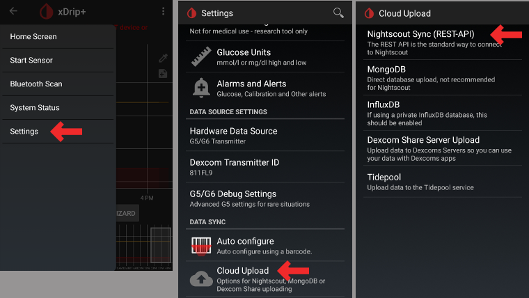

#### Disable automatic calibration and treatments

If you use an older version of AAPS (before 3.2), make sure to deactivate `Automatic Calibration` (7) If the checkbox for `Automatic Calibration` is checked, activate `Download treatments` (6) once, then remove the checkbox for `Automatic Calibration` and deactivate `Download treatments` again.

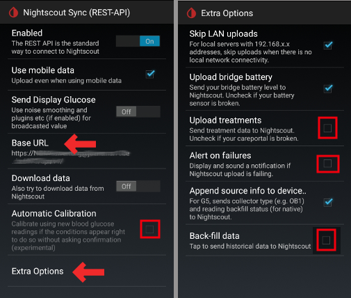

Tap `Extra Options`(8)

    {admonition} Safety warning
    :class: warning
    You must deactivate "Upload treatments" from xDrip+, otherwise treatments can be doubled in AAPS leading to false COB and IOB.

Deactivate `Upload treatments`(9) and make sure you will **NOT** use `Back-fill data` (11).

Option `Alert on failures` should also be deactivated (10). Otherwise you will get an alarm every 5 minutes in case Wi-Fi/mobile network issues or if the server is not available.

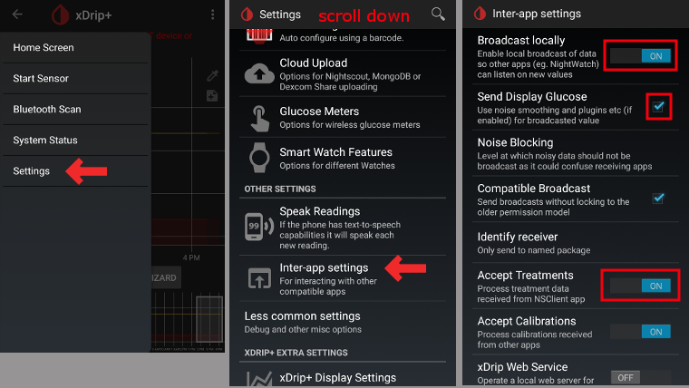

### **Inter-app Settings** (Broadcast)

If you are going to use AAPS and the data should be forwarded to i.e. AAPS you have to activate broadcasting in xDrip+ in Inter-App settings.

→ Hamburger Menu (1) → Settings (2) → Inter-app settings (3) → Broadcast locally **ON** (4)

In order for the values to be identical in AAPS with respect to xDrip+, you should activate `Send the displayed glucose value` (5).

Enable Compatible Broadcast (6).

If you have also activated `Accept treatments` in xDrip+ and `Enable broadcasts to xDrip+` in AAPS xDrip+ plugin, then xDrip+ will receive insulin, carbs and basal rate information from AAPS.

If you enable `Accept Calibrations`, xDrip+ will use the calibrations from AAPS. Be careful when you use this feature with Dexcom sensors: read [this](https://navid200.github.io/xDrip/docs/Calibrate-G6.html) first.

Remember to disable Import Sounds to avoid xDrip+ making a ringtone every time AAPS sends a basal/profile change.

(xdrip-identify-receiver)=

#### Identify receiver

- If you discover problems with local broadcast (AAPS not receiving BG values from xDrip+) go to → Hamburger Menu (1) Settings (2) → Inter-app settings (3) → Identify receiver (7) and enter `info.nightscout.androidaps` for AAPS build (if you are using PumpControl build, please enter `info.nightscout.aapspumpcontrol` instead!!).
- Pozor: automatické opravy textu v androidu mají tendenci měnit velikost prvního písmene. You **must use only lowercase letters** when typing `info.nightscout.androidaps` (or `info.nightscout.aapspumpcontrol` for PumpControl). Capital I would prevent the App from receiving BG values from xDrip+.
    
    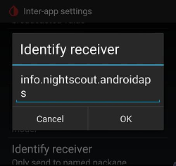

## Use AAPS to calibrate in xDrip+

- If you want to be able to use AAPS to calibrate then in xDrip+ go to Settings → Interapp Compatibility → Accept Calibrations and select ON. 
- You may also want to review the options in Settings → Less Common Settings → Advanced Calibration Settings.

## Dexcom G6

- Vysílač Dexcom G6 může být připojen současně k přijímači Dexcom (nebo pumpě t:slim) a zároveň k vašemu telefonu.
- Pokud používáte xDrip+ jako přijímač, nejprve odinstalujte aplikaci Dexcom. **K vysílači se nelze připojit prostřednictvím obou aplikací xDrip+ a Dexcom současně!**
- If you need Clarity and want to profit from xDrip+ features, use the [Build Your Own Dexcom App](#DexcomG6-if-using-g6-with-build-your-own-dexcom-app) with local broadcast to xDrip+, or use xDrip+ as a Companion app receiving notifications from the official Dexcom app.

### Verze xDripu+ závisí na výrobním čísle vysílače G6.

- All G6 transmitters manufactured after fall/end 2018 are called "Firefly". They do not allow sensor restart without [removing the transmitter](https://navid200.github.io/xDrip/docs/Remove-transmitter.html), they do not send raw data. It is recommended to use the latest [Nightly Snapshot](https://github.com/NightscoutFoundation/xDrip/releases).
- Old rebatteried transmitters and modified transmitters allow sensor life extension and restarts, they also send raw data. You can use the [latest APK (stable)](https://xdrip-plus-updates.appspot.com/stable/xdrip-plus-latest.apk).

### Dexcom specifická nastavení

- Follow [these instructions](https://navid200.github.io/xDrip/docs/G6-Recommended-Settings.html) to setup xDrip+.

### Preemptivní restarty nejsou doporučené

**Only rebatteried or modified Dexcom transmitters. [Preemptive restarts](https://navid200.github.io/xDrip/docs/Preemptive-Restart.html) do not work with standard transmitters and will stop the sensor completely: you need to [remove the transmitter](https://navid200.github.io/xDrip/docs/Remove-transmitter.html) to restart the sensor.**

Automatické prodloužení senzorů Dexcom (`preemptivní restart`) není doporučeno, protože to může způsobit „skoky“ v hodnotách glykémie 9. den po restartu.

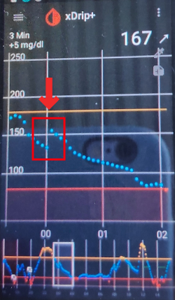

Abyste ho mohli používat bezpečně, je třeba vědět o několika skutečnostech:

- Pokud používáte nativní data s kalibračním algoritmem aplikace xDrip+ nebo Spike, nejbezpečnější postup je zakázat preemptivní restartování senzoru.
- Pokud musíte preemptivní restarty používat, pak se ujistěte, že senzor zavádíte v takovou denní dobu, kdy můžete sledovat změny a v případě potřeby provést kalibraci. 
- Jestliže senzory restartujete, buď použijte tovární kalibraci, aby byly výsledky v den 11 a 12 co nejbezpečnější, nebo buďte připraveni provést kalibrace a sledujte odchylku.
- Nastřelení senzoru G6 předem v kombinaci s tovární kalibrací pravděpodobně povede k odchylkám ve výsledcích měření. Jestliže nastřelujete senzor s předstihem, pak jej pravděpodobně v zájmu co nejlepších výsledků bude nutné zkalibrovat.
- Jestliže nechcete sledovat změny, ke kterým může docházet, možná bude lepší přepnout na režim bez továrních kalibrací a používat systém jako G5.

Chcete-li se dozvědět další informace o podrobnostech a důvodech pro tato doporučení, přečtěte si [kompletní článek](https://www.diabettech.com/artificial-pancreas/diy-looping-and-cgm/), který sepsal Tim Street, na adrese [www.diabettech.com](https://www.diabettech.com).

(xdrip-connect-g6-transmitter-for-the-first-time)=

### První připojení vysílače G6

**For second and following transmitters see [Extend transmitter life](#xdrip-extend-transmitter-life) below.**

Follow [these instructions](https://navid200.github.io/xDrip/docs/Starting-G6.html).

(xdrip-transmitter-battery-status)=

### Stav baterie vysílače

- Battery status can be controlled in system status  
    → Hamburger Menu (1) → System Status (2) → If you are on the Classic Status Page (3) swipe the screen (4) to reach → G5/G6/G7 Status screen.

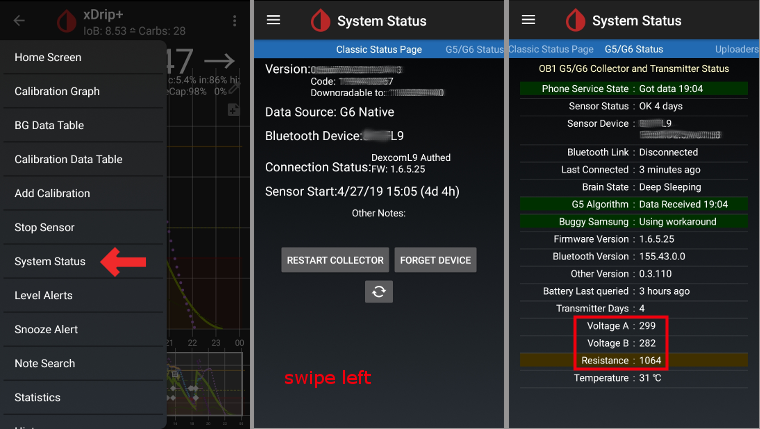

- See [here](https://navid200.github.io/xDrip/docs/Battery-condition.html) for more information.

(xdrip-extend-transmitter-life)=

### Prodloužení životnosti vysílače

- [Lifetime](https://navid200.github.io/xDrip/docs/Transmitter-lifetime.html) cannot be extended for Firefly transmitters: only rebatteried or modified transmitters.
- Follow [these instructions](https://navid200.github.io/xDrip/docs/Hard-Reset.html) for non-Firefly transmitters.

(xdrip-replace-transmitter)=

### Výměna vysílače

- Vypněte originální Dexcom přijímač (pokud ho používáte).
- [Stop sensor](https://navid200.github.io/xDrip/docs/Dexcom/StartG6Sensor.html) (only if replacing sensor).

- Vymažte zařízení z xDripu+ (Stav systému -> Forget device) a ze seznamu BT v nastavení telefonu (Zobrazuje se jako Dexcom??, přičemž ?? are the last two digits of the transmitter serial no.)  
    → Hamburger Menu (1) → System Status (2) → If you are not on the Classic Status Page (3) swipe the screen (4) to reach it → then tap Forget Device (5).

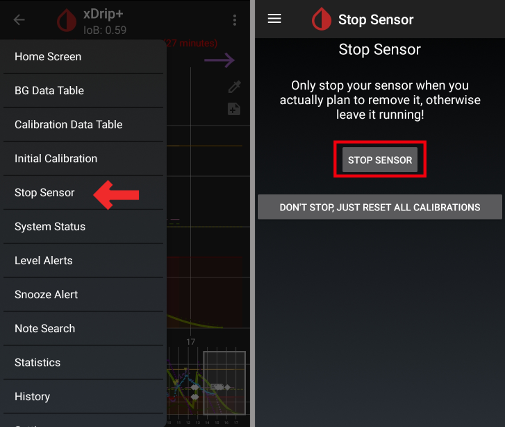

- Vyjměte vysílač (a také senzor – pokud ho měníte). To remove transmitter without removing sensor see [this](https://navid200.github.io/xDrip/docs/Remove-transmitter.html), or this video <https://youtu.be/AAhBVsc6NZo>.
- Uložte starý vysílač dostatečně daleko, aby se předešlo jeho opětovnému připojení. A microwave is a perfect Faraday shield for this - but unplug power cord to be 100% sure no one is turning the microwave on.
- Follow [these instructions](https://navid200.github.io/xDrip/docs/Starting-G6.html).
- Před prvním načtením dat do xDrip+ nezapínejte originální Dexcom přijímač (pokud ho používáte).

### Nový sensor

- Vypněte originální Dexcom přijímač (pokud ho používáte).
- Stop sensor following [these instructions](https://navid200.github.io/xDrip/docs/Dexcom/StartG6Sensor.html).

- Insert and then start a new sensor following [these instructions](https://navid200.github.io/xDrip/docs/Starting-G6.html).

(xdrip-retrieve-sensor-code)=

### Získání kódu senzoru

→ Hamburger Menu (1) → System Status (2) → If you are on the Classic Status Page (3) swipe the screen (4) to reach → G5/G6/G7 Status screen → Calibration Code.

(xdrip-troubleshooting-dexcom-g5-g6-and-xdrip)=

### Odstraňování potíží s Dexcom G5/G6 a xDrip+

#### Problém s připojením k vysílači

Follow [these instructions](https://navid200.github.io/xDrip/docs/Connectivity-troubleshoot.html).

#### Problém se spuštěním nového senzoru

Follow [these instructions](https://navid200.github.io/xDrip/docs/Dexcom/SensorFailedStart.html).

## Libre 1

- Setup your NFC to Bluetooth bridge in xDrip+
    
    → Hamburger Menu (1) → Settings (2) → Less common settings (3) → Bluetooth Settings (4)

- In Bluetooth Settings set the checkboxes exactly as in the screenshots below (5)
    
    - Disable watchdogs as they will reset the phone Bluetooth and interrupt your pump connection.
    
    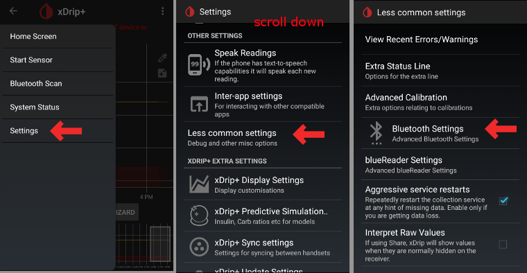

- You can try to enable the following settings (7)
    
    - Použít vyhledávání
    - Trust Auto-Connect
    - Use Background Scans

- If you easily lose connection to the bridge or have difficulties recovering connection, **DISABLE THEM** (8).
    
    

- Leave all other options disabled unless you know why you want to enable them.
    
    

### Úroveň baterie čtečky Libre

- Battery level of bridges such as MiaoMiao and Bubble can be displayed in AAPS (not Blucon).
- Details can be found on [screenshots page](#screens-sensor-level-battery).

### Připojte vysílač Libre a spusťte senzor

- If your sensor requires it (Libre 2 EU and Libre 1 US) install the latest out of process algorithm.

- Your sensor must be already started using the vendor app or the reader (xDrip+ cannot start or stop Libre sensors).

- Set the data source to Libre Bluetooth.
    
    → Hamburger Menu (1) → Settings (2) → Select Libre Bluetooth in Hardware Data source (3)
    
    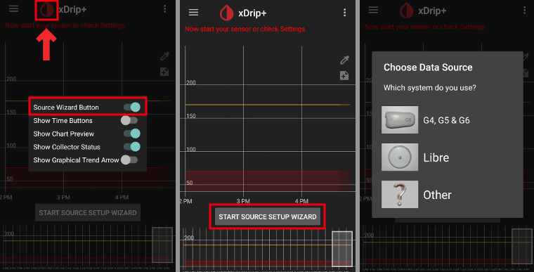

- Scan Bluetooth and connect the bridge.
    
    → Hamburger Menu (1) → Scan Bluetooth (2) → Scan (3)
    
    - If xDrip+ can't find the bridge, make sure it's not connected to the vendor app. Put it in charge and reset it.
    
    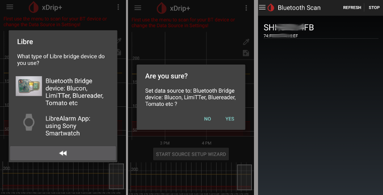

- Start the sensor in xDrip+.
    
        {admonition} Safety warning
        :class: warning
        Do not use sensor data before the one hour warm-up is over: the values can be extremely high and cause wrong decisions in AAPS.
    
    → Hamburger Menu (1) → Start sensor (2) → Start sensor (3) → Set the exact time you started it with the reader or the vendor app. If you didn't start it today, answer "Not Today" (4).

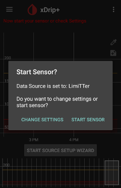

(xdrip-libre2-patched-app)=

## Libre 2 patched app

- Set the data source to Libre patched app.
    
    → Hamburger Menu (1) → Settings (2) → Select Libre (patched App) in Hardware Data source (3)
    
    

- You can add `BgReading:d,xdrip libre_receiver:v` under Less Common Settings->Extra Logging Settings->Extra tags for logging. This will log additional error messages for trouble shooting.

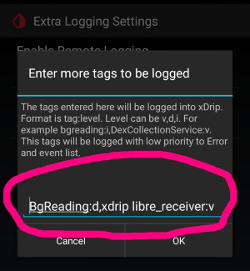