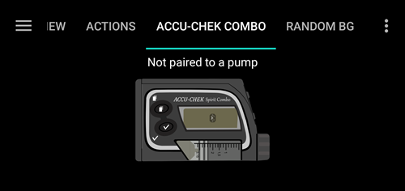

# Pumpa Accu-Chek Combo

**Tento software je součástí DIY řešení a není to produkt, ale vyžaduje po vás, abyste si přečetli, naučili se a porozuměli systému včetně toho, jak ho používat. Není to něco, co by za vás spravovalo veškerou vaši cukrovku, ale umožňuje vám zlepšit vaši cukrovku a kvalitu života, pokud jste ochotni věnovat potřebný čas. Nespěchejte do toho, ale dopřejte si čas na učení. Jste jediní, kdo nese odpovědnost za to, co s tím uděláte.**

## Hardwarové a softwarové požadavky

* Roche Accu-Chek Combo (jakýkoliv firmware, funguje se všemi).
* Zařízení Smartpix nebo Realtyme spolu s 360 konfiguračním softwarem pro nastavení pumpy. (Roche poskytuje zařízením Smartpix a konfigurační software zdarma svým zákazníkům na vyžádání.)
* Kompatibilní telefon. Android 9 (Pie) nebo novější je nutností. Pokud používáte LineageOS, minimální podporovaná verze je 16.1. See [release notes](#maintenance-android-version-aaps-version) for details.
* Aplikace AndroidAPS nainstalovaná v telefonu.

Některé telefony mohou pracovat lépe než jiné v závislosti na jejich kvalitě podpory technologie Bluetooth a na tom, zda mají doplňkové, velmi agresivní, metody úspory energie. A list of phones can be found in the [AAPS Phones](#Phones-list-of-tested-phones) document. Uvědomte si, že toto není úplný seznam a odráží osobní zkušenosti uživatelů. Doporučuje se také sdílet své zkušenosti a pomáhat tak ostatním (tyto projekty jsou o tom, jak si navzájem pomáhat).

(combov2-before-you-begin)=
## Než začnete

**BEZPEČNOST NA PRVNÍM MÍSTĚ** - nezkoušejte provést tento proces v prostředí, kde není možná obnova po chybě. Mějte své zařízení Smartpix / Realtyme po ruce, spolu s konfiguračním softwarem 360. Vyhraďte si přibližně hodinu na všechna nastavení a kontrolu, že všechno funguje v pořádku.

Mějte na paměti následující omezení:

* Extended bolus and multiwave bolus are currently not supported (you can use [Extended Carbs](../DailyLifeWithAaps/ExtendedCarbs.md) instead).
* Je podporovaný pouze jeden (první) bazální profil.
* Pokud není na pumpě aktivovaný profil č. 1, smyčka je deaktivována. To bude pokračovat dokud profil č. 1 nebude aktivní; když bude aktivován, AAPS při dalším připojení (ať už samotnou aplikací nebo protože uživatel stiskne tlačítko Obnovit v uživatelském rozhraní combov2) zjistí, že byl profil č. 1 aktivován a povolí smyčku znovu.
* Pokud smyčka požaduje zrušení spuštěného dočasného bazálu, Combo nastaví dočasný bazál na 90 % nebo 110 % na dobu 15 minut. Důvodem je, že skutečné zrušení dočasného bazálu vyvolá na pumpě alarm, který vyvolá mnoho vibrací, které nelze vypnout.
* Stabilita bluetooth připojení se liší s různými telefony, což způsobuje upozornění "pumpa nedostupná", kdy již není navázáno žádné spojení s pumpou. Pokud k této chybě dojde, ujistěte se, že je bluetooth povolen, stiskněte tlačítko Aktualizovat na kartě Combo, abyste zjistili, zda byla příčina přechodného problému, a pokud stále není připojení navázáno, restartujte telefon, což by to obvykle mělo vyřešit.
* Jestliže restart nepomůže, existuje ještě další možnost. Stiskněte tlačítko na pumpě (což resetuje Bluetooth na pumpě), pumpa by měla znovu navázat spojení.
* Nastavení TBR na pumpě by se mělo vyhnout, protože smyčka přebírá kontrolu nad TBR. Detekce nového TBR na pumpě může trvat až 20 minut a účinek TBR bude počítán pouze od chvíle, kdy bude detekován, takže v nejhorším případě může být 20 minut TBR, který není zohledněn v IOB.

Pokud jste používali starý ovladač Combo, který závisí na samostatné aplikaci Ruffy, a chcete přejít na tento nový, mějte na paměti, že párování musí být provedeno znovu - Ruffy a nový ovladač Combo nemohou sdílet spárováné zařízení. Také se ujistěte, že Ruffy _neběží_. Pokud si nejste jistí, podržte dlouze ikonu aplikace Ruffy, abyste zobrazili kontextové menu. V této nabídce klikněte na "App Info". V uživatelském rozhraní, které se právě otevřelo, stiskněte "Vynutit zastavení". Takto zajistíte, že aktivní instance Ruffy nemůže zasahovat do práce nového ovladače.

Zároveň, pokud migrujete ze starého ovladače, mějte na paměti, že nový driver komunikuje s pumpou Combo při podávání bolusu jiným, mnohem rychlejším způsobem. Nenechte se tedy překvapit, až se začne bolus podávat okamžitě, bez ohledu na velikost dávky. Kromě toho obecné návrhy, tipy a triky atd. o řešení problémů s párováním Ruffy a připojením zde nemohou být použity, protože se jedná o zcela nový ovladač, který se starým nesdílí žádný kód.

Tento nový ovladač je napsán tak, aby podporoval na Combu následující jazyky. (Toto nesouvisí s jazykem v AAPS - jedná se o jazyk zobrazený na samotném LCD pumpy Combo.)

* Angličtina
* Španělština
* Francouzština
* Italština
* Ruština
* Turečtina
* Polština
* Čeština
* Maďarština
* Slobenština
* Rumunština
* Chorvatština
* Nizozemština
* Řečtina
* Finština
* Norština
* Portugalština
* Švédština
* Dánština
* Němčina
* Slovinština
* Litevština

**Důležité**: Pokud je vaše pumpa nastavena na jazyk, který není v tomto seznamu, kontaktujte vývojáře a nastavte jazyk pumpy na jeden z nich. Jinak nebude ovladač fungovat správně.

## Nastavení telefonu

Je velmi důležité zajistit, aby byly vypnuty optimalizace baterie (úspora energie). AAPS již automaticky detekuje, když takovým optimalizacím podléhá, a ve svém uživatelském rozhraní vyžaduje jejich vypnutí. Ale na moderních telefonech s Androidem je _samotný Bluetooth_ aplikace (systémová aplikace). A obvykle je tato „Bluetooth aplikace“ spuštěna _s úsporami baterie ve výchozím nastavení_. V důsledku toho může Bluetooth odmítnout reagovat, když se telefon snaží šetřit energii a zastaví kvůli tomu Bluetooth aplikaci. To znamená, že v systémovém nastavení Bluetooth aplikace musí být optimalizace baterie také vypnuta. Bohužel, způsob jak najít tuto systémovou Bluetooth aplikaci se na různých telefonech liší. V základní verzi Android přejděte do Nastavení -> Aplikace -> Zobrazit všech N aplikací (N = počet aplikací ve vašem telefonu). Poté otevřete nabídku v pravém horním rohu, klepněte na položku "Zobrazit systém", "Zobrazit systémové aplikace" nebo "Všechny aplikace". Nyní ve zcela kompletním seznamu aplikací hledejte aplikaci "Bluetooth". Vyberte ji a v rozhraní "Informace o aplikaci" klepněte na "Baterie". Tam vypněte optimalizaci baterie (někdy nazývané "využití baterie").

## Nastavení pumpy Combo

* Nastavte pumpu pomocí konfiguračního softwaru Accu-Check 360. Pokud nemáte software, kontaktujte prosím svou Accu-Chek hotline. Obvykle posílají registrovaným uživatelům CD s "360° Pump Configuration Software" a zařízení SmartPix USB-infrazářič (zařízení Realtyme také funguje, pokud to máte).

  - **Požadované nastavení** (na snímcích obrazovky označeno zeleně):

     * Nastavte/nechte konfiguraci menu jako "Standard", toto zobrazí pouze podporovaná menu/akce na pumpě a skryje ty, které nejsou podporovány (rozšířené/multiwave bolusy, více bazálních dávek), což způsobuje omezení funkčnosti smyčky, když je používána, protože není možné bezpečně běžet smyčku, když je používána.
     * Ověřte, že _Quick Info Text_ je nastaven přesně na "QUICK INFO" (bez uvozovek, nastavení najdete pod _Insulin Pump Options_).
     * Nastavte maximální velikost dočasného bazálu (TBR) _Maximum Adjustment_ na 500%
     * Vypněte _Signal End of Temporary Basal Rate_ - alarm na konci dočasného bazálu
     * Nastavte _Časový přírůstek_ dočasného bazálu na 15 min
     * Povolte Bluetooth

  - **Požadované nastavení** (na snímcích obrazovky označeno modře)

     * Nastavte alarm na nízkou kazetu podle vašich představ
     * Nakonfigurujte maximální bolus vhodný pro vaši terapii, abyste ochránili zařízení před chybami v softwaru
     * Podobně nastavte maximální dobu TBR jako ochranu. Povolte alespoň 3 hodiny, protože možnost odpojit pumpu na 3 hodiny nastaví 0% během těchto 3 hodin.
     * Povolte zámek kláves na pumpě, abyste zabránili bolusu z pumpy, obzvlášť když byla pumpa používána dříve a rychlý bolus byl obvyklým zvykem.
     * Nastavte časový limit pro displej a časový limit pro menu na minimum 5,5 a 5 sekund. To umožňuje AAPS rychleji se zotavit z chybových situací a snižuje množství vibrací, které mohou během těchto chyb nastat

  

  

  

  

## Aktivace driveru a párování s pumpou Combo

* Select the "Accu-Chek Combo" driver in [Config builder > Pump](../SettingUpAaps/ConfigBuilder.md). **Důležité**: V seznamu je také starý ovladač nazvaný "Accu-Chek Combo (Ruffy)". Tento _nevybírejte_.

  

* Otevřete menu nastavení ovladače kliknutím na ozubené kolečko.

* V uživatelském rozhraní Nastavení klepněte na tlačítko "Párování s pumpou" v horní části obrazovky. Tím otevřete uživatelské rozhraní pro párování s pumpou Combo. Následujte instrukce a obrazovce ke spuštění párování. Pokud Android požádá o oprávnění k tomu, aby byl telefon viditelný pro ostatní zařízení Bluetooth, stiskněte tlačítko "Povolit". Nakonec Combo zobrazí na dispeji desetimístný párovací PIN a ovladač si vyžádá jeho zadání. Zadejte PIN kód do odpovídajícího pole.

  

  

  

  

  

* Pokud driver požádá o zadání PIN kódu zobrazeného na Combu a kód je zadán nesprávně, zobrazí se toto: 

* Jakmile je párování dokončeno, uživatelské rozhraní párování uzavřete klepnutím na tlačítko OK na obrazovce, na které je uvedeno že párování bylo úspěšné. Po jeho uzavření se vrátíte do uživatelského rozhraní nastavení ovladače. Tlačítko 'Párovat s pumpou' by nyní mělo být zatmaveno a deaktivováno.

  Po úspěšném párování vypadá záložka Accu-Chek Combo takto:

  

  Pokud však není spárováná pumpa Combo, záložka místo toho vypadá takto:

  

* K ověření správného nastavení (ve chvíli, kdy je pumpa z důvodu bezpečnosti **odpojena** od jakékoli kanyly), použijte AAPS k nastavení dočasného bazálu (TBR) na 500 % po dobu 15 min a následně zkuste vydat malý bolus. Pumpa by nyní měla mít běžící TBR a bolus v historii. AAPS by také měla zobrazit aktivní TBR a dodaný bolus.

* Povolte zámek kláves na pumpě, abyste zabránili bolusu z pumpy, obzvlášť když byla pumpa používána dříve a rychlý bolus byl obvyklým zvykem.

## Poznámky k párování

Pumpa Accu-Chek Combo byla vyvinuta před vydáním Bluetooth 4.0 a pouhý rok po uvolnění jeho první verze na Androidu. Z toho důvodu není způsob párování s dalšími zařízeními 100% kompatibilní s tím, jak se to dnes dělá v systému Android. Aby to bylo možné překonat, AAPS bude potřebovat úroveň systémových oprávnění, která je dostupná pouze pro systémové aplikace. Ty jsou do telefonů instalované jejich výrobci - uživatelé nemohou instalovat systémové aplikace.

Důsledkem toho je, že párování nikdy nebude 100% bez problémů, ačkoli je v novém ovladači výrazně vylepšeno. Zejména během párování se může na Androidu na chvíli zobrazit požadavek na zadání Bluetooth PIN, který automaticky zmizí. Ale někdy zůstane na obrazovce a žádá čtyřmístný PIN kód. (Toto nezaměňujte s desetimístným párovacím PIN kódem). Nezadávejte nic, jen stiskněte tlačítko Storno. Pokud párování nepokračuje, postupujte podle pokynů na obrazovce a zkuste spárování znovu.

(combov2-tab-contents)=
## Obsah záložky Accu-Chek Combo

Pokud byla pumpa spárována, záložka zobrazuje následující informace (položky jsou uvedeny shora dolů):

1. _Stav ovladače_: Ovladač může být v jednom z následujících stavů:
   - "Odpojeno": neexistuje žádné Bluetooth připojení; ovladač je v tomto stavu většinu času a připojuje se k pumpě pouze tehdy, když je to nutné - tento způsob šetří energii
   - "Připojování"
   - "Kontroluji pumpu": pumpa je připojena, ale ovladač v tomto okamžiku provádí bezpečnostní kontroly, aby zajistil, že vše je v pořádku a aktuální
   - "Připraveno" : ovladač je připraven přijímat příkazy od AAPS
   - "Pozastaveno": pumpa je pozastavena (ukazuje se jako "zastaveno" v Combo)
   - "Provádění příkazu": příkaz AAPS se provádí
   - "Chyba" : došlo k chybě; spojení bylo ukončeno, jakýkoli probíhající příkaz byl přerušen
2. _Poslední spojení_: Před kolika minutami se ovladač úspěšně připojil ke Combo; pokud hodnota přesahuje 30 minut, tato položka je zobrazena červeně
3. _Současná aktivita_: Další podrobnosti o tom, co pumpa právě dělá; je to také místo, kde může tenký ukazatel průběhu zobrazovat stav spouštění příkazů, jako je nastavení bazálu
4. _Baterie_: Úroveň nabití baterie; Combo pouze zobrazuje "Full", "Low" a "Empty" stavy baterie a nedává přesnější informace (jako procenta), takže jsou zde uvedeny pouze tyto tři úrovně
5. _Zásobník_: Kolik jednotek inzulínu je v současné době v zásobníku Comba
6. _Poslední bolus_: Před kolika minutami byl podán poslední bolus; pokud nebyl žádný bolus podán poté, co byl AAPS spuštěn, bude toto pole prázdné
7. _Dočasný bazál_: Podrobnosti o aktivním dočasnm bazálu; pokud není zrovna není žádný aktivní, pole je prázdné
8. _Základní bazální dávka_: V současné době aktivní bazální dávka ("základní" znamená bazální dávku bez aktivního dočasného bazálu ovlivňujícího celkový bazál)
9. _Výrobní číslo_: Výrobní číslo podle údaje pumpy Combo (odpovídá sériovému číslu uvedenému na zadní straně pumpy)
10. _Adresa Bluetooth_: 6-bajtová adresa Comba zobrazená ve formátu `XX:XX:XX:XX:XX:XX`

Combo lze provozovat přes Bluetooth v režimu _vzdáleného terminálu_ nebo v _příkazovém režimu_. Režim dálkového terminálu odpovídá "dálkovému ovládání" Combo, který napodobuje LCD a čtyři tlačítka pumpy. Některé příkazy musí v tomto režimu provést ovladač, protože nemají žádný protějšek v příkazovém režimu. Tento druhý způsob je mnohem rychlejší, ale jak již bylo řečeno, má omezený rozsah. Když je aktivní režim vzdáleného terminálu, je jeho obrazovka zobrazena v poli nad značkou Combo ve spodní části. Pokud se ale driver přepne do příkazového módu, je toto pole ponecháno prázdné.

(Uživatel na to nemá vliv; ovladač plně rozhoduje sám, jaký režim použije. To je pouze poznámka pro uživatele, aby věděli, proč jsou v tomto poli někdy vidět snímky Comba.)

Zcela dole je tlačítko "Obnovit". To spustí okamžitou aktualizaci stavu pumpy. It also is used to let AAPS know that a previously discovered error is now fixed and that AAPS can check again that everything is OK (more on that below in [the section about alerts](#combov2-alerts)).

## Nastavení

Pro ovladač Combo jsou k dispozici tyto předvolby (položky jsou uvedeny od shora dolů):

1. _Párování_: Toto je tlačítko, kterým spustíte párování s pumpou Combo. Je zakázáno, pokud je již pumpa spárována.
2. _Zrušit párování_: Zruší párování s již připojenou pumpou Combo; pravý opak položky č. 1. Je zakázáno, pokud není žádná pumpa spárovaná.
3. _Doba hledání (v sekundách)_: Při párování ovladač nastaví telefon, aby byl zjistitelný pumpou. Toto určuje, jak dlouho je zjistitelnost spuštěná. Ve výchozím nastavení je vybráno maximum (300 sekund = 5 minut). Android neumožňuje spustit tuto funkci na dobu neurčitou, takže je nutné zvolit dobu trvání.
4. _Automaticky zjistit a zadat výměnu inzulínu_: Pokud je povoleno, akce "Výměna zásobníku", kterou uživatel obvykle provádí prostřednictvím tlačítka "prime/plnění" na záložce Akce, je prováděna automaticky. This is explained [in further detail below](#combov2-autodetections).
5. _Automaticky zjistit a zadat výměnu baterie_: Pokud je povoleno, akce "Výměna baterie", kterou uživatel obvykle provádí prostřednictvím tlačítka "Výměna baterie v pumpe" na záložce Akce, je prováděna automaticky. This is explained [in further detail below](#combov2-autodetections).
6. _Povolit detailní logování Combo_: Toto značně rozšiřuje množství logovaných informací prováděné ovladačem. **UPOZORNĚNÍ**: Nezapínejte, pokud o to nepožádal vývojář. V opačném případě to může do protokolů AndroidAPS přidat mnoho šumu a snížit jejich užitečnost.

Většina uživatelů používá pouze první dvě položky, _Párování_ a _Zrušit párování_.

(combov2-autodetections)=
## Automatické zjištění a zadání výměny baterie a inzulínu

Ovladač je schopen rozpoznat výměnu baterie a zásobníku inzulínu sledováním úrovně jejich nabití/naplnění. Pokud Combo při poslední aktualizaci stavu hlásilo nízký stav nabití baterie, a nyní, při nové aktualizaci stavu, je úroveň nabití hlášena jako normální, ovladač dojde k závěru, že uživatel musel baterii vyměnit. Stejná logika se používá pro stav zásobníku inzulínu: pokud je nyní vyšší než dříve, je to vykládáno jako výměna zásobníku.

To funguje pouze v případě, že baterie nebo zásobník jsou vyměněny ve chvíli, kdy je jejich stav hlášen jako nízký _a zároveň_ jsou dostatečně naplněny.

Tyto automatické detekce mohou být vypnuty v uživatelském rozhraní Nastavení.

(combov2-alerts)=
## Upozornění (varování a chyby) a způsob jejich zpracování

Combo zobrazuje upozornění jako obrazovky vzdáleného terminálu. Varování jsou zobrazena s kódem "Wx" (x je číslice), spolu s krátkým popisem. Například "W7", "TBR OVER". Chyby jsou zobrazovány obdobně, ale zobrazí se s kódem "Ex".

Některá varování jsou automaticky zamítnuta ovladačem. Jedná se o:

- W1 "Reservoir low" : ovladač to změní v upozornění "Nízký stav inzulínu", které je zobrazeno na hlavní kartě AAPS
- W2 "Battery low" : ovladač to změní v upozornění "Nízký stav baterie", které je zobrazeno na hlavní kartě AAPS
- W3, W6, W7, W8 : tato varování jsou čistě informační pro uživatele, takže je pro ovladač může bezpečně automaticky zamítnout

Žádné další výstrahy _nejsou_ automaticky zamítnuty. Také chyby _nikdy nejsou_ automaticky zamítnuty. Oboje jsou zpracovány stejným způsobem: ovladač vytvoří výstražné dialogové okno nad rozhraním AAPS a přeruší vykonávání všech probíhajících příkazů. The driver then switches to the "error" state (see [the Accu-Chek Combo tab contents description above](#combov2-tab-contents)). Tento stav neumožňuje provádění jakýchkoli příkazů. Uživatel musí vyřešit chybu na pumpě; například chyba okluze může vyžadovat výměnu kanyly. Jakmile uživatel vyřeší chybu, běžný provoz může být obnoven stisknutím tlačítka "Obnovit" na záložce Accu-Chek Combo. Ovladač se pak spojí s pumpou Combo, zaktualizuje její stav a zkontroluje, zda není na obrazovce stále zobrazena chyba atd. Ovladač také po chvíli automaticky aktualizuje stav pumpy, takže ruční stisknutí tohoto tlačítka není povinné.

Zvláštní případ je dávkování bolusů. To probíhá v příkazovém režimu, který v průběhu podávání bolusu nereportuje, že se objevilo varování. Z toho důvodu ovladač nemůže automaticky zrušit _varování_ během podávání bolusu. To bohužel znamená, že pumpa bude v takovém případě pípat, dokud nebude ukončeno podávání bolusu. Nejčastější výstraha v průběhu bolusu je obvykle W1 "Reservoir low". V průběhu podávání bolusu **nevypínejte** upozornění přímo na pumpě. Riskujete tak přerušení podávání bolusu. Ovladač se o varování postará automaticky po dokončení bolusu.

Upozornění, která se objeví, zatímco ovladač není spojený s pumpou Combo, nebudou ovladačem zaznamenána. Combo nemá možnost automaticky odeslat tato upozornění do telefonu; spojení je vždy aktivováno na straně telefonu. Výsledkem je, že upozornění zůstane na pumpě, dokud se ovladač znovu nepřipojí. Uživatelé mohou stisknout tlačítko "Obnovit" pro navázání spojení a nechat ovladač rovnou odbavit čekající upozornění (místo čekání, dokud se sám AAPS nezahájí spojení samo).

**DŮLEŽITÉ**: Pokud dojde k chybě nebo se zobrazí varování, které není automaticky vypnuto, ovladač se přepne do chybového stavu. V tomto stavu bude smyčka **ZABLOKOVÁNA** dokud není aktualizován stav pumpy! K odblokování dojde po aktualizaci stavu pumpy (buď manuálně stiskem tlačítka "Obnovit" nebo automaticky ovladačem) a chyba se již nezobrazuje.

## Na co dávat pozor při používání pumpy Combo

* Mějte na paměti, že se nejedná o produkt. Obzvlášť na začátku uživatel potřebuje monitorovat a pochopit systém, jeho limity a jeho možná selhání. Je důrazně doporučováno nepoužívat tento systém, pokud ho uživatel není schopen plně pochopit.
* Kvůli způsobu, jakým funguje vzdálené ovládání Comba, jsou některé operace (především nastavení bazálního profilu) jsou ve srovnání s jinými pumpami pomalejší. Jde o nešťastné omezení pump Combo, které není možné překonat.
* Neset nebo nezrušujte TBR na pumpě. Smyčka předpokládá, že řídí dočasné bazály a bez splnění tohoto předpokladu nemůže spolehlivě fungovat. Důvodem je, že nelze určit čas spuštění dočasného bazálu zadaného uživatelem přímo na pumpě.
* Jestliže probíhá komunikace mezi AAPS a pumpou (na pumpě je během připojení zobrazeno logo Bluetooth), nesmíte na pumpě mačkat žádná tlačítka. Došlo by k přerušení Bluetooth připojení. Only do that if there are problems with establishing a connection (see [the "Before you begin" section above](#combov2-before-you-begin)).
* Nesmíte stisknout žádná tlačítka, pokud pumpa posílá bolus. Zejména se nepokoučejte zavřít jakákoli upozornění stiskem tlačítek. See [the section about alerts](#combov2-alerts) for a more detailed explanation why.

## Checklist pro případ, kdy nelze navázat spojení s pumpou Combo

Ovladač dělá maximum pro připojení ke Combu a používá pár triků k maximalizaci spolehlivosti. Přesto někdy nelze spojení navázat. Zde je několik kroků, které můžete podniknout k nápravě.

1. Stiskněte tlačítko na Combu. Někdy přestane Bluetooth modul v pumpě odpovídat a nepřijímá kvůli tomu spojení. Stisknutím tlačítka na pumpě přimějete LCD k rozsvícení a zároveň dojde k resetu Bluetooth modulu. Toto je většinou jediný krok, který je potřebný k opravě problémů s připojením.
2. Restartujte telefon. To může být nutné, pokud došlo k problému Bluetooth modulem samotného telefonu.
3. Pokud je krytka baterie pumpy stará, zvažte její výměnu. Staré kryty baterií mohou způsobit problémy s napájením pumpy Combo, což ovlivňuje Bluetooth.
4. Pokud pokusy o připojení nadále selhávají, zvažte odpojední a nové párování pumpy.
