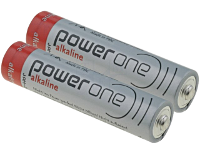

# AccuChek Combo tipy pro základní použití

## Jak zajistit bezproblémové používaní

* Vždy noste telefon sebou, v noci ho nechte u postele. Protože pumpa může během spánku ležet za vaším tělem nebo pod ním, je nejvhodnější vyšší poloha (na polici nebo stolku).
* Vždy se snažte mít baterii v pumpě plnou jak nejvíce je to možné. Přečtěte si kapitolu baterie, pro tipy jak toho nejlépe dosáhnout.
* Whenever possible, only operate the pump via the AAPS app. To facilitate this, activate the key lock on the pump under **PUMP SETTINGS / KEY LOCK / ON**. Ovládat pumpu přímo je zpravidla potřeba pouze při výměně baterie nebo zásobníku. 

## Pumpa není dostupná. Co s tím?

### Nastavte si alarm při nedostupnosti pumpy

* In AAPS, go to **Settings / Local Alarms** and activate **alarm when pump is unreachable** and set **pump not reachable limit [Min]** to **31** minutes.
* Toto nastavení dává dostatek času, aby se alarm nespustil, když odběhnete z místnosti ve které necháte telefon. Ale je dostatečně krátký na to, když je pumpa nedostupná po dobu, která překročí běžný čas dočasného bazálu.

### Obnovení komunikace s pumpou

* When AAPS reports a **pump unreachable** alarm, first release the keylock and **press any key on the pump** (e.g. "down" button). As soon as the pump display has turned off, press **Refresh** on the **Combo Tab** in AAPS. Toto často pomůže obnovit komunikaci.
* Když toto nepomůže, restartujte telefon. After the restart, AAPS will be reactivated and a new connection will be established with the pump. If you are using the old driver, ruffy will be reactivated as well.

* Bylo zjištěno, že některé telefony jsou více náchylné ke spouštění alarmu „pumpa nedostupná“ než jiné. See [AAPS Phones](#Phones-list-of-tested-phones) for successfully tested smartphones.

### Hlavní příčiny a důsledky častých poruch v komunikaci

* On phones with **low memory** (or **aggressive power-saving** settings), AAPS is often shut down. Můžete to poznat podle toho, že není zobrazeno tlačítko Bolus a Kalkulačky. Je to z toho důvodu, že systém teprve nabíhá. Kvůli těmto zastavením může být při startu vyvolán alarm „pumpa nedostupná“. In the **Last Connection** field of the Combo tab, you can check when AAPS last communicated with the pump.

* Tato chyba může způsobit rychlejší vybíjení baterie, protože při každém startu aplikace je znovu načítán celý bazální profil.
* Také zvyšuje riziko, že pumpa nebude chtít provádět žádné příkazy s AndroidAPS do doby, než bude stisknuto nějaké tlačítko přímo na pumpě (Jak je popsáno výše). 

## Selhání zrušení dočasného bazálu

* Occasionally, AAPS can not automatically cancel a **TBR CANCELED** alert. Then you have to either press **UPDATE** in the AAPS **Combo tab** or the alarm on the pump will need to be confirmed.

## Záležitosti týkající se baterie

### Výměna baterie

* Když pumpa zahlásí alarm **docházející baterie**, vyměňte baterii co možná nejdříve. Je to důležité proto, aby pumpa měla dost energie pro Bluetooth komunikaci, když telefon bude ve větší vzdálenosti od pumpy.
* I po alarmu **low battery** lze pumpu ještě nějaký čas používat. Nicméně je doporučeno mít sebou vždy náhradní baterii, aby mohla být vyměněna hned.
* Před změnou baterie stiskněte na hlavní obrazovce symbol **smyčka**, a vyberte **Pozastavit smyčku na 1h**. 
* Počkejte po dobu, co AndroidAPS komunikuje s pumpou. Poznáte to podle loga bluetooth na obrazovce pumpy.

* Release the key lock on the pump, put the pump into stop mode, confirm a possibly canceled temporary basal rate, and change the battery quickly.
* When using the old driver, if the clock on the pump did not survive the battery change, re-set the date and time on the pump to exactly the date/time on your phone running AAPS. (The new driver automatically updates the pump's date and time.)
* Then put the pump back in run mode select **Resume** when pressing on the **Suspended Loop** icon on the main screen.
* AAPS will re-set a necessary temporary basal rate with the arrival of the next blood sugar value.

(Accu-Chek-Combo-Tips-for-Basic-usage-battery-type-and-causes-of-short-battery-life)=

### Typy baterií a důvody krátké výdrže

* As intensive Bluetooth communication consumes a lot of energy, only use **high-quality batteries** like Energizer Ultimate Lithium, the "power one"s from the "large" Accu-Chek service pack, or if you are going for a rechargeable battery, use Eneloop batteries. 

 

Typická doba výdrže baterie dle typu:

* **Energizer Ultimate Lithium**: 4 až 7 týdnů
* **Power One Alkaline** (Varta) from the service pack: 2 to 4 weeks
* **Eneloop rechargeable** batteries (BK-3MCCE): 1 to 3 weeks

If your battery life is significantly shorter than the ranges given above, please check the following possible causes:

* Některá šroubovací „víčka“ baterie pumpy způsobovala rychlé vybíjení baterie (docházelo ke krátkým zkratům). Víčka, která tento problém nezpůsobují, poznáte podle toho, že jejich kontakty jsou pozlacené.
* Pokud hodiny pumpy „nepřežijí“ krátkou výměnu baterie, je pravděpodobné, že kondenzátor, který udržuje hodiny běžící během krátkého výpadku proudu, je rozbitý. V takovém případě Vám může pomoci pouze výměna pumpy firmou Roche, což není v průběhu záruční doby problém. 
* Hardware a software telefonu (operační systém Android a bluetooth stack) také ovlivňují životnost baterie pumpy, i když ještě nejsou zcela známy přesné faktory. Máte-li příležitost, vyzkoušejte jiný smartphone a porovnejte baterie.

## Rozložený bolus, kombinovaný bolus

Algoritmus OpenAPS nepodporuje paralelní rozložený bolus nebo kombinovaný bolus. But a similar treatment can be achieved by the following alternatives:

* Use **e-Carbs** when entering carbs or using the Calculator by entering the carbs of the full meal and the duration you expect the carbs to arrive as glucose in you blood. The system will then calculate small carbs equally distributed over the whole duration which will cause th algorithm to provide equivalent insulin dosing while still permanently checking the overall rise/decrease of the blood glucose level. For a multiwave bolus approach, you can also combine a smaller immediate bolus with e-carbs. 
* Before eating, on the **Actions tab** in AAPS set as a temporary **Eating Soon** goal with target glucose 80 for several hours. The duration should be based on the interval you would choose for an extended bolus. This will keep your target lower than usual and therefore increase the amount of insulin delivered.
* Then use the **CALCULATOR** to enter the full carbs of the meal, but do not directly apply the values suggested by the bolus calculator. If a multiwave-like bolus is to be delivered, correct the insulin dosage down. Depending on the meal, the algorithm now has to deliver additional SMBs or higher temporary basal rates to counteract the increase in blood sugar. Here, the safety limitation of the basal rate (Max IE / h, Maximum basal IOB) should be very carefully experimented with and, if necessary, temporarily changed.

* If you are tempted to just use the extended or multiwave bolus directly on the pump, AAPS will penalize you with disabling the closed loop for the next six hours to ensure that no excess insulin dosage is calculated.

## Poplachy při bolusu

* If AAPS detects that an identical bolus has been successfully delivered at the same minute, bolus delivery will be prevented with identical number of insulin units. If your really want to bolus the same insulin twice in short succession, just wait two more minutes and then deliver the bolus again. If the fist bolus has been interrupted or was not delivered for other reasons, you can immediately re-submit the bolus since AAPS 2.0.
* The alarm is a safety mechanism that reads the pump's bolus history before submitting a new bolus to correctly calculate insulin on board (IOB), even when a bolus is delivered directly from the pump. Musí být zabráněno nerozpoznatelným položkám.

* Tento mechanismus je také zodpovědný za druhou příčinu chyby: Pokud během používání bolusové kalkulačky dojde k dodání jiného bolusu přes pumpu a tím ke změně historie, je kalkulace bolusu špatná a bolus se předčasně ukončí. 

