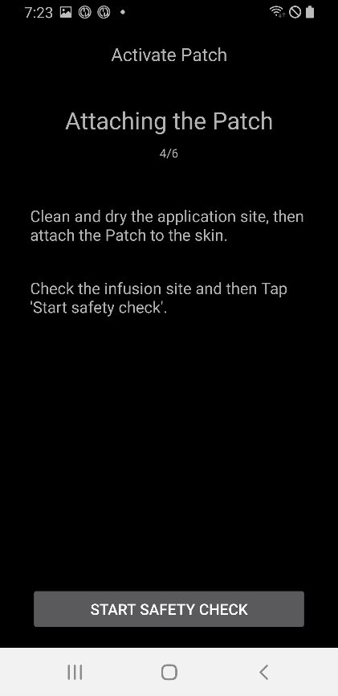

# Návod k EOPatch2

Patch vyžaduje použití inzulínu s rychlým účinkem, typu U-100, jako je NovoRapid nebo Humalog. Použijte inzulín s rychlým účinkem, který je pro vás vhodný podle předpisu lékaře, a používejte předepsané množství.

Nejmenší injekční dávka inzulínu při použití patche je 0,05 U. Profil BAS by měl být nastaven na minimální hodnotu 0,05 U/h nebo více a interval 0,05 U/h, jinak může dojít k chybě mezi odhadovaným celkovým množstvím inzulínu v profilu a skutečným množstvím inzulínu v náplasti. Stejně tak musí být bolus nastaven a dávkován s minimálním objemem 0,05 U.

## Nastavení pumpy
1. Na úvodní obrazovce AAPS klikněte na hamburgerové menu v levém horním rohu a přejděte do Konfigurace.
1. Vyberte 'EOPatch2' v sekci Pumpa.
1. Stiskněte klávesu Zpět pro návrat na úvodní obrazovku.

 

## Nastavení
Vyberte EOPATCH2 v horní části úvodní obrazovky pro přechod na kartu EOPATCH2.

Vyberte nabídku Preferencí EOPatch2 kliknutím na tři tečky v pravém horním rohu.

Nabídka Preferencí EOPatch2 nabízí nabídku pro nastavení 3 typů upozornění.

### Nízký stav zásobníku
Objeví se varování, když množství inzulínu zbývajícího v rezervoáru dosáhne nastavené hodnoty nebo méně při použití patche. Může být nastaveno od 10 do 50U v krocích po 5U.

### Připomínka na vypršení platnosti patche
Toto je připomínka upozornit vás na čas zbývající do vypršení současné náplasti. Může být nastaveno od 1 do 24 hodin v 1 hodinových krocích. Počáteční nastavení je 4 hodiny.

### Připomínka buzzera pro náplasti
Toto je funkce připomínky pro injekce mimo bazální injekci. Pokud používáte (rozšířenou) bolusovou injekci nebo dočasnou bazální injekci, náplast vydá zvuk buzzeru, když injekce začíná a když je injekce dokončena. Počáteční nastavení je vypnuto.

## Připojení náplasti

### Přejděte na obrazovku připojení náplasti

Vyberte EOPATCH2 na horní části domovské obrazovky a klikněte na tlačítko AKTIVOVAT NÁPLAST v dolním levém rohu.

### Připojení náplasti
Vložte jehlu stříkačky do inzulínového vstupu na náplasti a poté pomalu stlačujte píst, abyste injikovali inzulín. Když je inkompleno více než 80U, náplast vydá zvuk bootování (1 buzzer) a spustí se. Po potvrzení zvuku buzzeru klikněte na tlačítko ZAČÍT SPÁROVÁNÍ na obrazovce.

[Varování]

- Neotáčejte páku pro zasunutí jehly, dokud nebudete požádáni. Může to způsobit vážné problémy během injekce nebo kontrol bezpečnosti jinak.
- Množství inzulínu, které lze injikovat do náplasti, je 80 až 200U. Pokud injikujete méně než 80U do náplasti na začátku, náplast nebude fungovat.
- Vyndejte inzulín určený k vložení do náplasti z lednice a nechte ho 15 až 30 minut předem na pokojové teplotě. Teplota inzulínu, který má být injikován, musí být alespoň 10 °C.

### Párování náplasti
Obrazovka párování náplasti se zobrazí a párování se pokusí automaticky. Pokud je komunikace úspěšná, zobrazí se oznámení o žádosti o párování Bluetooth. Klikněte na OK a když se oznámení o žádosti o párování Bluetooth objeví podruhé s autentifikačním kódem, zvolte znovu OK.

[Varování]

- Pro párování musí být náplast a smartphone umístěny do 30 cm od sebe.
- Po dokončení spuštění náplasti bude náplast pípat každé 3 minuty, dokud nebude párování dokončeno.
- Po spuštění náplasti musí být aplikace náplasti dokončena prostřednictvím aplikace do 60 minut. Pokud nelze aplikaci dokončit do 60 minut, náplast by měla být zlikvidována.

  

### Příprava náplasti
Po odstranění lepící pásky z náplasti zkontrolujte, zda je jehla vytažená ven. Pokud s náplastí nejsou žádné problémy, klikněte na DALŠÍ.

### Připevnění náplasti
Inzulín by měl být injikován na místě s podkožním tukem, ale s minimálním počtem nervů nebo cév, proto se doporučuje použít břicho, rameno nebo stehna jako místo připevnění náplasti. Vyberte místo připevnění náplasti a aplikujte náplast po dezinfekci místa.

[Varování]

- Ujistěte se, že je strana pásky náplasti připevněná k tělu rovná, aby se náplast úplně přichytla na kůži.
- Pokud se náplast nelepí úplně, může se do prostoru mezi náplastí a kůží dostat vzduch, což může oslabit lepicí sílu a vodotěsnost náplasti.

### Kontrola bezpečnosti
Když je nalepení dokončeno, dotkněte se Zahájit kontrolu bezpečnosti. Když je kontrola bezpečnosti dokončena, náplast zazvoní jednou.

[Varování]

- Pro bezpečné použití nekrouťte páku jehly, dokud není kontrola bezpečnosti dokončena.

 

### Vložení jehly
Jehla se vloží tak, že držíte kolem náplasti a otočíte páku pro akci jehly o více než 100° směrem nahoru. Když je jehla vložena správně, ozve se zvukový signál. Dále otočte páku pro akci jehly po směru hodinových ručiček, abyste uvolnili páku. Klikněte na DALŠÍ.

[Upozornění]

- Pokud přejdete na další krok bez znějícího signálu, zobrazí se varování o chybě vložení jehly.

## Zbavení se náplasti
Náplasti musí být vyměněny v případě nízké hladiny inzulínu, vypršení platnosti používání a vad. Doporučená doba použití každé náplasti je 84 hodin od zapnutí náplasti.

### Zbavení se náplasti
Vyberte EOPATCH2 v horní části hlavní obrazovky a klikněte na tlačítko ZBAVIT SE/ZMĚNIT NÁPLAST na spodní straně. Na další obrazovce klikněte na tlačítko ZBAVIT SE NÁPLASTI. Zobrazí se dialogové okno pro potvrzení, a pokud vyberete tlačítko ZBAVIT SE NÁPLASTI, dojde k likvidaci.

   

## Pozastavení a obnovení dodávky inzulínu
Pozastavení dodávky inzulínu také zruší jak rozšířenou bolusovou dávku, tak dočasnou bazální dávku. Při obnovení dodávky inzulínu se zrušená rozšířená bolusová dávka a dočasná bazální dávka neobnoví. A při pozastavení dodávky inzulínu bude náplast každých 15 minut vydávat zvuk.

### Pozastavení dodávky inzulínu
Vyberte EOPATCH2 v horní části hlavní obrazovky a klikněte na tlačítko POZASTAVIT v pravém dolním rohu. Když vyberete POTVRDIT v potvrzovacím políčku, zobrazí se výběr času. Pokud po výběru času vyberete tlačítko POTVRDIT, dodávka inzulínu bude pozastavena na nastavenou dobu.

  

### Obnovení dodávky inzulínu
Vyberte EOPATCH2 v horní části hlavní obrazovky a klikněte na tlačítko OBNOVIT v pravém dolním rohu. Dodávka inzulínu se obnoví výběrem POTVRDIT v potvrzovacím dialogovém okně.

 

## Alarmy/Varování

### Alarm

Alarmy jsou vydávány pro naléhavé situace nejvyšší priority a vyžadují okamžitou akci. Alarmový signál nezmizí ani nevyprší, dokud nebude potvrzen. Alarm se aktivuje, pokud je problém s používanou náplastí, takže mohou nastat případy, kdy je třeba používanou náplast zlikvidovat a nahradit novou náplastí. Varování se zobrazí jako dialogové okno a přechod na jinou obrazovku není možný, dokud není zpracování dokončeno.

 

Různé typy alarmů jsou uvedeny níže.

| Alarmy                                  | Vysvětlení                                                                                                                                                                                                      |
| --------------------------------------- | --------------------------------------------------------------------------------------------------------------------------------------------------------------------------------------------------------------- |
| Prázdná nádrž                           | Nastává, když se nádrž náplasti vyprázdní z inzulínu.                                                                                                                                                           |
| Náplast vypršela                        | Nastává, když vypršela doba používání náplasti a není možné provést další injekce inzulínu.                                                                                                                     |
| Ucpání                                  | Nastává, když se zdá, že je vstup inzulínu do náplasti ucpaný.                                                                                                                                                  |
| Selhání automatického testu při zapnutí | Nastává, když patch najde neočekávanou chybu během procesu automatického testování po spuštění.                                                                                                                 |
| Nevhodná teplota                        | Nastává, když je patch mimo normální rozsah provozní teploty během aplikace a používání patche. Abychom se vypořádali s tímto alarmem, přesuňte patch do vhodného provozního teplotního rozsahu (4,4 až 37 °C). |
| Chyba při vložení jehly                 | Nastává, když vložení jehly není během procesu aplikace patche normální. Zkontrolujte, že hrana pro vložení jehly na patchi a tlačítko pro aktivaci jehly jsou v přímce.                                        |
| Chyba baterie patche                    | Nastává těsně před vybitím vnitřní baterie patche, což způsobí její vypnutí.                                                                                                                                    |
| Chyba aktivace patche                   | Nastává, když aplikace nedokáže dokončit proces patche během 60 minut po jejím spuštění.                                                                                                                        |
| Chyba patche                            | Nastává, když patch narazí na neočekávanou chybu při aplikaci a používání patche.                                                                                                                               |

### Upozornění

Upozornění se objevuje ve středním nebo nízkém prioritním případě. Když dojde k upozornění, zobrazí se jako oznámení na přehledové obrazovce.

Různé typy upozornění jsou vysvětleny níže.

| Upozornění                 | Vysvětlení                                                                                                        |
| -------------------------- | ----------------------------------------------------------------------------------------------------------------- |
| Konec pozastavení inzulínu | Nastává, když uplynula doba nastavená uživatelem po dokončení pozastavení infuze inzulínu.                        |
| Nízká nádrž                | Nastává, když zbývající množství inzulínu v patchi je pod nastaveným množstvím.                                   |
| Platnost patche vypršela   | Nastává, když uplynula doba používání patche.                                                                     |
| Záplata brzy vyprší        | Nastává 1 hodinu před tím, než musí být patch vyřazena.                                                           |
| Neúplná aktivace patche    | Nastává, když uplynulo více než 3 minuty v důsledku přerušení během aplikace patche v fázi po dokončení párování. |
| Nízká baterie patche       | Nastává, když je baterie patche slabá.                                                                            |

