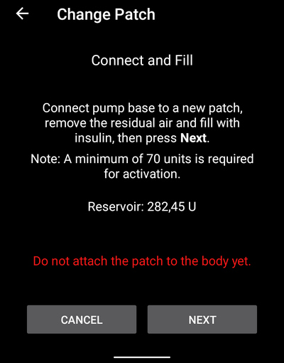

# Medtrum Nano / 300U

Tyto pokyny slouží ke konfiguraci inzulinové pumpy Medtrum.

This software is part of a DIY artificial pancreas solution and is not a product but requires YOU to read, learn, and understand the system, including how to use it. Jste jediní, kdo nese odpovědnost za to, co s tím uděláte.

```{contents} Table of contents
:depth: 1
:local: true
```

## Možnosti pumpy s AAPS
* Podpora všech funkcí smyčky (SMB, TBR atd.)
* Automatická detekce letního času a časových pásem
* Rozložený bolus není ovladačem pro AAPS podporován

## Hardwarové a softwarové požadavky
* **Kompatibilní základny a zásobníky (patche) Medtrum**
    - Aktuálně podporováno:
        - Medtrum TouchCare Nano se základnou s číslem REF: **MD0201** a **MD8201**.
        - Medtrum TouchCare 300U se základnou s číslem REF: **MD8301**.
        - Pokud máte nepodporovaný model a jste ochotni darovat hardware nebo pomoci s testováním, kontaktujte nás prostřednictvím discordu [zde](https://discordapp.com/channels/629952586895851530/1076120802476441641).
* **Version 3.2.0.0 or newer of AAPS built and installed** using the [Build APK](../SettingUpAaps/BuildingAaps.md) instructions.
* **Compatible Android phone** with a BLE Bluetooth connection
    - See AAPS [Release Notes](../Maintenance/ReleaseNotes.md)
* [**Continuous Glucose Monitor (CGM)**](../Getting-Started/CompatiblesCgms.md)

## Než začnete

**BEZPEČNOST PŘEDEVŠÍM** Nepokoušejte se používat zařízení v prostředí, ve kterém nedokážete snadno opravit případné chyby (dodatečné patche, inzulín a zařízení pro ovládání pumpy jsou nezbytností).

**PDM a aplikace Medtrum nebudou fungovat, je-li patch aktivován pomocí AAPS.** Dříve bylo možné odesílat pomocí PDM nebo aplikace Medtrum příkazy do pumpy. Z bezpečnostních důvodů můžete používat aktivovaný patch pouze se zařízením nebo aplikací, které byly použity k jeho aktivaci.

*To neznamená, že byste měli PDM vyhodit. Je doporučeno mít jej někde bezpečně uložený jako zálohu pro případ nouze, například pokud ztratíte telefon nebo AAPS nefunguje správně.*

**Vaše pumpa nepřestane vydávat inzulín, pokud není připojena k AAPS.** Výchozí bazální dávky jsou naprogramovány v pumpě tak, jak je definováno v aktuálním aktivním profilu. Pokud je AAPS v provozu, bude odesílat dočasné příkazy pro úpravy bazálních dávek, které poběží maximálně 120 minut. Pokud z nějakého důvodu pumpa neobdrží žádné nové příkazy (například kvůli ztrátě komunikace kvůli vzdálenosti mezi pumpou a telefonem), pumpa se vrátí k výchozí bazální dávce naprogramované v pumpě, jakmile skončí aktuální dočasný bazál.

**30 min Basal Rate Profiles are NOT supported in AAPS.** **The AAPS Profile does not support a 30 minute basal rate time frame** If you are new to AAPS and are setting up your basal rate profile for the first time, please be aware that basal rates starting on a half-hour basis are not supported, and you will need to adjust your basal rate profile to start on the hour. For example, if you have a basal rate of 1.1 units which starts at 09:30 and has a duration of 2 hours ending at 11:30, this will not work. You will need to change this 1.1 unit basal rate to a time range of either 9:00-11:00 or 10:00-12:00. Ačkoli pumpa Medtrum sama o sobě podporuje 30minutové intervaly pro nastavení bazálu, AAPS momentálně kvůli používaným algoritmům toto neumožňuje.

**Profily s 0U/h bazály NEJSOU v AAPS podporovány.** Zatímco pumpa Medtrum nulový bazál podporuje, AAPS používá násobky bazálního profilu k určení automatizované léčby, a proto nemůže fungovat s nulovým bazálem. A temporary zero basal rate can be achieved through the "Disconnect pump" function or through a combination of Disable Loop/Temp Basal Rate or Suspend Loop/Temp Basal Rate.

## Nastavení

POZOR: Při aktivaci patche pomocí AAPS **MUSÍTE** vypnout všechna ostatní zařízení, která mohou komunikovat s pumpou Medtrum. např. aktivní PDM nebo aplikace Medtrum. Ujistěte se, že máte připravenou základnu pumpy a sériové číslo k aktivaci nového patche.

### Krok 1: Vyberte pumpu Medtrum

#### Option 1: New installations

Pokud instalujete AAPS poprvé, **Průvodce nastavením** vás provede instalací AAPS. Až se dostanete k výběru pumpy, vyberte „Medtrum“.

Pokud máte pochybnosti, můžete také vybrat možnost „Virtuální pumpa“ a později vybrat „Medtrum“, poté, co nastavíte AAPS (viz možnost 2).


#### Option 2: The Config Builder

On an existing installation you can select the **Medtrum** pump in [Config Builder > Pump](#Config-Builder-pump):

V levém horním rohu klepněte na **hamburger menu**, vyberte **Konfigurace**\ ➜\ **Pumpa**\ ➜\ **Medtrum**\ klepnutím na **přepínač** s názvem **Medtrum**.

Klepnutím na **zaškrtávací políčko** vedle **ozubeného kolečka nastavení** zapnete zobrazení přehledu Medtrum v aplikaci AAPS na kartě **Medtrum**. Zaškrtnutím tohoto políčka budete moci snáze používat příkazy Medtrum při používání AAPS a je velmi doporučeno.


### Krok 2: Změňte nastavení Medtrum

Zadejte nastavení Medtrum klepnutím na **ozubené kolečko nastavení** modulu Medtrum v nabídce Konfigurace.


#### Sériové číslo:

Sem zadejte sériové číslo vaší základny, jak je uvedeno na základně. Ujistěte se, že sériové číslo je správné a nepřidali jste žádné mezery (Můžete použít velká nebo malá písmena).

POZNÁMKA: Toto nastavení lze změnit pouze tehdy, když není aktivní žádný patch.

#### Nastavení alarmů

***Výchozí: Pípnutí.***

Toto nastavení změní způsob, jakým vás pumpa upozorní v případě varování nebo chyby.

- Pípnutí > Patch bude při alarmech a výstrahách pípat.
- Tichý > Patch nebude upozorňovat na alarmy ani výstrahy.

Poznámka: V tichém režimu se stále spustí alarm v AAPS v závislosti na nastavení hlasitosti vašeho telefonu. Pokud na alarm nebudete reagovat, patch nakonec pípne.

#### Oznámení o varování pumpy

***Výchozí: Povoleno.***

This settings changes the way AAPS will show notification on non critical pump warnings. Když je povoleno, na telefonu se zobrazí oznámení, když dojde k varování pumpy, včetně:
    - Slabá baterie
    - Nízký stav zásobníku (20 U)
    - Připomenutí expirace patche

In either case these warnings are also shown on the Medtrum overview screen under [Active alarms](#medtrum-active-alarms).

(medtrum-patch-expiration)=
#### Vypršení platnosti patche

***Výchozí: Povoleno.***

Toto nastavení změní chování patche. Když je povoleno, platnost patche vyprší po 3 dnech a zazní zvukové varování, pokud máte zvuk povolen. Po 3 dnech a 8 hodinách přestane patch fungovat.

Pokud je tato možnost zakázána, patch vás nebude varovat a bude nadále fungovat, dokud se nevybije baterie patche nebo nedojde zásobník.

#### Varování o vypršení platnosti pumpy

***Výchozí: 72 hodin.***

This setting changes the time of the expiration warning, when [Patch Expiration](#medtrum-patch-expiration) is enabled, AAPS will give a notification on the set hour after activation.

#### Hodinové maximum inzulínu

***Výchozí: 25 U.***

Tímto nastavením se mění maximální množství inzulinu, které může být dodáno během jedné hodiny. Pokud je tento limit překročen, patch bude pozastaven a spustí se alarm. The alarm can be reset by pressing the reset button on in the overview menu see [Reset alarms](#nano-reset-alarms).

Nastavte na rozumnou hodnotu dle svých potřeb.

#### Denní maximum inzulínu

***Výchozí: 80 U.***

Tímto nastavením se mění maximální množství inzulinu, které může být dodáno během jednoho dne. Pokud je tento limit překročen, patch bude pozastaven a spustí se alarm. The alarm can be reset by pressing the reset button on in the overview menu see [Reset alarms](#nano-reset-alarms).

Nastavte na rozumnou hodnotu dle svých potřeb.

#### Scan on Connection error

***Default: Off.***

Located under **Advanced Settings**.

Only enable if you have connection problems. If enabled the driver scans for the pump again before trying to reconnect to the pump. Make sure you have Location permission set to "Always allow".

### Krok 2b: Nastavení výstrah AAPS

Otevřete nastavení

#### Pumpa:

##### Hlídač BT

Přejděte do nastavení a vyberte **Pumpa**:


##### Hlídač BT

Toto nastavení se pokusí vyřešit případné problémy s BLE. Pokusí se znovu připojit k pumpě, když dojde k ztrátě spojení. Při pokusu o znovupřipojení k pumpě také bude čekat, dokud pumpa nebude nedostupná po určitou dobu.

Povolte toto nastavení, pokud máte časté problémy s připojením k pumpě.

#### Místní výstrahy:

Přejděte do nastavení a vyberte **Místní výstrahy**:


##### Výstraha při nedostupné pumpě

***Výchozí: Povoleno.***

Toto nastavení je vynuceně zapnuto, když je aktivován ovladač Medtrum. Upozorní vás, pokud je pumpa nedostupná. K tomu může dojít, když je pumpa mimo dosah nebo když pumpa nereaguje z důvodu vadného patche nebo základny, např. když mezi základnu a patch vnikne voda.

Z bezpečnostních důvodů toto nastavení nelze deaktivovat.

##### Limit pro nedostupnost pumpy [min]

***Výchozí hodnota: 30 min.***

Tato nastavení změní dobu, po které vás AAPS upozorní, že není možné se připojit k pumpě. K tomu může dojít, když je pumpa mimo dosah nebo když pumpa nereaguje z důvodu vadného patche nebo základny, např. když mezi základnu a patch vnikne voda.

Toto nastavení lze při použití pumpy Medtrum změnit, ale doporučuje se nastavit ho na 30 minut z důvodu bezpečnosti.

### Krok 3: Aktivace patche

**Než budete pokračovat:**
- Mějte připravenou základnu Medtrum Nano a zásobník (patch).
- Make sure that AAPS is properly set up and a [profile is activated](../DailyLifeWithAaps/ProfileSwitch-ProfilePercentage.md).
- Ostatní zařízení, která mohou komunikovat s pumpou Medtrum, jsou vypnuta (PDM a aplikace Medtrum)

#### Aktivujte patch z karty Medtrum

Navigate to the [Medtrum TAB](#nano-overview) in the AAPS interface and press the **Change Patch** button in the bottom right corner.

Pokud je patch již aktivován, budete nejprve vyzváni k jeho deaktivaci. see [Deactivate Patch](#nano-deactivate-patch).

Postupujte podle pokynů pro naplnění a aktivaci nového patche. Upozornění – je důležité spojit základnu se zásobníkem (patchem) až ve chvíli, kdy vás k tomu aplikace vyzve. **Umístit pumpu na tělo a aplikovat kanylu je nutné až ve chvíli, kdy vás k tomu aplikace během aktivace vyzve (po dokončení plnění).**

##### Spusťte Aktivaci.


V tomto kroku zkontrolujte sériové číslo a ujistěte se, že základna pumpy ještě není připojena k patchi.

Stiskněte **Další** pro pokračování.

##### Naplnit zásobník



Jakmile je patch nalezen a naplněn minimálně 70 jednotkami inzulínu, zobrazí se tlačítko **Další**.

##### Naplnit patch


Neodstraňujte bezpečnostní pojistku a stiskněte tlačítko jehly na patchi.

Stisknutím tlačítka **Další** spustíte plnění.


Jakmile je plnění dokončeno, pokračujte stisknutím tlačítka **Další**.

##### Připojit patch


Očistěte pokožku, odstraňte krycí fólie a připevněte patch k tělu. Odstraňte bezpečnostní pojistku a stisknutím tlačítka na patchi aplikujte kanylu.

Stisknutím tlačítka **Další** aktivujte patch.

(medtrum-activate-patch)=
##### Aktivovat patch


Po dokončení aktivace se zobrazí následující obrazovka


Stiskněte **OK** pro návrat na hlavní obrazovku.

(nano-deactivate-patch)=

### Deaktivace patche

To deactivate a currently active patch, go to the [Medtrum TAB](#nano-overview) in the AAPS interface and press the **Change Patch** button.


Budete požádáni o potvrzení, že chcete deaktivovat aktuální patch. **Please note that this action is not reversible.** When deactivation is completed, you can press **Next** to continue the process to activate a new patch. Pokud nejste připraveni aktivovat nový patch, stiskněte **Zrušit** pro návrat na hlavní obrazovku.


Pokud AAPS nedokáže patch deaktivovat (například proto, že základna pumpy již byla odstraněna z patche), můžete stisknout tlačítko **Zahodit**, čímž systém zapomene aktuální relaci patche a umožní aktivovat nový patch.


Jakmile je deaktivace dokončena, stiskněte **OK** pro návrat na hlavní obrazovku nebo stiskněte **Další**, chcete-li pokračovat v procesu aktivace nového patche.

(nano-resume-interrupted-activation)=

### Obnovení přerušené aktivace

If a patch activation is interrupted, for instance because the phone battery runs out, you can resume the activation process by going to the [Medtrum TAB](#nano-overview) in the AAPS interface and press the **Change Patch** button.


Stisknutím tlačítka **Další** pokračujte v procesu aktivace. Stisknutím tlačítka **Zahodit** zahodíte aktuální relaci patche a bude možné aktivovat nový patch.


Ovladač se pokusí zjistit aktuální stav aktivace patche. Bude-li proces úspěšný, aktivace naváže a bude pokračovat.

(nano-overview)=

## Přehled

Přehled obsahuje informace o aktuálním stavu patche Medtrum. Obsahuje také tlačítka pro výměnu patche, resetování alarmů a obnovení stavu.


### Stav BLE:

Zobrazuje aktuální stav připojení Bluetooth k základně pumpy.

### Naposledy připojeno:

Zobrazuje čas posledního připojení pumpy k AAPS.

### Stav pumpy:

Zobrazuje aktuální stav pumpy. Například:
    - AKTIVNÍ : Pumpa je aktivována a funguje normálně
    - ZASTAVENO: Patch není aktivován

### Typ bazálu:

Zobrazuje aktuální typ bazálu.

### Bazál:

Zobrazuje aktuální bazální dávku.

### Poslední bolus:

Zobrazuje poslední vydaný bolus.

### Aktivní bolus:

Zobrazuje aktivní bolus, který je v současné době vydáván.

(medtrum-active-alarms)=
### Aktivní alarmy:

Zobrazuje všechny aktivní alarmy.

### Zásobník:

Zobrazuje aktuální úroveň zásobníku.

### Baterie:

Zobrazuje aktuální napětí baterie patche.

### Typ pumpy:

Zobrazuje číslo aktuálního typu pumpy.

### Verze FW:

Zobrazuje aktuální verzi firmwaru patche.

### Č. patche:

Zobrazuje pořadové číslo aktivovaného patche. Toto číslo se zvyšuje pokaždé, když je aktivován nový patch.

### Patch vyprší:

Zobrazuje datum a čas, kdy patch vyprší.

### Obnovit:

Toto tlačítko obnoví stav patche.

### Vyměnit patch:

Toto tlačítko spustí proces výměny patche. See [Activate patch](#medtrum-activate-patch) for more information.

(nano-reset-alarms)=

### Resetovat alarmy

Tlačítko alarmu se zobrazí na obrazovce přehledu, když je aktivní alarm, který lze resetovat. Stisknutím tohoto tlačítka dojde k resetování alarmů a obnovení dodávky inzulínu, pokud byl patch pozastaven kvůli alarmu. E.g. když je pozastaven kvůli alarmu při dosažení maximální denní dávky inzulínu.


Stiskněte tlačítko **Resetovat alarmy** k resetování alarmů a obnovení normálního provozu.

## Switching phone, export/import settings

Pokud měníte telefon za nový, je nezbytné, abyste provedli následující kroky:
* [Export settings](../Maintenance/ExportImportSettings.md) on your old phone
* Transfer settings from old to new phone, and import them into AAPS

The imported settings file has to be of the same patch session that you are currently using, otherwise the patch will not connect.

After a settings import the driver will sync history with the pump, this can take a while depending on the age of the settings file.

From AAPS version 3.3.0.0 onwards, the sync progress is shown in the the home screen: 

## Troubleshooting

### Problémy s připojením

Pokud máte problémy s přípojením kvůli časovému limitu nebo jiné problémy s připojením:
- V nastavení AAPS v systému Android: Nastavte oprávnění k určení polohy na „Povolit vždy“.

### Aktivace přerušena

Pokud je proces aktivace přerušen, například kvůli vybité baterii telefonu nebo poruše telefonu. The activation process can be resumed by going to the change patch screen and follow the steps to resume the activation as outlined here: [Resume interrupted activation](#nano-resume-interrupted-activation)

### Jak předejít chybám patche

Patch může způsobit různé chyby. Chcete-li zabránit častým chybám:
- Ujistěte se, že je základna pumpy správně umístěna v patchi a nejsou viditelné žádné mezery.
- Při plnění patche nevyvíjejte na píst stříkačky nadměrný tlak. Nepokoušejte se naplnit patch více než na maximální hodnotu udanou pro váš model.

## Kde získat pomoc

Veškerý vývoj ovladače pro Medtrum je prováděn komunitou na **dobrovolnické** bázi; žádáme vás, abyste měli tuto skutečnost na paměti a než požádáte o pomoc, abyste vyzkoušeli následující:

-  **Level 0:** Read the relevant section of this documentation to ensure you understand how the functionality with which you are experiencing difficulty is supposed to work.
-  **Úroveň 1:** Pokud přetrvávají problémy, které nejste schopni vyřešit použitím tohoto dokumentu, pak přejděte na kanál *#Medtrum* na **Discordu** pomocí [tohoto odkazu s pozvánkou](https://discord.gg/4fQUWHZ4Mw).
-  **Level 2:** Search existing issues to see if your issue has already been reported at [Issues](https://github.com/nightscout/AAPS/issues) if it exists, please confirm/comment/add information on your problem. If not, please create a [new issue](https://github.com/nightscout/AndroidAPS/issues) and attach [your log files](../GettingHelp/AccessingLogFiles.md).
-  **Be patient - most of the members of our community consist of good-natured volunteers, and solving issues often requires time and patience from both users and developers.**