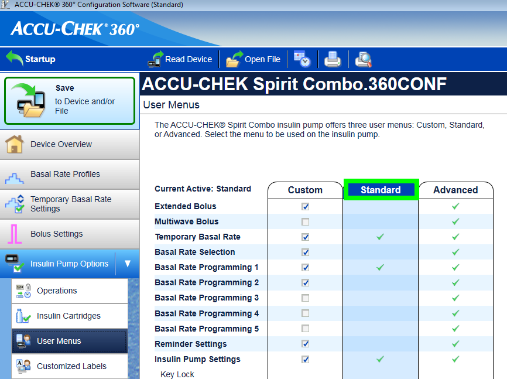

# Pumpa Accu-Chek Combo

**Tento software je součástí DIY řešení a není to produkt, ale vyžaduje, abyste si přečetli dokumentaci, pochopili celý systém a naučili se ho používat. Není to něco, co za Vás udělá veškerý management diabetu, ale pomůže Vám k lepším výsledkům a kvalitě života, pokud investujete čas k tomu potřebný. Zbytečně nespěchejte, nechejte si na učení dostatek času. Pouze Vy jste zodpovědní za to, jak ze systémem zacházíte.**

(hardware-requirements)=

## Hardwarové požadavky

- Roche Accu-Chek Combo (jakýkoliv firmware, funguje se všemi)
- Zařízení Smartpix nebo Realtyme spolu s programem 360 Configuration Software pro úpravu parametrů pumpy. (Roche posílá zařízení Smartpix a konfigurační software zdarma svým zákazníkům na vyžádání.)
- A compatible phone: An Android phone with a phone running LineageOS 14.1 (formerly CyanogenMod) or at least Android 8.1 (Oreo). As of AndroidAPS 3.0 Android 9 is mandatory. See [release notes](https://androidaps.readthedocs.io/en/latest/Installing-AndroidAPS/Releasenotes.html#android-version-and-aaps-version) for details.
- With LineageOS 14.1 it has to be a recent version from at least June 2017 since the change needed to pair the Combo pump was only introduced at that time. 
- Seznam telefonů lze nalézt v dokumentu [AAPS telefony](https://docs.google.com/spreadsheets/d/1gZAsN6f0gv6tkgy9EBsYl0BQNhna0RDqA9QGycAqCQc/edit).
- Prosím uvědomte si, že to není úplný seznam a odráží osobní uživatelské zkušenosti. Máte možnost doplnit své vlastní zkušenosti a tím pomoci dalším uživatelům.
- Mějte na paměti, že ačkoliv Android 8.1 umožňuje komunikaci s Combem, stále na Androidu 8.1 existují problémy s AAPS.
- Pokročilí uživatelé mohou provést párování na rootovaném telefonu a přenést jej do jiného rootovaného telefonu pro použití s ruffy/AAPS. To umožňuje používat telefony s Android < 8.1, ale nebylo to široce testováno: https://github.com/gregorybel/combo-pairing/blob/master/README.md

## Omezení

- Extended bolus and multiwave bolus are not supported (see [Extended Carbs](../Usage/Extended-Carbs.md) instead).
- Je podporován pouze jeden bazální profil.
- Setting a basal profile other than 1 on the pump or delivering extended boluses or multiwave boluses from the pump interferes with TBRs and forces the loop into low-suspend only mode for 6 hours as the the loop can't run safely under these conditions.
- It's currently not possible to set the time and date on the pump, so [daylight saving time changes](../Usage/Timezone-traveling.md#accu-chek-combo) have to be performed manually (you may disable the phone's automatic clock update in the evening and change it back in the morning together with the pump clock to avoid an alarm during the night).
- Aktuální rozsah bazálních dávek je od 0,05 do 10 U/h. This also applies when modifying a profile, e.g. when increasing to 200%, the highest basal rate must not exceed 5 U/h since it will be doubled. Obdobně platí, že při snížení na 50% musí být nejnižší bazální dávka 0,10 U/h.
- If the loop requests a running TBR to be cancelled the Combo will set a TBR of 90% or 110% for 15 minutes instead. This is because cancelling a TBR causes an alert on the pump which causes a lot of vibrations.
- Occasionally (every couple of days or so) AAPS might fail to automatically cancel a TBR CANCELLED alert, which the user then needs to deal with (by pressing the refresh button in AAPS to transfer the warning to AAPS or confirming the alert on the pump).
- Bluetooth connection stability varies with different phones, causing "pump unreachable" alerts, where no connection to the pump is established anymore. 
- If that error occurs, make sure Bluetooth is enabled, press the Refresh button in the Combo tab to see if this was caused by an intermitted issue and if still no connection is established, reboot the phone which should usually fix this. 
- There is another issue were a restart doesn't help but a button on the pump must be pressed (which resets the pump's Bluetooth), before the pump accepts connections from the phone again. 
- There is very little that can be done to remedy either of those issues at this point. So if you see those errors frequently your only option at this time is to get another phone that's known to work well with AndroidAPS and the Combo (see above).
- Vydání bolusu z pumpy nebude vždy detekováno okamžitě (zaznamenává se při každém spojení s pumpou), v nejhorším případě to může trvat 20 minut. 
- Bolusy na pumpě jsou kontrolovány před každým nastavením vyššího dočasného bazálu nebo bolusu pomocí AAPS, ale z důvodu omezení AAPS odmítne zapsat dočasný bazál / bolus, protože byl vypočítán podle falešných předpokladů. (-> nepodávejte bolus z pumpy! See chapter [Usage](#usage) below)
- Vyhněte se tomu, abyste nastavovali dočasný bazál na pumpě, smyčka předpokládá, že dočasné bazály řídí ona. Zaznamenání nového dočasného bazálu na pumpě může trvat až 20 minut a délka dočasného bazálu bude vypočítána pouze od momentu, kdy je načtena. Což v nejhorším případě může být 20 minut, které nebudou započítány do IOB. 

## Nastavení

- Nastavte pumpu pomocí 360 Config Software. 
- Pokud tento software nemáte, kontaktujte svého obchodního zástupce Roche nebo zákaznickou linku. Registrovaným uživatelům poskytují software a také hardwarovou čtečku SmartPix pro komunikaci s pumpou.
- **Required settings** (marked green in screenshots):
    
    - Set/leave the menu configuration as "Standard", this will show only the supported menus/actions on the pump and hide those which are unsupported (extended/multiwave bolus, multiple basal rates), which cause the loop functionality to be restricted when used because it's not possible to run the loop in a safe manner when used.
    - Ověřte, že *Quick Info Text* je nastaven přesně na "QUICK INFO" (bez uvozovek, nastavení najdete pod *Insulin Pump Options*).
    - Nastavte maximální velikost dočasného bazálu (TBR) *Maximum Adjustment* na 500%
    - Vypněte *Signal End of Temporary Basal Rate* - alarm na konci dočasného bazálu
    - Nastavte časový krok dočasného bazálu na 15 min
    - Zapněte Bluetooth

- **Recommended settings** (marked blue in screenshots)
    
    - Nastavte si upozornění na nízký stav zásobníku.
    - Nastavte si maximální bolus s ohledem na svou léčbu jako ochranu před chybami softwaru.
    - Podobně si nastavte maximální hodnotu dočasného bazálu jako pojistku. Allow at least 3 hours, since the option to disconnect the pump for 3 hours sets a 0% for 3 hours.
    - Aktivujte zámek tlačítek na pumpě, abyste předešli nechtěnému vydání bolusů z pumpy, when the pump was used before and quick bolusing was a habit.
    - Nastavte čas zhasnutí displeje na 5,5 s a čas opuštění menu na 5 s. This allows the AAPS to recover more quickly from error situations and reduces the amount of vibrations that can occur during such errors

- Nainstalujte AndroidAPS tak, jak je popsáno v [AndroidAPS wiki](https://androidaps.readthedocs.io/)
- Přečtěte si dokumentaci, abyste pochopili, jak nastavit AndroidAPS.
- Zvolte v konfigurátoru AndroidAPS pera jako plugin pro pumpu. V tuto chvíli nenastavujte plugin Combo, aby nedocházelo k narušování procesu párovaní.
- Clone ruffy via git from [MilosKozak/ruffy](https://github.com/MilosKozak/ruffy). At the moment, the primary branch is the `combo` branch, in case of problems you might also try the 'pairing' branch (see below).
- Build and install ruffy and use it to pair the pump. Pokud se nepodaří párovaní po několika pokusech, použijte branch `pairing`, spárujte pumpu a následně se vraťte k původní branchi. If the pump is already paired and can be controlled via ruffy, installing the `combo` branch is sufficient. Párovaní je v některých případech náročný proces (naštěstí se dělá pouze jednou). Může vyžadovat několik pokusů. Je potřeba rychle odpovídat na potvrzovací výzvy a často začít znovu. Když začínáte znovu, nezapomeňte odstranit párovaní z nastavení bluetooh. Jiný postup, který je možné vyzkoušet, je přejít do nastavení bluetooth ihned po začátku párovaní (to zajistí, že telefon je stále viditelný po celou dobu, co je nastavení otevřené), jakmile pumpa najde telefon, vrátit se ihned do ruffy a potvrdit párování i tam (ve chvíli, kdy pumpa zobrazí autorizační kód). Pokud se párovaní nepodaří ani po desátém pokusu, zkuste počkat 5–10 sekund, než potvrdíte na pumpě párování potom, co je zobrazen název telefonu. Pokud jste v předchozím kroku výše nastavili timeout menu na 5 s, je potřeba tuto hodnotu zvýšit. Tento postup byl u některých uživatelů úspěšný. Jedna z posledních možností při neúspěchu párovaní je možné rušení, zkuste párování v jiné místnosti, ideálně tam, kde není příliš WiFi a bluetooth zařízení. Minimálně jednomu člověku velmi pomohlo párovat mimo radiově zarušený prostor.
- Pokud použiváte AAPS s ruffy, nikdy nespouštějte a nepoužívejte ruffy přímo. Po úspěšném párovaní restartujte telefon, aby si AAPS mohl spustit ruffy na pozadí a sami už ruffy nespouštějte.
- U nikdy nepoužité pumpy je nutné před zahájením párovaní vydat aspoň jeden bolus, aby se vytvořil záznam v historii. Bez aspoň jednoho záznamu v historii je AAPS nefunkční.
- Před spuštěním Combo pluginu v AAPS ověřte, že máte správně nastavený a aktivovaný (!) profil. Ověřte dvakrát, že profil v AAPS odpovídá vašemu bazálnímu profilu. AAPS po spojení s pumpou zapíše bazální profil z AAPS do pumpy do profilu 1. Potom aktivujte Combo plugin. Stiskněte tlačítko *Obnovit* na záložce Combo, abyste zahájili komunikaci s pumpou Combo.
- Ověřte správné nastavení pumpy. Ve chvíli, kdy je pumpa ve stavu **Odpojeno**, použijte AAPS k nastavení dočasného bazálu (TBR) na 500 % po dobu 15 min a následně zkuste vydat malý bolus. Ověřte na pumpě, že dočasný bazál se nastavil na 500 % a bolus je zaznamenán v historii. AAPS také zobrazí, že obě akce (dočasný bazál a bolus) byly provedeny.

(why-pairing-with-the-pump-does-not-work-with-the-app-ruffy)=

## Why pairing with the pump does not work with the app "ruffy"?

There are serveral possible reasons. Try the following steps:

1. Vložte ** novou nebo nabitou baterii ** do pumpy. Podívejte se na podrobnosti do návodu do části Baterie. Ujistěte se, že pumpa je velmi blízko telefonu.

2. Vypněte nebo odstraňte jakékoliv jiné Bluetooth zařízení, abyste eliminovali možné rušení při párování. Jakákoliv paralelní komunikace s rozhraním Bluetooth nebo výzva k vytvoření připojení může narušit proces párování.

3. Delete already connected devices in the Bluetooth menu of the pump: **BLUETOOTH SETTINGS / CONNECTION / REMOVE** until **NO DEVICE** is shown.

4. Delete a pump already connected to the phone via Bluetooth: Under Settings / Bluetooth, remove the paired device "**SpiritCombo**"
5. Ujistěte se, že na pozadí není spuštěna smyčka aplikace AAPS. Deaktivuje smyčku v AAPS.
6. Try using the '**pairing**' branch from the [MilosKozak/ruffy](https://github.com/MilosKozak/ruffy/tree/pairing) repository to establish the connection 
7. Nyní spusťte aplikaci Ruffy v telefonu. Stiskněte tlačítko Reset and remove the old connection. Then hit **Connect!**.
8. V Bluetooth menu pumpy přejděte na ** ADD DEVICE / ADD CONNECTION**. Press *CONNECT!** 
    - The next three steps are timing-sensitive, so you might need to try different pauses/speed if pairing fails. Read the full sequence before trying it.

9. Nyní se na pumpě ukáže BT název telefonu a nabídne možnost párování. Here it is importand to wait at least 5s before you hit the select button on Pump. Jinak pumpa neodešle požadavek pro párování korektně.
    
    - Jestliže je nastaveno zhasnutí displeje na 5 s, můžete zkusit nastavit na 40 s (původní nastavení). From experiance the time between pump is showing up in phone until select phone is around 5-10s. In many other cases pairing just times out without successfully pair. Later you should set it back to 5s, to meet AAPS Combo settings and speed up connections.
    - If the pump does not show the phone as a pairing device at all, your phone's Bluetooth stack is probably not compatible with the pump. Ujistěte se, že používáte novou verzi systému **LineageOS ≥ 14.1** nebo **Android ≥ 8.1 (Oreo)**. If possible, try another smartphone. You can find a list of already successfully used smartphones under \[AAPS Phones\] (https://docs.google.com/spreadsheets/d/1gZAsN6f0gv6tkgy9EBsYl0BQNhna0RDqA9QGycAqCQc/edit#gid=698881435). 

10. Sometimes the phone asks for a (typically 4 digit) bluetooth PIN number that is not related to the 10 digit PIN later shown on the pump. Usually, ruffy will set this PIN automatically, but due to timing issues, this does not always work. If a request for a Bluetooth pairing PIN appears on the phone before any code is shown on the pump, you need to enter **}gZ='GD?gj2r|B}>** as the PIN. This is easiest done if you copy this 16 character text into the clipboard before starting the pairing sequence and just paste it in the dialog at this step. See related [Github issue](https://github.com/MilosKozak/ruffy/issues/14) for details.

11. At next the pump should show up a 10 digit security code. And Ruffy shold show a screen to enter it. So enter the code in Ruffy and you should be ready to go.
12. If pairing was not successful and you got a timeout on the pump, you will need to restart the process from scratch.
13. If you have used the 'Pairing' branch to build the ruffy app, now install the version build from the 'combo' branch on top of it. Make sure that you have used the same keys when signing the two versions of the app to be able to keep all setting and data, as they also contain the connection properties.
14. Restartujte telefon.
15. Nyní můžete restartovat AAPS smyčku.

## Používání

- Mějte na paměti, že toto není produkt, zvláště na začátku potřebuje uživatel pochopit a monitorovat systém, jeho limity a jak může dojít k chybě. Je důrazně doporučováno nepoužívat tento systém, pokud ho uživatel není schopen plně pochopit.
- Přečtěte si dokumentaci k OpenAPS na https://openaps.org, abyste pochopili algoritmus smyčky, na které je systém AndroidAPS založen.
- Read the online documentation to learn about and understand AndroidAPS https://androidaps.readthedocs.io/
- Propojení combo s ruffy/aaps používá stejné rozhraní jako originální glukometr. Glukometr zrcadlí obrazovku pumpy a simuluje stisk tlačítek na pumpě. Přenos obrazovky a zpětný přenos tlačítek je to, co dělá aplikace ruffy. A `scripter` component reads the screen and automates entering boluses, TBRs etc and making sure inputs are processed correctly. AAPS komunikuje s komponentou scripter a pomocí ní zadává příkazy vycházející z algoritmu smyčky. Tento způsob komunikace má pár omezení: Je relativně pomalý (ale stále dostatečně rychlý pro běžné použití), nastavení dočasného bazálu (TBR) nebo podání bolusu způsobuje vibrace pumpy.
- Integrace pumpy Combo do AAPS počítá s tím, že všechny příkazy pro pumpu jsou zadávány výhradně prostřednictvím AAPS. Bolus zadaný přímo na pumpě je sice detekován a načten do AAPS, ale může dojít ke zpoždění až 20 minut, než to AAPS zjistí. Zpětné načítání bolusů zadaných přímo na pumpě je JEN bezpečnostní opatření a nemělo by být nikdy používáno. (Smyčka stejně potřebuje znát i sacharidy, které nelze na pumpě zadat. Toto je další důvod, proč by veškeré operace měly být prováděny výhradně prostřednictvím AAPS). 
- Nenastavujte a nerušte dočasný bazál (TBR) na pumpě. Smyčka předpokládá, že řídí dočasné bazály, bez tohoto předpokladu nemůže spolehlivě fungovat. Důvod je ten, že nelze určit čas spuštění dočasného bazálu zadaného uživatelem přímo na pumpě.
- AAPS používá první bazální profil, ten je při startu aplikace načten a následně nastaven dle bazálního profilu v AAPS. Bazální profil neměňte ručně na pumpě. Tato změna je jako bezpečnostní opatření detekována a opět přepsána na nastavení platné v AAPS (nespoléhejte však na bezpečností opatření a detekci nežádoucích změn – toto je pouze bezpečnostní opatření).
- V zájmu snížení rizika náhodného vydání bolusu doporučujeme používat zámek klávesnice pumpy. Zejména pokud jste dříve používali pumpu s možností rychlého bolusu. Výhodou zámku je rovněž skutečnost, že náhodný stisk klávesy nepřeruší právě probíhající komunikaci mezi AAPS a pumpou.
- Občas se stane, že je vyvolán alarm „zrušený bolus“ nebo „zrušená dočasná bazální dávka“. Toto se čas od času stane a je to způsobeno přerušením komunikace mezi telefonem a pumpou v průběhu zadávaní příkazu. AAPS se snaží znovu připojit a zrušit alarm. Také se snaží znovu poslat neúspěšný příkaz (toto neplatí pro bolus, který se z bezpečnostních důvodů znovu neposílá). Proto alarm ani zrušení příkazu jako takové nejsou problém. Ale obvykle trvá až 30 sekund, než se AAPS podaří alarm zrušit a zaslat příkaz znova. Je to z toho důvodu, že dokud nezhasne obrazovka pumpy, není možné znovu navázat komunikaci s pumpou. Pokud alarm pumpy přetrvává, je možné že automatické zrušení alarmu selhalo. V tomto případě je nutné, aby alarm zrušil uživatel ručně.
- Pokud je vyvolán alarm kvůli vybité baterii nebo docházejícímu inzulínu v průběhu bolusu, AAPS tento alarm automaticky zruší a zobrazí notifikaci. V případě, že k této situaci dojde ve chvíli, kde není aktivní spojení s pumpou, je možné jít na záložku Combo v AAPS a stisknout tlačítko Obnovit. Alarm je zrušen a notifikace o důvodu alarmu uložena do AAPS.
- Pokud se AAPS nepodaří zrušit alarm o zrušení dočasné bazální dávky nebo jiný alarm, stisknutí tlačítka Obnovit na záložce Combo naváže spojení AAPS s pumpou, které zruší alarm a zobrazí notifikaci o důvodu alarmu. Je bezpečné tak učinit, protože hned v další operaci smyčky je nastavení provedeno znovu.
- Pro všechny ostatní alarmy vycházející z pumpy je zobrazena varovná hláška v záložce Combo. Pro některé, jako je například E4 – Ucpání systému, je zobrazena notifikace i na hlavní obrazovce. Chyby (E1–10) vždy zobrazí urgentní notifikaci. Systém AAPS nikdy neruší závažné chyby na pumpě, nechá pumpu vydávat zvukový alarm a vibrovat, aby uživatele upozornil na kritickou situaci, která potřebuje řešení.
- Po párovaní nikdy nepoužívejte aplikaci ruffy (AAPS spustí ruffy pro svoje použití na pozadí). Použití ruffy paralelně s AAPS není možné.
- Pokud dojde k chybě AAPS (nebo zastavení z debugger) při vzájemné komunikaci AAPS a pumpy, je nutné ukončit RUFFY v systémových prostředcích. Po restartování AAPS se RUFFY znovu spustí. Restartování telefonu je většinou nejjednodušší cesta, pokud nejde aplikace ukončit prostřednictvím systému.
- Jestliže probíhá komunikace AAPS s pumpou (na pumpě je zobrazeno logo Bluetooth), nemačkejte žádná tlačítka na pumpě.