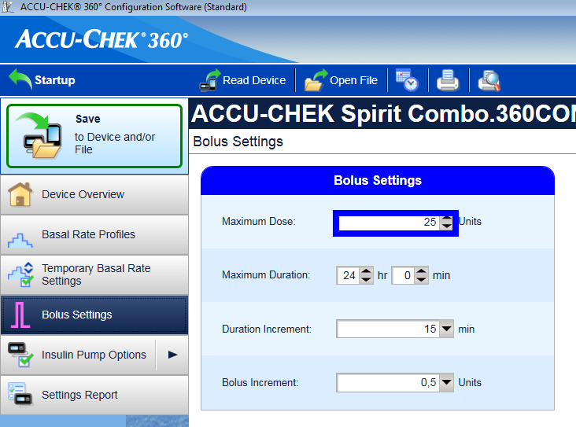

# Pumpa Accu-Chek Combo

**This software is part of a DIY solution and is not a product, but requires YOU to read, learn and understand the system including how to use it. It is not something that does all your diabetes management for you, but allows you to improve your diabetes and your quality of life if you're willing to put in the time required. Don't rush into it, but allow yourself time to learn. You alone are responsible for what you do with it.**

## Hardwarové požadavky

* Roche Accu-Chek Combo (jakýkoliv firmware, funguje se všemi)
* A Smartpix or Realtyme device together with the 360 Configuration Software to configure the pump. (Roche sends out Smartpix devices and the configuration software free of charge to their customers upon request.)
* Kompatibilní telefon: Android telefon s ROM LineageOS 14.1 (dříve CyanogenMod) nebo Android 8.1 (Oreo). 
* LineageOS 14.1 musí být nejnovější verze od června 2017, protože potřebné změny pro párování s Combo pumpou jsou až od této doby. 
* Seznam telefonů lze nalézt v dokumentu [AAPS telefony](https://docs.google.com/spreadsheets/d/1gZAsN6f0gv6tkgy9EBsYl0BQNhna0RDqA9QGycAqCQc/edit#gid=698881435).
* Prosím uvědomte si, že to není úplný seznam a odráží osobní uživatelské zkušenosti. Máte možnost doplnit své vlastní zkušenosti a tím pomoci dalším uživatelům.
* Be aware that while Android 8.1 allows communicating with the Combo, there are still issues with AAPS on 8.1.
* For advanced users, it is possible to perform the pairing on a rooted phone and transfer it to another rooted phone to use with ruffy/AAPS, which must also be rooted. This allows using phones with Android < 8.1 but has not been widely tested: https://github.com/gregorybel/combo-pairing/blob/master/README.md

## Omezení

* Rozložené bolusy a kombinované bolusy nejsou podporovány (podívejte se na [Extended Carbs](../Usage/Extended-Carbs.rst)).
* Je podporován pouze jeden bazální profil.
* Setting a basal profile other than 1 on the pump or delivering extended boluses or multiwave boluses from the pump interferes with TBRs and forces the loop into low-suspend only mode for 6 hours as the the loop can't run safely under these conditions.
* It's currently not possible to set the time and date on the pump, so [daylight saving time changes](../Usage/Timezone-traveling#accu-chek-combo) have to be performed manually (you may disable the phone's automatic clock update in the evening and change it back in the morning together with the pump clock to avoid an alarm during the night).
* Aktuální rozsah bazálních dávek je od 0,05 do 10 U/h. This also applies when modifying a profile, e.g. when increasing to 200%, the highest basal rate must not exceed 5 U/h since it will be doubled. Obdobně platí, že při snížení na 50% musí být nejnižší bazální dávka 0,10 U/h.
* If the loop requests a running TBR to be cancelled the Combo will set a TBR of 90% or 110% for 15 minutes instead. This is because cancelling a TBR causes an alert on the pump which causes a lot of vibrations.
* Occasionally (every couple of days or so) AAPS might fail to automatically cancel a TBR CANCELLED alert, which the user then needs to deal with (by pressing the refresh button in AAPS to transfer the warning to AAPS or confirming the alert on the pump).
* Bluetooth connection stability varies with different phones, causing "pump unreachable" alerts, where no connection to the pump is established anymore. 
* If that error occurs, make sure Bluetooth is enabled, press the Refresh button in the Combo tab to see if this was caused by an intermitted issue and if still no connection is established, reboot the phone which should usually fix this. 
* There is another issue were a restart doesn't help but a button on the pump must be pressed (which resets the pump's Bluetooth), before the pump accepts connections from the phone again. 
* There is very little that can be done to remedy either of those issues at this point. So if you see those errors frequently your only option at this time is to get another phone that's known to work well with AndroidAPS and the Combo (see above).
* Vydání bolusu z pumpy nebude vždy detekováno okamžitě (zaznamenává se při každém spojení s pumpou), v nejhorším případě to může trvat 20 minut. 
* Bolusy na pumpě jsou kontrolovány před každým nastavením vyššího dočasného bazálu nebo bolusu pomocí AAPS, ale z důvodu omezení AAPS odmítne zapsat dočasný bazál / bolus, protože byl vypočítán podle falešných předpokladů. (-> nepodávejte bolus z pumpy! See chapter [Usage](#usage) below)
* Vyhněte se tomu, abyste nastavovali dočasný bazál na pumpě, smyčka předpokládá, že dočasné bazály řídí ona. Zaznamenání nového dočasného bazálu na pumpě může trvat až 20 minut a délka dočasného bazálu bude vypočítána pouze od momentu, kdy je načtena. Což v nejhorším případě může být 20 minut, které nebudou započítány do IOB. 

## Nastavení

* Nastavte pumpu pomocí 360 Config Software. 
* Pokud tento software nemáte, kontaktujte svého obchodního zástupce Roche nebo zákaznickou linku. Registrovaným uživatelům poskytují software a také hardwarovou čtečku SmartPix pro komunikaci s pumpou.
* **Required settings** (marked green in screenshots):
    
    * Set/leave the menu configuration as "Standard", this will show only the supported menus/actions on the pump and hide those which are unsupported (extended/multiwave bolus, multiple basal rates), which cause the loop functionality to be restricted when used because it's not possible to run the loop in a safe manner when used.
    * Ověřte, že *Quick Info Text* je nastaven přesně na "QUICK INFO" (bez uvozovek, nastavení najdete pod *Insulin Pump Options*).
    * Nastavte maximální velikost dočasného bazálu (TBR) *Maximum Adjustment* na 500%
    * Vypněte *Signal End of Temporary Basal Rate* - alarm na konci dočasného bazálu
    * Nastavte časový krok dočasného bazálu na 15 min
    * Zapněte Bluetooth

* **Recommended settings** (marked blue in screenshots)
    
    * Nastavte si upozornění na nízký stav zásobníku.
    * Nastavte si maximální bolus s ohledem na svou léčbu jako ochranu před chybami softwaru.
    * Podobně si nastavte maximální hodnotu dočasného bazálu jako pojistku. Allow at least 3 hours, since the option to disconnect the pump for 3 hours sets a 0% for 3 hours.
    * Aktivujte zámek tlačítek na pumpě, abyste předešli nechtěnému vydání bolusů z pumpy, when the pump was used before and quick bolusing was a habit.
    * Nastavte čas zhasnutí displeje na 5,5 s a čas opuštění menu na 5 s. This allows the AAPS to recover more quickly from error situations and reduces the amount of vibrations that can occur during such errors

* Install AndroidAPS as described in the [AndroidAPS docs](../Installing-AndroidAPS/Building-APK.md).
* Make sure to read the docs to understand how to setup AndroidAPS.
* Select the **MDI plugin** in AndroidAPS, not the Combo plugin at this point to avoid the Combo plugin from interfering with ruffy during the pairing process.
* Clone [ruffy](https://github.com/MilosKozak/ruffy) from github via git.
* Pomocí Android Studia zkompilujte a následně nainstalujte ruffy. Spusťte ruffy a spárujte v něm pumpu.
    
    * Pokud se nepodaří párovaní po několika pokusech, použijte branch `pairing`, spárujte pumpu a následně se vraťte k původnímu branchi.
    * Note that the pairing processing is somewhat fragile (but only has to be done once) and may need a few attempts; quickly acknowledge prompts and when starting over, remove the pump device from the Bluetooth settings beforehand. 
    * Another option to try is to go to the Bluetooth menu after initiating the pairing process (this keeps the phone's Bluetooth discoverable as long as the menu is displayed) and switch back to ruffy after confirming the pairing on the pump, when the pump displays the authorization code.
    * Pokud se párovaní nepodaří ani po desátém pokusu, zkuste počkat 5–10 sekund, než potvrdíte na pumpě párování potom, co je zobrazen název telefonu. 
    * Pokud jste v předchozím kroku výše nastavili timeout menu na 5 s, je potřeba tuto hodnotu zvýšit. Tento postup byl u některých uživatelů úspěšný. 
    * Jedna z posledních možností při neúspěchu párovaní je možné rušení, zkuste párování v jiné místnosti, ideálně tam, kde není příliš WiFi a bluetooth zařízení. Minimálně jednomu člověku velmi pomohlo párovat mimo radiově zarušený prostor.

* Pokud použiváte AAPS s ruffy, nikdy nespouštějte a nepoužívejte ruffy přímo. The easiest way is to just reboot the phone after the pairing process and let AAPS start ruffy in the background.

* If the pump is completely new, you need to **do one bolus on the pump**, so the pump creates a first history entry.
* Before enabling the Combo plugin in AAPS make sure your profile is set up correctly and activated(!) and your basal profile is up to date as AAPS will sync the basal profile to the pump.
* Then activate the [Combo plugin](../Configuration/Config-Builder#pump). 
* Press the *Refresh* button on the Combo tab to initialize the pump.
* Ověřte správné nastavení pumpy. Ve chvíli, kdy je pumpa ve stavu **Odpojeno**, použijte AAPS k nastavení dočasného bazálu (TBR) na 500 % po dobu 15 min a následně zkuste vydat malý bolus.
* Ověřte na pumpě, že dočasný bazál se nastavil na 500 % a bolus je zaznamenán v historii. AAPS také zobrazí, že obě akce (dočasný bazál a bolus) byly provedeny.

## Why does pairing with the pump not work with the app "ruffy"?

Existuje několik možných důvodů. Vyzkoušejte tyto kroky:

1. Vložte ** novou nebo nabitou baterii ** do pumpy. Podívejte se na podrobnosti do návodu do části Baterie. Ujistěte se, že pumpa je velmi blízko telefonu.

2. Vypněte nebo odstraňte jakékoliv jiné Bluetooth zařízení, abyste eliminovali možné rušení při párování. Jakákoliv paralelní komunikace s rozhraním Bluetooth nebo výzva k vytvoření připojení může narušit proces párování.
3. Delete already connected devices in the Bluetooth menu of the pump: **BLUETOOTH SETTINGS / CONNECTION / REMOVE** until **NO DEVICE** is shown.
4. Delete a pump already connected to the phone via Bluetooth: Under Settings / Bluetooth, remove the paired device "**SpiritCombo**"
5. Ujistěte se, že na pozadí není spuštěna smyčka aplikace AAPS. Deaktivuje smyčku v AAPS.
6. Nyní spusťte aplikaci Ruffy v telefonu. Stiskněte tlačítko Reset a vymažte staré párování. Poté stiskněte tlačítko Connect.
7. V Bluetooth menu pumpy přejděte na ** ADD DEVICE / ADD CONNECTION**. Press *CONNECT!**
    
    * Step 6 and 7 have to be done in a short timing.

8. Nyní se na pumpě ukáže BT název telefonu a nabídne možnost párování. Here it is important to wait at least 5s before you hit the select button on Pump. Jinak pumpa neodešle požadavek pro párování korektně.

* Jestliže je nastaveno zhasnutí displeje na 5 s, můžete zkusit nastavit na 40 s (původní nastavení). From experience the time between pump is showing up in phone until select phone is around 5-10s. In many other cases pairing just times out without successfully Pair. 
* Později můžete vrátit zhasnuti LCD na 5 s, jak je doporučeno pro AAPS.
* If the pump does not show the phone as a pairing device at all, your phone's Bluetooth stack is probably not compatible with the pump. Ujistěte se, že používáte novou verzi systému **LineageOS ≥ 14.1** nebo **Android ≥ 8.1 (Oreo)**. If possible, try another smartphone. Pod níže uvedeným odkazem najdete seznam telefonů, které již byly s AAPS vyzkoušeny (pod AAPS Phones) (https://docs.google.com/spreadsheets/d/1gZAsN6f0gv6tkgy9EBsYl0BQNhna0RDqA9QGycAqCQc/edit#gid=698881435). 

9. Na pumpě se zobrazí desetimístný bezpečnostní kód. Ruffy zobrazí obrazovku pro zadání. Po zadání kódu do aplikace Ruffy byste měli být připraveni.
10. Restartujte telefon.
11. Nyní můžete restartovat AAPS smyčku.

## Používání

* Mějte na pamětí, že toto není produkt, zvláště in the beginning the user needs to monitor and understand the system, its limitations and how it can fail. 
* It is strongly advised NOT to use this system when the person using it is not able to fully understand the system.
* Read the OpenAPS documentation https://openaps.org to understand the loop algorithm AndroidAPS is based upon.
* Read the [AAPS docs](https://androidaps.readthedocs.io/en/latest/) to learn about and understand AndroidAPS.
* Propojení combo s ruffy/aaps používá stejné rozhraní jako originální glukometr.
* Glukometr zrcadlí obrazovku pumpy a simuluje stisk tlačítek na pumpě. 
* The connection to the pump and this forwarding is what the ruffy app does. 
* A 'scripter' components reads the screen and automates entering boluses, TBRs etc and making sure inputs are processed correctly.
* AAPS komunikuje s komponentou scripter a pomocí ní zadává příkazy vycházející z algoritmu smyčky.
* This mode has some restrictions: it's comparatively slow (but well fast enough for what it is used for) and setting a TBR or giving a bolus causes the pump to vibrate.
* The integration of the Combo with AndroidAPS is designed with the assumption that all inputs are made via AndroidAPS. Boluses entered on the pump directly will be detected by AAPS, but it can take up to 20 min before AndroidAPS becomes aware of such a bolus. 
* Reading boluses delivered directly on the pump is a safety feature and not meant to be regularly used (the loop requires knowledge of carbs consumed, which can't be entered on the pump, which is another reason why **all inputs should be done in AndroidAPS**). 
* Nenastavujte a nerušte dočasný bazál (TBR) na pumpě. Smyčka předpokládá, že řídí dočasné bazály, bez tohoto předpokladu nemůže spolehlivě fungovat. Důvod je ten, že nelze určit čas spuštění dočasného bazálu zadaného uživatelem přímo na pumpě.
* AAPS používá první bazální profil, ten je při startu aplikace načten a následně nastaven dle bazálního profilu v AAPS.
* The basal rate should not be manually changed on the pump, but will be detected and corrected as a safety measure (don't rely on safety measures by default, this is meant to detect an unintended change on the pump).
* V zájmu snížení rizika náhodného vydání bolusu doporučujeme používat zámek klávesnice pumpy. when the pump was used before and using the "quick bolus" feature was a habit.
* Also, with keylock enabled, accidentally pressing a key will NOT interrupt active communication between AAPS and pump.
* When a BOLUS/TBR CANCELLED alert starts on the pump during bolusing or setting a TBR, this is caused by a disconnect between pump and phone, which happens from time to time. AAPS will try to reconnect and confirm the alert and then retry the last action (**boluses are NOT retried** for safety reasons). 
* Therefore, such an alarm can be ignored as AAPS will confirm it automatically, usually within 30s (cancelling it is not problem, but will lead to the currently active action to have to wait till the pump's display turns off before it can reconnect to the pump). 
* If the pump's alarm continues, automatic confirmation failed, in which case the user needs to confirm the alarm manually.
* When a low cartridge or low battery alarm is raised during a bolus, they are confirmed and shown as a notification in AAPS. 
* If they occur while no connection is open to the pump, going to the Combo tab and hitting the Refresh button will take over those alerts by confirming them and show a notification in AAPS.
* When AAPS fails to confirm a TBR CANCELLED alert, or one is raised for a different reason, hitting Refresh in the Combo tab establishes a connection, confirms the alert and shows a notification for it in AAPS. This can safely be done, since those alerts are benign - an appropriate TBR will be set again during the next loop iteration.
* For all other alerts raised by the pump: connecting to the pump will show the alert message in the Combo tab, e.g. "State: E4: Occlusion" as well as showing a notification on the main screen.
* Chyby (E1–10) vždy zobrazí urgentní notifikaci. 
* AAPS never confirms serious errors on the pump, but let's the pump vibrate and ring to make sure the user is informed of a critical situation that needs action.
* After pairing, ruffy should not be used directly (AAPS will start in the background as needed), since using ruffy at AAPS at the same time is not supported.
* If AAPS crashes (or is stopped from the debugger) while AAPS and the pump were communicating (using ruffy), it might be necessary to force close ruffy. Po restartování AAPS se RUFFY znovu spustí.
* Restarting the phone is also an easy way to resolve this if you don't know how to force kill an app.
* Don't press any buttons on the pump while AAPS communicates with the pump (Bluetooth logo is shown on the pump).