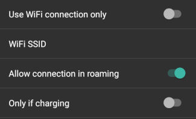

# Konfigurace

Konfigurace (Conf) je záložka, kde si zapínáte, nebo vypínáte jednotlivé moduly. Zaškrtnutím boxu (kroužek) na levé straně (A) vybíráte modul který chcete používat, boxy (čtverečky) na pravé straně (C) zajistí zobrazení modulu jako záložky (E) v AndroidAPS. I když není pravý box zaškrtnutý, dostanete se k funkci přes hamburger menu (D) v levém horním rohu obrazovky.

Pokud má modul další dodatečná nastavení, dostanete se k nim kliknutím na ozubené kolo (B).

**První nastavení**: od AAPS v 2.0 Vám s úvodním nastavením aplikace pomůže Průvodce nastavením. Stiskněte 3 tečky v pravé horní části obrazovky (F), a vyberte „Průvodce nastavením“.

## Profil

Vyberte bazální profil, který chcete použít. Další informace viz stránku [Profily](../Usage/Profiles.md).

### NS profil

NS profil používá profily, které jste uložili na webu nightscout (https://[adresavašehoprofilu]/profile). K přepnutí profilu, který bude aktivní, můžete použít tlačítko [Přepnout profil](../Usage/Profiles.md). Akce zapíše profil do pumpy, kde bude použit v případě selhání AndroidAPS. Takto si v Nightscoutu můžete vytvořit více profilů (např.. práce, doma, sport, prázdniny atd.). Je-li Váš mobil online, budou profily po stisknutí tlačítka „Uložit“ odeslány do AAPS. Pokud nemáte připojení k internetu nebo k Nightscoutu, budou profily uloženy pouze v AAPS, a to do té doby, dokud nebudou synchronizované.

Vybráním tlačítka **Přepnout profil** se aktivuje vybraný profil z Nightscoutu. V horní části hlavní obrazovky AAPS stiskněte a podržte tlačítko s názvem aktuálního profilu (prostřední šedé pole mezi polem „Otevřená/Uzavřená smyčka“ a polem s hodnotami cíle) > Přepnutí profilu > Vybrat profil > OK. Po změně profilu zapíše AAPS vybraný profil do pumpy, takže zde bude k dispozici pro případ nouze, a pumpa bude moci pokračovat.

### Jednoduchý profil

Jednoduchý profil s jediným časovým blokem pro DIA, IC, ISF, základní bazál a cílové rozmezí (tj. žádné změny základního bazálu během dne). Nejpravděpodobněji bude použit pro testovací účely, pokud nemáte v průběhu 24 hodin stejné parametry. Jakmile bude vybrán „Jednoduchý profil“, objeví se v AAPS nová záložka, kde budete moci zadat data profilu.

### Místní profil (doporučený)

Místní profil používá bazální profil zapsaný přímo do telefonu. Po jeho vybrání se v AAPS objeví nová záložka, kde si můžete profil upravovat. Ten je pak v případě potřeby načten pumpou. Při přepnutí profilu je uložen do pumpy - v profilu 1. Tento profile je doporučen, protože nevyžaduje připojení k internetu.

## Inzulín

Vyberte typ inzulínové křivky, kterou používáte. Všechny varianty „Rychle působící Oref“, „Ultra rychlý Oref“ a „Volitelný vrchol Oref“ mají exponenciální tvar. Více informací najdete v [dokumentaci k OpenAPS](http://openaps.readthedocs.io/en/latest/docs/While%20You%20Wait%20For%20Gear/understanding-insulin-on-board-calculations.html#understanding-the-new-iob-curves-based-on-exponential-activity-curves). Křivky se liší podle DIA a času max. účinnosti inzulínu. Hodnota DIA by vždy měla být nejméně 5. Další informace se můžete dočíst v části Výběr inzulínového profilu na [této](../Getting-Started/Screenshots.md) stránce. Pro „Rychle působící“ a „Ultra rychlý“ inzulín je DIA jediná proměnná, kterou si můžete upravovat. Doba maximální účinnosti je fixní. „Volitelný vrchol“ umožňuje nastavit obě proměnné – DIA i dobu maximální účinnosti inzulínu. Tato volba je určena pouze pro pokročilé uživatele, kteří znají důsledky nastavených hodnot. Graf inzulínových křivek Vám pomůže porozumět různým křivkám. Zaškrtnutím čtverečku vedle názvu si je můžete prohlédnout v záložce. Další možnost jejich zobrazení je přes hamburgerové menu.

### Rychle působící Oref

* doporučeno pro Humalog, Novolog a Novorapid
* DIA = alespoň 5 h
* Max. účinnost inzulínu = 75 minut po podání

### Ultra rychlý Oref

* doporučeno pro FIASP
* DIA = alespoň 5 h
* Max. účinnost inzulínu = 55 minut po podání

Pro velké množství lidí nemá po 3–4 hodinách FIASP prakticky žádné znatelné účinky, i když fakticky zbývá cca 0,0xx jednotek. Nicméně i toto zbytkové množství může mít vliv například při sportu. Proto AndroidAPS používá jako minimální hodnotu DIA 5 h.

### Volitelný vrchol Oref

V profilu „Volitelný vrchol 0ref“ můžete ručně zadat dobu max. účinku inzulínu. Pokud není v profilu zadána vyšší hodnota, je DIA je automaticky nastavena na 5 h.

This effect profile is recommended if an unbacked insulin or a mixture of different insulins is used.

## Zdroj glykémií

Select the blood glucose source you are using - see [BG Source](BG-Source.md) page for more setup information.

* [xDrip+](https://xdrip-plus-updates.appspot.com/stable/xdrip-plus-latest.apk)
* NSClient BG
* [MM640g](https://github.com/pazaan/600SeriesAndroidUploader/releases)
* [Glimp](https://play.google.com/store/apps/details?id=it.ct.glicemia&hl=de)
* [Dexcom G5 app (patched)](https://github.com/dexcomapp/dexcomapp/) - Select 'Send BG data to xDrip+' if you want tu use xDrip+ alarms. 
* [Poctech](http://www.poctechcorp.com/en/contents/268/5682.html)

## Pumpy

Select the pump you are using.

* [DanaR](DanaR-Insulin-Pump.md)
* DanaR Korean (for domestic DanaR pump)
* DanaRv2 (DanaR pump with firmware upgrade)
* [DanaRS](DanaRS-Insulin-Pump.md)
* [Accu Chek Combo Pump](Accu-Chek-Combo-Pump.md) (requires ruffy installation)
* MDI (receive AAPS suggestions for your multiple daily injections thereapy)
* Virtual pump (open loop for pump which don't have any driver yet - AAPS suggestions only)

Use **Advanced settings** to activate BT watchdog if necessary. It switches off bluetooth for one second if no connection to the pump is pobbile. This may help on some phones where the bluetooth stack freezes.

## Detekce citlivosti

Select the type of sensitivity detection. This will analyse historical data on the go and make adjustments if it recognizes that you are reacting more sensitively (or conversely, more resistant) to insulin than usual. Details about the Sensitivity Oref0 algorithm can be read in the [OpenAPS docs](http://openaps.readthedocs.io/en/latest/docs/walkthrough/phase-4/advanced-features.html#auto-sensitivity-mode).

You can view your sensistivity on the homescreen by selecting SEN and watching the white line. Note, you need to be in [Objective 6](../Usage/Objectives) in order to use Sensitivity Detection/autosens.

### Absorption settings

If you use Oref1 with SMB you must change **min_5m_carbimpact** to 8. The value is only used during gaps in CGM readings or when physical activity "uses up" all the blood glucose rise that would otherwise cause AAPS to decay COB. At times when carb absorption can't be dynamically worked out based on your bloods reactions it inserts a default decay to your carbs. Basically it is a failsafe.

## APS

Select the desired APS algorithm for therapy adjustments. You can view the active detail of the chosen algorithm in the OpenAPS(OAPS) tab.

* OpenAPS MA (meal assist, state of the algorithm in 2016)
* OpenAPS AMA (advanced meal assist, state of the algorithm in 2016)  
    More detail about OpenAPS AMA can be found in the [OpenAPS docs](http://openaps.readthedocs.io/en/latest/docs/Customize-Iterate/autosens.html#advanced-meal-assist-or-ama). In simple terms the benefits are after you give yourself a meal bolus the system can high-temp more quickly IF you enter carbs reliably.  
    Note you need to be in [Objective 7](../Usage/Objectives.md) in order to use OpenAPS AMA.
* [OpenAPS SMB](../Usage/Open-APS-features.md) (super micro bolus, most recent algorithm for advanced users)  
    Note you need to be in [Objective 8](../Usage/Objectives.md) in order to use OpenAPS SMB and min_5m_carbimpact must be set to 8 in Config builder > Sensitivity detection > Sensitivity Oref1 settings.

## Smyčka

Define whether you want to allow AAPS automatic controls or not.

### Open Loop

AAPS continuously evaluates all available data (IOB, COB, BG...) and makes treatment suggestions on how to adjust your therapy if necessary. The suggestions will not be executed automatically (as in closed loop) have to be entered manually into the pump or by using a button in case you are using a compatible pump (Dana R/RS or Accu Chek Combo). This option is for getting to know how AndroidAPS works or if you are using an unsupported pump.

### Closed Loop

AAPS continuously evaluates all available data (IOB, COB, BG...) and automatically adjusts the treatment if necessary (i.e. without further intervention by you) to reach the set target range or value (bolus delivery, temporary basal rate, insulin switch-off to avoid hypoversion, etc.). The Closed Loop works within numerous safety limits, which you can be set individually. Closed Loop is only possible if you are in [Objective 4](../Usage/Objectives.md) or higher and use a supported pump.

## Objectives (learning program)

AndroidAPS has a number of objectives that you have to fulfill step by step. This should guide you safely through setting up a closed loop system. It guarantees that you have set everything up correctly and understand what the system does exactly. This is the only way you can trust the system.

Doporučujeme pravidelně exportovat veškeré své nastavení (včetně pokroku při plnění cílů). V případě, že v budoucnosti budete muset svůj smartphone nahradit (nové zařízení, poškození displeje atd.), můžete tato nastavení jednoduše importovat.

Více informací naleznete na stránce [Cíle](../Usage/Objectives.md).

## Ošetření

Na záložce Ošetření můžete vidět ošetření, která byla nahrána do Nightscoutu. Chcete-li upravit nebo odstranit záznam (například když jste snědli méně sacharidů, než jste očekávali), vyberte „Odstranit“ a zadejte novou hodnotu (případně změňte čas) prostřednictvím karty Péče.

## Obecné

### Přehled

Displays the current state of your loop and buttons for most common actions (see [section The Homescreen](../Getting-Started/Screenshots.md) for details). Settings can be accessed by clicking the cog wheel.

#### Keep screen on

Option 'Keep screen on' will force Android to keep the screen on at all times. This is useful for presentations etc. But it consumes a lot of battery power. Therefore it is recommended to connect the smartphone to a charger cable.

#### Buttons

Define which Buttons are shown on the home screen.

* Ošetření
* Calculator
* Inzulín
* Carbs
* CGM (opens xDrip+)
* Calibration

Furthermore you can set shortcuts for insulin and carb increments and decide wether the notes field should be shown in treatment dialogues.

#### QuickWizard settings

Create a button for a certain standard meal (carbs and calculation method for the bolus) which will be displayed on the home screen. Use for standard meals frequently eaten. If different times are specified for the different meals you will always have the appropriate standard meal button on the home screen, depending on the time of day.

Note: Button will not be visible if outside the specified time range or if you have enough IOB to cover the carbs defined in the QuickWizard button.

#### Advanced settings

Enable super bolus functionality in wizard. Use with caution and do not enable until you learn what it really does. Basically the basal for the next two hours is added to the bolus and a two hour zero-temp activated. Details on super bolus can be found [here](https://www.diabetesnet.com/diabetes-technology/blue-skying/super-bolus).

### Actions

Some buttons to quickly access common features:

* Profiles Switch (see [Profiles page](../Usage/Profiles.md) for more setup information)
* Temporary targets
* Set / cancel temp. basal rate
* Extended bolus (DanaR/RS or Combo pump only)
* Prime / fill (DanaR/RS or Combo pump only)
* History browser
* TDD (Total daily dose = bolus + basal per day)

Some doctors use - especially for new pumpers - a basal-bolus-ratio of 50:50. Therefore ratio is calculated as TDD / 2 * TBB (Total base basal = sum of basal rate within 24 hours). Others prefer range of 32% to 37% of TDD for TBB. Like most of these rules-of-thumb it is of limited real validity. Note: Your diabetes may vary!

### Portál nastavení péče

Allows you to record any specific care entries and view the current sensor, insulin, canula and pump battery ages in the Careportal (CP) tab.

Note: **No insulin** will be given if entered via careportal (i.e. meal bolus, correction bolus...)

Carbs entered in the careportal (i.e. correction carbs) will be used for COB calculation.

### SMS komunikátor

Allows remote caregivers to control some AndroidAPS features via SMS, see [SMS Commands](../Usage/SMS-Commands.md) for more setup information.

### Food

Displays the food presets defined in the Nightscout food database, see [Nightscout Readme](https://github.com/nightscout/cgm-remote-monitor#food-custom-foods) for more setup information.

Note: Entries cannot be used in the AndroidAPS calculator. (View only)

### Wear

Monitor and control AAPS using your Android Wear watch (see [page Watchfaces](../Configuration/Watchfaces.md)). Use settings (cog wheel) to define which variables should be considered when calculating bolus given though your watch (i.e. 15min trend, COB...).

If you want to bolus etc from the watch then within "Wear settings" you need to enable "Controls from Watch".

Through Wear tab or hamburger menu (top left of screen, if tab is not displayed) you can

* Resend all data. Might be helpful if watch was not connected for some time and you want to push the information to the watch.
* Open settings on your watch directly from your phone.

### xDrip Statusline (watch)

Display loop information on your xDrip+ watchface (if you are not using AAPS/[AAPSv2 watchface](../Configuration/Watchfaces.md)

### Ongoing Notification

Displays a summary of current BG, delta, active TBR%, active basal u/hr and profile, IOB and split into bolus IOB and basal IOB on the phones dropdown screen and phonelock screen.

### NS Client

Setup sync of your AndroidAPS data with Nightscout.

If **Log app start to NS** is activated each AndroidAPS will be visible in Nightscout. Might be useful to detect problems with the app (i.e. battery optimisation not disabled for AAPS) but can flood the Nightscout graph with entries.

#### Alarm options

Activate/deactivate AndroidAPS alarms

#### Connection settings

Offline looping, disable roaming...

If you want to use only a specific WiFi network you can enter its **WiFi SSID **. Several SSIDs can be separated by semicolon. To delete all SSIDs enter a blank space in the field.

#### Advanced settings

* Auto backfill missing BGs from Nightscout
* Create announcement from errors Create Nightscout announcement fro error dialogs and local alerts (also viewable in careportal in treatments section)
* Enable local broadcast to other apps like xDrip+
* NS upload only (sync disabled)
* No upload to NS
* Always use basal absolute values -> Must be activated if you want to use [Autotune](https://openaps.readthedocs.io/en/latest/docs/Customize-Iterate/autotune.html) properly.

### Maintenance

Email and number of logs to be send. Normally no change neccessary.

### Config Builder

Use tab for config builder instead of hambuger menu.