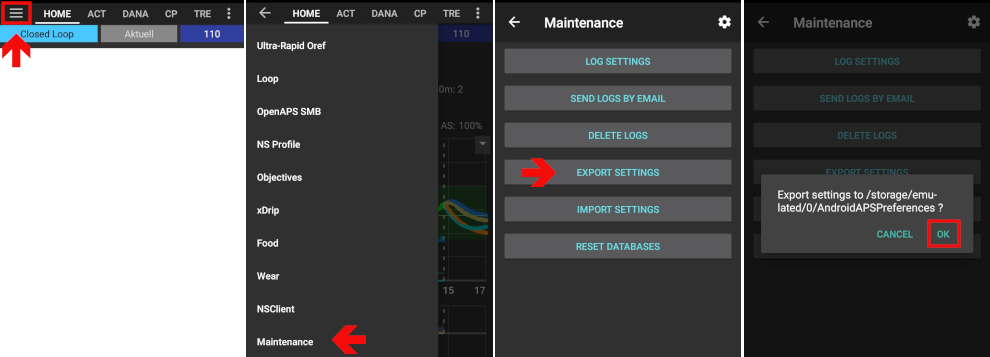

# Pumpa DanaRS

*Tyto pokyny jsou pro konfiguraci aplikace a Vaší pumpy, pokud máte pumpu DanaRS od roku 2017 a výše. Pokud máte původní DanaR, navštivte [Pumpa DanaR](./DanaR-Insulin-Pump).*

**New Dana RS firmware v3 can be used from AndroidAPS version 2.7 onwards.**

* In DanaRS pump "BASAL A" is used by the app. Existing data gets overwritten.

## Pairing pump

* In AndroidAPS go to Config Builder and select 'DanaRS'

* Vyvolejte Menu ťuknutím na tři tečky v pravém horním rohu. Zvolte Nastavení.

* Select DanaRS Pair New Pump, and click your DanaRS serial number.
  
  

* Select Pump password and input your password.

### Default password

     * For DanaRS with firmware v1 and v2 the default password is 1234.
     * For DanaRS with firmware v3 the default password is a combination of production month and production date (i.e. month 01 and day 24). 
    
        a. On your pump open main menu 
    
        b. review 
    
        c. information. Ne. 3 is production date.
    

* **You have to confirm the pairing on the pump!** That's just the way you are used to from other bluetooth pairings (i.e. smartphone and car audio).
  
  

* Select Bolus Speed to change the default bolus speed used (12sec per 1u, 30sec per 1u or 60sec per 1u).

* Restart your phone.

* Set basal step on pump to 0.01 U/h using Doctors menu (see pump user guide)

* Na pumpě povolte rozšířené bolusy

## Change password on pump

* Press OK button on pump
* In main menu select "OPTION" (move right by pressing arrow button several times)
  
  

* In options menu select "USER OPTION"
  
  

* Use arrow button to scroll down to "11. password"
  
  

* Press OK to enter old password.

* Enter **old password** (Default password see [above](#default-password)) and press OK
  
  

* If wrong password is entered here there will be no message indicating failure!

* Set **new password** (Change numbers with + & - buttons / Move right with arrow button).
  
  

* Confirm with OK button.

* Save by pressing OK button again.
  
  

* Move down to "14. EXIT" and press OK button.
  
  

## Dana RS specific errors

### Error during insulin delivery

V případě, že dojde k přerušení spojení mezi AAPS a pumpou Dana RS v průběhu vydávání bolusu (např. odejdete mimo dosah telefonu, zatímco pumpa Dana RS vydává inzulin), zobrazí se následující zpráva a zazní akustická výstraha.

* In most cases this is just a communication issue and the correct amount of insulin is delivered.
* Check in pump history (either on the pump or through Dana tab > pump history > boluses) if correct bolus is given.
* Delete error entry in [treatments tab](../Getting-Started/Screenshots#carb-correction) if you wish.
* Real amount is read and recorded on next connect. To force this press BT icon on dana tab or just wait for next connect.

## Special note when switching phone

Pokud přecházíte na nový telefon, je nezbytné, abyste provedli následující kroky:

* **Export settings** on your old phone
  
  * Hamburger menu (top left corner of screen)
  * Údržba
  * Exportovat nastavení
    
    

* **Transfer** settings from old to new phone

* **Manually pair** Dana RS with the new phone 
  * As pump connection settings are also imported AAPS on your new phone will already "know" the pump and therefore not start a bluetooth scan. Therefore new phone and pump must be paired manually.
* **Install AndroidAPS** on the new phone.
* **Importujte nastavení** on your new phone 
  * Hamburger menu (top left corner of screen)
  * Údržba
  * Importujte nastavení

## Timezone traveling with Dana RS pump

Chcete-li se dozvědět více informací o cestování mezi časovými pásmy, přejděte na část [Cestování s pumpou mezi časovými pásmy](../Usage/Timezone-traveling#danarv2-danars).