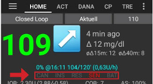

# Nastavení

## Heslo do nastavení

Tato volba Vám umožňuje nastavit heslo, abyste předešli náhodným nebo neoprávněným změnám v nastavení. Pokud zde zadáte heslo, budete požádáni, abyste ho zadali pro vstup do Nastavení. Chcete-li odstranit heslo, tak vymažte text v nastavení u této volby.

## Věk pacienta

V tomto nastavení jsou stanoveny bezpečnostní limity v závislosti na Vámi zvoleném věku. Pokud začnete narážet na limit (jako maximální bolus), je čas posunout se o stupeň výš. Není správné zvolit vyšší věk, než je skutečný, jelikož to může vést k předávkování zadáním nesprávné hodnoty v dialogovém okně pro inzulín (např. vynecháním desetinné čárky). If you want to know the actual numbers for these hard coded security limits, scroll to the algorithm feature you are using on [this page](../Usage/Open-APS-features.md).

## Obecné

* Vyberte svůj jazyk. Pokud není Váš jazyk dostupný, nebo nejsou všechna slova přeložena, je možnost tato slova přeložit, nebo dát návrh na [Crowdin](https://crowdin.com/project/androidaps) anebo se zeptat na [gitter chatroom](https://gitter.im/MilosKozak/AndroidAPS).

## Přehled

* Keep screen on is useful while you are giving a presentation. It will consume a lot of energy, so it is wise to have your phone plugged into a charger.
* Buttons let you choose which buttons are visible on your home screen. Also gives you a few options for the popup screen you will see after pressing a button.
* Quick Wizard settings allows you to add a quick button for a frequent snack or meal, enter your decided carb details and on the homescreen if you select the quick wizard button it will calculate and bolus for those carbs based on your current ratios (taking into account blood glucose value or insulin on board if set up).
* Advanced settings to enable superbolus in wizard and to show status lights on home screen. Status lights give a visual warning for low reservoir and battery level as well as overdue site change.
    
    

## Bezpečnost zadání ošetření

### Maximální povolený bolus [U]

This is the maximum amount of bolus insulin that AAPS is allowed to deliver. This setting exists as a safety limit to prevent the delivery of a massive bolus due to accidental input or user error. It is recommended to set this to a sensible amount that corresponds roughly to the maximum amount of bolus insulin that you are ever likely to need for a meal or correction dose. This restriction is also applied to the results of the Bolus Calculator.

### Maximální povolené sacharidy [g]

This is the maximum amount of carbs that AAPS bolus calculator is allowed to dose for. Toto nastavení slouží jako bezpečnostní limit, aby nemohlo dojít k poslaní enormní dávky, nebo jako chyba uživatele. It is recommended to set this to a sensible amount that corresponds roughly to the maximum amount of carbs that you are ever likely to need for a meal.

## Smyčka

You can toggle between open and closed looping here. Open looping means TBR suggestions are made based on your data and appear as a notification, but you must manually choose to accept them and manually enter them into your pump. Closed looping means TBR suggestions are automatically sent to your pump without confirmation or input from you. The homescreen will display in the top left corner whether you are open or closed looping, and pressing and holding this homescreen button will also allow you to toggle between the two.

## Pokročilý asistent jídla v OpenAPS (AMA)

OpenAPS Advanced Meal Assist (AMA) allows the system to high-temp more quickly after a meal bolus IF you enter carbs reliably. Turn it on in the Config tab to view the safety settings here, you will need to have completed Objective 7 to use this feature. You can read more about the settings and [Autosens in the OpenAPS docs](http://openaps.readthedocs.io/en/latest/docs/Customize-Iterate/autosens.html).

### Maximální povolený bazál [U/h]

This setting exists as a safety limit to prevent AAPS from ever being capable of giving a dangerously high basal rate. The value is measured in units per hour (u/hr). It is advised to set this to something sensible. A good recommendation is to take the **highest basal rate** in your profile and **multiply it by 4**. For example, if the highest basal rate in your profile was 0.5u/hr you could multiply that by 4 to get a value of 2u/hr.

### Maximální bazální IOB [U]

Amount of additional basal insulin (in units) allowed to accumulate in your body, on top of your normal basal profile. Once this value is reached, AAPS will stop giving additional basal insulin until your basal Insulin on Board (IOB) has decayed to within this range again.

* This value does not consider bolus IOB, only basal.
* This value is calculated and monitored indepentandlty of your normal basal rate. It is only the additional basal insulin on top of that normal rate that is considered.
* This value is measured in insulin units (u).

When you begin looping, **it is advised to set Max Basal IOB to 0** for a period of time, while you are getting used to the system. This prevents AAPS from giving any additional basal insulin at all. During this time AAPS will still be able to limit or turn off your basal insulin to help prevent hypoglycaemia.

This is an important step in order to:

* Have a period of time to safely get used to the AAPS system and monitor how it works.
* Take the opportunity to perfect your basal profile and Insulin Sensitivity Factor (ISF).
* See how AAPS limits your basal insulin to prevent hypoglycaemia.

When you feel comfortable, you can allow the system to start giving you additional basal insulin, by raising the Max Basal IOB value. The recommended guideline for this is to take the **highest basal rate** in your profile and **multiply it by 3**. For example, if the highest basal rate in your profile was 0.5u/hr you could multiply that by 3 to get a value of 1.5u.

* You can start conservatively with this value and increase it slowly over time. 
* These are guidelines only; everyone's body is different. You may find you need more or less than what is recommended here, but always start conservatively and adjust slowly.

*Note: As a safety feature, Max Basal IOB is hard-limited to 7u.*

## Nastavení absorpce sacharidů

If you have selected to use AMA Autosens then you will be able to enter your maximum meal absorption time and how frequently you want autosense to refresh. If you often eat high fat or protein meals you will need to increase your meal absorption time.

## Nastavení pumpy

The options here will vary depending on which pump driver you have selected in 'Config Builder'. Pair and set your pump up according to the [DanaR Insulin Pump](../Configuration/DanaR-Insulin-Pump.md) or [DanaRS Insulin Pump](../Configuration/DanaRS-Insulin-Pump.md) or [Accu Chek Combo Pump](../Configuration/Accu-Chek-Combo-Pump.md) instructions where relevant. If using AndroidAPS to open loop then make sure you have selected Virtual Pump in config builder.

## NS Client

* Set your 'nightscout URL' here (https://yourwebsitename.herokuapp.com or https://yourwebsitename.azurewebsites.net), and the 'API secret' (a 12 character password recorded in your heroku or azure variables). This enables data to be read and written between both the nightscout website and AndroidAPS. Double check for typos here if you are stuck in Objective 1.
* 'Log app start to nightscout' will record a note in your careportal entries every time the app is started. The app should not be needing to start more than once a day; more frequently than this suggests a problem. 
* 'Alarm options' allows you to select which default nightscout alarms to use through the app. For the alarms to sound you need to set the Urgent High, High, Low and Urgent Low alarm values in your [heroku or azure variables](http://www.nightscout.info/wiki/welcome/website-features#customalarms). They will only work whilst you have a connection to nightscout and are intended for parent/carers, if you have the CGM source on your phone then use those alarms instead (e.g. xdrip+).
* 'Enable local broadcasts' will share your careportal data to other apps on the phone such as xdrip.
* 'Always use basal absolute values' must be activated if you want to use Autotune properly.

## SMS komunikátor

This setting allows remote control of the app by texting instructions to the patients phone which the app will follow such as suspending loop, or bolusing. Further information is described in [SMS Commands](../Usage/SMS-Commands.md) but it will only display in Preferences if you have selected this option in the Config Builder.

## Jiné

* You can set defaults for your temp targets here for the different types of temp target (eating soon and activity). When you select a temp target and then choose, for example, "Eating Soon" from the drop down box, it will automatically populate the duration and value for you based on the figures you provided here. For more information on use of Temp Targets see [OpenAPS features](../Usage/Open-APS-features.md). 
* You can set default prime amounts - this will prime the pump the value specified and this insulin is counted as used from the reservoir but not counted in IOB calculations. See the instruction booklet in your cannula box for how many units should be primed depending on needle length and tubing length.
* You can change the display on the homescreen and watch for the values that are in range. Note that this is just how the graphs look and doesn't impact on your target or calculations.
* 'Shorten tab titles' allows you to see more tab titles on screen, for example the 'Open APS' tab becomes 'OAPS', 'Objectives' becomes 'Obj' etc.
* 'Local Alerts' lets you decide if you receive a warning and after how long for not receiving blood glucose values (stale data) or the pump being unreachable. If you frequently get pump unreachable alerts then enable BT Watchdog in the Advanced Settings.

## Data Choices

* 'Fabric Upload' will send crash reporting and feature usage data to the developers.