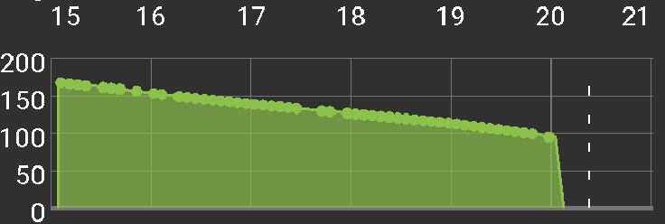

# Detekce citlivosti

## Algoritmy detekce

V současné době máme 4 modely pro detekci citlivosti:

* Citlivost Oref0
* Citlivost AAPS
* Citlivost váženým průměrem
* Citlivost Oref1

### Citlivost Oref0

Citlivost je počítaná za posledních 24 hodin. Trávení sacharidů (pokud nejsou absorbované) se v simulaci zařezává na mezní dobu, která je uvedená v nastavení. Tento model pracuje obdobně jako OpenAPS Oref0, popsaný v [OpenAPS Oref0 dokumentaci](https://openaps.readthedocs.io/en/2017-05-21/docs/walkthrough/phase-4/advanced-features.html).

### Citlivost AAPS

Citlivost se počítá stejným způsobem jako v Oref0 variantě, ale můžete zadat čas do minulosti. Minimální absorpce sacharidů se počítá z maximální doby trávení sacharidů z nastavení

### Citlivost váženým průměrem

Citlivost je vypočítaná jako vážený průměr z odchylek. Novější odchylky mají větší váhu. Minimální absorpce sacharidů se počítá z maximální doby trávení sacharidů z nastavení. Tento algoritmus je nejrychlejší při následujících změnách citlivosti.

### Citlivost Oref1

Citlivost je vypočítaná z údajů 8 hodin do minulosti nebo od poslední výměny kanyly, pokud k ní došlo méně než 8 hodin zpět. Sacharidy (pokud nejsou absorbované) se odříznou po době určené v předvolbách. Pouze Oref1 algoritmus podporuje "neohlášené jídlo" (UAM, un-announced meal). To znamená, že časy s odhalenými UAM jsou vyjmuty z výpočtu citlivosti. Takže pokud používáte SMB s UAM, musíte si vybrat Oref1 algoritmus, aby výpočet citlivosti fungoval správně. Pro více informací si přečtěte [OpenAPS Oref1 dokumentaci](https://openaps.readthedocs.io/en/latest/docs/Customize-Iterate/autosens.html).

## Simultaneous carbs

There is significant difference while using AAPS, WeightedAverage vs Oref0, Oref1. Oref plugins expects only one meal decaying at time. It means 2nd meal starts decaying after 1st meal is completely decayed. AAPS+Weighted average starts decaying immediately when you enter the carbs. If there is more than one meal on board, the minimum carb decay will adjust according to meal size and max absorption time. The minimum absorption accordingly will be higher in comparation to Oref plugins.

## COB Examples

Oref0 / Oref1 - unabsorbed carbs are cut off after specified time

AAPS, WeightedAverage - absorption is calculated to have `COB == 0` after specified time

If minimal carbs absorption is used instead of value calculated from deviations, a green dot appears on COB graph