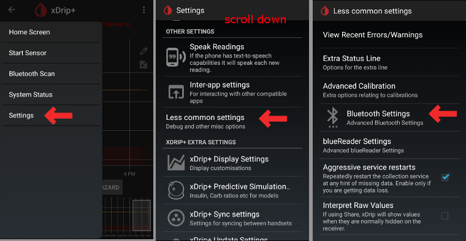

# xDrip+ nastavení

Pokud ho ještě nemáte nastaven, stáhněte si [xDrip+](https://github.com/NightscoutFoundation/xDrip)

Pro vysílače G6 vyrobené od podzimu 2018 se prosím ujistěte, že používáte jednu z posledních verzí [nightly build xDrip+](https://github.com/NightscoutFoundation/xDrip/releases). Tyto vysílače mají nový firmware, a poslední stabilní verze xDrip+ (2019/01/10) si s ním neporadí. Pokud výrobní číslo vašeho vysílače Dexcom G6 začíná znaky 8G... vyzkoušejte nightly build 2019/07/28 nebo novější.

## Základní nastavení pro všechny CGM & FGM systémy

* Ujistěte se, že máte URL nastavenou správně: s **S** na konci http**s**:// (nejen http://)
   
   např. https://API_SECRET@your-app-name.herokuapp.com/api/v1/
   
   -> Hamburger Menu (horní levá část domovské obrazovky) -> Nastavení-> Nahrávání do cloudu -> Nahrávání přes API (REST) > Základní URL

* Zrušte `Automatické kalibrace` Je-li checkbox `Automatic Calibration` zaškrtnut, aktivujte jednou `Download data`, poté odškrtněte checkbox `Automatic Calibration` na znovu deaktivujte `Download data`. Jinak budou ošetření (sacharidy & inzulín) poslána do Nigtscoutu dvakrát.

* Zvolte `Extra Options`
* Zrušte `Upload treatments` a `Back-fill data`
* Dále by měla být deaktivována volba `Alert on failures`. Jinak bude každých 5 minut spuštěn alarm, bude-li připojení přes wifi/mobilní síť málo kvalitní, anebo při problémech se spojením k serveru.
   
   
   
   

* **Komunikace mezi aplikacemi** (Broadcast) Pokud budete používat AndroidAPS a data by měla být přenášena např. do AndroidAPS, měli byste v xDripu aktivovat Lokální odesílání dat.

* Aby byly hodnoty stejné, měli byste aktivovat `Odesílat zobrazovanou glykémii`.
* Pokud jste aktivovali `Přijímat ošetření` a v AndroidAPS i Povolení odesílání, bude xDrip+ přijímat sacharidy, insulín i bazální hodnoty z AndroidAPS, a může tak předpovídat blížící se hypo atd. mnohem přesněji.
   
   

* Objevily se problémy s lokálním odesíláním dat (AAPS nepřijímal nové hodnoty BG z xDrip+) v případě, že byl zapnutý mód letadlo. Jděte do Nastavení > Komunikace mezi zařízeními > Identify reciever, a vložte hodnotu `info.nightscout.androidaps`.
   
   

## xDrip+ a Dexcom G6

### Dexcom specifická nastavení

* Otevřete G5/G6 Debug Settings -> Hamburger Menu (pravý horní roh domácí obrazovky) -> nastavení -> G5/G6 Debug Settings 

* Zvolte následující nastavení
   
   * `Použít Ob1 collector`
   * `Native Algorithm` (důležité pokud chcete použít SMB)
   * `Podpora G6`
   * `Zvolte OB1 unbonding`
   * `Zvolte OB1 initiate bonding`
* Všechny ostatní volby by měly zůstat vypnuté
* Nastavte varování baterie na 280 (G5/G6 nastavení- dolní část)
   
   

### Preemptivní restarty nejsou doporučené

Automatické prodloužení senzorů Dexcom (`preemtive restarts`) není doporučeno, tato volba může způsobit „skoky“ v hodnotách glykémie 9. den po restartu.

Použití G6 může být o něco složitější, než se na první pohled zdá. Abyste ho mohli používat bezpečně, je třeba vědět o několika skutečnostech:

* Pokud používáte nativní data s kalibračním algoritmem aplikace xDrip+ nebo Spike, nejbezpečnější postup je zakázat preemptivní restartování senzoru.
* Pokud musíte preemptivní restarty používat, pak se ujistěte, že senzor zavádíte v takovou denní dobu, kdy můžete sledovat změny a v případě potřeby provést kalibraci. 
* Jestliže senzory restartujete, udělejte to bez tovární kalibrace, aby byly výsledky 11 a 12 den co nejbezpečnější, nebo buďte připraveni provést kalibrace a sledujte odchylku.
* Nastřelení senzoru G6 předem v kombinaci s tovární kalibrací pravděpodobně povede k odchylkám ve výsledcích měření. Jestliže nastřelujete senzor s předstihem, pak jej pravděpodobně v zájmu co nejlepších výsledků bude nutné zkalibrovat.
* Jestliže nechcete sledovat změny, ke kterým může docházet, možná bude lepší přepnout na režim bez továrních kalibrací a používat systém jako G5.

Chcete-li se dozvědět další informace o podrobnostech a důvodech pro tato doporučení, přečtěte si [kompletní článek](http://www.diabettech.com/artificial-pancreas/diy-looping-and-cgm/), který sepsal Tim Street na adrese [www.diabettech.com](http://www.diabettech.com).

### První připojení vysílače G6

**Pro druhý a další vysílače viz [Prodloužení životnosti vysílače](../Configuration/xdrip#extend-transmitter-life) níže.**

* Pro vysílače G6 vyrobené od podzimu 2018 se prosím ujistěte, že používáte jednu z posledních verzí [(nightly build) xDrip+](https://github.com/NightscoutFoundation/xDrip/releases). Tyto vysílače mají nový firmware, a poslední stabilní verze xDrip+ (2019/01/10) si s ním neporadí.
* Vypněte originální Dexcom přijímač (je-li použit).
* Dlouze stiskněte na symbol kapky krve Xdrip+ a vyberte zobrazení zobrazit `Source Wizard Button`.
* Klikněte na tlačítko Start Source Setup Wizard, a při výběru G5 / G6 se zajistí nastavení správného OB1 & Nativního módu 
   * Průvodce vás provede přes prvotní nastavení.
   * Pokud ho používáte poprvé, budete potřebovat sériové číslo vysílače.

* Vložte sériové číslo nového vysílače (je napsané na krabičce od vysílače nebo na spodní straně vysílače)
   
   

* Vložte nový senzor (pouze když ho měníte)

* Nasaďte vysílač na senzor
* Vyberte start senzoru (pouze při výměně) -> Po několika minutách se v dolní části obrazovky musí objevit nápis `Warm Up x,x hours left`. -> Pokud se tato hláška po několika minutách neobjeví, vypněte a znovu zapněte senzor.
* Klikněte na Restart collector (Stav systému - když neměníte senzor)
* Před prvním načtením dat do xDrip+ nezapínejte originální Dexcom přijímač (pokud ho používáte).
* Dlouhým stisknutím symbolu kapky krve xDrip+ zrušíte zobrazování `Source Wizard Button`.
   
   
   
   
   
   
   
   

### Stav baterie vysílače

* Stav baterie je zobrazen v system status (Hamburger menu levý horní roh domácí obrazovky)
* Swipněte do leva pro zobrazení druhé obrazovky. 

* Přesné hodnoty, kdy vysílač "umře" z důvodu vybití baterie, nejsou známy. Po "smrti" vysílače byly na internetu zveřejněny následující hodnoty: Transmitter days: 151 Voltage A: 297 Voltage B: 260 Resistance: 2391

### Prodloužení životnosti vysílače

* Při operaci prodloužení životnosti vysílače bude přerušena aktuální session senzoru. Mějte to na paměti, a naplánujte prodloužení životnosti vysílače současně s výměnou senzoru. Nebo se připravte na 2 h zahřívání senzoru.
* Přepněte do `engineering mode`: 
   * tap on the character on the right of the xDrip+ start screen that represents a syringe
   * then tap on the microphone icon in the lower right corner
   * In the text box that opens type "enable engineering mode" 
   * click "Done"
   * If Google Speak engine is enabled, you can also speak the voice command: "enable engineering mode". 
* Go to the G5 debug settings and check `OB1 collector`.
* Use the voice command: “hard reset transmitter”
* The voice command will be executed with the next data receipt of the transmitter
* Look at the system status (Hamburger menu -> system status) and see what happens
* If you see a message "Phone Service State: Hard Reset maybe failed" on second system status screen just start the sensor and this message should go away.
   
   

* Transmitter days will be set to 0 after successful extension and start of sensor.

### Replace transmitter

Pro vysílače G6 vyrobené od podzimu 2018 se prosím ujistěte, že používáte jednu z posledních verzí [nightly build xDrip+](https://github.com/NightscoutFoundation/xDrip/releases). Tyto vysílače mají nový firmware, a poslední stabilní verze xDrip+ (2019/01/10) si s ním neporadí.

* Vypněte originální Dexcom přijímač (je-li použit).
* Stop sensor (only if replacing sensor)
   
   Ensure it really is stopped:
   
   On the second "G5/G6 Status" screen look at `Queue Items` about half way down - It may say something like `(1) Stop Sensor`
   
   Wait until this goes - usually within a few minutes.
   
   -> To remove transmitter without stopping sensor see this video <https://youtu.be/AAhBVsc6NZo>.
   
   
   
   

* Forget device (in system status)
   
   

* Forget device in smartphone’s BT settings (Will be shown as DexcomXX whereas XX are the last two digits of the transmitter serial no.)

* Remove transmitter (and sensor if replacing sensor)
* Dlouze stiskněte na symbol kapky krve Xdrip+ a vyberte zobrazení zobrazit `Source Wizard Button`.
* Klikněte na tlačítko Start Source Setup Wizard, a při výběru G5 / G6 se zajistí nastavení správného OB1 & Nativního módu 
   * Průvodce vás provede přes prvotní nastavení.
   * You will need your transmitter serial number if this is the first time you've used it.
* Put in serial number of new transmitter.
* Insert new sensor (only if replacing).
* Nasaďte vysílač na senzor
* Start sensor (only if replacing)
   
   **It is recommended to wait approx. 15 minutes between stopping and starting the new sensor (until `Sensor Status: Stopped` is shown on second system status screen).**

* Klikněte na Restart collector (Stav systému - když neměníte senzor)

* Před prvním načtením dat do xDrip+ nezapínejte originální Dexcom přijímač (pokud ho používáte).
* Dlouhým stisknutím symbolu kapky krve xDrip+ zrušíte zobrazování `Source Wizard Button`.
   
   
   
   
   
   
   
   

### New Sensor

* Vypněte originální Dexcom přijímač (je-li použit).
* Stop sensor if necessary
   
   Ensure it really is stopped:
   
   On the second "G5/G6 Status" screen look at `Queue Items` about half way down - It may say something like `(1) Stop Sensor`
   
   Wait until this goes - usually within a few minutes.
   
   
   
   

* Clean contacts (transmitter backside) with alcohol and let air-dry.

* In case you use this function disable `Restart Sensor` and `Preemptive restarts` (Hamburger menu -> Settings -> G5/G6 Debug Settings). If you miss this step and have these functions enabled the new sensor will not start properly.
   
   

* Start Sensor
   
   **It is recommended to wait approx. 15 minutes between stopping and starting the new sensor (until `Sensor Status: Stopped` is shown on second system status screen).**

* Set time inserted
   
   * To use G6 Native mode you must wait for the 2 hour warm up (i.e insertion time is now).
   * If you are using the xDrip+ algorithm then you can set a time more than 2 hours ago to avoid warm up. Readings may be very erratic. Therefore this is not recommended.
* Enter Sensor code (on the peel-off foil of the sensor) 
   * Keep code for further reference (i.e. new start after transmitter had to be removed)
   * Code can also be found in [xDrip+ logs](../Configuration/xdrip#retrieve-sensor-code): Click 3-dots-menu on xDrip+ homescreen and choose `View Event Logs`.
* No calibration is needed if you use G6 in "native mode". xDrip+ will show readings automatically after 2 hour warm-up.
* Do not turn original Dexcom Receiver (if used) back on before xDrip+ shows first readings.
   
   
   
   

### Retrieve sensor code

* In latest nightly builds the sensor code is shown in system status (Hamburger menu top left on homescreen).
* Swipe left once to see second screen.
   
   

* Dexcom sensor code can also be found in xDrip+ logs.

* Tap 3 dot menu (top right side on homescreen)
* Select `View Event Logs` and search for "code"
   
   

## xDrip+ & Freestyle Libre

### Libre specific settings

* Open Bluetooth Settings -> Hamburger Menu (top left of homescreen) -> Settings -> scroll down -> Less common settings -> Bluetooth Settings
   
   

* Zvolte následující nastavení
   
   * `Turn Bluetooth on` 
   * `Use scanning`
   * `Always discover services`

* All other options should be disabled
   
   

### Connect Libre Transmitter & start sensor

