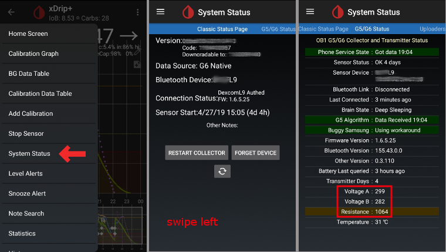
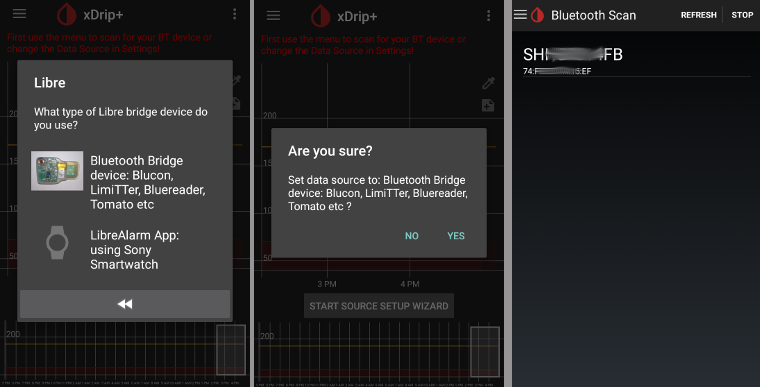

# xDrip+ nastavení

Pokud ho ještě nemáte nastaven, stáhněte si [xDrip+](https://github.com/NightscoutFoundation/xDrip)

For G6 transmitters manufactured after fall/end of 2018 (i.e. serial no. starting with 80 or 81) please make sure to use at least the [master dated 2019/05/18](https://jamorham.github.io/#xdrip-plus).

If your Dexcom G6 transmitter's serial no. is starting with 8G... try [nightly build 2019/07/28 or later](https://github.com/NightscoutFoundation/xDrip/releases).

## Základní nastavení pro všechny CGM & FGM systémy

* Ujistěte se, že máte URL nastavenou správně: s **S** na konci http**s**:// (nejen http://)
   
   např. https://API_SECRET@your-app-name.herokuapp.com/api/v1/
   
   -> Hamburger Menu (horní levá část domovské obrazovky) -> Nastavení-> Nahrávání do cloudu -> Nahrávání přes API (REST) > Základní URL

* Zrušte `Automatické kalibrace` Je-li checkbox `Automatic Calibration` zaškrtnut, aktivujte jednou `Download data`, poté odškrtněte checkbox `Automatic Calibration` na znovu deaktivujte `Download data`. Jinak budou ošetření (sacharidy & inzulín) poslána do Nigtscoutu dvakrát.

* Zvolte `Extra Options`
* Zrušte `Upload treatments` a `Back-fill data`
* Dále by měla být deaktivována volba `Alert on failures`. Jinak bude každých 5 minut spuštěn alarm, bude-li připojení přes wifi/mobilní síť málo kvalitní, anebo při problémech se spojením k serveru.
   
   
   
   

* **Komunikace mezi aplikacemi** (Broadcast) Pokud budete používat AndroidAPS a data by měla být přenášena např. do AndroidAPS, měli byste v xDripu aktivovat Lokální odesílání dat.

* Aby byly hodnoty stejné, měli byste aktivovat `Odesílat zobrazovanou glykémii`.
* Pokud jste aktivovali `Přijímat ošetření` a v AndroidAPS i Povolení odesílání, bude xDrip+ přijímat sacharidy, insulín i bazální hodnoty z AndroidAPS, a může tak předpovídat blížící se hypo atd. mnohem přesněji.
   
   

* Objevily se problémy s lokálním odesíláním dat (AAPS nepřijímal nové hodnoty BG z xDrip+) v případě, že byl zapnutý mód letadlo. Jděte do Nastavení > Komunikace mezi zařízeními > Identify reciever, a vložte hodnotu `info.nightscout.androidaps`.
   
   

## xDrip+ a Dexcom G6

### xDrip+ version depending on G6 transmitter serial no.

For G6 transmitters manufactured after fall/end of 2018 (i.e. serial no. starting with 80 or 81) please make sure to use at least the [master dated 2019/05/18](https://jamorham.github.io/#xdrip-plus).

If your Dexcom G6 transmitter's serial no. is starting with 8G... try [nightly build 2019/07/28 or later](https://github.com/NightscoutFoundation/xDrip/releases).

### Dexcom specific settings

* Otevřete G5/G6 Debug Settings -> Hamburger Menu (pravý horní roh domácí obrazovky) -> nastavení -> G5/G6 Debug Settings 

* Zvolte následující nastavení
   
   * `Použít Ob1 collector`
   * `Native Algorithm` (důležité pokud chcete použít SMB)
   * `Podpora G6`
   * `Zvolte OB1 unbonding`
   * `Zvolte OB1 initiate bonding`
* Všechny ostatní volby by měly zůstat vypnuté
* Nastavte varování baterie na 280 (G5/G6 nastavení- dolní část)
   
   

### Preemptive restarts not recommended

The automatic extension of Dexcom sensors (`preemtive restarts`) is not recommended as this might lead to “jumps” in BG values on day 9 after restart.

Použití G6 může být o něco složitější, než se na první pohled zdá. Abyste ho mohli používat bezpečně, je třeba vědět o několika skutečnostech:

* Pokud používáte nativní data s kalibračním algoritmem aplikace xDrip+ nebo Spike, nejbezpečnější postup je zakázat preemptivní restartování senzoru.
* Pokud musíte preemptivní restarty používat, pak se ujistěte, že senzor zavádíte v takovou denní dobu, kdy můžete sledovat změny a v případě potřeby provést kalibraci. 
* Jestliže senzory restartujete, udělejte to bez tovární kalibrace, aby byly výsledky 11 a 12 den co nejbezpečnější, nebo buďte připraveni provést kalibrace a sledujte odchylku.
* Nastřelení senzoru G6 předem v kombinaci s tovární kalibrací pravděpodobně povede k odchylkám ve výsledcích měření. Jestliže nastřelujete senzor s předstihem, pak jej pravděpodobně v zájmu co nejlepších výsledků bude nutné zkalibrovat.
* Jestliže nechcete sledovat změny, ke kterým může docházet, možná bude lepší přepnout na režim bez továrních kalibrací a používat systém jako G5.

To learn more about the details and reasons for these recommendations read the [complete article](http://www.diabettech.com/artificial-pancreas/diy-looping-and-cgm/) published by Tim Street at [www.diabettech.com](http://www.diabettech.com).

### Connect G6 transmitter for the first time

**For second and following transmitters see [Extend transmitter life](../Configuration/xdrip#extend-transmitter-life) below.**

For G6 transmitters manufactured after fall/end of 2018 (i.e. serial no. starting with 80 or 81) please make sure to use at least the [master dated 2019/05/18](https://jamorham.github.io/#xdrip-plus).

If your Dexcom G6 transmitter's serial no. is starting with 8G... try [nightly build 2019/07/28 or later](https://github.com/NightscoutFoundation/xDrip/releases).

* Vypněte originální Dexcom přijímač (je-li použit).
* Long press the red xDrip+ blood drop icon on the main screen to enable the `Source Wizard Button`.
* Use the Source Wizard Button which ensures default settings including OB1 & Native Mode 
   * This guides you through the initial set up.
   * you will need your transmitter serial number if this is the first time you've used it.

* Put in serial number of new transmitter (on the transmitter packaging or on the back of the transmitter). Be careful not to confuse 0 (zero) and O (capital letter o).
   
   

* Insert new sensor (only if replacing)

* Put transmitter into sensor
* **Wait 15 minutes** before starting sensor so xDrip can initialize communication with the new transmitter
* Start sensor (only if replacing)
   
   -> Near the bottom of the screen `Warm Up x,x hours left` must be displayed after a few minutes.

-> If your transmitter serial no. does not start with 8G and there is no time specification after a few minutes stop and restart the sensor.

* Restart collector (system status - if not replacing sensor}
* Do not turn original Dexcom receiver (if used) back on before xDrip+ shows first readings.
* Long press the red xDrip+ blood drop icon on the main screen to disable the `Source Wizard Button`.
   
   
   
   
   
   
   
   

### Transmitter battery status

* Battery status can be controlled in system status (Hamburger menu top left on homescreen)
* Swipe left once to see second screen. 

* The exact values when the transmitter “dies” due to empty battery are not known. The following information was posted online after the transmitter “died”: Transmitter days: 151 Voltage A: 297 Voltage B: 260 Resistance: 2391

### Extend transmitter life

* So far life cannot be extended for transmitters whos serial no. starts with 8G.
* To prevent difficulties starting sensors it is highly recommended to extend transmitter life before day 100 of first usage.
* Running sensor session will be stopped when extending transmitter life. So extend before sensor change or be aware that there will be a new 2 h warm-up phase.
* Switch to the `engineering mode`: 
   * tap on the character on the right of the xDrip+ start screen that represents a syringe
   * then tap on the microphone icon in the lower right corner
   * In the text box that opens type "enable engineering mode" 
   * click "Done"
   * If Google Speak engine is enabled, you can also speak the voice command: "enable engineering mode". 
* Go to the G5 debug settings and check `OB1 collector`.
* Use the voice command: “hard reset transmitter”
* The voice command will be executed with the next data receipt of the transmitter
* Look at the system status (Hamburger menu -> system status) and see what happens
* If you see a message "Phone Service State: Hard Reset maybe failed" on second system status screen just start the sensor and this message should go away.
   
   

* Transmitter days will be set to 0 after successful extension and start of sensor.

### Replace transmitter

For G6 transmitters manufactured after fall/end of 2018 (i.e. serial no. starting with 80 or 81) please make sure to use at least the [master dated 2019/05/18](https://jamorham.github.io/#xdrip-plus).

If your Dexcom G6 transmitter's serial no. is starting with 8G... try [nightly build 2019/07/28 or later](https://github.com/NightscoutFoundation/xDrip/releases).

* Vypněte originální Dexcom přijímač (je-li použit).
* Stop sensor (only if replacing sensor)
   
   Ensure it really is stopped:
   
   On the second "G5/G6 Status" screen look at `Queue Items` about half way down - It may say something like `(1) Stop Sensor`
   
   Wait until this goes - usually within a few minutes.
   
   -> To remove transmitter without stopping sensor see this video <https://youtu.be/AAhBVsc6NZo>.
   
   
   
   

* Forget device (in system status)
   
   

* Forget device in smartphone’s BT settings (Will be shown as Dexcom?? whereas ?? are the last two digits of the transmitter serial no.)

* Remove transmitter (and sensor if replacing sensor)
* Long press the red xDrip+ blood drop icon on the main screen to enable the `Source Wizard Button`.
* Use the Source Wizard Button which ensures default settings including OB1 & Native Mode 
   * This guides you through the initial set up.
   * You will need your transmitter serial number if this is the first time you've used it.
* Put in serial number of new transmitter. Be careful not to confuse 0 (zero) and O (capital letter o).
* Insert new sensor (only if replacing).
* Put transmitter into sensor
* Start sensor (only if replacing)
   
   **It is recommended to wait approx. 15 minutes between stopping and starting the new sensor (until `Sensor Status: Stopped` is shown on second system status screen).**

* Restart collector (system status - if not replacing sensor}

* Do not turn original Dexcom receiver (if used) back on before xDrip+ shows first readings.
* Long press the red xDrip+ blood drop icon on the main screen to disable the `Source Wizard Button`.
   
   
   
   
   
   
   
   

### New Sensor

* Vypněte originální Dexcom přijímač (je-li použit).
* Stop sensor if necessary
   
   Ensure it really is stopped:
   
   On the second "G5/G6 Status" screen look at `Queue Items` about half way down - It may say something like `(1) Stop Sensor`
   
   Wait until this goes - usually within a few minutes.
   
   
   
   

* Clean contacts (transmitter backside) with alcohol and let air-dry.

* In case you use this function disable `Restart Sensor` and `Preemptive restarts` (Hamburger menu -> Settings -> G5/G6 Debug Settings). If you miss this step and have these functions enabled the new sensor will not start properly.
   
   

* Start Sensor
   
   **It is recommended to wait approx. 15 minutes between stopping and starting the new sensor (until `Sensor Status: Stopped` is shown on second system status screen).**

* Set time inserted
   
   * To use G6 Native mode you must wait for the 2 hour warm up (i.e insertion time is now).
   * If you are using the xDrip+ algorithm then you can set a time more than 2 hours ago to avoid warm up. Readings may be very erratic. Therefore this is not recommended.
* Enter Sensor code (on the peel-off foil of the sensor) 
   * Keep code for further reference (i.e. new start after transmitter had to be removed)
   * Code can also be found in [xDrip+ logs](../Configuration/xdrip#retrieve-sensor-code): Click 3-dots-menu on xDrip+ homescreen and choose `View Event Logs`.
* No calibration is needed if you use G6 in "native mode". xDrip+ will show readings automatically after 2 hour warm-up.
* Do not turn original Dexcom Receiver (if used) back on before xDrip+ shows first readings.
   
   
   
   

### Retrieve sensor code

* In master dated 2019/05/18 and the latest nightly builds the sensor code is shown in system status (Hamburger menu top left on homescreen).
* Swipe left once to see second screen.
   
   

* Dexcom sensor code can also be found in xDrip+ logs.

* Tap 3 dot menu (top right side on homescreen)
* Select `View Event Logs` and search for "code"
   
   

## Troubleshooting Dexcom G6 and xDrip+

### Problem connecting transmitter

* Transmitter must be shown in your smartphone's bluetooth settings.
* Transmitter will be shown as Dexcom?? whereas ?? represent the last two digits of your transmitter serial no. (i.e. DexcomHY).
* Open system status in xDrip+ (hamburger menue on top left side of home screen).
* Check if your transmitter is shown on first status page ('classic status page').
* If not: Delete device from your smartphone's bluetooth settings.
* Wait about 5 min. until Dexcom transmitter reconnects automatically.

### Problem when starting new sensor

* Native sensor is marked as "FAILED: Sensor Failed Start"
* Zastavte senzor
* Restart your phone
* Start sensor with code 0000 (four times zero)
* Wait 15 minutes
* Zastavte senzor
* Start sensor with "real" code (printed on the adhesive protector)

Check in xDrip+ logs if xDrip+ starts counting "Duration: 1 minute" (and so on). Only in the xdrip+ logs you can detect at an early stage whether xdrip+ has stopped a sensor. Latest status is not always shown correctly on bottom of startscreen.

## xDrip+ & Freestyle Libre

### Libre specific settings

* Open Bluetooth Settings -> Hamburger Menu (top left of homescreen) -> Settings -> scroll down -> Less common settings -> Bluetooth Settings
   
   

* Zvolte následující nastavení
   
   * `Turn Bluetooth on` 
   * `Use scanning`
   * `Always discover services`

* Všechny ostatní volby by měly zůstat vypnuté
   
   

### Connect Libre Transmitter & start sensor

