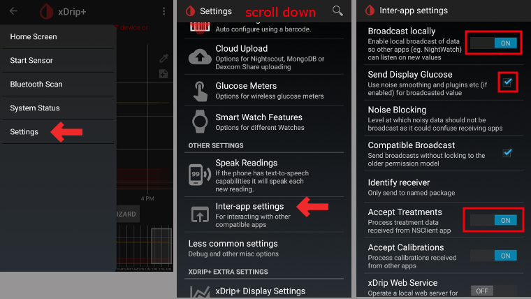
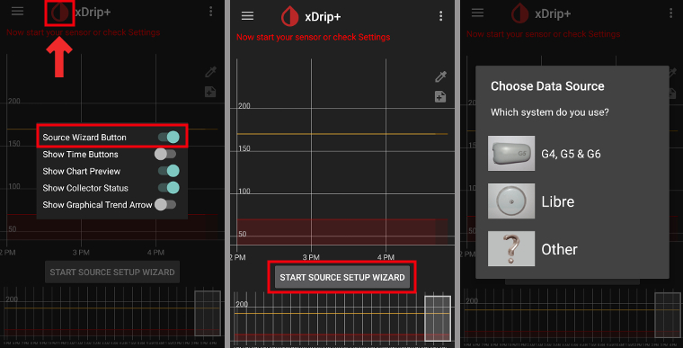

# xDrip+ nastavení

(Další informace týkající se xDrip+ se podívejte se na https://xdrip.readthedocs.io/en/latest/)

Pokud ho ještě nemáte nastaven, stáhněte si [xDrip+](https://jamorham.github.io/#xdrip-plus).

**Teto dokumentace je určena výhradně pro aplikaci xDrip+ pro Android.** Existuje aplikace „xDrip for iOS“, která však s původní aplikací xDrip+ pro Android nemá nic společného.

S vysílači pro G6 vyrobenými na podzim 2018 (např. výrobní čísla znaky 80 nebo 81) můžete použít verzi [master](https://jamorham.github.io/#xdrip-plus).

Pokud výrobní číslo vašeho vysílače Dexcom G6 začíná znaky 8G nebo 8H nebo 8J... použijte jednu z [nejnovějších nightly builds](https://github.com/NightscoutFoundation/xDrip/releases) verzí.

Pokud váš telefon používá systém Android 10 a máte potíže s aplikací xDrip+ ve verzi master, vyzkoušejte verzi [nightly build 2019/12/31 nebo novější](https://github.com/NightscoutFoundation/xDrip/releases).

## Základní nastavení pro všechny CGM & FGM systémy

* Ujistěte se, že máte URL nastavenou správně: s **S** na konci http**s**:// (nejen http://)
   
   např. https://API_SECRET@your-app-name.herokuapp.com/api/v1/
   
   -> Hamburger Menu (horní levá část domovské obrazovky) -> Nastavení-> Nahrávání do cloudu -> Nahrávání přes API (REST) > Základní URL

* Zrušte `Automatické kalibrace` Je-li checkbox `Automatic Calibration` zaškrtnut, aktivujte jednou `Download data`, poté odškrtněte checkbox `Automatic Calibration` na znovu deaktivujte `Download data`. Jinak budou ošetření (sacharidy & inzulín) poslána do Nigtscoutu dvakrát.

* Zvolte `Extra Options`

* Zrušte `Upload treatments` a `Back-fill data`.
   
   **Bezpečnostní upozornění: v xDripu musíte deaktivovat volbu „Nahrávat ošetření“, jinak se v AAPS můžete setkat s duplicitními hodnotami ošetření, a to způsobí špatnou kalkulaci IOB a COB.**

* Dále by měla být deaktivována volba `Alert on failures`. Jinak bude každých 5 minut spuštěn alarm, bude-li připojení přes wifi/mobilní síť málo kvalitní, anebo při problémech se spojením k serveru.
   
   
   
   

* **Komunikace mezi aplikacemi** (Broadcast) Pokud budete používat AndroidAPS a data by měla být přenášena např. do AndroidAPS, měli byste v xDripu aktivovat Lokální odesílání dat.

* Aby byly hodnoty stejné, měli byste aktivovat `Odesílat zobrazovanou glykémii`.

* Pokud také zapnete `Přijímat ošetření` a "Povolení lokálního odesílání" v AndroidAPS, tak xDrip+ bude přijímat informace o inzulínu, sacharidech a nastavení bazálů z AndroidAPS a bude předpovídat blížící se hypo atd. mnohem přesněji.
   
   

(xdrip-identify-receiver)=

### Identify receiver

* If you discover problems with local broadcast (AAPS not receiving BG values from xDrip+) go to Settings > Inter-app settings > Identify receiver and enter `info.nightscout.androidaps` for AndroidAPS build (if you are using PumpControl build, please enter `info.nightscout.aapspumpcontrol` instead!!).
* Pozor: automatické opravy textu v androidu mají tendenci měnit velikost prvního písmene. You **must use only lowercase letters** when typing `info.nightscout.androidaps` (or `info.nightscout.aapspumpcontrol` for PumpControl). Capital I would prevent the App from receiving BG values from xDrip+.
   
   

## xDrip+ a Dexcom G6

* Vysílač Dexcom G6 může být připojen současně k přijímači Dexcom (nebo pumpě t:slim) a zároveň k vašemu telefonu.
* Pokud používáte xDrip+ jako přijímač, nejprve odinstalujte aplikaci Dexcom. **K vysílači se nelze připojit prostřednictvím obou aplikací xDrip+ a Dexcom současně!**
* If you need Clarity and want to profit from xDrip+ alarms use the [Build Your Own Dexcom App](DexcomG6-if-using-g6-with-build-your-own-dexcom-app) with local broadcast to xDrip+.

### Verze xDripu+ závisí na výrobním čísle vysílače G6.

* S vysílači pro G6 vyrobenými na podzim 2018 (např. výrobní čísla začínající znaky 80 nebo 81) můžete použít verzi [master](https://jamorham.github.io/#xdrip-plus). 
* Pokud výrobní číslo vašeho vysílače Dexcom G6 začíná znaky 8G nebo 8H nebo 8J, vyzkoušejte verzi [nightly build 2019/07/28 nebo novější](https://github.com/NightscoutFoundation/xDrip/releases).

### Dexcom specifická nastavení

* Otevřete G5/G6 Debug Settings -> Hamburger Menu (pravý horní roh domácí obrazovky) -> nastavení -> G5/G6 Debug Settings 

* Zvolte následující nastavení
   
   * `Použít Ob1 collector`
   * `Native Algorithm` (důležité pokud chcete používat SMB)
   * `Podpora G6`
   * `Zvolte OB1 unbonding`
   * `Zvolte OB1 initiate bonding`
* Všechny ostatní volby by měly zůstat vypnuté
* Nastavte varování baterie na 280 (G5/G6 nastavení – dolní část)
   
   

### Preemptivní restarty nejsou doporučené

**With Dexcom transmitters who's serial no. is starting with 8G, 8H or 8J preemptive restarts do not work and might kill the sensor completely!**

The automatic extension of Dexcom sensors (`preemptive restarts`) is not recommended as this might lead to “jumps” in BG values on day 9 after restart.

What’s clear is that using the G6 is perhaps a little more complex than it as first suggests. To use it safely, there are a few points to be aware of:

* Pokud používáte nativní data s kalibračním algoritmem aplikace xDrip+ nebo Spike, nejbezpečnější postup je zakázat preemptivní restartování senzoru.
* Pokud musíte preemptivní restarty používat, pak se ujistěte, že senzor zavádíte v takovou denní dobu, kdy můžete sledovat změny a v případě potřeby provést kalibraci. 
* Jestliže senzory restartujete, buď použijte tovární kalibraci, aby byly výsledky v den 11 a 12 co nejbezpečnější, nebo buďte připraveni provést kalibrace a sledujte odchylku.
* Nastřelení senzoru G6 předem v kombinaci s tovární kalibrací pravděpodobně povede k odchylkám ve výsledcích měření. Jestliže nastřelujete senzor s předstihem, pak jej pravděpodobně v zájmu co nejlepších výsledků bude nutné zkalibrovat.
* Jestliže nechcete sledovat změny, ke kterým může docházet, možná bude lepší přepnout na režim bez továrních kalibrací a používat systém jako G5.

To learn more about the details and reasons for these recommendations read the [complete article](https://www.diabettech.com/artificial-pancreas/diy-looping-and-cgm/) published by Tim Street at [www.diabettech.com](https://www.diabettech.com).

(xdrip-connect-g6-transmitter-for-the-first-time)=

### První připojení vysílače G6

**For second and following transmitters see [Extend transmitter life](xdrip-extend-transmitter-life) below.**

S vysílači pro G6 vyrobenými na podzim 2018 (např. výrobní čísla začínající znaky 80 nebo 81) můžete použít verzi [master](https://jamorham.github.io/#xdrip-plus).

Pokud výrobní číslo vašeho vysílače Dexcom G6 začíná znaky 8G nebo 8H nebo 8J, vyzkoušejte verzi [nightly build 2019/07/28 nebo novější](https://github.com/NightscoutFoundation/xDrip/releases).

* Vypněte originální Dexcom přijímač (pokud ho používáte).
* Dlouze přidržte symbol kapky krve Xdrip+ a vyberte možnost zobrazit `Source Wizard Button`.
* Použijte tlačítko Source Wizard, které zajistí, že budou vybrána výchozí nastavení včetně OB1 a nativního režimu 
   * Průvodce vás provede prvotním nastavením.
   * Pokud ho používáte poprvé, budete potřebovat sériové číslo vysílače.

* Vložte výrobní číslo nového vysílače (je napsané na krabičce od vysílače nebo na spodní straně vysílače). Dejte pozor, abyste si nepletli `0` (nula) a `O` (velké písmeno o).
   
   

* Vložte nový senzor (pouze když ho měníte)

* Nasaďte vysílač na senzor
* Pokud se objeví zpráva s žádostí o párování s "DexcomXX", kde "XX" jsou poslední dva znaky sériového čísla vysílače, potvrďte ji (klepněte na "párovat")
* * Nespuštějte nový senzor dokud nejsou zobrazeny následující informace ve Statusu -> G5/G6 status -> PhoneServiceState:
   
   * Sériové číslo vysílače začínající na 80 nebo 81: "Got data hh:mm" (např. "Got data 19:04")
   * Sériové číslo vysílače začínající na 8G, 8H nebo 8J: "Got glucose hh:mm" (např. "Got glucose 19:04") nebo "Got no raw hh:mm" (např. "Got now raw 19:04")
   
   

* Spusťte senzor (pouze pokud ho měníte)
   
   -> V dolní části obrazovky se po několika minutách musí zobrazit `Zahřívání zbývá x,x hodin`.

-> If your transmitter serial no. does not start with 8G, 8H or 8J and there is no time specification after a few minutes stop and restart the sensor.

* Klikněte na Restart collector (Stav systému – když neměníte senzor)
* Před prvním načtením dat do xDrip+ nezapínejte originální Dexcom přijímač (pokud ho používáte).
* Dlouhým přidržením symbolu kapky krve xDrip+ zrušíte zobrazování `Source Wizard Button`.
   
   
   
   
   
   
   
   

(xdrip-transmitter-battery-status)=

### Stav baterie vysílače

* Stav baterie je zobrazen v system status (Hamburger menu levý horní roh domácí obrazovky)
* Posuňte obrazovku doleva pro zobrazení druhé obrazovky.

* Přesné hodnoty, kdy vysílač „umře“ z důvodu vybití baterie, nejsou známy. Následující údaje byly zaslány poté, co vysílač „umřel“:
   
   * První případ: Transmitter days: 151 / Voltage A: 297 / Voltage B: 260 / Resistance: 2391
   * Druhý případ: Transmitter days: 249 / Voltage A: 275 (v okamžiku selhání)

(xdrip-extend-transmitter-life)=

### Prodloužení životnosti vysílače

* Prozatím nelze prodloužit životnost vysílačů, jejichž seriové číslo začíná znaky 8G, 8H nebo 8J. To samé platí pro vysílače se sériovým číslem starting with 81 and firmware 1.6.5.**27** (see xDrip+ System Status - G5/G6 status as shown in [screenshot above](xdrip-transmitter-battery-status)).
* V zájmu prevence potíží se spouštěním senzorů je důrazně doporučeno prodlužovat životnost vysílače před 100 dny prvního použití.
* Používání vysílačů se sériovým číslem starting with 81 and firmware 1.6.5.**27** beyond day 100 is only possible if [engineering mode](nabling-Engineering-Mode-in-xDrip) is turned on and 'native mode' is deactivated (hamburger menu -> settings -> G5/G6 debug settings -> native algorithm) because a transmitter hard reset is NOT possible.
* Během prodlužování životnosti vysílače bude přerušena aktuální relace senzoru. Mějte to na paměti a naplánujte prodloužení životnosti vysílače současně s výměnou senzoru. Nebo se připravte na 2h zahřívání senzoru.
* Zastavte senzor ručně nebo prostřednictvím hamburger menu.
* Přepněte do `engineering mode`: 
   * klepněte na symbol injekční stříkačky v pravém horním rohu hlavní obrazovky
   * pak chvíli podržte symbol mikrofonu v dolním pravém rohu
   * a do textového pole napište bez uvozovek „enable engineering mode“ 
   * klepněte na tlačítko „OK“
   * Pokud máte povoleny Google hlasové příkazy, můžete po klepnutí na symbol mikrofonu vyslovit příkaz „enable engeneering mode“. 
* Přejděte do nastavení ladění G5 a ujistěte se, že volba `Používat OB1 collector` je povolena.
* Použijte hlasový příkaz: „hard reset transmitter“
* Hlasový příkaz bude proveden při následujícím odeslání dat do vysílače
* Přejděte na stav systému (hamburger menu -> Stav systému) a sledujte, co se stalo
* Po cca. 10 min. můžete přepnout na stránku 'Classic Status Page' (přejeďte prstem vpravo) a klepnout na volbu 'Restart Collector'. Tím to bude senzor nastaven na den 0 bez nutnosti spuštění nového senzoru.
* Další možnost: jestliže se na druhé systémové stránce objeví hláška "Phone Service State: Hard Reset maybe failed", prostě spusťte senzor, hláška by měla sama zmizet.
   
   

* Po úspěšném prodloužení vysílače a startu senzoru by se měla hodnota Transmitter days resetovat na 0.

(xdrip-replace-transmitter)=

### Výměna vysílače

S vysílači pro G6 vyrobenými na podzim 2018 (např. výrobní čísla začínající znaky 80 nebo 81) můžete použít verzi [master](https://jamorham.github.io/#xdrip-plus).

Pokud výrobní číslo vašeho vysílače Dexcom G6 is starting with 8G, 8H or 8Juse one of the [latest nightly builds](https://github.com/NightscoutFoundation/xDrip/releases).

* Vypněte originální Dexcom přijímač (pokud ho používáte).
* Stop senzor (pouze když ho měníte)
   
   Ujistěte se, zda je opravdu zastaven:
   
   Na druhé obrazovce „G5/G6 Status“ se zhruba v dolní polovině podívejte na `Queue Items`, mělo by tam být něco jako `(1) Stop Sensor`
   
   Počkejte, až se fronta odešle – obvykle během pár minut. Sensor Status musí být „Stopped“ (viz snímek obrazovky).
   
   -> Pro výměnu vysílače bez zastavení senzoru se podívejte na toto video <https://youtu.be/AAhBVsc6NZo>.
   
   
   
   

* Vymažte zařízení z xDripu+ (Stav systému -> Forget device) a ze seznamu BT v nastavení telefonu (Zobrazuje se jako Dexcom??, přičemž ?? jsou poslední dva znaky výrobního čísla vysílače)
   
   

* Vyjměte vysílač (a také senzor – pokud ho měníte)

* Uložte starý vysílač dostatečně daleko, aby se předešlo jeho opětovnému připojení. Výborné odstínění poskytne (jako dokonalá Faradayova klec) mikrovlnná trouba. Jen ji raději odpojte od napájení, aby se vyloučila možnost náhodného zapnutí.
* Dlouze přidržte symbol kapky krve Xdrip+ a vyberte možnost zobrazit `Source Wizard Button`.
* Použijte tlačítko Source Wizard, které zajistí, že budou vybrána výchozí nastavení včetně OB1 a nativního režimu 
   * Průvodce vás provede prvotním nastavením.
   * Pokud ho vkládáte poprvé, budete potřebovat sériové číslo vysílače.
* Vložte sériové číslo nového vysílače. Buďte opatrní, abyste nezaměnili 0 (nulu) a O (velké písmeno o).
* Vložte nový senzor (pouze když ho měníte).
* Vložte vysílač do senzoru – **ale nestartujte ho ihned!**
* Nový vysílač „Firefly“ (jehož sériové číslo začíná znaky 8G, 8H nebo 8J) lze používat pouze v nativním režimu.
* U nových „Firefly“ vysílačů (jejichž sériové číslo začíná znaky 8G, 8H nebo 8J):
   
   * Preemptivní restart (zakázat!)
   * Restartovat senzor (zakázat!)
   * Vrátit se k xDrip+ algoritmu (zakázat!)
   
   

* Na stránce Classic Status Page -> G5/G6 status -> PhoneServiceState, zkontrolujte, zda se zobrazuje některá z následujících informací:
   
   * Sériové číslo vysílače začínající na 80 nebo 81: "Got data hh:mm" (např. "Got data 19:04")
   * Sériové číslo vysílače začínající na 8G, 8H nebo 8J: "Got glucose hh:mm" (např. "Got glucose 19:04") nebo "nemá raw hh:mm" Got no raw hh:mm" (např. "Got now raw 19:04")
   
   

* Počkejte 15 minut, vysílač by měl s xDripem několikrát komunikovat, než bude spuštěn nový senzor. Udaje o baterii budou zobrazeny pod Informacemi o firmwaru.
   
   

* Spusťte senzor a NEZADÁVEJTE DATUM V MINULOSTI! Vždy vyberte „Ano, dnes“!

* Klikněte na Restart collector (Stav systému - když neměníte senzor)
* Před prvním načtením dat do xDrip+ nezapínejte originální Dexcom přijímač (pokud ho používáte).
* Dlouhým přidržením symbolu kapky krve xDrip+ zrušíte zobrazování `Source Wizard Button`.
   
   
   
   
   
   
   
   

### Nový sensor

* Vypněte originální Dexcom přijímač (pokud ho používáte).
* Je-li to potřeba, vypněte senzor
   
   Ujistěte se, zda je opravdu zastaven:
   
   Na druhé obrazovce „G5/G6 Status“ se zhruba v dolní polovině podívejte na `Queue Items`, mělo by tam být něco jako `(1) Stop Sensor`
   
   Počkejte, až se fronta odešle – obvykle během pár minut.
   
   
   
   

* Vyčistěte alkoholem kontakty vysílače (na spodní straně) a nechte je oschnout.

* V tomto případě vypněte funkce `Restart Sensor` a `Preemptive restarts` (Hamburger menu -> Nastavení -> Možnosti ladění pro G5/G6). Když tento krok vynecháte a funkce pro restart budou zapnuté, nemusí se nový senzor korektně spustit.
   
   

* Spuštění senzoru
   
   **Pro nové vysílače Firefly** (výrobní č. začínající znaky 8G, 8H nebo 8J) **je to povinné, pro všechny ostatní vysílače je doporučeno čekat alespoň 15 minut mezi zastavením a spuštěním nového senzoru (dokud se na druhé stránce s informacemi o stavu systému nezobrazí `Stav senzoru: Zastaveno`). NEZADÁVEJTE DATUM V MINULOSTI!**

* Nastavit čas vložení
   
   * Pro použití G5/G6 nativního režimu musíte čekat 2 hodiny na zahřívání senzoru (takže čas zavedení senzoru je právě nyní).
   * Používáte-li algoritmus xDrip+ , můžete nastavit dobu před 2 hodinami a tak se vyhnout zahřívání senzoru. Získaná data ale mohou být velmi nepředvídatelná. Proto se to nedoporučuje.
* Vložte kód senzoru (je na odlepovací fólii obalu senzoru) 
   * Kód senzoru si ponechejte pro pozdější použití (např. nový start senzoru po výměně vysílače)
   * Code can also be found in [xDrip+ logs](xdrip-retrieve-sensor-code): Click 3-dots-menu on xDrip+ homescreen and choose `View Event Logs`.
* Pokud používáte G6 v „nativním módu“, není potřeba žádná kalibrace. Po 2 hodinovém zahřívání senzoru začne xDrip+ zobrazovat nové hodnoty.
* Před prvním načtením dat do xDrip+ nezapínejte originální Dexcom přijímač (pokud ho používáte).
   
   
   
   

(xdrip-retrieve-sensor-code)=

### Získání kódu senzoru

* Ve verzi master ze dne 2019/05/18 a ve verzích nightly build je kód senzoru zobrazován ve stavu systému (Hamburger menu v levém horním rohu hlavní obrazovky).
* Posuňte obrazovku doleva pro zobrazení druhé obrazovky.
   
   

* Kód senzoru můžete najít také v log souborech xDrip+.

* Klepněte na 3 tečky v pravém horním rohu hlavní obrazovky
* Vyberte `Zobrazit logy` a hledejte kód senzoru
   
   

(xdrip-troubleshooting-dexcom-g5-g6-and-xdrip)=

## Odstraňování potíží s Dexcom G5/G6 a xDrip+

### Problém s připojením k vysílači

* Vysílač musí být zobrazen v bluetooth nastavení ve vašem telefonu.
* Vysílač se musí zobrazovat jako Dexcom??, přičemž ?? kde ?? jsou poslední dva znaky výrobního čísla vysílače. (např. DexcomHY).
* Otevřete nabídku Stav systému v xDrip+ (hamburger menu vlevo nahoře na hlavní obrazovce).
* Ověřte, že je vysílač zobrazen na první stránce se stavem systému ('classic status page').
* Pokud ne: Odstraňte zařízení z nastavení bluetooth svého telefonu a restartujte collector.
* Počkejte přibližně 5 minut, dokud se vysílač Dexcom automaticky znovu nepřipojí.

### Problém se spuštěním nového senzoru

Please note that the following method might likely not work if your Dexcom G6 transmitter's serial no. is starting with 8G, 8H or 8J.

* Nativní senzor je označen jako "FAILED: Sensor Failed Start"
* Zastavte senzor
* Restartujte telefon
* Spusťte nový senzor s kódem 0000 (čtyři nuly)
* Počkejte 15 minut
* Zastavte senzor
* Spusťte senzor se skutečným kódem (vytištěným na ochranné nálepce)

V log souborech v xDrip+ ověřte, že xDrip+ začne počítat „Trvání: 1 minuta“ (a tak dále). Pouze v log protokolech v xDrip+ můžete v úvodní fázi zjistit, zda xDrip+ zastavil senzor. Pozdější stav není v dolní části hlavní obrazovky vždy zobrazen správně.

## xDrip+ a Freestyle Libre

### Speciální nastavení Libre

* Otevřete nastavení Bluetooth -> Hamburger menu (levý horní roh hlavní obrazovky) -> Nastavení -> sjeďte dolů -> Méně častá nastavení -> Nastavení BT
   
   

* Zvolte následující nastavení
   
   * `Zapnout Bluetooth` 
   * `Použít vyhledávání`
   * `Vždy prohledávat služby`

* Všechny ostatní volby by měly zůstat vypnuté
   
   

### Úroveň baterie čtečky Libre

* Úroveň baterie chytrých čteček jako MiaoMiao 2 může být zobrazena v AAPS.
* Podrobnosti naleznete na [stránce se screenshoty](Screenshots-sensor-level-battery).

### Připojte vysílač Libre a spusťte senzor

