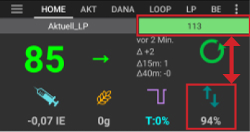

# AAPS screens

## Hlavní stránka

This is the first screen you will come across when you open AAPS and it contains most of the information that you will need day to day.

### Sekce A – Karty

* Navigate between the various AAPS modules.
* Obrazovky můžete také změnit tak, že přejedete prstem doleva nebo doprava.
* Displayed tabs can be selected in [config builder](../SettingUpAaps/ConfigBuilder.md#tab-or-hamburger-menu).

### Sekce B – Profil & cíl

#### Aktuální profil

* Aktuální profil je zobrazen v levém panelu.
* Krátkým stiskem panelu profilu zobrazíte detaily profilu
* Long press profile bar to [switch between different profiles](../DailyLifeWithAaps/ProfileSwitch-ProfilePercentage.md#profile-switch--profile-percentage).
* Pokud byl profil přepnut s dobou trvání, tak se zbývající minuty platnosti profilu zobrazí v závorkách.

#### Cíl

* Aktuální cílová hladina glykémie je zobrazena v pravém řádku.
* Short press target bar to set a [temporary target](../DailyLifeWithAaps/TempTargets.md).
* Pokud je nastaven dočasný cíl, zobrazí se žlutě a zbývající čas v minutách bude zobrazen v závorkách.

#### Vizualizace dynamické úpravy cíle

* AAPS může dynamicky upravovat vaši cílovou hodnotu na základě citlivosti, pokud používáte algoritmus SMB.
* Enable either one or both of the [following options](../SettingUpAaps/Preferences.md#openaps-smb-settings) 
   * "citlivost zvyšuje cíl" a/nebo 
   * "rezistence snižuje cíl" 
* Jestliže AAPS detekuje rezistenci nebo citlivost, cíl se bude lišit od hodnoty, která je nastavena v profilu. 
* Když tato funkce změní cílovou glykémii, její hodnota bude podbarvena zeleně.

### Sekce C – glykémie a stav smyčky

#### Aktuální hodnota glykémie

* Nejnovější glykémie z CGM je zobrazena na levé straně.
* Color of the BG value reflects the status to the defined [range](../SettingUpAaps/Preferences.md#range-for-visualization). 
   * zelená = v rozmezí
   * červená = pod cílovým rozmezím
   * žlutá = nad cílovým rozmezím
* Šedý blok uprostřed zobrazuje minuty od posledního načtení hodnoty a změny od posledního čtení, za posledních 15 a 40 minut.

#### Stav smyčky

* Nová ikona zobrazující stav smyčky:
   
   * zelený kruh = smyčka běží
   * green circle with dotted line = [low glucose suspend (LGS)](../SettingUpAaps/CompletingTheObjectives.md#objective-6-starting-to-close-the-loop-with-low-glucose-suspend)
   * červený kruh = smyčka vypnutá (nefunguje trvale)
   * žlutý kruh = smyčka pozastavena (dočasně pozastavena, ale bude vydán bazální inzulin) - zbývající čas je zobrazen pod ikonou
   * šedý kruh = pumpa odpojena (dočasně žádný výdej inzulínu) - zbývající čas je zobrazen pod ikonou
   * Oranžový kruh = je spuštěn superbolus - zbývající čas je zobrazen pod ikonou
   * modrý kruh s tečkovanou čárou = otevřená smyčka

* Krátkým nebo dlouhým stiskem ikony otevřete dialog smyčky pro přepnutí režimu smyčky (Uzavřená smyčka, Zastavení před nízkou, Otevřená smyčka, Vypnuto), pozastavit / znovu povolit smyčku nebo odpojit / znovu připojit pumpu.
   
   * Pokud krátce stisknete ikonu smyčky, je po výběru některé možnosti v dialogu smyčky vyžadováno ověření
   
   

#### BG warning sign

Beginning with Android 3.0, you might get a warning signal beneath your BG number on the main screen.

*Note*: Up to 30h hours are taken into accord for AAPS calculations. So even after you solved the origin problem, it can take about 30 hours for the yellow triangle to disappear after the last irregular interval occurred.

To remove it immediately you need to manually delete a couple of entries from the Dexcom/xDrip+ tab.

However, when there are a lot of duplicates, it might be easier to

* [backup your settings](../Maintenance/ExportImportSettings.md),
* reset your database in the maintenance menu and
* [import your settings](../Maintenance/ExportImportSettings.md) again

##### Red warning sign: Duplicate BG data

The red warning sign is signaling you to get active immediately: You are receiving duplicate BG data, which does avoid the loop to do its work right. Therefore your loop will be disabled until it is resolved.

You need to find out why you get duplicate BGs:

* Is Dexcom bridge enabled on your NS site? Disable the bridge by going to heroku (or any other hosting provider), edit the "enable" variable and remove the "bridge" part there. (For heroku [details can be found here](https://nightscout.github.io/troubleshoot/troublehoot/#heroku-settings).)
* Do multiple sources upload your BG to NS? If you use the BYODA app, enable the upload in AAPS but do not enable it in xDrip+, if you use that.
* Do you have any followers that might receive your BG but do also upload it again to your NS site?
* Last resort: In AAPS, go to your NS Client settings, select the sync settings and disable the "Accept CGM data from NS" option.

##### Yellow warning sign

* The yellow warning signal is indicating that your BG arrived in irregular time intervals or some BGs are missing.
   
   

* Usually you do not have to take any action. The closed loop will continue to work!

* As a sensor change is interupting the constant flow of BG data a yellow warning sign after sensor change is normal and nothing to worry about.
* Special note for libre users:
   
   * Every single libre slips a minute or two every few hours, meaning you never get a perfect flow of regular BG intervals.
   * Also jumpy readings interrupt the continous flow.
   * Therefore the yellow warning sign will be 'always on' for libre users.

### Sekce D – IOB, COB, BR a AS

* Injekční stříkačka: aktivní inzulín (IOB) - množství aktivního inzulinu v těle
   
   * Ukazatel aktivního inzulínu by měl být nula, pokud běží pouze váš standardní bazál a žádný z předchozích bolusů už nemá aktivní zůstatek. 
   * IOB může být i záporný, pokud byl dříve aktivován snížený bazál.
   * Stisknutím ikony zobrazíte rozdělení bolusové a bazální dávky

* Grain: [carbs on board (COB)](CobCalculation) - yet unabsorbed carbs you have eaten before -> icon pulses if carbs are required

* Fialový řádek: bazál – změny ikon odrážející dočasné změny bazálu (rovná linka při 100 %) 
   * Stisknutím ikony zobrazíte základní bazální dávku a podrobnosti o jakémkoli dočasném bazálu (včetně zbývající doby trvání)
* Arrows up & down: indicating actual [autosens](KeyAapsFeatures#autosens) status (enabled or disabled) and value is shown below icon

#### Požadavek sacharidů

* Návrhy sacharidů jsou uvedeny v případě, že algoritmus detekuje potřebu sacharidů.
* Děje se tak tehdy, když si algoritmus oref myslí, že vás nedokáže zachránit zastavením bazálu (nulový bazál) a že budete potřebovat další sacharidy.
* Oznámení jsou mnohem sofistikovanější než ta z bolusového kalkulátoru. Můžete vidět návrh sacharidů, zatímco bolusová kalkulačka neobsahuje chybějící sacharidy.
* V případě potřeby může být notifikace vyžadovaných sacharidů odeslána do Nightscoutu. Notifikace se pak zobrazí v Nightscoutu a bude vysílána.

### Sekce E – Stavové indikátory

* Stavové indikátory zobrazují vizuální varování pro 
   * Stáří kanyly
   * Stáří inzulínu (doba použití aktuálního zásobníku)
   * Stav zásobníku (jednotky)
   * Stáří senzoru
   * Stáří a úroveň (%) baterie
* Pokud dojde k dosažení prahové hodnoty, zobrazí se hodnoty žlutě.
* Pokud dojde k dosažení kritické prahové hodnoty, hodnoty se zobrazí červeně.
* Settings can be made in [preferences](../SettingUpAaps/Preferences.md#status-lights).

### Sekce F – Hlavní graf

* Graf zobrazuje vaši glykémii (BG), jak je načtena z vašeho senzoru (CGM). 
* Zde jsou zobrazeny poznámky zadané na záložce Akce, jako jsou kalibrace pomocí měření glykémie z prstu, záznamy sacharidů a přepnutí profilu. 
* Dlouhým přidržením prstu na grafu změníte časové měřítko. Můžete si vybrat 6, 12, 18 nebo 24 hodin.
* Zelená plocha zobrazuje váš cílový rozsah. It can be configured in [preferences](../SettingUpAaps/Preferences.md#range-for-visualization).
* Blue triangles show [SMB](KeyAapsFeatures#super-micro-bolus-smb) - if enabled in [preferences](../SettingUpAaps/Preferences.md#openaps-smb-settings).
* Volitelné informace:
   
   * Predikce
   * Bazály
   * Aktivita – Křivka aktivity inzulínu

#### Aktivovat volitelné informace

* Kliknutím na trojúhelník na pravé straně hlavního grafu vyberete, které informace se zobrazí v hlavním grafu.
* For the main graph just the three options above the line "\---\-\--- Graph 1 \---\-\---" are available.
   
   

(Screenshots-prediction-lines)=

#### Linky predikce

* **Orange** line: [COB](CobCalculation) (colour is used generally to represent COB and carbs)
   
   Linka predikce ukazuje, jak se bude vaše glykémie (ne pouze samotné COB!) vyvíjet na základě aktuálního nastavení pumpy a za předpokladu, že odchylky způsobené absorpcí sacharidů zůstanou konstantní. Tato linka se zobrazí pouze v případě, že je známý COB.

* **Tmavě modrá** linka: IOB (barva se obecně používá k vizualizaci IOB a inzulínu)
   
   Linka předpovědi ukazuje, co by se stalo pouze pod vlivem inzulínu. Například, pokud jste aplikovali nějaký inzulín a pak nejedli žádné sacharidy.

* **Světle modrá** linka: nulový dočasný bazál (předpověď glykémie, pokud by byl dočasný bazál nastaven na 0 %)
   
   Prediction line shows how the BG trajectory line would change if the pump stopped all insulin delivery (0% TBR).
   
   *This line appears only when the [SMB](../SettingUpAaps/Preferences.md#advanced-meal-assist-ama-or-super-micro-bolus-smb) algorithm is used.*

* **Dark yellow** line: [UAM](../DailyLifeWithAaps/SensitivityDetectionAndCob.md#sensitivity-oref1) (un-announced meals)
   
   Neohlášená jídla znamenají, že je zjištěn výrazný nárůst glykemie v důsledku jídla, adrenalinu nebo jiných vlivů. Linka předpovědi je podobná ORANŽOVÉ COB lince, ale předpokládá, že se odchylky budou snižovat konstantní rychlostí (rozšířením současné rychlosti snížení).
   
   *This line appears only when the [SMB](../SettingUpAaps/Preferences.md#advanced-meal-assist-ama-or-super-micro-bolus-smb) algorithm is used.*

* **Dark orange** line: aCOB (accelerated carbohydrate absorption)
   
   Similar to COB, but assuming a static 10 mg/dL/5m (-0.555 mmol/l/5m) carb absorption rate. Deprecated and of limited usefulness.
   
   *This line appears only when the older [AMA](../SettingUpAaps/Preferences.md#advanced-meal-assist-ama-or-super-micro-bolus-smb) algorithm is used.*

Obvykle vaše skutečná křivka glykémie končí uprostřed těchto linek nebo blízko k té, jejíž předpoklady se nejvíce podobají vaší situaci.

#### Bazály

* **Nepřerušovaná modrá** linka ukazuje bazál z pumpy, který se aktuálně vydává.
* **Tečkovaná modrá** linka ukazuje, jaký bazál by se vydával, pokud by nedocházelo k žádné úpravě dočasného bazálu (TBR).
* V době, kdy je vydáván standardní bazál, je plocha pod linkou zbarvena tmavě modře.
* Když je bazální dávka dočasně upravena (zvýšena nebo snížena), plocha pod křivkou je znázorněna světle modře.

#### Aktivita

* **Tenká žlutá** linka ukazuje aktivitu Inzulínu. 
* Je založena na očekávaném poklesu glykémie odpovídajícímu množství inzulínu, pokud nebyly přítomny žádné jiné faktory (jako např. sacharidy).

### Sekce G – Další grafy

* Můžete aktivovat až čtyři další grafy pod hlavním grafem.
* To open settings for additional graphs click the triangle on the right side of the [main graph](#section-f---main-graph) and scroll down.

* To add an additional graph check the box on the left side of its name (i.e. \---\-\--- Graph 1 \---\-\---).

#### Absolutní inzulin

* Aktivní inzulin včetně bolusů **a bazálu**.

#### Aktivní inzulín

* Zobrazuje vydaný inzulín, který je aktivní (= aktivní inzulín v těle). Zahrnuje inzulín z bolusu a dočasného bazálu (**ale nezahrnuje bazální dávky nastavené ve vašem profilu**).
* If there were no [SMBs](KeyAapsFeatures#super-micro-bolus-smb), no boluses and no TBR during DIA time this would be zero.
* IOB může být záporný, pokud již není aktivní žádný bolus a po delší dobu byl nastaven nulový/nízký dočasný bazál.
* Decaying depends on your [DIA and insulin profile settings](../SettingUpAaps/ConfigBuilder.md#local-profile). 

#### Zbývající sacharidy

* Zobrazuje zkonzumované sacharidy (= aktivní, dosud nevstřebané sacharidy v těle). 
* Vstřebávání závisí na odchylkách, které detekuje algoritmus. 
* Pokud se zjistí vyšší absorpce, než se očekávalo, může dojít k vydání inzulinu. To bude mít za následek zvýšení IOB (zda více či méně závisí na vašich bezpečnostních nastaveních). 

#### Odchylky

* **ŠEDÉ** sloupce zobrazují odchylku způsobenou sacharidy. 
* **ZELENÉ** sloupce ukazují, že je glykémie vyšší, než algoritmus očekával. Green bars are used to increase resistance in [Autosens](KeyAapsFeatures#autosens).
* **ČERVENÉ** sloupce ukazují, že je glykémie nižší, než algoritmus očekával. Red bars are used to increase sensitivity in [Autosens](KeyAapsFeatures#autosens).
* **ŽLUTÉ** sloupce ukazují odchylky způsobené UAM.
* **ČERNÉ** sloupce ukazují drobné odchylky, které nejsou pro citlivost zohledňovány

#### Citlivost

* Shows the sensitivity that [Autosens](KeyAapsFeatures#autosens) has detected. 
* Citlivost je výpočet citlivosti na inzulín v důsledku pohybu, hormonů atd.

#### Aktivita

* Shows the activity of insulin, calculated by your insulin profile (it's not derivative of IOB). 
* Hodnota je vyšší pro inzulín blíže době špičky.
* Derivace by znamenala, že aktivita bude záporná, pokud IOB klesá. 

#### Odchylka sklonu

* Internal value used in algorithm.

### Section H - Buttons

* Buttons for insulin, carbs and Calculator are almost'always on'.
   
   * If connection to pump is lost, the insulin button will not be visible.

* Other Buttons have to be setup in [preferences](../SettingUpAaps/Preferences.md#buttons).

#### Inzulín

* To give a certain amount of insulin without using [bolus calculator](#bolus-wizard).
* By checking the box you can automatically start your [eating soon temp target](../SettingUpAaps/Preferences.md#default-temp-targets).
* If you do not want to bolus through pump but record insulin amount (i.e. insulin given by syringe) check the corresponding box.

#### Sacharidy

* Zadání sacharidů bez podání bolusu.
* Certain [pre-set temporary targets](../SettingUpAaps/Preferences.md#default-temp-targets) can be set directly by checking the box.
* Time offset: When will you / have you been eaten carbs (in minutes).
* Duration: To be used for ["extended carbs"](ExtendedCarbs)
* Můžete použít tlačítka pro rychlému zvýšení hodnoty sacharidů.
* Notes will be uploaded to Nightscout - depending on your settings for [NS client](../SettingUpAaps/Preferences.md#nsclient).

#### Kalkulačka

* See Bolus Wizard [section below](#bolus-wizard)

#### Kalibrace

* Odeslání kalibrace do xDrip+ nebo otevře dialogové okno pro kalibraci Dexcom.
* Must be activated in [preferences](../SettingUpAaps/Preferences.md#buttons).

#### CGM

* Opens xDrip+.
* Back button returns to AAPS.
* Must be activated in [preferences](../SettingUpAaps/Preferences.md#buttons).

#### Průvodce rychlým bolusem

* Easily enter amount of carbs and set calculation basics.
* Details are setup in [preferences](../SettingUpAaps/Preferences.md#quick-wizard).

## Bolus Wizard

Když se chystáte odesílat bolus k jídlu, dobře se k tomu hodí funkce kalkulátor.

### Section I

* BG field is normally already populated with the latest reading from your CGM. Pokud právě nemáte senzor v provozu, pak bude pole prázdné. 
* Do políčka "Sacharidy" vkládáte odhadované množství sacharidů (nebo ekvivalentní hodnotu), ke kterým chcete poslat bolus. 
* The CORR field is if you want to modify the end dosage for some reason.
* The CARB TIME field is for pre-bolusing so you can tell the system that there will be a delay before the carbs are to be expected. Můžete zde zadat i záporné číslo, pokud později dopichujete bolus k dříve zkonzumovaným sacharidům.

(Screenshots-eating-reminder)=

#### Eating reminder

* For carbs in the future the alarm checkbox can be selected (and is by default when a time in the future is entered) so that you can be reminded at a time in the future of when to eat the carbs you have input into AAPS
   
   

### Section J

* SUPERBOLUS je funkce, kdy je k dávce okamžitého bolusu přičtený bazální inzulín za následující dvě hodiny a zároveň je pumpě nastavená dočasná bazální dávka 0% na dvě hodiny, aby se tak vybalancoval zpět extra podaný inzulín. The option only shows when "Enable [superbolus](../SettingUpAaps/Preferences.md#superbolus) in wizard" is set in the [preferences overview](../SettingUpAaps/Preferences.md#overview).
* Cílem je dodat inzulín dřív, aby se snížil kopec, který na grafu glykémie obvykle následuje.
* For details visit [diabetesnet.com](https://www.diabetesnet.com/diabetes-technology/blue-skying/super-bolus/).

### Section K

* Zobrazuje vypočtený bolus. 
* Pokud množství již aktivního inzulínu v krvi převyšuje vypočtený bolus, pak se jen zobrazí doporučené množství sacharidů k jeho pokrytí.
* Notes will be uploaded to Nightscout - depending on your settings for [NS client](../SettingUpAaps/Preferences.md#nsclient).

### Section L

* Details of wizard's bolus calculation.
* Můžete odznačit všechny, které se vám nehodí, ale normálně by k tomu neměl být důvod.
* For safety reasons the **TT box must be ticked manually** if you want the bolus wizard to calculate based on an existing temporary target.

#### Kombinace COB a IOB a jejich význam

* For safety reasons IOB boxed cannot be unticked when COB box is ticked as you might run the risk of too much insulin as AAPS is not accounting for what’s already given.
* Pokud vyberete COB a IOB, budou při výpočtu zohledněny nestrávané sacharidy, které již nejsou pokryty inzulinem + veškerý inzulin, který byl dodán jako DBD nebo SMB.
* Pokud vyberete IOB bez COB, AAPS bude zohledňovat již vydaný inzulin, ale nezapočítá žádné zkonzumované sacharidy, které dosud nejsou stráveny. To vede k oznámení o 'chybějících sacharidech'.
* If you bolus for **additional food** shortly after a meal bolus (i.e. additional desert) it can be helpful to **untick all boxes**. Tak lze přidat pouze nově zkonzumované sacharidy, jelikož hlavní jídlo dosud nemusí být stráveno, takže IOB krátce po bolusu k jídlu nebude přesně odpovídat množství COB.

(Screenshots-wrong-cob-detection)=

#### Chybná detekce COB

* If you see the warning above after using bolus wizard, AAPS has detected that the calculated COB value maybe wrong.
* Takže chcete-li si dát bolus znovu po předchozím jídle s COB, měli byste si dát pozor na možné předávkování inzulinem! 
* For details see the hints on [COB calculation page](CobCalculation#detection-of-wrong-cob-values).

(Screenshots-action-tab)=

## Action tab

### Actions - section M

* Button [profile switch](../DailyLifeWithAaps/ProfileSwitch-ProfilePercentage.md#profile-switch--profile-percentage) as an alternative to pressing the [current profile](#section-b---profile--target) on homescreen.
* Button [temporary target](../DailyLifeWithAaps/TempTargets.md) as an alternative to pressing the [current target](#section-b---profile--target) on homescreen.
* Button to start or cancel a temporary basal rate. Please note that the button changes from “TEMPBASAL” to “CANCEL x%” when a temporary basal rate is set.
* Even though [extended boluses](ExtendedCarbs#extended-bolus-and-why-they-wont-work-in-closed-loop-environment) do not really work in a closed loop environment some people were asking for an option to use extended bolus anyway.
   
   * This option is only available for Dana RS and Insight pumps. 
   * Closed loop will automatically be stopped and switched to open loop mode for the time running extended bolus.
   * Make sure to read the [details](ExtendedCarbs) before using this option.

(Screenshots-careportal-section-n)=

### Careportal - section N

* Displays information on
   
   * sensor age & level (battery percentage)
   * insulin age & level (units)
   * stáří kanyly
   * pump battery age & level (percentage

* Less information will be shown if [low resolution skin](../SettingUpAaps/Preferences.md#skin) is used.

(Screenshots-sensor-level-battery)=

#### Sensor level (battery)

* Needs xDrip+ nightly build Dec. 10, 2020 or newer.
* Works for CGM with additional transmitter such as MiaoMiao 2. (Technically sensor has to send cat level information to xDrip+.)
* Thresholds can be set in [preferences](../SettingUpAaps/Preferences.md#status-lights).
* If sensor level is the same as phone battery level you xDrip+ version is probably too old and needs an update.
   
   

### Careportal - section O

* BG check, prime/fill, sensor insert and pump battery change are the base for the data displayed in [section N](#careportal---section-n).
* Prime/Fill allows you to record pump site and insulin cartridge change.
* Section O reflects the Nightscout careportal. So exercise, announcement and question are special forms of notes.

### Tools - section P

#### History Browser

* Allows you to ride back in AAPS history.

#### CDD

* Total daily dose = bolus + basal per day
* Někteří lékaři doporučují – hlavně pro nové uživatele pumpy – poměr bazál-bolus 50:50. 
* Poměr se proto vypočítá jako TDD / 2 * TBB (celková denní dávka = součet hodnot bazálních dávek za 24 hodin). 
* Jiní dávají přednost hodnotám, kdy TBB tvoří 32 % až 37 % z TDD. 
* Stejně jako podobná pravidla má i toto v reálném životě omezenou platnost. Poznámka: Váš diabetes může být jiný!

(Screenshots-insulin-profile))=

## Inzulínový profil

* This shows the activity profile of the insulin you have chosen in [config builder](../SettingUpAaps/ConfigBuilder.md#insulin). 
* FIALOVÁ linka ukazuje, jaké množství inzulínu průběžně v čase zůstává od aplikace k úplnému rozložení, a MODRÁ linka ukazuje, nakolik je v čase aktivní.
* The important thing to note is that the decay has a long tail. 
* Pokud jste byli zvyklí na ruční podávání inzulínu, pravděpodobně jste předpokládali, že inzulín se bude postupně spotřebovávat asi 3,5 hodiny. 
* However, when you are looping the long tail matters as the calculations are far more precise and these small amounts add up when they are subjected to the recursive calculations in the AAPS algorithm.

Pro podrobnější informace o různých typech inzulínu, o jejich profilech aktivity a proč je to vše důležité, si můžete přečíst článek [Understanding the New IOB Curves Based on Exponential Activity Curves](https://openaps.readthedocs.io/en/latest/docs/While%20You%20Wait%20For%20Gear/understanding-insulin-on-board-calculations.html#understanding-the-new-iob-curves-based-on-exponential-activity-curves)

A také si o tom můžete přečíst výborný článek blogu zde: [Why we are regularly wrong in the duration of insulin action (DIA) times we use, and why it matters…](https://www.diabettech.com/insulin/why-we-are-regularly-wrong-in-the-duration-of-insulin-action-dia-times-we-use-and-why-it-matters/)

And even more at: [Exponential Insulin Curves + Fiasp](https://seemycgm.com/2017/10/21/exponential-insulin-curves-fiasp/)

## Stav pumpy

* Different information on pump status. Displayed information depends on your pump model.
* See [pumps page](../Getting-Started/CompatiblePumps.md) for details.

## Péče

Careportal replicated the functions you will find on your Nightscout screen under the “+” symbol which allows you to add notes to your records.

### Review carb calculation

* If you have used the [Bolus Wizard](#bolus-wizard) to calculate insulin dosage you can review this calculation later on ts tab.
* Just press the green Calc link. (Depending on pump used insulin and carbs can also be shown in one single line in ts.)

(Screenshots-carb-correction)=

### Korekce sacharidy

Záložka ošetření může být použita k opravě chybných záznamů sacharidů (např. jste sacharidy přecenili nebo podcenili).

1. Zkontrolujte a zapamatujte si aktuální COB a IOB na domovské obrazovce.
2. V závislosti na pumpě se mohou sacharidy v záložce ošetření zobrazovat společně s inzulínem v jednom řádku nebo jako samostatný záznam (např. s Danou RS).
3. Remove the entry with the faulty carb amount. (Latest versions have trashcan icon in treatments screen. Press the trashcan icon, select the lines to remove, and then press the trashcan icon again to finalize.)
4. Ujistěte se, že sacharidy byly úspěšně odstraněny kontrolou COB na domovské obrazovce.
5. Kontrolu proveďte také pro IOB, pokud v záložce ošetření jeden řádek obsahuje sacharidy i inzulín.
   
   -> Nejsou-li sacharidy odstraněny tak, jak bylo zamýšleno, a přidáte další sacharidy, jak je zde vysvětleno (6.), COB budou příliš vysoké a to může vést k podání příliš vysokého množství inzulínu.

6. Zadejte správné množství sacharidů pomocí tlačítka na domovské obrazovce a ujistěte se, že jste nastavili správný čas události.

7. Pokud je v záložce ošetření pouze jedna řádka obsahující sacharidy i inzulín, musíte také přidat množství inzulínu. Nezapomeňte nastavit správný čas události a po potvrzení nového záznamu zkontrolujte IOB na domovské obrazovce.

## Loop, AMA / SMB

* These tabs show details about the algorithm's calculations and why AAPS acts the way it does.
* Calculations are each time the system gets a fresh reading from the CGM.
* For more details see [APS section on config builder page](../SettingUpAaps/ConfigBuilder.md#aps).

## Profile

* Profile contains information on your individual diabetes settings:
   
   * DIA (Duration of Insulin Action)
   * IC or I:C: Insulin to Carb ratio
   * ISF: Insulin Sensitivity Factor
   * Bazální dávka
   * Target: Blood glucose level that you want AAPS to be aiming for

(Screenshots-treatment)=

## Bolus

History of the following treatments:

* Bolus & carbs -> option to [remove entries](#carb-correction) to correct history
* [Prodloužený bolus](ExtendedCarbs#extended-bolus-and-switch-to-open-loop---dana-and-insight-pump-only)
* Temporary basal rate
* [Dočasný cíl](../DailyLifeWithAaps/TempTargets.md)
* [Přepínání profilu](../DailyLifeWithAaps/ProfileSwitch-ProfilePercentage.md)
* Careportal - notes entered through action tab and notes in dialogues

## BG Source - xDrip+, BYODA...

* Depending on your BG source settings this tab is named differently.
* Shows history of CGM readings and offers option to remove reading in case of failure (i.e. compression low).

## NSClient

* Displays status of the connection with your Nightscout site.
* Settings are made in [preferences](../SettingUpAaps/Preferences.md#nsclient). You can open the corresponding section by clicking the cog wheel on the top right side of the screen.
* For troubleshooting see this [page](../GettingHelp/TroubleshootingNsClient.md).