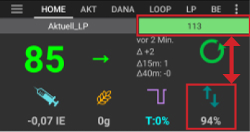

# Funkce OpenAPS

(Open-APS-features-autosens)=

## Autosens

- Autosens is an algorithm which looks at blood glucose deviations (positive/negative/neutral).
- Pokusí se zjistit, jak citlivý(-á)/rezistentní jste na základě těchto odchylek.
- Realizace algoritmu oref v ** OpenAPS ** pracuje s kombinací dat za 24 a 8 hodin. Používá ta, která jsou více senzitivní.
- In versions prior to **AAPS 2.7**, the user had to choose between 8 or 24 hours manually.
- From **AAPS 2.7** on Autosens in **AAPS** will switch between a 24 and 8 hours window for calculating sensitivity. It will pick whichever one is more sensitive. 
- Pokud uživatelé pocházejí z Oref1, pravděpodobně si všimnou toho, že systém může být méně dynamický na změny, v závislosti na citlivosti za 24 nebo 8 hodin.
- Changing a cannula or changing a profile will reset Autosens ratio back to 100% (a percentual profile switch with duration won't reset autosens).
- Autosens adjusts your basal and ISF (i.e.: mimicking what a Profile shift does).
- If continuously eating carbs over an extended period, Autosens will be less effective during that period as carbs are excluded from **BG** delta calculations.

(Open-APS-features-super-micro-bolus-smb)=

## Super Micro Bolus (SMB)

**SMB**, the shortform of **Super micro bolus**, is an OpenAPS feature introduced from 2018 onwards, within the Oref1 algorithm. In contrast to **AMA**, **SMB** does not use temporary basal rates to control glucose levels, but mainly **small super micro boluses**. In situations where **AMA** would add 1.0 IU insulin using a temporary basal rate, **SMB** delivers several super micro boluses in small steps at **5 minute intervals**, e.g. 0.4 IU, 0.3 IU, 0.2 IU and 0.1 IU. Z bezpečnostních důvodů pak ve stejném okamžiku SMB nastaví na určitou dobu dočasný bazál na 0 U/h jako prevenci proti nadměrné dávce inzulínu. This allows the system to adjust the blood glucose faster than with the temporary basal rate increase in **AMA**.

Thanks to SMB, it may be sufficient for meals containing only "slow" carbs to inform the system of the planned amount of carbohydrate and leave the rest to **AAPS**. However, this may lead to higher postprandial (post-meal) peaks because pre-bolusing isn’t possible. Or you can give, if necessary with pre-bolusing, a **start bolus**, which **only partly** covers the carbohydrates (e.g. 2/3 of the estimated amount) and let **SMB** deliver the rest of the insulin.

SMBs are shown on the main graph with blue triangles. Tap on the triangle to see how much insulin was delivered, or use the [Treatments tab](#aaps-screens-treatments).

**SMB's** features contain some safety mechanisms:

1. **Largest single SMB dose**  
    The largest single SMB dose can only be the smallest value of:
    
    - hodnota aktuálního bazálního inzulínu (upravená pomocí automatické detekce citlivosti) pro dobu přednastavenou ve volbě „Maximální počet minut bazálu, ke kterým se limituje SMB“, např. bazální dávka inzulínu pro následujících 30 minut, nebo
    - polovina aktuálně požadované dávky inzulínu, nebo
    - zbývající část nastavené hodnoty maxIOB.

2. **Low temp basal rates**  
    Low temporary basal rates (called 'low temps') or temporary basal rates at 0 U/h (called 'zero-temps') are activated more in **SMB**. This is by design for safety reasons and has no negative effects if the **Profile** is set correctly. On the main graph, the IOB curve (yellow thin line) is more meaningful than the course of the temporary basal rates.

3. **Un-Announced Meals**  
    Additional calculations to predict the course of glucose, e.g. by **UAM** (un-announced meals). Even without manual carbohydrate input from the user, **UAM** can automatically detect a significant increase in glucose levels due to meals, adrenaline or other influences and try to adjust this with **SMB**. V zájmu zachování bezpečnosti to funguje i opačně a deaktivuje SMB dříve, pokud dojde k neočekávanému poklesu glykémie. To je důvod, proč by funkce UAM měla být při používání SMB vždy aktivní.

**You must have started [objective 9](#objectives-objective9) to use SMB.**

See also :

- [OpenAPS documentation for SMB](https://openaps.readthedocs.io/en/latest/docs/Customize-Iterate/oref1.html#understanding-super-micro-bolus-smb).
- [OpenAPS documentation for oref1 SMB](https://openaps.readthedocs.io/en/latest/docs/Customize-Iterate/oref1.html)
- [Tim's info on SMB](https://www.diabettech.com/artificial-pancreas/understanding-smb-and-oref1/).

The settings for OpenAPS SMB are described below.

(Open-APS-features-max-u-h-a-temp-basal-can-be-set-to)=

### Max U/h a temp basal can be set to

Toto bezpečnostní omezení stanoví maximální výši dočasné bazální dávky inzulínu, která muže být pumpou aplikována. It is also known as **max-basal**.

Jakmile je tato hodnota dosažena, AAPS zastaví přidávání dodatečného bazálu, dokud hodnota inzulínu v těle (IOB) opět neklesne pod tuto hodnotu. Doporučuje se nastavit toto na rozumnou hodnotu. A good recommendation for setting this parameter is:

    max-basal = highest basal rate x 4
    

Například: máte-li ve svém profilu nejvyšší hodnotu bazálu 0.5U/h, dostanete po vynásobení 4 hodnotu 2U/h.

**AAPS** limits this value as a 'hard limit' according to [Preferences > Treatments safety > Patient Type](#preferences-patient-type). The hard limits are as follows:

- Děti: 2
- Dospívající: 5
- Dospělí: 10
- Dospělí s vyšší rezistencí na inzulín: 12
- Těhotná: 25

*See also [overview of hard-coded limits](#overview-of-hard-coded-limits).*

(Open-APS-features-maximum-total-iob-openaps-cant-go-over)=

### Maximum total IOB OpenAPS can’t go over

This value determines the maximum **Insulin on Board** (basal and bolus IOB) that **AAPS** will remain under while running in closed loop mode. It is also known as **maxIOB**.

Pokud je aktuální IOB (např. po bolusové dávce) nad nastavenou hodnotou, smyčka nenavýší dávky inzulínu, dokud se hodnota IOB pod tuto hodnotu nesníží.

A good start for setting this parameter is:

    max IOB = průměrná hodnota bolusů podávaných před jídlem + 3násobek nejvyšší hodnoty v bazálním profilu
    

Be careful and patient when adjusting your **max-IOB**. It is different for everyone and can also depend on the average total daily dose (TDD).

**AAPS** limits this value as a 'hard limit' according to [Preferences > Treatments safety > Patient Type](#preferences-patient-type). The hard limits are as follows:

- Děti: 3
- Dospívající: 7
- Dospělí: 12
- Dospělí s vyšší rezistencí na inzulín: 25
- Těhotná: 40

*See also [overview of hard-coded limits](#overview-of-hard-coded-limits).*

Note : When using **SMB**, the **max-IOB** is calculated differently than in AMA. In **AMA**, maxIOB is a safety-parameter for basal **IOB**, while in SMB-mode, it also includes bolus IOB.

Viz také [Dokumentace k OpenAPS SMB](https://openaps.readthedocs.io/en/latest/docs/Customize-Iterate/oref1.html#understanding-super-micro-bolus-smb).

### Enable Autosens

[Autosens](#autosens) looks at blood glucose deviations (positive/negative/neutral). Pokud je chcete i přesto změnit, prostudujte si podrobnosti v , abyste pochopili, co děláte.

### Povolit SMB

Enable this to use SMB functionality. If disabled, no **SMBs** will be given.

(Open-APS-features-enable-smb-with-high-temp-targets)=

### Povolit SMB s vysokými dočasnými cíli

If this setting is enabled, **SMBs** will still be delivered even if the user has selected a high **Temp Target** (defined as anything above 100mg/dL or 5.6mmol/l, regardless of **Profile** target). This option is intended to be used to disable SMBs when the setting is disabled. For example, if this option is disabled, **SMBs** can be disabled by setting a **Temp Target** above 100mg/dL or 5.6mmol/l. This option will also disable **SMBs** regardless of what other condition is trying to enable SMB.

If this setting is enabled, **SMB** will only be enabled with a high temp target if **Enable SMB with temp targets** is also enabled.

(Open-APS-features-enable-smb-always)=

### Vždy povolit SMB

If this setting is enabled, SMB is enabled always enabled(independent of COB, temp targets or boluses). If this setting is enabled, the rest of the enable settings below will have no effect. However, if **Enable SMB with high temp targets** is disabled and a high temp target is set, SMBs will be disabled.

For safety reasons, this option is only available for BG sources with a good filtering system for noisy data.

- Currently, it is only available with a Dexcom G5 or G6, if using the [Build your own Dexcom App](#DexcomG6-if-using-g6-with-build-your-own-dexcom-app) or “[native mode](#smoothing-xdrip-dexcom-g6)” in xDrip+. If a BG value has too large of a deviation, the G5/G6 doesn’t send it and waits for the next value 5 minutes later.
- For other CGM/FGM like Freestyle Libre, **SMB always** is deactivated until there is a better noise smoothing plugin. 
- You can find more [here](../CompatibleCgms/SmoothingBloodGlucoseData.md).

### Povolit SMB se sacharidy

If this setting is enabled, SMB is enabled when the COB is greater than 0.

### Povolit SMB s dočasnými cíli

If this setting is enabled, SMB is enabled when there is any temp target set (eating soon, activity, hypo, custom). If this setting is enabled but **Enable SMB with high temp targets** is disabled, SMB will be enabled when a low temp target is set (below 100mg/dL or 5.6mmol/l) but disabled when a high temp target is set.

### Povolit SMB po jídle

If enabled, SMB is enabled for 6h after carbohydrates are announced, even if COB has reached 0.

For safety reasons, this option is only available for BG sources with a good filtering system for noisy data.

- Currently, it is only available with a Dexcom G5 or G6, if using the [Build your own Dexcom App](#DexcomG6-if-using-g6-with-build-your-own-dexcom-app) or “[native mode](#smoothing-xdrip-dexcom-g6)” in xDrip+. If a BG value has too large of a deviation, the G5/G6 doesn’t send it and waits for the next value 5 minutes later.
- For other CGM/FGM like Freestyle Libre, **SMB always** is deactivated until there is a better noise smoothing plugin.
- You can find more [here](../CompatibleCgms/SmoothingBloodGlucoseData.md).

### Jak často budou SMB podávány v minutách

This feature limits the frequency of SMBs. This value determines the minimum time between SMBs. Note that the loop runs every time a glucose value comes in (generally 5 minutes). Subtract 2 minute to give loop additional time to complete. E.g. if you want SMB to be given every loop run, set this to 3 minutes.

Výchozí hodnota: 3 min.

(Open-APS-features-max-minutes-of-basal-to-limit-smb-to)=

### Maximální počet minut bazálu, ke kterým se limituje SMB

Jedná se o důležité bezpečnostní nastavení. Tato hodnota určuje, kolik SMB může být vydáno na základě aktuálního bazálu, když nejsou pokryty sacharidy.

Making this value larger allows the SMB to be more aggressive. You should start with the default value of 30 minutes. After some experience, increase the value in 15 minutes increments and observe the effects over multiple meals.

It is recommended not to set the value higher than 90 minutes, as this would lead to a point where the algorithm might not be able to accommodate a decreasing BG with 0 U/h basal ('zero-temp'). You should also set alarms, especially if you are still testing new settings, which will warn you well before a hypo.

Výchozí hodnota: 30 min.

### Povolit UAM

Je-li tato možnost povolena, algoritmus SMB dokáže rozpoznat neoznámená jídla. This is helpful if you forget to tell **AAPS** about your carbs or estimate your carbs wrong and the amount of entered carbs is wrong or if a meal with lots of fat and protein has a longer duration than expected. Without any carb entry, UAM can recognize fast glucose increase caused by carbs, adrenaline, etc., and tries to adjust it with SMBs. This also works the opposite way: if there is a fast glucose decrease, it can stop SMBs earlier.

**Proto by měla být při používání SMB funkce UAM vždy povolena.**

### Citlivost zvyšuje cíl

If this option is enabled, the sensitivity detection (autosens) can raise the target when sensitivity is detected (below 100%). In this case your target will be raised by the percentage of the detected sensitivity.

If the target is modified due to sensitivity detection, it will be displayed with a green background on your home screen.

### Rezistence snižuje cíl

If this option is enabled, the sensitivity detection (autosens) can lower the target when resistance is detected (above 100%). In this case your target will be lowered by the percentage of the detected resistance.

### Vysoký dočasný cíl zvýší senzitivitu

If you have this option enabled, the insulin sensitivity will be increased while having a temporary target above 100 mg/dl or 5.6 mmol/l. To znamená, že ISF se zvýší, zatímco IC a bazál se sníží. This will effectively make **AAPS** less aggressive when you set a high temp target.

### Nízký dočasný cíl sníží senzitivitu

Je-li tato volba aktivní, citlivost na inzulin se při nastavení dočasného cíle pod 5.6 mmol/l (100 mg/dl) sníží. To znamená, že ISF se sníží, zatímco IC a bazál se zvýší. This will effectively make **AAPS** more aggressive when you set a low temp target.

(key-aaps-features-minimal-carbs-required-for-suggestion)=

### Minimal carbs required for suggestion

Minimum grams of carbs to display a carbs suggestion alert. V případě že referenční design detekuje potřebu sacharidů, navrhe konzumaci dalších sacharidů. V tomto případě obdržíte oznámení, které může být odloženo na 5, 15 nebo 30 minut.

V případě potřeby může být notifikace vyžadovaných sacharidů odeslána do Nightscoutu. Notifikace se pak zobrazí v Nightscoutu a bude vysílána.

In any case, the required carbs will be displayed in the COB section on your home screen.

### Rozšířená nastavení

You can read more here : [OpenAPS docs](https://openaps.readthedocs.io/en/latest/docs/While%20You%20Wait%20For%20Gear/preferences-and-safety-settings.html).

**Always use short average delta instead of simple data** If you enable this feature, **AAPS** uses the short average delta/blood glucose from the last 15 minutes, which is usually the average of the last three values. This helps **AAPS** to be steadier with noisy data sources like xDrip+ and Libre.

**Max. násobitel denního nejvyššího bazálu** Toto je důležité bezpečnostní omezení. Výchozí nastavení (které pravděpodobně nebude potřeba upravovat) je 3. This means that **AAPS** will never be allowed to set a temporary basal rate that is more than 3x the highest hourly basal rate programmed in a user’s pump and/or profile. Example: if your highest basal rate is 1.0 U/h and max daily safety multiplier is 3, then **AAPS** can set a maximum temporary basal rate of 3.0 U/h (= 3 x 1.0 U/h).

Default value: 3 (shouldn’t be changed unless you really need to and know what you are doing)

**Max. násobitel současného bazálu** Toto je další důležité bezpečnostní omezení. Výchozí nastavení (které pravděpodobně také nebude potřeba upravovat) je 4. This means that **AAPS** will never be allowed to set a temporary basal rate that is more than 4x the current hourly basal rate programmed in a user’s pump and/or profile.

Default value: 4 (shouldn’t be changed unless you really need to and know what you are doing)

* * *

(Open-APS-features-advanced-meal-assist-ama)=

## Advanced Meal Assist (AMA)

AMA je zkratka pro "advanced meal assist" (pokročilý pomocník s jídly), což je funkce OpenAPS od roku 2017 (oref0). OpenAPS Advanced Meal Assist (AMA) umožňuje systému rychleji reagovat po bolusu na jídlo, pokud zadáte sacharidy správně.

You can find more information in the [OpenAPS documentation](https://newer-docs.readthedocs.io/en/latest/docs/walkthrough/phase-4/advanced-features.html#advanced-meal-assist-or-ama).

### Max. povolený bazál U/h (OpenAPS "max-basal")

This safety setting helps **AAPS** from ever being capable of giving a dangerously high basal rate and limits the temp basal rate to x U/h. Doporučuje se nastavit toto na rozumnou hodnotu. Doporučuje se vzít z vašeho profilu nejvyšší hodnotu bazálu, a vynásobit ji 4 a alespoň 3. Například: máte-li ve svém profilu nejvyšší hodnotu bazálu 1,0 U/h, dostanete po vynásobení 4 hodnotu 4 U/h. Nastavte tedy 4 jako svůj bezpečnostní parametr.

You cannot choose any value: For safety reason, there is a 'hard limit', which depends on the patient age. 'Pevný limit' pro maxIOB jev algoritmu AMA nižší než v SMB. Pro děti je hodnota nejnižší, zatímco pro dospělé pacienty s rezistencí na inzulin je největší.

The hardcoded parameters in **AAPS** are:

- Děti: 2
- Dospívající: 5
- Dospělí: 10
- Dospělí s vyšší rezistencí na inzulín: 12
- Těhotná: 25

*See also [overview of hard-coded limits](#overview-of-hard-coded-limits).*

### Maximum basal IOB OpenAPS can deliver \[U\] (OpenAPS "max-iob")

This parameter limits the maximum of basal IOB where **AAPS** still works. Pokud je IOB vyšší, zastaví se výdej dalšího bazálního inzulínu, dokud je IOB z bazálu pod limitem.

The default value is 2, but you should rise this parameter slowly to see how much it affects you and which value fits best. Nastavení je individuální a mj. vychází i z výše celkové denní dávky inzulínu. Z bezpečnostních důvodů jsou nastaveny limity vycházející z věku pacientů. 'Pevný limit' pro maxIOB jev algoritmu AMA nižší než v SMB.

- Děti: 3
- Dospívající: 5
- Dospělí: 7
- Dospělí s vyšší rezistencí na inzulín: 12
- Těhotná: 25

*See also [overview of hard-coded limits](#overview-of-hard-coded-limits).*

### Povolit AMA Autosense

Here, you can choose, if you want to use the [sensitivity detection](../DailyLifeWithAaps/SensitivityDetectionAndCob.md) autosens or not.

### Autosense upravuje také cílovou glykémii

If you have this option enabled, autosens can adjust targets (next to basal and ISF), too. This lets **AAPS** work more 'aggressive' or not. Aktuálně nastaveného cíle lze s touto funkcí dosáhnout rychleji.

### Rozšířená nastavení

- Obvykle v tomto dialogu není potřeba měnit žádná nastavení!
- Pokud je chcete přesto změnit, ujistěte se, že jste si přečetli podrobnosti v [dokumentaci OpenAPS](https://openaps.readthedocs.io/en/latest/docs/While%20You%20Wait%20For%20Gear/preferences-and-safety-settings.html#) a rozmíte tomu, co děláte.

**Always use short average delta instead of simple data** If you enable this feature, **AAPS** uses the short average delta/blood glucose from the last 15 minutes, which is usually the average of the last three values. This helps **AAPS** to work more steady with noisy data sources like xDrip+ and Libre.

**Max. násobitel denního nejvyššího bazálu** Toto je důležité bezpečnostní omezení. Výchozí nastavení (které pravděpodobně nebude potřeba upravovat) je 3. This means that **AAPS** will never be allowed to set a temporary basal rate that is more than 3x the highest hourly basal rate programmed in a user’s pump. Example: if your highest basal rate is 1.0 U/h and max daily safety multiplier is 3, then **AAPS** can set a maximum temporary basal rate of 3.0 U/h (= 3 x 1.0 U/h).

Default value: 3 (shouldn’t be changed unless you really need to and know what you are doing)

**Max. násobitel současného bazálu** Toto je další důležité bezpečnostní omezení. Výchozí nastavení (které pravděpodobně také nebude potřeba upravovat) je 4. This means that **AAPS** will never be allowed to set a temporary basal rate that is more than 4x the current hourly basal rate programmed in a user’s pump.

Default value: 4 (shouldn’t be changed unless you really need to and know what you are doing)

**Dělitel bolus snooze** Funkce “bolus snooze” funguje po bolusu na jídlo. **AAPS** doesn’t set low temporary basal rates after a meal in the period of the DIA divided by the “bolus snooze”-parameter. Výchozí hodnota je 2. To znamená, že s DIA 5 h by trvání parametru „bolus snooze“ bylo 5 h : 2 = 2,5 h.

Výchozí hodnota: 2

* * *

(Open-APS-features-overview-of-hard-coded-limits)=

## Přehled pevně naprogramovaných limitů

|            | Dítě  | Dospívající | Dospělý | Dospělý s nízkou citlivostí | Těhotná |
| ---------- | ----- | ----------- | ------- | --------------------------- | ------- |
| MAXBOLUS   | 5,0   | 10,0        | 17,0    | 25,0                        | 60,0    |
| MINDIA     | 5,0   | 5,0         | 5,0     | 5,0                         | 5,0     |
| MAXDIA     | 9,0   | 9,0         | 9,0     | 9,0                         | 10,0    |
| MINIC      | 2,0   | 2,0         | 2,0     | 2,0                         | 0,3     |
| MAXIC      | 100,0 | 100,0       | 100,0   | 100,0                       | 100,0   |
| MAXIOB_AMA | 3,0   | 5,0         | 7,0     | 12,0                        | 25,0    |
| MAXIOB_SMB | 7,0   | 13,0        | 22,0    | 30,0                        | 70,0    |
| MAXBASAL   | 2,0   | 5,0         | 10,0    | 12,0                        | 25,0    |