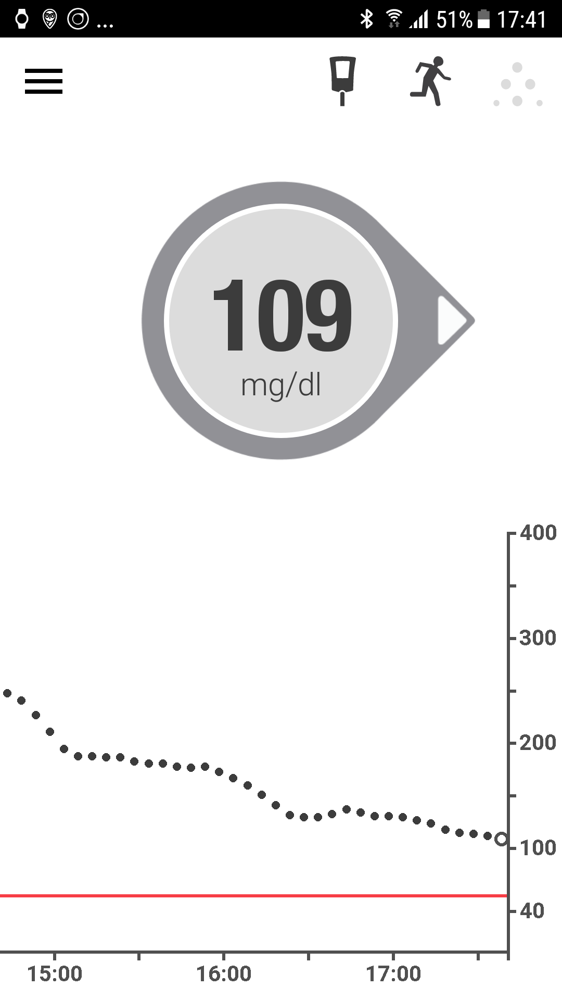

# Sample setup: Samsung S7, DanaR, Dexcom G5 and Sony Smartwatch

## Description

In this setup, the Samsung Galaxy S7 smartphone is used as control center of the loop. The slightly modified Dexcom App reads glucose values from the Dexcom G5 CGM. AndroidAPS is used to control the Dana R insulin pump from Korean manufacturer SOOIL via bluetooth. Further devices are not required.

Protože Dexcom aplikace nabízí pouze omezené možnosti alarmů, použijeme open source aplikaci xDrip+, která umí nastavit kromě alarmů vysoké a nízké glykémie také další alarmy přizpůsobené individuálním požadavkům.

Hodinky s WearOS lze použít (v tomto příkladu Sony Smartwatch 3 (SWR50)), volitelně k zobrazení glykémie a hodnot AndroidAPS na vašem zápěstí. Hodinky lze dokonce použít k ovládání AndroidAPS (např. diskrétní poslání bolusu k jídlu).

Systém pracuje offline. To znamená, že pro ovládání není třeba datové připojení telefonu k internetu.

Nicméně, data se automaticky nahrají do Nightscoutu, jakmile je navázáno datové připojení. Nahráním dat do Nightscoutu získáte kompletní výkazy, které využijete například při návštěvě lékaře nebo můžete sdílet aktuální hodnoty s členy rodiny. Data do Nightscoutu (abyste mohli využívat různé Výkazy) lze také pouze prostřednictvím (předdefinovaného) Wi-Fi připojení.

## Požadované součásti

1. Samsung Galaxy S7
    
    * Alternativy: viz [seznam testovaných telefonů a hodinek](https://docs.google.com/spreadsheets/d/1gZAsN6f0gv6tkgy9EBsYl0BQNhna0RDqA9QGycAqCQc/edit#gid=698881435) pro AndroidAPS

2. inzulinová pumpa [DanaR](http://www.sooil.com/eng/product/) nebo Dana RS
    
    * Alternativy: 
    * [Accu-Chek Combo](../Configuration/Accu-Chek-Combo-Pump.md)
    * Další pumpy mohou být k dispozici v budoucnu, podrobnosti viz [budoucí možné ovladače pumpy ](Future-possible-Pump-Drivers.md).

3. [Dexcom G5](https://dexcom.com)
    
    * Alternativy: viz seznam možných [zdrojů glykémie](../Configuration/BG-Source.md)

4. Volitelné: Sony Smartwatch 3 (SWR50)
    
    * Alternativy: viz [seznam testovaných telefonů a hodinek](https://docs.google.com/spreadsheets/d/1gZAsN6f0gv6tkgy9EBsYl0BQNhna0RDqA9QGycAqCQc/edit#gid=698881435) pro AndroidAPS (OS musí být Wear OS)

## Příprava Nightscoutu

Podrobné [Nastavení Nightscoutu](../Installing-AndroidAPS/Nightscout.md)

## Nastavení počítače

Abyste byli schopni vytvořit aplikaci pro Android z volně dostupných otevřených zdrojových kódu AAPS, potřebujete Android Studio nainstalované na svém počítači nebo notebooku (Windows, Mac, Linux). Podrobné instrukce naleznete v části [Vytvoření APK](../Installing-AndroidAPS/Building-APK.md).

Při instalaci Android Studia buďte trpěliví, software potřebuje stáhnout spoustu dodatečných dat (balíčků) po nainstalovaní do počítače.

## Nastavení telefonu

### Zkontrolujte firmware telefonu

* Nabídka > Nastavení> Info o telefonu > Info o softwaru: Je potřeba alespoň „Android-verze 7.0“ (úspěšně testované do Android verze 8.0.0 Oreo - Samsung Experience verze 9.0) 
* Chcete-li aktualizovat firmware: Nabídka > Nastavení > Aktualizace softwaru

### Povolit instalaci aplikací z neznámých zdrojů

Nabídka > Nastavení> Zabezpečení > Neznámé zdroje > přepněte doprava (= aktivní)

Z bezpečnostních důvodů by toto nastavení mělo být nastaveno zpět na neaktivní po dokončení instalace všech aplikací, které jsou popsané zde.

### Zapněte Bluetooth

1. Nabídka > Nastavení > Připojení > Bluetooth > přepnout doprava (= aktivní)
2. Nabídka > Nastavení > Připojení > Umístění > přepnout doprava (= aktivní)

Služby určování polohy (dále jen „GPS“) musí být aktivovány, aby Bluetooth správně fungovalo.

### Nainstalujte aplikaci Dexcom (upravená verze)

Původní aplikace Dexcom z obchodu Google Play nebude fungovat, protože nevysílá hodnoty do jiné aplikace. Proto je vyžadována verze mírně upravená komunitou. Pouze tato upravená Dexcom aplikace může komunikovat s AAPS. Navíc lze použít upravenou Dexcom aplikaci se všemi Android telefony a ne jen s těmi v [seznamu kompatibilních zařízení s Dexcom](https://www.dexcom.com/dexcom-international-compatibility). Verze upravené aplikace Dexcom v mmol/l a mg/dl jsou k dispozici na https://github.com/dexcomapp/dexcomapp?files=1.

To do this perform the following steps on your smartphone:

1. If the original Dexcom app is already installed: 
    * Stop sensor
    * Uninstall app via Menu > Settings > Apps > Dexcom G5 Mobile > Uninstall
2. Download modified Dexcom app (check unit mg/dl or mmol/l according to your needs): <https://github.com/dexcomapp/dexcomapp?files=1>
3. Install modified Dexcom app on your smartphone (= select the downloaded APK file)
4. Start modified Dexcom app, activate/calibrate the sensor according to the given instructions and wait until the warm-up phase is finished.
5. Once the first two calibrations have been entered successfully and the modified Dexcom app shows actual glucose value setup the warnings (hamburger menu on top left side of the screen) as follows: 
    * Urgent low `55mg/dl` / `3.1mmol/l` (cannot be disabled)
    * Low `OFF`
    * High `OFF`
    * Rise rate `OFF`
    * Fall rate `OFF`
    * Signal loss `OFF`

## Install AndroidAPS

1. Follow the instructions to [build the APK](../Installing-AndroidAPS/Building-APK#generate-signed-apk)
2. [Transfer](../Installing-AndroidAPS/Building-APK#transfer-apk-to-smartphone) the generated APK to your phone
3. [Configure AndroidAPS](../Configuration/Config-Builder.md) according to your needs using the setup assistant or manually
4. In this sample setup we used (among others)

* BG source: `Dexcom G5 App (patched)` -- click cock-wheel and activate `Upload BG data to NS` and `Send BG data to xDrip+` (see [BG source](../Configuration/BG-Source.md)

* NS Client activated (see [NS Client](../Configuration/Config-Builder#ns-profile) and [Nightscout setup](../Installing-AndroidAPS/Nightscout.md))

## Install xDrip+

xDrip+ is another mature open source app that offers countless possibilities. In this setup, contrary to what the developers first wrote the app for, xDrip+ is not used to collect glucose data from the Dexcom G5, but only to output alarms and to display the current glucose value including the curve on the Android home screen in the widget. With xDrip+ the alarms can be set much more individually than with the Dexcom software, AAPS or Nightscout (no limitation in the selection of sounds, different alarms depending on day/night time etc.).

1. Download the latest stable APK version of xDrip+ with your smartphone <https://xdrip-plus-updates.appspot.com/stable/xdrip-plus-latest.apk> - not the version from the Google Play Store!
2. Install xDrip+ by selecting the downloaded APK file.
3. Start xDrip+ and make the following settings (hamburger menu at top left) 
    * Settings > Alarms and Alerts > Glucose Level Alert List > Create Alerts (high and low) according to your needs. 
    * The existing alarms can be changed with a long press on the alarm.
    * Settings > Alarms and Alerts > Calibration Alerts: disabled (reminded via the modified Dexcom app)
    * Settings > Hardware Data Source > 640G/EverSense
    * Settings > Inter-app settings > Accept Calibrations > `ON`
    * Menu > Start sensor (is only "pro forma" and has nothing to do with the running G5 sensor. This is necessary otherwise an error message will appear regularly.) 

### Example of an alarm setup

The "Urgent low alarm" (below 55 mg/dl resp. 3,1 mmol) is a standard alarm from the modified Dexcom app that cannot be disabled.

Tip for meetings / church visits / cinema etc..:

If "Do not disturb" mode is activated in the Samsung Galaxy S7 (Menu > Settings > Sounds and vibration > Do not disturb: slider to right side (= active)), the phone only vibrates during urgent low alarm and does not issue an acoustic warning. For the other alarms set up via xDrip+ you can select whether the silent mode should be ignored (acoustic sound played) or not.

## Disable power saving option

On your Samsung Galaxy S7 go to Menu > Settings > Device Maintenance > Battery > Unmonitored Apps > + Add apps: Select the apps AndroidAPS, Dexcom G5 Mobile, xDrip+ and Android Wear (if smartwatch is used) one after the other

## Optional: Setup Sony Smartwatch 3 (SWR50)

With an Android Wear smartwatch life with diabetes can be made even more inconspicuous. The watch can be used to display the current glucose level, the status of the loop etc. on the wrist. The watch can even be used to control AndroidAPS (i.e. discreetly set a meal bolus). To do this, double tap the CGM value of the AAPSv2 watchface. The SWR50 usually runs for a full day until the battery needs to be recharged (same charger as the Samsung Galaxy S7: microUSB).

Details about the information displayed on the watchface can be found [here](../Configuration/Watchfaces.md).

* Install the app "Android Wear" on your smartphone via the Google Play Store and connect the smartwatch according to the instructions there.
* In AAPS choose hamburger menu (top left corner) > Config Builder > General (at the bottom of the list) > Wear > activate on left side, click cock wheel > Wear settings and activate `Controls from Watch`
* On your smartwatch: Long press display to change watchface and select `AAPSv2`
* If necessary restart both devices once.

## Pump setup

see [DanaR pump](../Configuration/DanaR-Insulin-Pump.md)