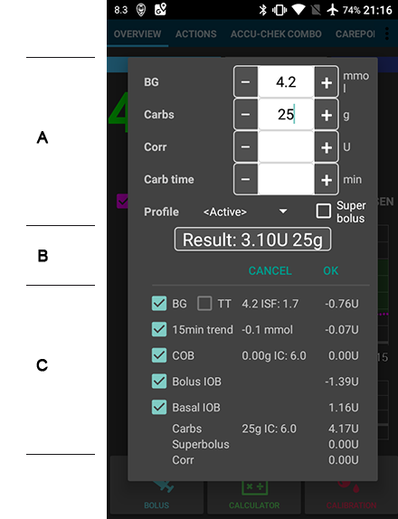
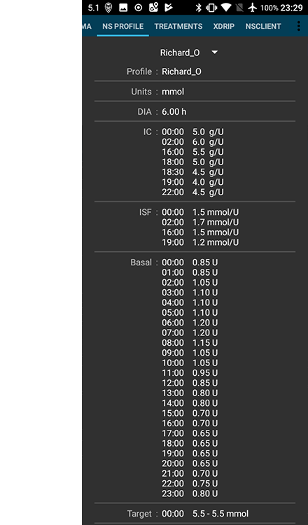

# Snímky obrazovky

## Hlavní stránka

Toto je první obrazovka, na kterou narazíte, když spustíte aplikaci AndroidAPS. Obsahuje většinu informací, které budete potřebovat každý den.

**Sekce A:** umožňuje vám navigaci mezi různými moduly AndroidAPS tažením prstu (swipe) doleva nebo doprava.

**Sekce B:** umožňuje přepínat stav smyčky (otevřená smyčka, uzavřené smyčka, pozastavená smyčka atd.), zjistit si váš aktuální profil, zjistit si aktuální cíl glykemie a nastavit dočasný cíl. Podržte prst dlouze na některém z tlačítek pro změnu nastavení. Tj. dlouze držte prst na cílovém modrém poli v horní pravé části ("5,5" na snímku), abyste nastavili dočasný cíl.

**Sekce C:** poslední glykemie z vašeho senzoru CGM, kolik času uplynulo od posledního čtení, změna za posledních 15 a 40 minut, vaše aktuální bazální dávka - včetně jakékoliv dočasné bazální dávky (DBD) naprogramované systémem, množství aktivního inzulínu (IOB) a množství aktivních sacharidů (COB).

Volitelné [stavové indikátory](../Configuration/Preferences.md) (CAN | INS | RES | SEN | BAT) poskytují vizuální upozornění na nízký stav zásobníku, vybitou baterie nebo nadměrné stáří kanyly.

Ukazatel aktivního inzulínu by měl být nula, pokud běží pouze váš standardní bazál a žádný z předchozích bolusů už nemá aktivní zůstatek. Čísla v závorkách ukazují, kolik z celku tvoří inzulín z předchozích bolusů a kolik tvoří navýšení/ponížení bazálu naprogramované aplikací AAPS. Tato druhá část může být i záporná, pokud předcházela období se sníženým bazálem.

**Sekce D:** Klepnutím na šipku na pravé straně obrazovky v sekci D můžete vybrat, které informace se mají zobrazit v grafu níže.

**Sekce E:** Graf, který ukazuje vaši glykémii načtenou z vašeho senzoru (CGM). V grafu se zobrazují rovněž oznámení Nightscoutu jako kalibrace z prstu nebo zaznamenané sacharidy. Dlouhým přidržením prstu na grafu změníte časové měřítko. Můžete si vybrat 6, 8, 12, 18 nebo 24 hodin.

Prodloužené linky ukazují predikce glykémie a trendy, pokud jste je zvolili.

    * Oranžová linka: COB (barva se používá obecně k zobrazení COB a sacharidů)
    * Tmavě modrá linka: IOB (barva se používá k zobrazení IOB a inzulinu)
    * světle modrá linka: bazály
    * tmavě žlutá čára: UAM
    

Tyto linky ukazují různé predikce založené na aktuální rychlosti absorpce sacharidů (COB); samotném inzulinu (IOB); ukazují, za jak dlouho se glykémie dostane do cílového rozsahu nebo nad něj, pokud by odchylky najednou zmizely a my jsme mezitím měli vypnutý bazál (zero-temp) a efekt/detekci neoznámeného jídla, u kterého byly detekovány sacharidy, ale nebyly uživatelem zaznamenány do systému (UAM).

Modrá linka ukazuje dávkování bazálního inzulínu vaší pumpou. Tečkovaná modrá linka je úroveň bazální dávky, jaká by byla vydávána za normálních okolností, kdyby nebyla navýšená/ponížená pomocí dočasné bazální dávky (DBD) a plná modrá linka je aktuální dávkování v průběhu času.

**Sekce F:** Tato sekce je také konfigurovatelná volbami ze sekce D. Na tomto snímku ukazujeme IOB (aktivní inzulín v těle) – kdyby zde nebyly žádné DBD a žádný zbývající inzulín z bolusů, pak by IOB byl nula. Na snímku se také zobrazuje citlivost a odchylka. ŠEDÉ pruhy zobrazují odchylky kvůli sacharidům, ZELENÉ pruhy ukazují, že glykémie je vyšší, než algoritmus očekával, a ČERVENÉ pruhy signalizují, že je glykémie nižší, než bylo očekáváno.

**Sekce G:** Tato sekce umožňuje podávat bolusy (obvykle byste k tomu použili tlačítko Kalkulačka) a ke vkládání kalibrace CGM pomocí měření z prstu.

## Kalkulačka

Když se chystáte odesílat bolus k jídlu, dobře se k tomu hodí funkce kalkulačka.

**Sekce A:** Zde se vyplňují údaje o bolusu, který se chystáte odeslat. Pole „Glykémie“ bývá automaticky předvyplněné poslední naměřenou hodnotou ze senzoru. Pokud právě nemáte senzor v provozu, pak bude pole prázdné. Do pole „Sacharidy“ vkládáte odhadované množství sacharidů (nebo ekvivalentní hodnotu), ke kterému chcete poslat bolus. Pole „Korekce“ slouží k navýšení/snížení výsledné dávky inzulínu z jakéhokoliv důvodu a „Čas jídla“ slouží k předsazení bolusu tak, abyste systému řekli, že mezi bolusem a konzumací jídla bude udaná prodleva. Můžete zde zadat i záporné číslo, pokud později dopichujete bolus k již dříve zkonzumovaným sacharidům.

SUPERBOLUS je funkce, kdy je k dávce okamžitého bolusu přičtený bazální inzulín za následující dvě hodiny a zároveň je na pumpě nastavená dočasná bazální dávka 0 % na dvě hodiny, aby se tak vyrovnalo celkové množství inzulinu, který již byl vydán při superbolusu. Cílem je dodat inzulín dřív, aby se snížil kopec, který na grafu glykémie obvykle následuje.

**Sekce B:** Zobrazuje vypočtený bolus. Pokud množství již aktivního inzulínu v krvi převyšuje vypočtený bolus, pak se jen zobrazí doporučené množství sacharidů k jeho pokrytí.

**Sekce C:** Zobrazuje různé hodnoty, které byly použity k výpočtu bolusu. Můžete zrušit označení všech, které se vám nehodí, ale normálně by k tomu neměl být důvod.

<b>Kombinace COB a IOB a jejich význam</b>

<ul>
    <li>Pokud vyberete COB a IOB, budou při výpočtu zohledněny nestrávané sacharidy, které již nejsou pokryty inzulinem + veškerý inzulin, který byl dodán jako DBD nebo SMB.</li>
    <li>Pokud vyberete COB bez IOB, riskujete vydání příliš velkého množství inzulinu, protože AAPS nebude brát v potaz inzulin, který již byl vydán. </li>
    <li>Pokud vyberete IOB bez COB, AAPS bude zohledňovat již vydaný inzulin, ale nezapočítá žádné zkonzumované sacharidy, které dosud nejsou stráveny. To vede k oznámení o 'chybějících sacharidech'.
</ul>

V případě, že chcete vydat další bolus krátce po podání bolusu k jídlu (např. když si přidáte zákusek), je užitečné zrušit označení všech těchto políček. Tak lze přidat pouze nově zkonzumované sacharidy, jelikož hlavní jídlo dosud nemusí být stráveno, takže IOB krátce po bolusu k jídlu nebude přesně odpovídat množství COB.

## Inzulínový profil

Zde se zobrazuje profil aktivity pro inzulín, který jste vybrali. FIALOVÁ linka ukazuje, jaké množství inzulínu průběžně v čase zůstává od aplikace po úplné rozložení, a MODRÁ linka ukazuje, nakolik je v čase aktivní.

Obvykle budete používat jeden z profilů Oref – a nezapomeňte na důležitou věc, a sice, že rozpad inzulínu má „dlouhý ocas“. Pokud jste byli zvyklí na ruční podávání inzulínu, pravděpodobně jste předpokládali, že inzulín se bude postupně spotřebovávat asi 3,5 hodiny. Avšak pokud používáte smyčku, tak na zbytkovém inzulínu (na onom „ocasu“) záleží. Pokud s ním totiž počítáte, výsledné výpočty jsou mnohem přesnější. Zvláště patrné je to v rekurzivním výpočtu algoritmu AndroidAPS, když se počítá řada malých zbytků inzulínu.

Podrobnější informace o různých typech inzulínu, o jejich profilech aktivity a o tom, proč je to vše důležité, najdete v článku [Understanding the New IOB Curves Based on Exponential Activity Curves](https://openaps.readthedocs.io/en/latest/docs/While%20You%20Wait%20For%20Gear/understanding-insulin-on-board-calculations.html#understanding-the-new-iob-curves-based-on-exponential-activity-curves)

A také si o tom můžete přečíst výborný článek blogu zde: [Why we are regularly wrong in the duration of insulin action (DIA) times we use, and why it matters…](http://www.diabettech.com/insulin/why-we-are-regularly-wrong-in-the-duration-of-insulin-action-dia-times-we-use-and-why-it-matters/)

A ještě více na: [Exponential Insulin Curves + Fiasp](http://seemycgm.com/2017/10/21/exponential-insulin-curves-fiasp/)

## Stav pumpy

Zde vidíme stav inzulínové pumpy – v tomto případě Accu-Chek Combo. Zobrazené informace nepotřebují další vysvětlení. Dlouhý stisk tlačítka HISTORIE spustí čtení dat z historie pumpy, včetně bazálního profilu. Ale pamatujte, že na pumpě Combo je podporován pouze jeden bazální profil.

## Péče

Zde jsou replikované funkce, které najdete na obrazovce Nightscoutu pod symbolem „+“ a které vám umožní přidávat poznámky k záznamům. Funkce jako např. poznačení, že jste vyměnili kanylu nebo zásobník s inzulinem, by měly být samovysvětlující. Je však důležité si zapamatovat, že tato sekce NEODESÍLÁ žádné příkazy do pumpy. Takže pokud zadáte bolus na této obrazovce, tak se o tom prostě jenom zapíše záznam do Nightscoutu, ale pumpa žádný bolus nepošle.

## Smyčka, MA, AMA, SMB

Obvykle se těmito kartami nemusíte zatěžovat, zobrazují podrobné výsledky algoritmu OpenAPS, který se spouští pokaždé, kdy systém obdrží nová data ze senzoru CGM. Detaily naleznete v jiné dokumentaci.

## Profil

AndroidAPS umí fungovat s různými konfiguracemi profilů. Obvykle – jak je znázorněno zde – je do aplikace stažený Nightscoutový profil přes vestavěný Nightscout klient a zde zobrazený profil je pak pouze pro čtení. Pokud chcete v profilu provést jakékoliv změny, musíte to nejdřív udělat na internetových stránkách Nightscoutu a pak je třeba provést „Přepnutí profilu“ ve vaší AndroidAPS aplikaci, aby se vynutilo opětovné stažení profilu. Údaje jako bazální profil pak budou automaticky zkopírované přímo do vaší pumpy.

**DIA:** znamená trvání účinku inzulinu a je popsané výše v části o inzulínových profilech.

**IC:** je inzulino-sacharidový poměr. Tento poměr se může v průběhu dne různě měnit.

**ISF:** je citlivost na inzulin – hodnota, o kterou jedna jednotka inzulínu sníží glykémii, a to za předpokladu, že se nic jiného nemění.

**Bazál:** je bazální profil naprogramovaný do vaší pumpy.

**Cíl:** je hodnota glykémie, ke které má aplikace po celou dobu směřovat. Pokud chcete, můžete nastavit různé hodnoty pro různé části dne, a dokonce můžete stanovit horní a dolní hranici, takže aplikace začne provádět opatření jenom tehdy, pokud se odhadovaný průběh glykémie dostane mimo stanovený rozsah. V případě, že zvolíte rozsah hodnot, však bude systém reagovat pomaleji a glykémie se vám bude srovnávat hůř.

## Ošetření, xDrip, NSClient

Toto jsou jednoduše záznamy ošetření (bolusy a sacharidy), zprávy xDripu a zprávy odesílané do Nightscoutu prostřednictvím zabudovaného interního Nightscout klienta. Dokud nemáte nějaký problém, obvykle nebývá nutné se o žádnou z těchto karet starat.

## Konfigurace

Toto je místo, kde se provádí základní nastavení vašeho systému AndroidAPS. Uvedený snímek ukazuje docela typické nastavení: pumpa Combo, senzor Dexcom G5 spravovaný přes xDrip+, inzulin NovoRapid, profil Oref a připojení k Nightscout serveru v cloudu.

Zaškrtnutí políčka vpravo určuje, že daný modul se bude zobrazovat v horní liště s nabídkami (viz sekce A na Hlavní obrazovce) a ikona s ozubeným kolečkem zpřístupňuje nastavení daného modulu, pokud jsou nějaká k dispozici.

## Nastavení a předvolby

Vpravo nahoře na navigační liště se nacházejí tři malé tečky pod sebou. Jejich stisknutím otevřete nastavení, prohlížeč historie, průvodce nastavením, informace o aplikaci a tlačítko Konec pro ukončení aplikace.