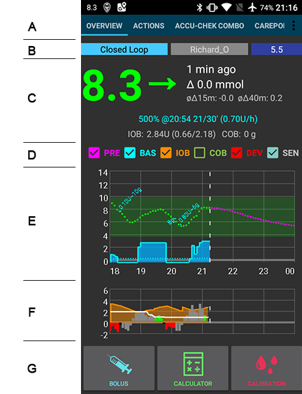

# Rozumíme obrazovkám AndroidAPS

## Hlavní stránka

Toto je první obrazovka, na kterou narazíte, když spustíte aplikaci AndroidAPS. Obsahuje většinu informací, které budete potřebovat každý den.

Sekce A: umožňuje vám navigaci mezi různými moduly AndroidAPS tažením prstu (swipe) doleva nebo doprava.

Sekce B: umožňuje přepínat stav smyčky (otevřená smyčka, uzavřené smyčka, pozastavená smyčka atd.), zjistit si váš aktuální profil, zjistit si aktuální cíl glykemie a nastavit dočasný cíl. Podržte prst dlouze na některém z tlačítek pro změnu nastavení. Tj. dlouze držte prst na cílovém modrém poli v horní pravé části ("5,5" na snímku), abyste nastavili dočasný cíl.

Sekce C: poslední glykemie z vašeho senzoru CGM, kolik času uplynulo od posledního čtení, změna za posledních 15 a 40 minut, vaše aktuální bazální dávka - včetně jakékoliv dočasné bazální dávky (DBD) naprogramované systémem, množství aktivního inzulínu (IOB) a množství aktivních sacharidů (COB).

Ukazatel aktivního inzulínu by měl být nula, pokud běží pouze váš standardní bazál a žádný z předchozích bolusů už nemá aktivní zůstatek. Čísla v závorkách ukazují, kolik z celku tvoří inzulín z předchozích bolusů a kolik tvoří navýšení/ponížení bazálu vzhledem k DBD naprogramované aplikací AAPS. Tato druhá část může být i záporná, pokud předcházela období se sníženým bazálem.

Sekce D: zde si můžete vybrat, které informace se mají zobrazovat v grafu níže.

Sekce E: graf, který zobrazuje stav glukózy ve vaší krvi, jak byla přečtena vaším senzorem (CGM). V grafu se také zobrazují oznámení Nightscoutu, např. kalibrace z prstu a vstupy sacharidů. Fialová linka ukazuje předpovídaný trend glukózy - pokud se má zobrazovat.

Modrá linka ukazuje dávkování bazálního inzulínu vaší pumpy. Tečkovaná modrá linka je úroveň bazální dávky, jaká by byla za normálních okolností, kdyby nebyla navýšená/ponížená pomocí dočasné bazální dávky (DBD) a plná modrá linka je aktuální dávkování v průběhu času. Dlouze držte prst na grafu, abyste na něm změnili časové měřítko. Můžete si vybrat 6, 8, 12, 18 nebo 24 hodin.

Sekce F: je také konfigurovatelná volbami ze sekce D. Na tomto snímku ukazujeme IOB (aktivní inzulín v těle) - kdyby zde nebyly žádné DBD a žádné zůstatky inzulínu z bolusů, pak by IOB bylo nula. Dále se na snímku ukazuje citlivost a odchylka. ŠEDÉ pruhy zobrazují odchylky kvůli sacharidům, ZELENÉ pruhy ukazují, že glykémie je vyšší, než očekával algoritmus, a ČERVENÉ pruhy signalizují, že je glykémie nižší, než bylo očekáváno.

Sekce F: umožňuje podávání bolusu (obvykle k tomu použijete tlačítko Kalkulačka) a ke vkládání kalibrace CGM měřením glykémie z prstu.

## Kalkulátor

Když se chystáte odesílat bolus k jídlu, dobře se k tomu hodí funkce kalkulátor.

Sekce A: zde se vyplňují údaje o bolusu, který se chystáte odeslat. Políčko "Glykémie" bývá automaticky předvyplněné poslední naměřenou hodnotou ze senzoru. Pokud právě nemáte senzor v provozu, pak bude pole prázdné. Do políčka "Sacharidy" vkládáte odhadované množství sacharidů (nebo ekvivalentní hodnotu), ke kterým chcete poslat bolus. Pole "Korekce" slouží k navýšení/snížení výsledné dávky inzulín z jakéhokoliv důvodu a "Čas jídla" slouží k předsazení bolusu tak, abyste systému řekli, že mezi bolusem a konzumací jídla bude udaná prodleva. Můžete zde zadat i záporné číslo, pokud později dopichujete bolus k dříve zkonzumovaným sacharidům.

SUPERBOLUS je funkce, kdy je k dávce okamžitého bolusu přičtený bazální inzulín za následující dvě hodiny a zároveň je pumpě nastavená dočasná bazální dávka 0% na dvě hodiny, aby se tak vybalancoval zpět extra podaný inzulín. The idea is to deliver the insulin sooner and hopefully reduce spikes.

Section B: shows the calculated bolus. If the amount of insulin on boead already exceeds the calculated bolus then it will just display the amount of carbs still required.

Section C: shows the various elements that have been used to calculate the bolus. You can deselect any that you do not want to include but you normally wouldn't want to.

## Insulin Profile

This shows the activity profile of the insulin you have chosen. The PURPLE line shows how much insulin remains after it has been injected as it decays with time and the BLUE line shows how active it is.

You will normally be using one of the Oref profiles - and the important thing to note is that the decay has a long tail. If you have been used to manual pumping you have probably been used to assuming that insulin decays over about 3.5 hours. However, when you are looping the long tail matters as the calculations are far more precise and these small amounts add up when they are subjected to the recursive calculations in the AndroidAPS algorithm.

For a more detailed discussion of the different types of insulin, their activity profiles and why all this matters you can read an article here on [Understanding the New IOB Curves Based on Exponential Activity Curves](https://openaps.readthedocs.io/en/latest/docs/While%20You%20Wait%20For%20Gear/understanding-insulin-on-board-calculations.html#understanding-the-new-iob-curves-based-on-exponential-activity-curves)

And you can read an excellent blog article about it here: [Why we are regularly wrong in the duration of insulin action (DIA) times we use, and why it matters…](http://www.diabettech.com/insulin/why-we-are-regularly-wrong-in-the-duration-of-insulin-action-dia-times-we-use-and-why-it-matters/)

And more at: [Exponential Insulin Curves + Fiasp](http://seemycgm.com/2017/10/21/exponential-insulin-curves-fiasp/)

## Pump Status

Here we see the status of the insulin pump - in this case an Accu-Chek Combo. The information displayed is self explanatory. A long press on the HISTORY button will read the data from your pump history, including your basal profile. But remember only one basal profile is supported on the Combo pump.

## Care Portal

This replicates the functions you will find on your Nightscout screen under the "+" symbol which allows you to add notes to your records. Functions such as recording when you change a pump site, or insulin cartridge should be self explanatory. BUT this section does not issue any commands to your pump. So if you add a bolus using this screen it simply makes a note of this on your Nightscout record, the pump won't be instructed to deliver a bolus.

## Loop, OpenAPS AMA

You don't normally need to worry about these, they show the results of the OpenAPS algorithm which runs each time the system gets a fresh reading from the CGM. These are discussed elsewhere.

## Profile

AndroidAPS can run using a number of different profile configuratons. Typically - as shown here - the Nightscout profile has been downloaded via the built in Nighscout client and is displayed here in read-only form. If you wanted to make any changes you would do this from your Nightscout user interface and then do a "Switch Profile" on your AndroidAPS rig to refresh the download. Data such as the basal profile would then be automatically copied over to your pump.

DIA: stands for Duration of Insulin Action and it is discussed above in the section on insulin profiles.

IC: is Insulin to Carb ratio. This profile has a number of different values set for different times of day.

ISF: is Insulin Sensitivity Factor - the amount by which one unit of insulin will reduce your blood glucose assuming that nothing else changes.

Basal: is the basal profile programmed into your pump.

Target: is the blood glucose level that you want the rig to be aiming for all the time. You can set different levels for differenttimes of day if you wish, and you can even set an upper and lower range so that the rig will only start to make changes when the predicted blood glucose value falls outside, but if you do that then the rig will respond more slowly and you are unlikely to achieve such stable blood sugars.

## Treatment, xDrip, NSClient

These are simply logs of treatments (boluses and carbs), xDrip messages and messages sent to Nightscout via the built-in Nightscout client. You don't normally need to worry about any of these unless there is a problem.

## Config Builder

This is where you will set up the configuraton of your AndroidAPS rig. This screenshot shows a pretty typical rig using a Combo pump, a Dexcom G5 CGM sensor being managed via xDrip+ and running with NovoRapid insulin on an Oref profile and connected to a Nightscout cloud based server.

The tick box on the right determines if that particular module will be displayed in the top menu bar (see section A at Homescreen) and the small gear wheel symbol allows access to the setting for that module, if there are any.

## Settings and Preferences

At the top right of the navigation bar you will find three small vertical dots. Pressing on these takes you to the app's preferences and settings, and emables you to export your settings if ever you need to transfer to a different rig. These are discussed elsewhere in the wiki.