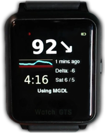

# Smartwatches and AAPS

Various smartwatches can be used to display some of the information available in **AAPS** or perform remote actions.

Having a smartwatch directly control **AAPS** (pump and sensor) is achieved using full Android watches (that are considered like small [smartphones](./Phones.md)).

Some smartwatches can allow you to enter treatments, or more, but with the phone itself still managing **AAPS**.

Chytré hodinky se začínají stále více používat s **AAPS** aplikací, a to jak pro dospělé pacienty s cukrovkou, tak pro pečovatele/rodiče dětí s cukrovkou.

## Obecné výhody používání chytrých hodinek s **AAPS**


Chytré hodinky, v závislosti na modelu, mohou být s **AAPS** využity mnoha různými způsoby. Mohou být využity k úplnému nebo částečnému ovládání **AAPS** nebo jednoduše ke vzdálené kontrole glykémií, aktivního inzulínu a dalších parametrů.

Integrace chytrých hodinek s **AAPS** může být užitečná v mnoha situacích, včetně řízení auta, motocyklu, kola nebo během cvičení. Some people feel that looking at a watch (in a meeting, party, dinner table etc.) is more discrete than looking on a phone. Z hlediska bezpečnosti, chytré hodinky mohou být přínosem na cestách, kdy uživateli umožňují mít jeho **AAPS** telefon uložen z dohledu (například v tašce), ale přitom pod vzdálenou kontrolou prostřednictvím hodinek.

## Specifické výhody pro rodiče/pečovatele používající **AAPS**

Pro dítě - pokud je jejich **AAPS** telefon poblíž - může pečovatel využít chytré hodinky k dohledu a úpravám bez nutnosti použít přímo **AAPS** telefon. To může být užitečné, například pokud je **AAPS** telefon uložený v páse pumpy.

A smartwatch can be used either _in addition_ to, or as an _alternative_ to the PHONE-based options for remote control or [following only](../RemoteFeatures/FollowingOnly.md).

Additionally, unlike parent/caregiver follower phones (which rely on the mobile network or Wi-Fi connection), Bluetooth connected smartwatches can be useful in remote locations, like a cave, in a boat, or half-way up a mountain. Pokud jsou obě zařízení (**AAPS** telefon a chytré hodinky) na stejné wifi síti, mohou ji také využívat.

## Různé druhy interakcí chytrých hodinek a AAPS

Aktuálně existuje pět základních způosobů, jak využít chytré hodinky ve spojení s **AAPS**. Ty jsou uvedeny v následující tabulce: 

| Watch Setup         | Features                            | Požadavky                                                                                                                                                                                                                                             |
| ------------------- | ----------------------------------- | ----------------------------------------------------------------------------------------------------------------------------------------------------------------------------------------------------------------------------------------------------- |
| Standalone          | AAPS without a phone                | Full Android smartwatch (check min Android)</br> Running **app-fullRelease**                                                                                                                                                                          |
| Full remote control | Most AAPS functions                 | Android **Wear OS** watch (check Android/API)</br>Running **wear-fullRelease**                                                                                                                                                                        |
| Remote control      | AAPSClient functions                | Android **Wear OS** watch (check Android/API)</br>Running **[wear-aapsclientRelease](https://github.com/nightscout/AndroidAPS/releases)**                                                                                                             |
| Remote control      | Some AAPSClient functions           | Some Samsung, Fitbit and Garmin watches</br>See below.                                                                                                                                                                                                |
| Display             | Display some AAPSClient indications | Many smartwatches (see [here](https://bigdigital.home.blog/))</br>[xDrip+](https://github.com/nightscoutfoundation/xdrip/releases) and [WatchDrip+](https://bigdigital.home.blog/2022/06/16/watchdrip-a-new-application-for-xdrip-watch-integration/) |

## Než si koupíte smartwatch…

Přesný model chytrých hodinek, který kupujete, závisí na požadovaných funkcích. You may find useful information on the [Phones page](#Phones-list-of-tested-phones), including a list a tested phones that also contains some smartwatches.

Mezi oblíbené značky patří Samsung Galaxy, Garmin, Fossil, Mi a Fitbit. The different options summarized in the Table above are explained in more detail below, to help you decide which smartwatch is right for your situation.

Pokud chcete integrovat chytré hodinky s **AAPS** na telefonu s úmyslem vzdáleně **AAPS** ovládat, musíte také vzít do úvahy jestli jsou spolu obě zařízení kompatibilní, zejména pokud máte starší nebo neobvyklý telefon.

Obecně platí, že pokud chcete pouze sledovat hodnoty glykémie a nepotřebujete **AAPS** z hodinek ovládat, existuje široká škála jednodušších dostupných hodinek, které můžete použít.

Nejlepší způsob, jak vybrat chytré hodinky, je hledat v příspěvcích "hodinky" buď na Discordu nebo na Facebookových **AAPS** skupinách. Přečtěte si o zkušenostech ostatních a pokud to nezodpoví vaše dotazy, zanechte zde konkrétní otázku.

## Full Android

Zní to jako atraktivní možnost, že? V současné době však pouze několik nadšenců experimentuje s **AAPS** na hodinkách samostatně. Existuje omezené množství typů chytrých hodinek s dostatečně velkým ciferníkem a zároveň správně fungujících s **AAPS** a CGM aplikací. Popular models include the LEMFO LEM. Hodinky budete muset startovat s plnou verzí **AAPS** aplikace (full.apk, která se obvykle používá na telefonech) namísto **AAPS** "wear" apk.

Protože neexistuje specifikace, podle které by šlo určit, které hodinky jsou vhodné pro samostatný provoz **AAPS**, tyto parametry mohou pomoct:

1)  Android 11 or newer. 2) Je schopen použít ciferník v režimu „čtverec“, aby byl text větší a snadněji čitelný. 3) Velmi dobrá životnost baterie. 4)  Good Bluetooth range.

Většina frustrace ze samostatného provozu **AAPS** na hodinkách pramení z práce s maličkou obrazovkou a z faktu, že plná AAPS aplikace nebyla navržena pro zobrazení na hodinkách. Práce s rozhraním **AAPS** na hodinkách může být kvůli omezené velikosti orazovky pohodlnější se stylusem. Z těchto důvodů ani nemusí být některá tlačítka <0>AAPS</0> na obrazovce viditelná.

Další výzvy spočívají v tom, že je těžké mít dostatečnou kapacitu baterie, a hodinky s dostatečnou baterií jsou často objemné a tlusté. Users report fighting with the OS and power-saving settings, difficulty in starting sensors on the watch, poor Bluetooth range (for maintaining connection with both the sensor and pump) and questionable water resistance. Examples are shown in the photos below.


Pokud máte zájem o nastavení samostatných hodinek, přečtěte si příspěvky ve Facebookové **AAPS** skupině (je dobré vyhledat výrazy "standalone" a "Lemfo") a na Discordu.

## Wear OS

**AAPS** code contains an app extension that can be installed on [**Wear OS** smartwatches](https://wearos.google.com/#oem-carousel).


Verify your smartwatch satisfies **AAPS** [prerequisites](#maintenance-android-version-aaps-version).

### What _is_ Wear OS?

První tři možnosti chytrých hodinek vyžadují, aby měly instalovaný **Wear OS**.

**Wear OS** je operační systém, který běží na některých moderních chytrýích hodinkách Android. Pokud je v popisu chtrých hodinek informace pouze o _kompatibilitě_ s Android nebo iOS, neznamená to, že běží na WearOS. Může se jednat o jiný druh operačního systému konkrétního výrobce, který není kompatibilní s **AAPS**. To support installation and use of any version of **AAPS** or **AAPSClient**, a smartwatch will need to be running **Wear OS**, and be Android 11 or newer. As a guide, as of October 2024, the latest release of **Wear OS** is version 5.0 (based on Android 13).

If you install **AAPS** wear.apk on a **Wear OS** watch, there are a range of different custom **AAPS** watchfaces which can be selected. Alternativně můžete využít standardní ciferník, kde budou informace z **AAPS** zobrazeny na malých polích známých jako "complications". A complication is any feature that is displayed on a watchface in addition to the time.


### What could my smartwatch look like?

After [installing **AAPS** onto your watch](../WearOS/WearOsSmartwatch.md), you will automatically be able to select your preferred watchface from these **AAPS**-dedicated watchfaces. On most watches, you simply long-press on the home screen until the screen shrinks and swipe right to select an alternative screen:


These are the basic screens embedded in **AAPS**, there are [more watchfaces](#WearOS_changing-to-AAPS-watchface) and you can also use [complications](#Watchfaces-complications).

### Jak provozovat hodinky Wear OS v každodenním životě?

Further details about the watchfaces, and day-to-day use, including how to make (and share) your own customized watchface, can be found in the section [Operation of Wear AAPS on a Smartwatch](../WearOS/WearOsSmartwatch.md).

(Watchfaces-tizen)=

## Samsung Tizen

**AAPS** supports sending data to the [G-Watch app](https://play.google.com/store/apps/details?id=sk.trupici.g_watch).

Please check the dedicated [Facebook group](https://www.facebook.com/groups/gwatchapp) for latest news.


(Watchfaces-garmin)=

## Garmin

There are a some watch faces for Garmin that integrate with [AAPS](https://apps.garmin.com/search?keywords=androidaps), on the Garmin ConnectIQ store.


[AAPS Glucose Watch](https://apps.garmin.com/apps/3d163641-8b13-456e-84c3-470ecd781fb1) integrates directly with **AAPS**. It shows loop status data (insulin on board, temporary basal) in addition to glucose readings and sends heart rate readings to **AAPS**. It is available in the ConnectIQ store, the necessary **AAPS** plugin is only available from **AAPS** 3.2. 


## Fitbit

```{Warning}
Google is phasing out Fitbit products. Custom watchfaces are not available in Europe anymore (you need to use a VPN). Purchasing a Fitbit now is not recommended.
```

**AAPS** supports sending data to the [Sentinel](http://ryanwchen.com/sentinel.html) watchface.


Ciferník **"Sentinel"** vyvinul [Ryan Chen](http://ryanwchen.com/sentinel.html) pro svou rodinu a zdarma ho poskytl pro uživatele chytfých hodinek Fitbit: Sense 1/2, Versa 2/3/4. Není kompatibilní s FitBit Luxe, protože se jedná pouze o fitness tracker. Sentinel je možné stáhnout z aplikace [FitBit mobile](https://gallery.fitbit.com/details/5f75448f-413d-4ece-a53d-b969c6afea7c).

Umožňuje to dohled nad stavem glykémie 1, 2 nebo 3 jedinců s využitím Dexcom Share, Nightscoutu nebo jejich kombinace jako zdrojů dat.

Také můžete použít xDrip+ nebo SpikeApp, pokud je používáte v režimu lokálního webového serveru. Uživatelé si mohou nastavit vlastní alarmy nebo odesílat události z hodinek přímo do Nightscout portálu, aby bylo možné lépe sledonat akotivní inzulín (IOB), aktivní sacharidy (COB), zadávat informace o jídlech (množství sacharidů a velikost bolusu) a hodnoty kontroly glykémie.

Všechno se zobrazí na grafu časové osy Nightscoutu a jako aktualizované hodnoty v polích IOB a COB. Podpora komunity je k dispozici v dedikované [Facebookové skupině, Sentinel.](https://www.facebook.com/groups/3185325128159614)

Existují další možnosti sledování pomocí hodinek FitBit, které ale slouží pouze k monitorování. To zahrnuje [Glance](https://glancewatchface.com/). Tyto další možnosti jsou popsány na stránkách [Nightscout.](https://nightscout.github.io/nightscout/wearable/#fitbit)

## Following only

These smartwatches will reflect some **AAPS** information, some will require other apps.

There are a wide range of affordable smartwatches which can provide display only. If you are using Nightscout, then a good overview of all the options is [here](https://nightscout.github.io/nightscout/wearable/#)

Here below some of the follow-only watch options popular with **AAPS** users:

### **Xiaomi and Amazfit watches**

[Artem](https://github.com/bigdigital) has created an xDrip+ integration app WatchDrip+ for various smartwatch models, mostly for Xiaomi (_e.g._ Mi band) and Amazfit brands:


You can read more about them, including how to set up at his website [here](https://bigdigital.home.blog/). The advantage of these watches is that they are small and relatively affordable. They are a popular option especially for kids and those with smaller wrists to wear.

### Pebble watch


Pebble watches ([now discontinued](https://en.wikipedia.org/wiki/Pebble_(watch))) were on general sale from 2013 to 2016, and may still be available second-hand. Fitbit took over Pebble’s assets. Pebble users can use the Urchin watchface to view Nightscout data. Displayed data options include IOB, currently active temp basal rate and predictions. If open looping you can use IFTTT to create an applet that says if a Notification has been received from **AAPS**  then send either an SMS or pushover notification.

### [Bluejay watches](https://bluejay.website/)





These are unique pieces of technology which can receive glucose data **directly** from the Dexcom transmitter. It is not widely known that Dexcom G6/G7 transmitters actually broadcasts the current glucose data on _two_ separate channels, a phone channel and a medical channel. The Bluejay watches can be set to receive glucose data on either channel, so if **AAPS ** is using the phone channel, then the Bluejay watches can use the medical channel.

The key advantage is that it is currently the only watch which is completely independent of both the phone and the looping system. So, for example, if you disconnect the pump and the **AAPS** phone at the beach or theme park, and are out of range of the **AAPS** phone, you can still get readings from your Dexcom directly to the Bluejay watch.

Reported disadvantages are that it doesn’t always pick up a reading every 5 min, and the battery is not replaceable. The Bluejay GTS watch runs a modified version of xDrip+ software whilst the Bluejay U1 runs full xDrip+.

### Apple watch

Check [Nightscout on your watch](https://nightscout.github.io/nightscout/wearable/#).

The Apple watch now supports G7 direct connection and can be used simultaneously with **AAPS**.

