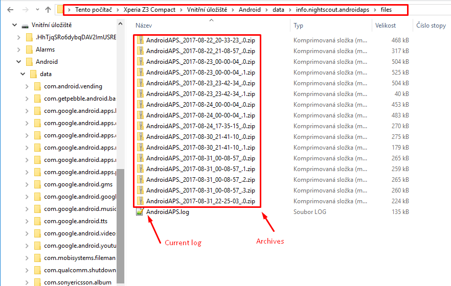

(Accessing-logfiles-accessing-logfiles)=

# Zpřístupnění log souborů

* Připojte telefon k počítači v režimu přenosu souborů
* Locate the log files in the AAPS data directory
    
    * (2.8.2) Adresář bude na místě jako je toto ***Internal storage(1) / Android / data / info.nightscout.androidaps / files***
    * (3.0.0) Adresář bude na místě jako je toto ***Internal storage(1) / AAPS / logs***
    * Pojmenování kořenového adresáře (1) úložiště se může lišit v závislosti na telefonu.

* Aktuální log je .log soubor, který může být zobrazený několika způsoby. Např. v [LogCat](https://developer.android.com/studio/debug/am-logcat.html) z Android Studia, v jakékoliv aplikaci pro prohlížení logů na Androidu, nebo jednoduše jako textový soubor v libovolném editoru. 
* Předcházející log soubory jsou automaticky zazipované a uložené do složek v pořadí podle datumu/času. 
* Sdílíte-li kvůli potenciální chybě soubor s logy na [discordu](https://discord.gg/4fQUWHZ4Mw), prosíme rozbalte a nahrajte soubor s datem těsně před tím, než se chyba objevila.