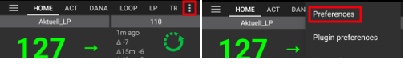

# Troubleshooting

Informace o odstraňování problémů můžete najít na mnoha stránkách wiki. Tato stránka obsahuje řadu odkazů, které vám mohou pomoci při hledání informací k řešení vašeho problému.

Additional useful information might also be available in the [FAQ](../UsefulLinks/FAQ.md).

## AAPS app

### Vytváření a aktualizace

* [Ztráta úložiště klíčů](#troubleshooting_androidstudio-lost-keystore)
* [Troubleshooting AndroidStudio](TroubleshootingAndroidStudio)

### Installing

You may see a Google Play Protect warning that the app is unsafe, was built for older Android versions and doesn't include latest privacy protections.

Ignore it: More details, Install anyway.

### Nastavení
* Profile

  

* [Pump - data from different pump](#update30-failure-message-data-from-different-pump)

  

* [Nightscout Client](../GettingHelp/TroubleshootingNsClient.md)

### Použití
* [Wrong carb values](#CobCalculation-detection-of-wrong-cob-values)

   

* [SMS commands](#SMSCommands-troubleshooting)

### Cannot start Omnipod with Android 16

Upgrade to minimum version of AndroidAPS: 3.3.2.1.

### Frequent Bluetooth connection problems

#### Android 15

After upgrading Android or moving to a recent phone, **AAPS** frequently loses Bluetooth connection to the pump. The problem disappears temporarily when restarting the phone. If the phone runs Android 15, you can try to enable the following:

1) **Open preferences** by clicking the three-dot menu on the top right side of the home screen.

2. Scroll down and open the **Confirmation beeps** / **Advanced** submenu. Enable **Bond BT device on Android 15+**.

   

3. If the pump asks for a pairing request, accept it.

4. Restart your phone.

#### Battery optimization

This can happen with various pumps. Apart from excluding AAPS from any battery optimization, you can also exclude the system Bluetooth app from battery optimization. This can help in some cases. Depending on the phone you use, you will find the Bluetooth app differently.

Here are examples how to find them on specific android phones.

##### Pixel phones (stock Android)

* Go to the android settings, select "Apps".

  

* Select "See all apps"

  

* On the menu on the right, select "Show system" apps.

  

* Now search and select the app "Bluetooth".

  

* Click the "App battery usage" and select "Not optimized".

  

##### Samsung phones

* Go to the android settings, select "Apps"

* On the icon that supposedly changes the sorting algorithm (1), select "Show system apps" (2).

  

  

* Now search the bluetooth app and select it to see its settings.

  

* Select "battery".

  

* Set it to "Not optimized"

  

## CGM

* [General](#general-cgm-troubleshooting)
* [Dexcom G6](#DexcomG6-troubleshooting-g6)
* [Libre 3](#libre3-experiences-and-troubleshooting)
* [Libre 2](#Libre2-experiences-and-troubleshooting)
* [xDrip - no CGM data](#xdrip-identify-receiver)
* [xDrip - Dexcom troubleshooting](#xdrip-troubleshooting-dexcom-g5-g6-and-xdrip)

## Pumpy

* [DanaRS](#DanaRS-Insulin-Pump-dana-rs-specific-errors)
* [Accu-Chek Combo general](../CompatiblePumps/Accu-Chek-Combo-Tips-for-Basic-usage.md)
* [Accu-Chek Insight](#Accu-Chek-Insight-Pump-insight-specific-errors)
* [Medtronic + RileyLink](#MedtronicPump-what-to-do-if-i-loose-connection-to-rileylink-and-or-pump)

## Telefony

* [Jelly](../CompatiblePhones/Jelly.md)
* [Huawei bluetooth & battery optimization](../CompatiblePhones/Huawei.md)

## Chytré hodinky

* [Troubleshooting Wear app](#Watchfaces-troubleshooting-the-wear-app)
