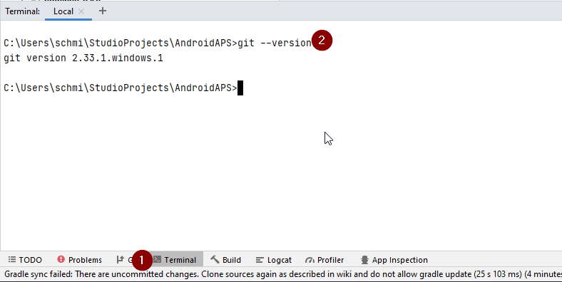
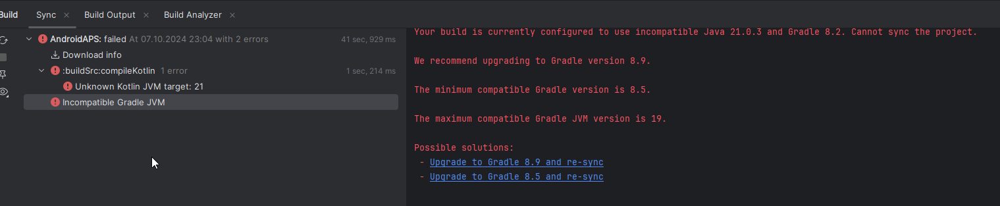

(troubleshooting_androidstudio-troubleshooting-android-studio)=
# Řešení problémů s Android Studiem

(troubleshooting_androidstudio-lost-keystore)=
## Ztráta úložiště klíčů
If you use the same keystore when updating AAPS you do not have to uninstall the previous version on your smartphone. To je důvod, proč je doporučeno uchovávat úložiště klíčů na bezpečném místě.

V případě, že nemůžete najít své staré úložiště klíčů, postupujte při aktualizaci takto:

In case you cannot find your old keystore or its password anymore, proceed as follows:

1. [Export settings](../Maintenance/ExportImportSettings.md) on your phone.
2. Copy or upload the settings file from your phone to an external location (i.e. your computer, cloud storage service...).
4. Generate signed apk of new version as described on the [Update guide](../Maintenance/UpdateToNewVersion) and transfer it to your phone.
5. Odinstalujte předchozí verzi AAPS na svém telefonu.
6. Nainstalujte novou verzi AAPS na svůj telefon.
7. [Import settings](#ExportImportSettings-restoring-from-your-backups-on-a-new-phone-or-fresh-installation-of-aaps) to restore your objectives and configuration.

   If you can't find them on your phone copy them from the external storage to your phone.

8. Check your battery optimization options and disable them again.
9. Smyčku pak můžete dále používat.

## Error "on demand" Configuration
Gradle Sync can fail to various reasons. Wen you get a message saying that gradle sync failed, open the "Build" tab (1) at the bottom of Android Studio and check what error message (2) is displayed.

  

Při vytváření nového úložiště klíčů pro vytvoření podepsané APK se ve Windows může objevit následující chybová zpráva
* [Neprovedené změny](#uncommitted-changes)
* [No cached version of ... available](#could-not-resolveno-cached-version)
* [Incompatible Gradle JVM](#incompatible-gradle-jvm)
* [Incompatible version of the Android Gradle plugin](#incompatible-version-of-android-gradle-plugin)

*Important*: After you have followed the instructions for your specific problem, you need to trigger the [gradle sync](#gradle-resync) again.

(troubleshooting_androidstudio-uncommitted-changes)=
### Neprovedené změny

Pokud se zobrazí podobná chybová zpráva,


#### Step 1 - Check git installation
  * Open the terminal tab (1) at the bottom of Android Studio and copy the following text and paste or type into the terminal.
    ```
    git --version
    ```

    

    Note: There is a space and two hyphens between git and version!

  * You must receive a message saying what git version is installed, as you can see in the screenshot above. In this case, go to [Step 2](#troubleshooting-android-studio-check-for-uncommitted-changes).

  * In case you get an message saying
    ```
    Git: command not found
    ```
    your Git installation is not right.

  * [Check git installation](#BuildingAaps-steps-for-installing-git)

  * if on Windows and git was just installed, you should restart your computer to make git globally available after the installation

  * If Git is installed, you have restarted (if on windows), and git still couldn't found:

  * Search your computer for a file "git.exe".

    Note for yourself, what directory it is in.

  * Go to the Environment variables in windows, select the variable "PATH" and click edit. Add the directory where you have found your git installation.

  * Save and close.

  * Restart Android Studio.

(troubleshooting-android-studio-check-for-uncommitted-changes)=
#### Step 2: Check for uncommitted changes.

  * V Android Studio zvolte VCS -> GIT -> Reset HEAD
  * You can see either a "Default changeset" (2) or "Unversioned files" (3):

    * For "Default changeset", you probably updated gradle or changed some of the file contents by mistake.

    * Right click on "Default Changeset" and select "Rollback"

      

    * The files are fetched again from the Git server. If there are no other changes in the commit tab, go to [Step 3](#gradle-resync).

  * If you can see "Unversioned Files", you might have stored files in your sourecode directory which should be better places somewhere else, e.g. your keystore file.

    * Use your regular file explorer on your computer to move or cut and paste that file to a save place.

    * Go back to Android Studio and click the Refresh button (4) within the Commit tab to make sure the file is not stored in the AAPS directory anymore.

      If there are no other changes in the commit tab, go to [Step 3](#gradle-resync).


(troubleshooting_androidstudio-step-3-gradle-resync)=

#### Step 3: Resync Gradle (again)

Follow the instructions at [Gradle Resync](#gradle-resync).

(troubleshooting_androidstudio-android-gradle-plugin-requires-java-11-to-run)=

(incompatible-gradle-jvm)=
### Incompatible Gradle JVM

 If you experience the following error message, you need to download a correct JVM version before you can try again:
* Open the gradle view by clicking on the elephant (1) on the right side of Android Studio and open the settings (2) and select **Gradle Settings** (3):


* Open the **Gradle JDK** options, then select **Download JDK...**


* At **Version** (1), you need to select **17**. Then select the **JetBrains Runtime** from the **Vendor** (2) options. Do not change the **Location** (3).


* Close the **Settings** dialog with **OK**.
* You now need to restart the Gradle Sync. Follow the instructions at [Gradle Resync](#gradle-resync).

(incompatible-version-of-android-gradle-plugin)=
### Incompatible version of Android Gradle plugin

  If you experience the following error message

  

  You are using an outdated version of Android Studio. In the menu, go to Help > Check for updates and install any updates of Android Studio and its plugins that are found.

(troubleshooting_androidstudio-could-not-resolve-no-cached-version)=
### Možnost 3 – Zkuste stáhnout aktualizace

  You might get this error message:


  * Zkopírujte ‘git checkout --’ do schránky (bez uvozovek)

    Make sure the button shown at (2) is *NOT* selected.

    

  * Now you need to trigger a [Gradle Resync](#gradle-resync)

(troubleshooting_androidstudio-unable-to-start-daemon-process)=
### Unable to start daemon process

  Pokud vidíte zmíněnou chybovou zprávu, pravděpodobně používáte 32bitový systém Windows 10. This is not supported by Android Studio 3.5.1 and above and unfortunately nothing the AAPS developer can do about!

  There are a lot of manuals on the internet how to determine wether you have a 32-bit or 64-bit OS - i.e. [this one](https://support.microsoft.com/en-us/windows/32-bit-and-64-bit-windows-frequently-asked-questions-c6ca9541-8dce-4d48-0415-94a3faa2e13d).

  

(gradle-resync)=
### Gradle Resync

  If you can still see the message that the gradle sync failed, now select the Link "Try again". 


  If you don't see the a message anymore, you can still trigger this manually:

  * Open the Gradle tab (1) on the right border of Android Studio.

    

  * Right-click on AAPS (2)

  * Click on "Reload Gradle Project" (3)

## Varování kompilátoru Kotlin

When you generate the signed apk, you might get the notification that generation was successfully but are told that 0 build variants where generated:


This is a false warning. Check the directory your selected as "Destination folder" for generation (step [Generate Signed APK](#Building-APK-generate-signed-apk)) and you will find the generated apk there!


## Klíč byl vytvořen s chybami

If your build completed successfully but you get compiler or kotlin warnings (indicated by a yellow or blue exclamation mark) then you can just ignore these warnings.

 

Your app was build successfully and can be transferred to phone!


## Klíč byl vytvořen s chybami

Při vytváření nového úložiště klíčů pro vytvoření podepsané APK se ve Windows může objevit následující chybová zpráva


Zdá se, že se jedná o chybu Android Studia 3.5.1 a jeho prostředí Java ve Windows. Klíč je správně vytvořen, ale doporučení je nesprávně zobrazeno jako chyba. To lze nyní ignorovat.


## No CGM data is received by AAPS

* In case you are using patched Dexcom G6 app: This app is outdated. Use the [BYODA](#DexcomG6-if-using-g6-with-build-your-own-dexcom-app) app instead.

* In case you are using xDrip+: Identify receiver as described on [xDrip+ settings page](#xdrip-identify-receiver).


## Aplikace není nainstalována


* Ujistěte se, že jste do telefonu přenesli soubor „app-full-release.apk“.
* Pokud se na telefonu zobrazí "Aplikace není nainstalována", postupujte následovně:

1. [Export settings](../Maintenance/ExportImportSettings.md) (in AAPS version already installed on your phone)
2. Odinstalujte aplikaci AAPS ze svého telefonu
3. Změňte cílovou složku APK (jiné umístění).
4. Nainstalujte novou verzi (“app-full-release.apk”)
5. [Importujte nastavení](../Maintenance/ExportImportSettings.md)
6. Znovu zapněte bluetooth a vypněte režim letadlo

## Nejsou dostupná data z CGM

If you built the app successfully, transferred it to your phone and installed it successfully but the version number stays the same then you might have missed to [update your local copy](#Update-to-new-version-update-your-local-copy)

## Neprovedené změny

Jestliže žádný z uvedených tipů nepomáhá, zvažte sestavení aplikace úplně od začátku:

1. [Export settings](../Maintenance/ExportImportSettings.md) (in AAPS version already installed on your phone)

2. Zálohujte si úložiště klíčů a heslo k němu. In case you have forgotten passwords you can try to find them in project files as described [here](https://youtu.be/nS3wxnLgZOo).

    Nebo můžete vytvořit a použít nové úložiště klíčů.

3. Build app from scratch as described [here](#Building-APK-download-AAPS-code).

4. Jestliže jste úspěšně sestavili APK, odstraňte stávající aplikaci z telefonu a přeneste do něj a nainstalujte nový soubor apk.
5. [Import settings](../Maintenance/ExportImportSettings.md) again to restore your objectives and settings.
6. Znovu zapněte bluetooth a vypněte režim letadlo

## Aplikace není nainstalována

V případě, že ani sestavení aplikace úplně od začátku nevyřeší váš problém, zkuste úplně odinstalovat Android Studio. Někteří uživatelé uvedli, že to jejich problém vyřešilo.

**Make sure to uninstall all files associated with Android Studio.** If you do not completely remove Android Studio with all hidden files, uninstalling may cause new problems instead of solving your existing one(s). manuály pro kompletní odinstalaci můžete najít na internetu, například

[https://stackoverflow.com/questions/39953495/how-to-completely-uninstall-android-studio-from-windowsv10](https://stackoverflow.com/questions/39953495/how-to-completely-uninstall-android-studio-from-windowsv10).

Install Android Studio from scratch as described [here](#Building-APK-install-android-studio).
