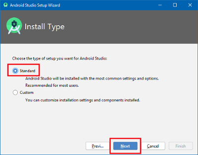
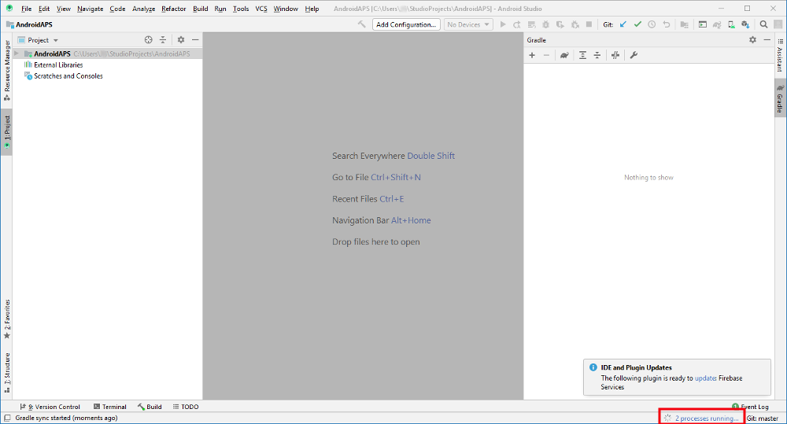

# Sestavení APK

## Vyrobte si místo stažení

**AndroidAPS není k dispozici ke stažení kvůli regulaci zdravotnických zařízení. Je legální vytvořit aplikaci pro své vlastní použití, ale nesmíte dát kopii ostatním! Další informace naleznete v části [Časté dotazy](../Getting-Started/FAQ.md).**

## ## Důležité poznámky

* Chcete-li sestavit apk, použijte **[Android Studio Version 4.1.1](https://developer.android.com/studio/)** nebo novější.
* [32 bitové systémy Windows 10](../Installing-AndroidAPS/troubleshooting_androidstudio#unable-to-start-daemon-process) nejsou programem Android Studio 4.1.1. podporovány.

**Configuration on demand (Konfigurace na vyžádání)** není aktuální verzí plug-inu Android Gradle podporována!

Jestliže vytváření apk selže s chybou "on demand configuration", proveďte následující změnu:

* Otevřete okno Preferences klepnutím na File > Settings (na platformě Mac, Android Studio > Preferences).
* V levé části pak na Build, Execution, Deployment > Compiler.
* Zrušte označení možnosti Configure on demand.
* Klepněte na tlačítko použít nebo OK.

* * *

### Tento článek je rozdělený do dvou částí.

* V části Přehled najdete vysvětlení, které kroky jsou obecně nutné, abyste sestavili soubor APK.
* V části Průvodce krok za krokem najdete snímky obrazovky z konkrétní instalace. Jelikož se Android Studio (vývojové prostředí, které použijeme k sestavení APK) v čase mění velmi rychle, nebudou snímky úplně shodné s vaší instalací, ale určitě vám poskytnou dobrý záchytný bod. Android studio běží na Windows, Linuxu a Mac OS X, a proto mohou být na různých platformách malé rozdíly. Jestliže najdete něco zásadního, co je špatně nebo vám něco chybí, prosím informujte o tom facebookovou skupinu „AndroidAPS users“ nebo použijte Gitter chat [Android APS](https://gitter.im/MilosKozak/AndroidAPS) nebo [AndroidAPSwiki](https://gitter.im/AndroidAPSwiki/Lobby), abychom se na to mohli podívat.

## Přehled

Následují obecné kroky k sestavení souboru APK:

1. [Nainstalujte git](../Installing-AndroidAPS/git-install.rst)
2. [Instalace Android Studio](../Installing-AndroidAPS/Building-APK#install-android-studio)
3. [Nastavte v předvolbách Android Studio cestu ke gitu](../Installing-AndroidAPS/Building-APK#set-git-path-in-preferences)
4. [Stáhněte si kód AndroidAPS](../Installing-AndroidAPS/Building-APK#download-androidaps-code)
5. [Stáhněte Android SDK](../Installing-AndroidAPS/Building-APK#download-android-sdk)
6. [Sestavte aplikaci](../Installing-AndroidAPS/Building-APK#generate-signed-apk) (vygenerujte podepsaný soubor apk)
7. [Nahrajte aplikaci do mobilu](../Installing-AndroidAPS/Building-APK#transfer-apk-to-smartphone)
8. [Možnost „Identify receiver“ při používání xDripu+](../Installing-AndroidAPS/Building-APK#identify-receiver-if-using-xdrip)

## Průvodce krok za krokem

Následuje detailní popis kroků nutných k sestavení souboru APK.

## Nainstalujte git (pokud ho ještě nemáte)

Postupujte podle návodu na [stránka instalace gitu](../Installing-AndroidAPS/git-install.rst).

## Instalace Android Studio

Následující snímky obrazovky byly převzaty z aplikace Android Studio verze 3.6.1. Máte-li vyšší verzi aplikace Android Studio, může Vaše obrazovka vypadat trochu jinak. Měli byste však být schopni najít cestu. K dispozici je [pomoc od komunity](../Where-To-Go-For-Help/Connect-with-other-users.md).

Jedna z nejdůležitějších věcí při instalaci aplikace Android Studio: **Buďte trpěliví!** Během instalace a nastavení aplikace Android Studio se stahuje spousta věcí, které zaberou spoustu času.

Nainstalujte [Android Studio](https://developer.android.com/studio/install.html) a proveďte nastavení během prvního spuštění.

Zvolte "Do not import settings", protože jste tento software zatím nevyužívali.


Rozhodněte se, zda chcete či nechcete sdílet data se společností Google.


Na následující obrazovce klepněte na tlačítko „Další“.


Vyberte „Standard“ instalaci a klikněte na „Next“.



Vyberte si motiv uživatelského rozhraní, který se vám líbí. (V tomto návodu jsme použili „Light“.) Poté klikněte na „Next“. Jedná se pouze o barevný motiv. Můžete si vybrat jakýkoli jiný (např. „Darcula“ pro tmavý režim). Tato volba nemá žádný vliv na sestavení APK.


V dialogovém okně „Verify Settings“ klikněte na „Next“.


Buďte trpěliví - vyčkejte, dokud Android Studio nestáhne potřebné komponenty. Jakmile je vše staženo, tlačítko „Finish“ se zbarví modře. Klikněte na něj.


## Nastavení cesty k nástroji git v předvolbách

Ujistěte se, že na svém počítači máte [nainstalován git](../Installing-AndroidAPS/git-install.rst).

Na úvodní obrazovce aplikace Android Studio klepněte na malý trojúhelník (1. v dalším snímku obrazovky) a vyberte „Settings“ (2.).


### Windows

* Klikněte na malý trojúhelníček před Version Control (1.), rozbalí se související menu.
* Klikněte na Git (2.).
* Ověřte, že v kolonce Update Method je zvolena volba Merge (3.).
* Kliknutím na tlačítko "Test" (4.) spustíte automatické ověření, že Android Studio má přístup k git.exe
    
    

* Pokud byl automatický test úspěšný zobrazí se okno s informací o verzi Git.

* Klikněte na "OK" v dialogovém okně (1.) a pak na "OK" v okně s nastavením (2.).
    
    

* Pokud soubor git.exe nebyl automatickým testem nalezen, klikněte na "OK" v dialogovém okně (1.) a pak na tlačítko se třemi tečkami (2.).

* Použijte funkci [vyhledávání](https://www.tenforums.com/tutorials/94452-search-file-explorer-windows-10-a.html) v programu Průzkumník souborů pro nalezení souboru "git.exe" pokud si nejste jisti, kde lze soubor najít. Hledáte soubor git.exe ve složce \bin\.
* Vyberte cestu k souboru git.exe a ujistěte se, že vybraný soubor je ve složce ** \bin\ ** (3.) a klikněte na tlačítko "OK" (4.).
* Zavřete okno nastavení kliknutím na tlačítko "OK" (5.).
    
    

* **Restartujte počítač, aktualizuje se prostředí jeho systému.**

### Mac

* Měly by fungovat všechny verze gitu. Například <https://git-scm.com/download/mac>.
* Použijte homebrew k instalaci gitu: ```$ brew install git```.
* Detaily o instalaci gitu naleznete v [oficiální dokumentaci gitu](https://git-scm.com/book/en/v2/Getting-Started-Installing-Git).
* Pokud instalujete git přes homebrew, není třeba měnit žádné předvolby. Pokud by bylo třeba: Najdete je zde: Android Studio - Preferences.

## Stáhněte si kód AndroidAPS

* **Pokud jste po nastavení cesty k souboru git.exe ještě nerestartovali počítač, udělejte tak nyní. Prostředí systému musí být aktualizováno.**

* Jsou dvě možnosti, jak nastartovat nový projekt:
    
    * Na úvodní obrazovce Android Studia klikněte na "Get from version control"
        
        
    
    * Pokud již máte spuštěné Android Studio a nevidíte úvodní obrazovku, vyberte volbu File (1.) > New (2.) > Project from Version Control... (3.)
        
        

* Do pole URL vyplňte adresu úložiště AndroidAPS (https://github.com/nightscout/AndroidAPS) (1.).

* Vyberte složku, do které chcete uložit vlastní klon kódu. (2.)
* Klikněte na tlačítko "Clone" (3.).
    
    

* Neklikejte na tlačítko "Background" v průběhu klonování úložiště!
    
    

* Po úspěšném naklonování úložiště otevřete svou lokální kopii kliknutím na tlačítko "Yes".
    
    

* V pravém dolním rohu můžete vidět informaci o úlohách Android Studia probíhajících na pozadí.
    
    

* Pokud váš firewall bude požadovat potvrzení povolení prostupu, potvrďte.
    
    

* Jakmile budou dokončeny úlohy prováděné na pozadí, pravděpodobně se zobrazí následující chybová zpráva:
    
    

## Stáhněte Android SDK

* Klikněte na File > Settings.
    
    

* Klikněte na malý trojúhelníček před volbou Appearance & Behaviour (1.).

* Klikněte na malý trojúhelníček před volbou System Settings (2.) a vyberte Android SDK (3.)
* Klikněte na čtvereček nalevo od "Android 9.0 (Pie)" (4.) (API Level 28).
    
    

* Potvrďte změny v nastavení kliknutím na tlačítko OK.
    
    

* Souhlaste s licenčním ujednáním (1.) a klikněte na tlačítko "Next" (2.).
    
    

* Vyčkejte dokud se instalace nedokončí.
    
    

* Jakmile bude instalace SDK dokončena, tlačítko "Finish" zmodrá. Klikněte na toto tlačítko.
    
    

* Android Studio může doporučovat aktualizovat gradle systém. **Nikdy neaktualizujte gradle!** Mohlo by to vše zkomplikovat!

* Pokud uvidíte v pravém dolním rohu Android Studia, že Android Gradle Plugin je připraven k aktualizaci, klikněte na slovo "update" (1.) a v dialogovém okně klikněte na "Don't remind me again for this project" (2.).
    
    

## Vytvořte podepsaný soubor APK

Podepsání znamená, že označíte svou aplikaci, že jste si jí sami vytvořili, ale digitálním způsobem, jde o jakýsi digitální otisk prstu v samotné aplikaci. To je nezbytné, protože Android má pravidlo, že z bezpečnostních důvodů přijme pouze podepsaný kód. Pro víc informací k tomuto tématu klikněte na [tento odkaz](https://developer.android.com/studio/publish/app-signing.html#generate-key).

* Click "Build" in the menu bar and select "Generate Signed Bundle / APK...".
    
    

* Select "APK" (1.) instead of "Android App Bundle" and click "Next" (2.).
    
    

* Ujistěte se, že modul je nastaven na varianty "app" (1.).

* Klikněte na tlačítko "Create new..." (2.) pro vytvoření nového úložiště klíčů.
    
    Úložiště klíčů v tomto případě není nic víc než soubor, ve kterém jsou informace pro podpisování. Je zašifrované a údaje jsou zabezpečené hesly.
    
    

* Klikněte na symbol složky (1.) pro zadání cesty k úložišti klíčů.

* Vyberte cestu k místu, kde může být uloženo úložiště klíčů (2.). **Neukládejte do stejné složky, jako je projekt. Musíte použít jinou složku!** Jednou z možností je využít vaší domovskou složku.
* Napište jméno souboru vašeho úložiště klíčů (3.).
* Klikněte na tlačítko "OK" (4.).
* Hesla pro úložiště klíčů a klíče samotné nemusí být příliš složité. Hesla si dobře zapamatujte nebo zapište na bezpečné místo. V případě, že si nebudete pamatovat svá hesla v budoucnosti, podívejte se na [řešení problémů se ztraceným úložištěm klíčů](../Installing-AndroidAPS/troubleshooting_androidstudio#lost-keystore).
* Vložte (5.) a potvrďte (6.) heslo od vašeho úložiště klíčů.
* To samé udělejte s heslem ke svému klíči (7. + 8.).
* Platnost (9.) je přednastavena na 25 let. Přednastavenou hodnotu nemusíte měnit.
* Jméno a příjmení musí být vyplněno (10.). Všechny ostatní informace jsou nepovinné.
* Až budete mít vše vyplněno, klikněte na tlačítko "OK" (11.).
    
    

* Ujistěte se, že je zatržena volba pro zapamatování hesla (1.). Díky tomu nebudete muset zadávat heslo pokaždé znovu (např. až budete připravovat další verzi AndroidAPS).

* Klikněte na tlačítko "Next" (2.).
    
    

* Select build variant "fullRelease" (1.).

* Check boxes V1 and V2 for signature versions (2.).
* Click "Finish". (3.)
    
    

* Android Studio will display the information "APK(s) generated successfully..." after build is finished.

* In case build was not successful refer to the [troubleshooting section](../Installing-AndroidAPS/troubleshooting_androidstudio.rst).
* Easiest way to find the apk is to click on "Event log".
    
    

* In the event log section click "locate".
    
    

* app-full-release.apk is the file you are looking for.
    
    

## Přeneste soubor APK do telefonu

Easiest way to transfer app-full-release.apk to your phone is via [USB cable or Google Drive](https://support.google.com/android/answer/9064445?hl=en). Please note that transfer by mail might cause difficulties and is not the preferred way.

On your phone you have to allow installation from unknown sources. Manuals how to do this can be found on the internet (i.e. [here](https://www.expressvpn.com/de/support/vpn-setup/enable-apk-installs-android/) or [here](https://www.androidcentral.com/unknown-sources)).

## Možnost „Identify receiver“ při používání xDripu+

[Viz stránka xDrip+](../Configuration/xdrip#identify-receiver)

## Poradce při potížích

Viz samostatná stránka [odstraňování potíží s Android Studiem](../Installing-AndroidAPS/troubleshooting_androidstudio.rst).