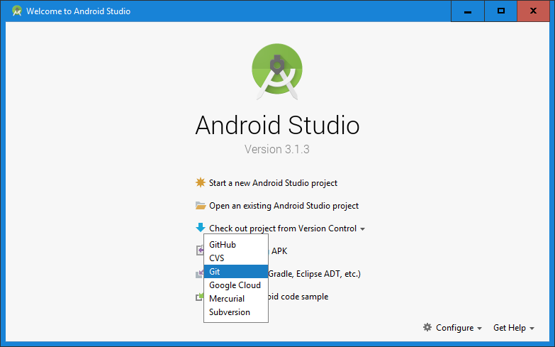
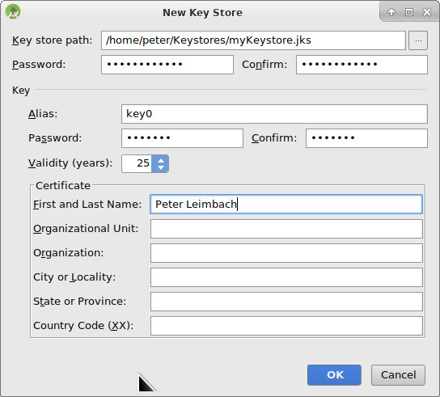

# Sestavení APK

* * *

***Mějte prosím na paměti** při vytváření AndroidAPS 2.0 apk: **Konfigurace na vyžádání** není podporována v aktuální verzi Android Gradle pluginu! Jestliže vytváření apk selže s chybou "on demand configuration", proveďte následující změnu:*

     * * Otevřete okno Preferences klepnutím na File > Settings (v systému Mac, Android Studio > Preferences). *
     * * V levém podokně klepněte na Build, Execution, Deployment > Compiler.*
     * * Zrušte zaškrtnutí políčka Configure on demand.*
    

## * *Klepněte na tlačítko použít nebo OK.*

### Tento článek je rozdělený do dvou částí.

* V části Přehled najdete vysvětlení, které kroky jsou obecně nutné, abyste sestavili soubor APK.
* V části Průvodce krok za krokem najdete snímky obrazovky z konkrétní instalace. Jelikož se Android Studio (vývojové prostředí, které použijeme k sestavení APK) v čase mění velmi rychle, nebudou snímky úplně shodné s vaší instalací, ale určitě vám poskytnou dobrý záchytný bod. Android studio běží na Windows, Linuxu a Mac OS X, a proto mohou být na různých platformách malé rozdíly. Jestliže najdete něco zásadního, co je špatně, nebo vám něco chybí, prosím informujte o tom facebookovou skupinu „AndroidAPS users“ nebo použijte Gitter chat [Android APS](https://gitter.im/MilosKozak/AndroidAPS) nebo [AndroidAPSwiki](https://gitter.im/AndroidAPSwiki/Lobby), abychom se na to mohli podívat.

## Přehled

Následují obecné kroky k sestavení souboru APK:

* Instalujte git
* Instalujte a nastavte Android Studio.
* Použijte git, abyste si naklonovali zdrojové kódy z centrálního úložiště na Githubu, kam vývojáři umístili poslední zdrojové kódy aplikace.
* Otevřete naklonovaný projekt v Android Studiu jako aktivní projekt.
* Sestavete podepsané APK.
* Doručte podepsané APK na váš telefon.

## Průvodce krok za krokem

Následuje detailní popis kroků nutných k sestavení souboru APK.

## Nainstalujte Android Studio

* Instalujte git 
  * [Windows](https://gitforwindows.org/)
  * [Mac OS X](http://sourceforge.net/projects/git-osx-installer/)
  * Linux - prostě instalujte balíček git správcem balíčků z vaší distribuce
* Instalujte [Android Studio](https://developer.android.com/studio/install.html).
* Nastavte Android Studio při prvním spuštění

Zvolte "Do not import settings", protože jste tento software zatím nevyužívali.

Klikněte na "Next".

Vyberte "Standard" instalaci a klikněte na "Next".

Vyberte "Intellij" jako schéma uživatelského prostředí a klikněte na "Next".

Klikněte na "Next" v dialogovém okně "Verify Settings".

Emulátor Androidu (pro simulaci telefonu na vašem PC nebo Macu) se pro sestavení APK nepoužívá. Můžete kliknout na "Finish", abyste dokončili instalaci a odložili četbu dokumentace později na vyžádání.

Android Studio stahuje velké množství softwarových komponent, které používá. Můžete kliknout na tlačítko "Show Details" pro zobrazení detailů, které ale vůbec nejsou důležité.

Jakmile jsou stahování dokončena, klikněte na tlačítko "Finish".

* Hurá, hurá, nyní jste dokončili instalaci Android Studia a můžete začít s klonováním zdrojových souborů. Možná je teď vhodná doba na krátkou přestávku?

## Stáhněte si kód a další komponenty

* Použijte klonování gitu v Android Studiu, jak je vidět na snímku níže. Zvolte "Check out project from Version Control" s "Git" jako konkrétní verzí správce zdrojových kódů.

 

Zadejte URL adresu do hlavního úložiště AndroidAPS ("https://github.com/MilosKozak/AndroidAPS") a klepněte na "Clone".

Android Studio začne s klonováním. Neklikejte na "Background", což by věci nyní pouze zkomplikovalo.

Dokončete načtení projektu od správce zdrojových kódů kliknutím na "Yes", což projekt otevře.

Použijte standardní "default gradle wrapper" a klikněte na "OK".

Přečtěte si okno "Tip of Day" a kliknutím na "Close" je zavřete.

* Super, máte vlastní kopii zdrojového kódu a jste připraveni na vytvoření Apk.
* Nyní se blížíme k první chybové zprávě. Naštěstí nám Android Studio nabídne její řešení.

Klikněte na "Install missing platform(s) and sync project", protože Android Studio potřebuje doinstalovat chybějící platformu.

Přijměte licenční ujednání zvolením "Accept" a kliknutím na "Next".

Jak již bylo řečeno v dialogovém okně, počkejte, než se stahování dokončí.

Nyní je dokončené. Prosím, klikněte na "Finish".

Aaaach, další chyba. Ale Android Studio navrhuje podobné řešení. Klikněte na "Install Build Tools and sync project", protože Android Studio potřebuje stáhnout chybějící pomůcky.

Jak již bylo řečeno v dialogovém okně, počkejte, než se stahování dokončí.

Nyní je dokončené. Prosím, klikněte na "Finish".

A další chyba k řešení, protože Android Studio potřebuje zase stáhnout chybějící platformu. Klikněte na "Install missing platform(s) and sync project".

Jak již bylo řečeno v dialogovém okně, počkejte, než se stahování dokončí.

Nyní je dokončené. Prosím, klikněte na "Finish".

Klikněte na "Install Build Tools and sync project", protože Android Studio potřebuje stáhnout chybějící pomůcky.

Jak již bylo řečeno v dialogovém okně, počkejte, než se stahování dokončí.

Nyní je dokončené. Prosím, klikněte na "Finish".

Ano, chybové zprávy jsou pryč a první gradle sestavení běží. Možná je čas dát si trochu vody?

<!--- Android Studio recommends we now update the gradle system to version 4.4. If you made this build for an AndroidAPS version before the release of at least a release candidate(RC) of version 2.0 do not follow this recommendation. Otherwise, the build will fail. The gradle system is a tool which Android Studio uses to control the build process. For AndroidAPS there is no disadvantage to using the old gradle version. The APK file in the end is not different. If you build a APK for version 2 of AndroidAPS feel free to upgrade the gradle system to version 4.4. ---> Android Studio doporučuje aktualizaci systému gradle. 

**Nikdy neaktualizujte gradle!** Mohlo by to vše zkomplikovat!

Klikněte prosím na „Znovu nepřipomínat pro tento projekt“.

Sestavení zase běží.

Ano, první sestavení bylo úspěšné, ale ještě nejsme hotoví.

## Vytvořte podepsaný soubor APK

<!--- Do not forget to copy to update-to-new-version.md --->

V nabídce vyberte „Build“ a pak „Generate Signed Bundle / APK…“. (Nabídka Android Studio se v září 2018 změnila. Ve starších verzích vyberte nabídku „Build“ a pak „Generate Signed APK...“.)  
Podepsání znamená, že podepíšete svou generovanou aplikaci, ale digitálním způsobem, něco jako digitálním otiskem prstu v samotné aplikaci. To je nezbytné, protože Android má pravidlo, že z bezpečnostních důvodů přijme pouze podepsaný kód. Pokud se o toto téma zajímáte, můžete si k tomu víc přečíst [zde](https://developer.android.com/studio/publish/app-signing.html#generate-key), ale Bezpečnost je hluboké a komplexní téma a teď ho nepotřebujete.

V následujícím dialogovém okně vyberte „APK“ místo „Android App Bundle“ a klepněte na tlačítko „Next“.

Zvolte „app“ a klepněte na tlačítko „Next“.

Klepněte na „Create new...“ a vytvořte úložiště svých klíčů. Úložiště klíčů v tomto případě není nic jiného než soubor, ve kterém jsou uložené podepisovací informace. Je zašifrované a údaje jsou zabezpečené hesly. Doporučujeme, abyste si ho uložili do své domovské složky a zapamatovali si hesla. Kdybyste však tyto informace ztratili, nebyl by to tak velký problém, protože potom byste prostě museli vytvořit nové úložiště klíčů. Ale lepší je tyto údaje pečlivě uložit.

* Vyplňte údaje pro další dialogové okno. 
  * Key store path: je cesta k vašemu úložišti klíčů
  * Políčka s hesly níže jsou pro úložiště klíčů a jsou zdvojená, aby se zabránilo překlepům.
  * Alias je název pro klíč, který potřebujete. Můžete ponechat výchozí, anebo si vybrat jakýkoli jiný název.
  * Políčka s hesly pod tím jsou pro samotný klíč. Jako vždy jsou zdvojená, aby se zabránilo překlepům.
  * Můžete ponechat "Validity (years)" na výchozí hodnotě 25.
  * Povinná pole jsou pouze jméno a příjmení, ale klidně můžete vyplnit i zbývající údaje. Pak klikněte na tlačítko „OK“.

Vyplňte údaje posledního dialogového okna a klikněte na tlačítko „Next“.

Zvolte „full“ jako flavour generované aplikace. Zvolte V1 „Jar Signature“ (V2 je volitelné) a klikněte na tlačítko „Finish“. Následující údaje mohou být důležité pro pozdější použití.

* Možnost „Release“ by měla být výchozí volbou pro „Build Type“, možnost „Debug“ je pouze pro vývojáře.
* Vyberte typ sestavení, jaký budete chtít. 
  * full (tj. automatické doporučení pro uzavřenou smyčku)
  * openloop (tj. doporučení pro uživatele s otevřenou smyčkou)
  * pumpcontrol (tj. vzdálené ovládání pumpy bez smyčky)
  * nsclient (tj. zobrazují se data jiného uživatele se smyčkou a lze vkládat záznamy ošetření)

V podokně „Event Log“ vidíme, že podepsaný soubor APK byl úspěšně vygenerován.

Klikněte na odkaz „locate“ v podokně „Event Log“.

## Přeneste soubor APK do telefonu

<!--- Do not forget to copy to update-to-new-version.md --->

Objeví se okno správce souborů. Na vašem počítači může vypadat trochu jinak, protože já používám systém Linux. Pokud používáte sytém Windows, otevře se Průzkumník souborů, na platformě Mac OS X to bude Finder. V něm byste měli vidět složku s vygenerovaným souborem APK. Toto bohužel není správné umístění, protože „wear-release.apk“ není podepsaný soubor „app“ APK, který hledáme.

Přejděte prosím do složky AndroidAPS/app/full/release a tam vyhledejte soubor „app-full-release.apk“. Přeneste tento soubor do telefonu s Androidem. Můžete to udělat způsobem, který upřednostňujete, přes Bluetooth, nahráním do cloudu, připojením telefonu k počítači pomocí kabelu nebo přes přílohu e-mailu. Já v této ukázce používám Gmail, jelikož je to pro mě poměrně jednoduché. Zmiňuji to proto, protože instalaci self-signed aplikace (certifikát podepsaný sám sebou) potřebujeme v systému Android výslovně povolit, i když byl soubor přijatý přes Gmail. Standardně je to totiž zakázané. Pokud použijete jinou metodu, zvolte vhodný postup.

V nastavení telefonu je nabídka (instalovat neznámé aplikace), kde lze povolit instalaci APK souborů, které jsem si poslal přes Gmail.

Vyberte možnost „Povolit z tohoto zdroje“. Po instalaci můžete tuto volbu zase zakázat.

Posledním krokem je klepnout na soubor APK, který jsem přijal přes Gmail, a nainstalovat aplikaci. Pokud se APK nechce nainstalovat a máte v telefonu již starší verzi AndroidAPS, pravděpodobně byla podepsaná jiným klíčem – v tom případě musíte starou verzi nejdřív odinstalovat, avšak nezapomeňte předtím exportovat svá nastavení!

Ano, máte to a můžete začít s úvodní konfigurací AndroidAPS (CGM, inzulínová pumpa) atd.