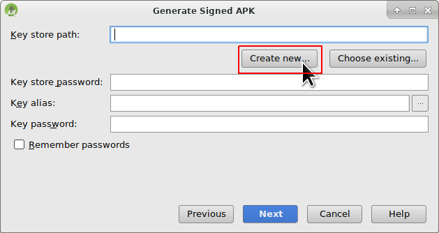

# Sestavení APK

Tento článek je rozdělený do dvou částí.

* V části přehled se vám dostane vysvětlení, které kroky obecně jsou nutné, abyste sestavili soubor APK.
* V části průvodce krok za krokem najdete snímky obrazovky z konkrétní instalace. Jelikož se Android Studio (vývojové prostředí, které použijeme k sestavení APK) v čase mění velmi rychle, nebudou snímky úplně shodné s vaší instalací, ale určitě vám poskytnou dobrý záchytný bod. Dalším důvodem je fakt, že Android Studio běží na Windows, Mac OS X i na Linuxu a konkrétní varianty mohou být trochu odlišné. Jestliže najdete něco zásadního, co je špatně nebo vám chybí, prosím informujte o tom facebookovou skupinu "AndroidAPS users" nebo použijte Gitter chat [Android APS](https://gitter.im/MilosKozak/AndroidAPS) nebo [AndroidAPSwiki](https://gitter.im/AndroidAPSwiki/Lobby), abychom se na to mohli podívat.

## Přehled

Následují obecné kroky k sestavení souboru APK.

* Instalujte git
* Instalujte a nastavte Android Studio.
* Použijte git, abyste si naklonovali zdrojové kódy z centrálního úložiště na Githubu, kam vývojáři umístili poslední zdrojové kódy aplikace.
* Otevřete naklonovaný projekt v Android Studiu jako aktivní projekt.
* Sestavete podepsané APK.
* Doručte podepsané APK na váš telefon.

## Průvodce krok za krokem

Následuje detailní popis kroků nutných k sestavení souboru APK.

* Instalujte git 
  * [Windows](https://gitforwindows.org/)
  * [Mac OS X](http://sourceforge.net/projects/git-osx-installer/)
  * Linux - prostě instalujte balíček git správcem balíčků z vaší distribuce
* Instalujte [Android Studio](https://developer.android.com/studio/install.html).
* Nastavte Android Studio při prvním spuštění

Zvolte "Do not import settings", protože jste tento software zatím nevyužívali.

Klikněte na "Next".

Vyberte "Standard" instalaci a klikněte na "Next".

Vyberte "Intellij" jako schéma uživatelského prostředí a klikněte na "Next".

Klikněte na "Next" v dialogovém okně "Verify Settings".

Emulátor Androidu (pro simulaci telefonu na vašem PC nebo Macu) se pro sestavení APK nepoužívá. Můžete kliknout na "Finish", abyste dokončili instalaci a odložili četbu dokumentace později na vyžádání.

Android Studio stahuje velké množství softwarových komponent, které používá. Můžete kliknout na tlačítko "Show Details" pro zobrazení detailů, které ale vůbec nejsou důležité.

Jakmile jsou stahování dokončena, klikněte na tlačítko "Finish".

* Hurá, hurá, nyní jste dokončili instalaci Android Studia a můžete začít s klonováním zdrojových souborů. Možná je teď vhodná doba pro krátkou přestávku?

* Použijte klonování gitu v Android Studiu, jak je vidět na snímku níže. Zvolte "Check out project from Version Control" s "Git" jako konkrétní verzí správce zdrojových kódů.

 

Zadejte URL adresu do hlavního úložiště AndroidAPS ("https://github.com/MilosKozak/AndroidAPS") a klepněte na "Clone".

Android Studio will start cloning. Don't click "Background" as it goes fast and makes things more complicate at the moment.

Finish the checkout from version control with opening the project by clicking "Yes".

Use the standard "default gradle wrapper" and click "OK".

Read and the close the "Tip of Day" screen of Android Studio by pressing "Close".

* Excellent, you have your own copy of the source code and ready to start the build.
* Now we are approaching our first error messsage. Fortunately Android Studio will directly give us the solution for this.

Click "Install missing platform(s) and sync project" as Android Studio needs to install a missing platform.

Accept the license agreement by selecting "Accept" and clicking "Next".

As it is said in the dialog please wait until the download is finished.

Now it's finished. Please click "Finish".

Aaaahhh, next error. But Android Studio suggests a similar solution. Click "Install Build Tools and sync project" as Android Studio needs to download missing Tools.

As it is said in the dialog please wait until the download is finished.

Now it's finished. Please click "Finish".

And another error to handle as Android Studio needs to download again a missing platform. Click "Install missing platform(s) and sync project".

As it is said in the dialog please wait until the download is finished.

Now it's finished. Please click "Finish".

Click "Install Build Tools and sync project" as Android Studio needs to download missing Tools.

As it is said in the dialog please wait until the download is finished.

Now it's finished. Please click "Finish".

Yeah, the error messages are gone and the first gradle build is runing. May be it's time to trink some water?

Android Studio recommends us now to update the gradle system to version 4.4. If you make this build for an AndroidAPS version before the release of at least a release condidat (RC) of version 2.0 do not follow this recommendation. Otherwise the build will fail. The gradle system is a tool which Android Studio uses to control the build process. For AndroidAPS there is no disadvantage by using the old gradle version. The APK file in the end is not different. If you build a APK for version 2 of AndroidAPS feel free to upgrade the gradle system to version 4.4. Please click "Remind me tomorrow".

The build is running again.

Yeah, the first build is successful but we are not finished.

Select in the menu "Build" and then "Generate Signed APK...". Signing means as in real life the you sign your generated app but in a digital way as a kind of digital fingerprint in the app itself. That's necessary because Android has a rule that it only ecepts to run signed code for security reasons. If you are more interested in this topic you can read [here](https://developer.android.com/studio/publish/app-signing.html#generate-key) but security is a deep and complex topic and you don't need this now.

Select "app" and click "Next".

Click "Create new..." to start creating you keystore. A keystore in this case is nothing more than a file in which the informations for signing are stored. It's is encrypted and the information is secured with passwords. We suggest to store it in your home folder and remeber the passwords but if you loose this information it's not a big issue because then you just have to create a new one. But it's better to store this information carefully.

* Fill in the information for the next dialog. 
  * Key store path: is the path to the keystore file
  * The password fields below are for the keystore as allways in double to catch typing errors.
  * Alias is a name for the key you need. You can let the default or gave it a fancy name you want.
  * The password fields below the key are fopr the key itself. As allways in double to catch typing errors.
  * You can let the validity at the default of 25 years.
  * You only have to fill out firstname and lastname but feely free to complement the rest of information on your own choice. Then click "OK".

Fill in the information of the last dialog in this dialog and click "Next".

Select "full" as flavour for the generated app. Select V1 "Jar Signature" (V2 is optional) and click "Finish". The following information might be important for later use.

* 'Release' should be your default choice for "Build Type", 'Debug' is just for people coding.
* Select the build type you want to build. 
  * full (i.e. recommendations automatically enacted in closed looping)
  * openloop (i.e. recommendations given to user to manually enact)
  * pumpcontrol (i.e. remote control for pump, no looping)
  * nsclient (i.e. looping data of another user is displayed and careportal entries can be added)

In the event log you see that the Signed APK was generated successfully.

Click the "locate" link in the event log.

A file manager window opens. It might look a bit different at your system as I am using Linux. On Windows there will be the File Explorer and on Mac OS X the Finder. Anyway there you should see the directory with the generated APK file. Unfortunately this is the wrong place as "wear-release.apk" is not the signed "app" APK we are searching.

Please change to the directoy AndroidAPS/app/full/release to find the "app-full-release.apk" file. Transfer this file to your Android smartphone. You can do it on your preferred way, i.e. bluetooth, cloud upload or email. I use Gmail here in this example as it is fairly simple for me. I mention this because to install the selfsigned app we need to allow Android on our smartphone to do this installation even if this file is received via Gmail which is normally forbidden. If you use something other please proceed accordingly.

In Settings of your smartphone there is an area "unknown apps install" where I have to give Gmail the right to install APK files which I get via Gmail.

Select "Allow from this source". After the installation, you can disable it again.

The last step is to press on the APK file I got via Gmail and install the app. If the APK does not install and you have an older version of AndroidAPS on your phone that was signed with a different key then you will need to uninstall this first, remember to export your settings if so!

Yeah, you got it and can now start with configuring AndroidAPS for your use (CGMS, insulin pump) etc.