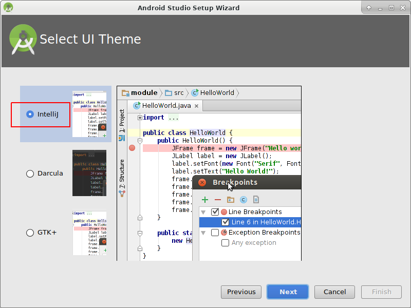
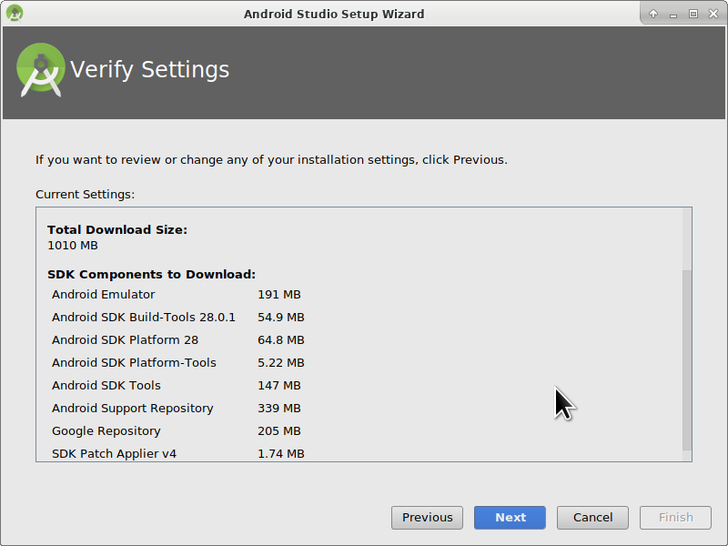
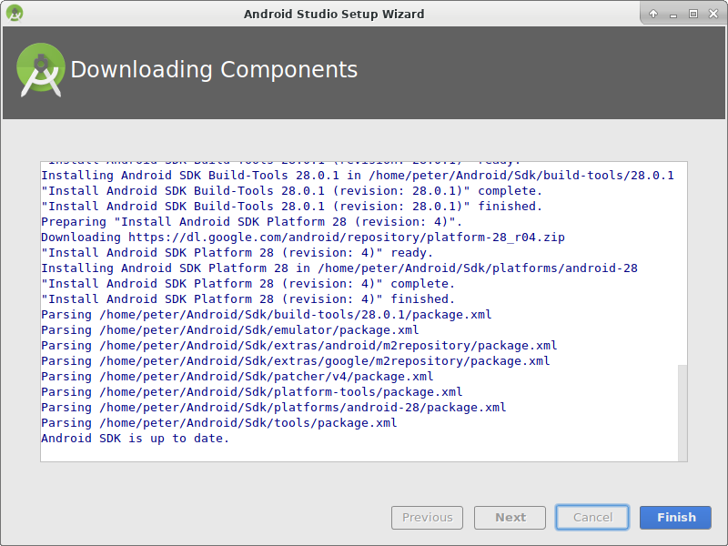
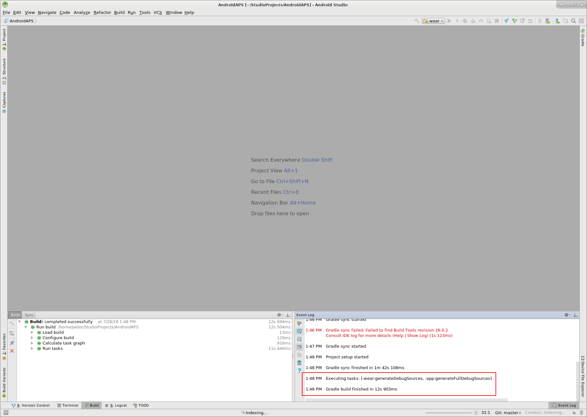

# Sestavení APK

## Vyrobte si místo stažení

**AndroidAPS není k dispozici ke stažení kvůli regulaci zdravotnických zařízení. Je legální vytvořit aplikaci pro své vlastní použití, ale nesmíte dát kopii ostatním! See [FAQ page](../Getting-Started/FAQ.md) for details.**

## ## Důležité poznámky

* Please use **[Android Studio Version 3.5.1](https://developer.android.com/studio/)** or newer to build the apk.
* [Windows 10 32-bit systems](../Installing-AndroidAPS/troubleshooting_androidstudio#unable-to-start-daemon-process) are not supported by Android Studio 3.5.1.

**Configuration on demand** is not supported by the current version of the Android Gradle plugin!

Jestliže vytváření apk selže s chybou "on demand configuration", proveďte následující změnu:

* Open the Preferences window by clicking File > Settings (on Mac, Android Studio > Preferences).
* In the left pane, click Build, Execution, Deployment > Compiler.
* Uncheck the Configure on demand checkbox.
* Click Apply or OK.

* * *

### Tento článek je rozdělený do dvou částí.

* In the overview part there is an explanation on what steps are necessary to build the APK file.
* In the step by step walkthrough part you will find the screenshots of a concrete installation. Because the versions of Android Studio - the software development environment which we will use to build the APK - will change very quickly this will be not identical to your installation but it should give you a good starting point. Android Studio also runs on Windows, Mac OS X and Linux and there might be small differences in some aspects between each platform. If you find that something important is wrong or missing, please inform the facebook group "AndroidAPS users" or in the Gitter chats [Android APS](https://gitter.im/MilosKozak/AndroidAPS) or [AndroidAPSwiki](https://gitter.im/AndroidAPSwiki/Lobby) so that we can have a look at this.

## Přehled

In general, the steps necessary to build the APK file:

* [Install git](../Installing-AndroidAPS/git-install.rst)
* Install and setup Android Studio.
* Use git to clone the source code from the central Github repository where the developers have put the actual code for the app.
* Open the cloned project in Android Studio as active project.
* Build the signed APK.
* Transfer the signed APK to your smartphone.

## Step by step walkthrough

Detailed description of the steps necessary to build the APK file.

## Nainstalujte git (pokud ho ještě nemáte)

Follow the manual on the [git installation page](../Installing-AndroidAPS/git-install.rst).

## Install Android Studio

The following screenshots have been taken from Android Studio Version 3.1.3. Your screen might look a bit different depending on the Android Studio version you use. But you should be able to find your way through. Help from the community is provided for example in the [AndroidAPS Facebook group](https://www.facebook.com/groups/1900195340201874/) and [other places](../Where-To-Go-For-Help/Connect-with-other-users.md).

Install [Android Studio](https://developer.android.com/studio/install.html) and setup during first start.

Select "Do not import settings" as you have not used it before.

Click "Next".

Select "Standard" installation and click "Next".

Select the theme for the user interface you like. (In this manual we used "Intellij". Then click "Next". This is just the color scheme. You can select any you like (i.e. "Darcula" for dark mode). This selection has no influence on building the APK.

Click "Next" on the "Verify Settings" dialog.

The Android emulator (to emulate the smartphone on your PC or Mac) is not used to build the APK. You can click "Finish" to finish the installation and read the documentation later on demand.

Android Studio is downloading a lot of software components it uses. You can click on the "Show Details" button to the what happens but that's not important at all.

After the downloads are completed click the "Finish" button.

* Applause, applause you have now finished the Android Studio installation and can start cloning the source code. Maybe it's time for a short break?

## Set git path in preferences

### Windows

* Let Studio know where is git.exe located: File - Settings
  
  

* In the next window: Version Control - Git

* Choose correct path: .../Git<b>/bin</b>

* Make sure update method "Merge" is selected.
  
  

### Mac

* If you install git via homebrew there is no need to change any preferences. Just in case: They can be found here: Android Studio - Preferences.

## Download code and additional components

* Use git clone in Android Studio as shown in screenshots below. Select "Check out project from Version Control" with "Git" as concrete version control system.

Fill in the URL to the main AndroidAPS repository ("https://github.com/MilosKozak/AndroidAPS") and click "clone".

Android Studio will start cloning. Don't click "Background" as it goes fast and makes things more complicated at the moment.

Finish the checkout from version control with opening the project by clicking "Yes".

Use the standard "default gradle wrapper" and click "OK".

Read and close the "Tip of Day" screen of Android Studio by pressing "Close".

* Excellent, you have your own copy of the source code and are ready to start the build.
* Now we are approaching our first error message. Fortunately, Android Studio will directly give us the solution for this.

Click "Install missing platform(s) and sync project" as Android Studio needs to install a missing platform.

Accept the license agreement by selecting "Accept" and clicking "Next".

As it is said in the dialog please wait until the download is finished.

Now it's finished. Please click "Finish".

Aaaahhh, next error. But Android Studio suggests a similar solution. Click "Install Build Tools and sync project" as Android Studio needs to download missing Tools.

As it is said in the dialog please wait until the download is finished.

Now it's finished. Please click "Finish".

And another error to handle as Android Studio needs to download again a missing platform. Click "Install missing platform(s) and sync project".

As it is said in the dialog please wait until the download is finished.

Now it's finished. Please click "Finish".

Click "Install Build Tools and sync project" as Android Studio needs to download missing Tools.

As it is said in the dialog please wait until the download is finished.

Now it's finished. Please click "Finish".

Yeah, the error messages are gone and the first gradle build is runing. Maybe it's time to drink some water?

Android Studio recommends to update the gradle system. **Never update gradle!** This might lead to difficulties!

Please click "Don't remind me again for this project".

The build is running again.

Yeah, the first build is successful but we are not finished.

## Vytvořte podepsaný soubor APK

V nabídce vyberte „Build“ a pak „Generate Signed Bundle / APK…“. (Nabídka Android Studio se v září 2018 změnila. In older versions select in the menu “Build” and then “Generate Signed APK...”.)

Signing means that you sign your generated app but in a digital way as a kind of digital fingerprint in the app itself. To je nezbytné, protože Android má pravidlo, že z bezpečnostních důvodů přijme pouze podepsaný kód. Pokud se o toto téma zajímáte, můžete si k tomu víc přečíst [zde](https://developer.android.com/studio/publish/app-signing.html#generate-key), ale Bezpečnost je hluboké a komplexní téma a teď ho nepotřebujete.

V následujícím dialogovém okně vyberte „APK“ místo „Android App Bundle“ a klepněte na tlačítko „Next“.

Zvolte „app“ a klepněte na tlačítko „Next“.

Click "Create new..." to start creating your keystore. A keystore in this case is nothing more than a file in which the information for signing is stored. It is encrypted and the information is secured with passwords. We suggest storing it in your home folder and remember the passwords but if you lose this information it's not a big issue because then you just have to create a new one. Best practice is to store this information carefully.

* Fill in the information for the next dialog. 
  * Key store path: is the path to the keystore file. **Do not save in same folder as projekt. You must use a different directory!**
  * The password fields below are for the keystore to double check for typing errors.
  * Alias is a name for the key you need. You can leave the default or give it a fancy name you want.
  * The password fields below the key are for the key itself. As always to double check for typing errors.
  * You can let the validity at the default of 25 years.
  * You only have to fill out first name and last name but feel free to complete the rest of information. Then click "OK".

Fill in the information of the last dialog in this dialog and click "Next".

Select "full" (or "fullRelease") as flavour for the generated app. Select V1 "Jar Signature" (V2 is optional) and click "Finish". Následující údaje mohou být důležité pro pozdější použití.

* Možnost „Release“ by měla být výchozí volbou pro „Build Type“, možnost „Debug“ je pouze pro vývojáře.
* Vyberte typ sestavení, jaký budete chtít. 
  * full / fullRelease (i.e. recommendations automatically enacted in closed looping)
  * openloop (tj. doporučení pro uživatele s otevřenou smyčkou)
  * pumpcontrol (tj. vzdálené ovládání pumpy bez smyčky)
  * nsclient (tj. zobrazují se data jiného uživatele se smyčkou a lze vkládat záznamy ošetření)

V podokně „Event Log“ vidíme, že podepsaný soubor APK byl úspěšně vygenerován.

Klikněte na odkaz „locate“ v podokně „Event Log“.

## Přeneste soubor APK do telefonu

Objeví se okno správce souborů. Na vašem počítači může vypadat trochu jinak, protože já používám systém Linux. Pokud používáte sytém Windows, otevře se Průzkumník souborů, na platformě Mac OS X to bude Finder. V něm byste měli vidět složku s vygenerovaným souborem APK. Toto bohužel není správné umístění, protože „wear-release.apk“ není podepsaný soubor „app“ APK, který hledáme.

Přejděte prosím do složky AndroidAPS/app/full/release a tam vyhledejte soubor „app-full-release.apk“. Přeneste tento soubor do telefonu s Androidem. You can do it on your preferred way, i.e.

* Bluetooth
* cloud upload (Google Drive or other cloud services)
* connect computer and phone by cable 
* by mail (Note that some mail apps do not allow apk attachments, in this case use other transfer method.)

In this example Gmail is used as it is fairly simple. To install the self-signed app you need to allow Android on your smartphone to do this installation even if this file is received via Gmail which is normally forbidden. Pokud použijete jinou metodu, zvolte vhodný postup.

V nastavení telefonu je nabídka (instalovat neznámé aplikace), kde lze povolit instalaci APK souborů, které jsem si poslal přes Gmail.

Vyberte možnost „Povolit z tohoto zdroje“. Po instalaci můžete tuto volbu zase zakázat.

Posledním krokem je klepnout na soubor APK, který jsem přijal přes Gmail, a nainstalovat aplikaci. Pokud se APK nechce nainstalovat a máte v telefonu již starší verzi AndroidAPS, pravděpodobně byla podepsaná jiným klíčem – v tom případě musíte starou verzi nejdřív odinstalovat, avšak nezapomeňte předtím exportovat svá nastavení!

Ano, máte to a můžete začít s úvodní konfigurací AndroidAPS (CGM, inzulínová pumpa) atd.

## Identify receiver if using xDrip

[See xDrip page](../Configuration/xdrip#identify-receiver)

## Poradce při potížích

See separate page [troubleshooting Android Studio](../Installing-AndroidAPS/troubleshooting_androidstudio.rst).