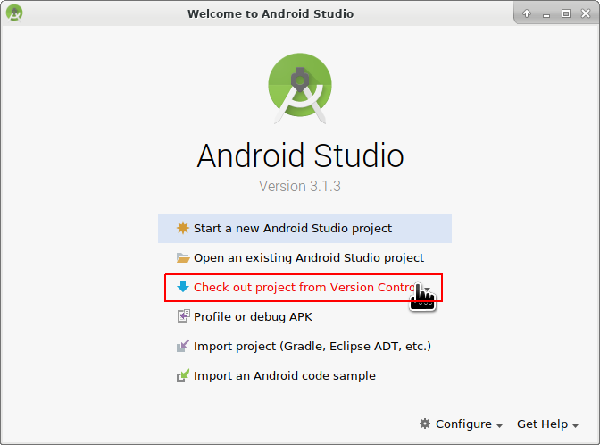

# Sestavení APK

* * *

**Please note** With AndroidAPS version 2.3 it is not possible to build the APK with the latest Android Studio version. Please use Android Studio 3.4 from [here](https://developer.android.com/studio/archive?).

**Please note** when building AndroidAPS 2.0 apk: **Configuration on demand** is not supported by the current version of the Android Gradle plugin!

Jestliže vytváření apk selže s chybou "on demand configuration", proveďte následující změnu:

     * Open the Preferences window by clicking File > Settings (on Mac, Android Studio > Preferences).
     * In the left pane, click Build, Execution, Deployment > Compiler.
     * Uncheck the Configure on demand checkbox.
     * Click Apply or OK.
    

* * *

### Tento článek je rozdělený do dvou částí.

* V části Přehled najdete vysvětlení, které kroky jsou obecně nutné, abyste sestavili soubor APK.
* V části Průvodce krok za krokem najdete snímky obrazovky z konkrétní instalace. Jelikož se Android Studio (vývojové prostředí, které použijeme k sestavení APK) v čase mění velmi rychle, nebudou snímky úplně shodné s vaší instalací, ale určitě vám poskytnou dobrý záchytný bod. Android studio běží na Windows, Linuxu a Mac OS X, a proto mohou být na různých platformách malé rozdíly. Jestliže najdete něco zásadního, co je špatně, nebo vám něco chybí, prosím informujte o tom facebookovou skupinu „AndroidAPS users“ nebo použijte Gitter chat [Android APS](https://gitter.im/MilosKozak/AndroidAPS) nebo [AndroidAPSwiki](https://gitter.im/AndroidAPSwiki/Lobby), abychom se na to mohli podívat.

## Přehled

In general, the steps necessary to build the APK file:

* Instalujte git
* Instalujte a nastavte Android Studio.
* Použijte git, abyste si naklonovali zdrojové kódy z centrálního úložiště na Githubu, kam vývojáři umístili poslední zdrojové kódy aplikace.
* Otevřete naklonovaný projekt v Android Studiu jako aktivní projekt.
* Sestavete podepsané APK.
* Doručte podepsané APK na váš telefon.

## Step by step walkthrough

Detailed description of the steps necessary to build the APK file.

## Install Android Studio

* Instalujte git 
  * [Windows](https://gitforwindows.org/)
  * [Mac OS X](http://sourceforge.net/projects/git-osx-installer/)
  * Linux - prostě instalujte balíček git správcem balíčků z vaší distribuce
* Instalujte [Android Studio](https://developer.android.com/studio/install.html).
* Nastavte Android Studio při prvním spuštění

Select "Do not import settings" as you have not used it before.

Click "Next".

Select "Standard" installation and click "Next".

Select the theme for the user interface you like. (In this manual we used "Intellij". Then click "Next". This is just the color scheme. You can select any you like (i.e. "Darcula" for dark mode). This selection has no influence on building the APK.

Click "Next" on the "Verify Settings" dialog.

The Android emulator (to emulate the smartphone on your PC or Mac) is not used to build the APK. You can click "Finish" to finish the installation and read the documentation later on demand.

Android Studio is downloading a lot of software components it uses. You can click on the "Show Details" button to the what happens but that's not important at all.

After the downloads are completed click the "Finish" button.

* Hurá, hurá, nyní jste dokončili instalaci Android Studia a můžete začít s klonováním zdrojových souborů. Možná je teď vhodná doba na krátkou přestávku?

## Download code and additional components

* Použijte klonování gitu v Android Studiu, jak je vidět na snímku níže. Zvolte "Check out project from Version Control" s "Git" jako konkrétní verzí správce zdrojových kódů.

Fill in the URL to the main AndroidAPS repository ("https://github.com/MilosKozak/AndroidAPS") and click "clone".

Android Studio will start cloning. Don't click "Background" as it goes fast and makes things more complicated at the moment.

Finish the checkout from version control with opening the project by clicking "Yes".

Use the standard "default gradle wrapper" and click "OK".

Read and close the "Tip of Day" screen of Android Studio by pressing "Close".

* Super, máte vlastní kopii zdrojového kódu a jste připraveni na vytvoření Apk.
* Nyní se blížíme k první chybové zprávě. Naštěstí nám Android Studio nabídne její řešení.

Click "Install missing platform(s) and sync project" as Android Studio needs to install a missing platform.

Accept the license agreement by selecting "Accept" and clicking "Next".

As it is said in the dialog please wait until the download is finished.

Now it's finished. Please click "Finish".

Aaaahhh, next error. But Android Studio suggests a similar solution. Click "Install Build Tools and sync project" as Android Studio needs to download missing Tools.

As it is said in the dialog please wait until the download is finished.

Now it's finished. Please click "Finish".

And another error to handle as Android Studio needs to download again a missing platform. Click "Install missing platform(s) and sync project".

As it is said in the dialog please wait until the download is finished.

Now it's finished. Please click "Finish".

Click "Install Build Tools and sync project" as Android Studio needs to download missing Tools.

As it is said in the dialog please wait until the download is finished.

Now it's finished. Please click "Finish".

Yeah, the error messages are gone and the first gradle build is runing. Maybe it's time to drink some water?

Android Studio recommends to update the gradle system. **Never update gradle!** This might lead to difficulties!

Please click "Don't remind me again for this project".

The build is running again.

Yeah, the first build is successful but we are not finished.

## Vytvořte podepsaný soubor APK

V nabídce vyberte „Build“ a pak „Generate Signed Bundle / APK…“. (Nabídka Android Studio se v září 2018 změnila. Ve starších verzích vyberte nabídku „Build“ a pak „Generate Signed APK...“.)  
Podepsání znamená, že podepíšete svou generovanou aplikaci, ale digitálním způsobem, něco jako digitálním otiskem prstu v samotné aplikaci. To je nezbytné, protože Android má pravidlo, že z bezpečnostních důvodů přijme pouze podepsaný kód. Pokud se o toto téma zajímáte, můžete si k tomu víc přečíst [zde](https://developer.android.com/studio/publish/app-signing.html#generate-key), ale Bezpečnost je hluboké a komplexní téma a teď ho nepotřebujete.

V následujícím dialogovém okně vyberte „APK“ místo „Android App Bundle“ a klepněte na tlačítko „Next“.

Zvolte „app“ a klepněte na tlačítko „Next“.

Click "Create new..." to start creating your keystore. A keystore in this case is nothing more than a file in which the information for signing is stored. It is encrypted and the information is secured with passwords. We suggest storing it in your home folder and remember the passwords but if you lose this information it's not a big issue because then you just have to create a new one. Best practice is to store this information carefully.

* Vyplňte údaje pro další dialogové okno. 
  * Key store path: je cesta k vašemu úložišti klíčů
  * Políčka s hesly níže jsou pro úložiště klíčů a jsou zdvojená, aby se zabránilo překlepům.
  * Alias je název pro klíč, který potřebujete. Můžete ponechat výchozí, anebo si vybrat jakýkoli jiný název.
  * Políčka s hesly pod tím jsou pro samotný klíč. Jako vždy jsou zdvojená, aby se zabránilo překlepům.
  * Můžete ponechat "Validity (years)" na výchozí hodnotě 25.
  * Povinná pole jsou pouze jméno a příjmení, ale klidně můžete vyplnit i zbývající údaje. Pak klikněte na tlačítko „OK“.

Fill in the information of the last dialog in this dialog and click "Next".

Zvolte „full“ jako flavour generované aplikace. Zvolte V1 „Jar Signature“ (V2 je volitelné) a klikněte na tlačítko „Finish“. Následující údaje mohou být důležité pro pozdější použití.

* Možnost „Release“ by měla být výchozí volbou pro „Build Type“, možnost „Debug“ je pouze pro vývojáře.
* Vyberte typ sestavení, jaký budete chtít. 
  * full (tj. automatické doporučení pro uzavřenou smyčku)
  * openloop (tj. doporučení pro uživatele s otevřenou smyčkou)
  * pumpcontrol (tj. vzdálené ovládání pumpy bez smyčky)
  * nsclient (tj. zobrazují se data jiného uživatele se smyčkou a lze vkládat záznamy ošetření)

V podokně „Event Log“ vidíme, že podepsaný soubor APK byl úspěšně vygenerován.

Klikněte na odkaz „locate“ v podokně „Event Log“.

## Přeneste soubor APK do telefonu

Objeví se okno správce souborů. Na vašem počítači může vypadat trochu jinak, protože já používám systém Linux. Pokud používáte sytém Windows, otevře se Průzkumník souborů, na platformě Mac OS X to bude Finder. V něm byste měli vidět složku s vygenerovaným souborem APK. Toto bohužel není správné umístění, protože „wear-release.apk“ není podepsaný soubor „app“ APK, který hledáme.

Přejděte prosím do složky AndroidAPS/app/full/release a tam vyhledejte soubor „app-full-release.apk“. Přeneste tento soubor do telefonu s Androidem. Můžete to udělat způsobem, který upřednostňujete, přes Bluetooth, nahráním do cloudu, připojením telefonu k počítači pomocí kabelu nebo přes přílohu e-mailu. Já v této ukázce používám Gmail, jelikož je to pro mě poměrně jednoduché. Zmiňuji to proto, protože instalaci self-signed aplikace (certifikát podepsaný sám sebou) potřebujeme v systému Android výslovně povolit, i když byl soubor přijatý přes Gmail. Standardně je to totiž zakázané. Pokud použijete jinou metodu, zvolte vhodný postup.

V nastavení telefonu je nabídka (instalovat neznámé aplikace), kde lze povolit instalaci APK souborů, které jsem si poslal přes Gmail.

Vyberte možnost „Povolit z tohoto zdroje“. Po instalaci můžete tuto volbu zase zakázat.

Posledním krokem je klepnout na soubor APK, který jsem přijal přes Gmail, a nainstalovat aplikaci. Pokud se APK nechce nainstalovat a máte v telefonu již starší verzi AndroidAPS, pravděpodobně byla podepsaná jiným klíčem – v tom případě musíte starou verzi nejdřív odinstalovat, avšak nezapomeňte předtím exportovat svá nastavení!

Ano, máte to a můžete začít s úvodní konfigurací AndroidAPS (CGM, inzulínová pumpa) atd.