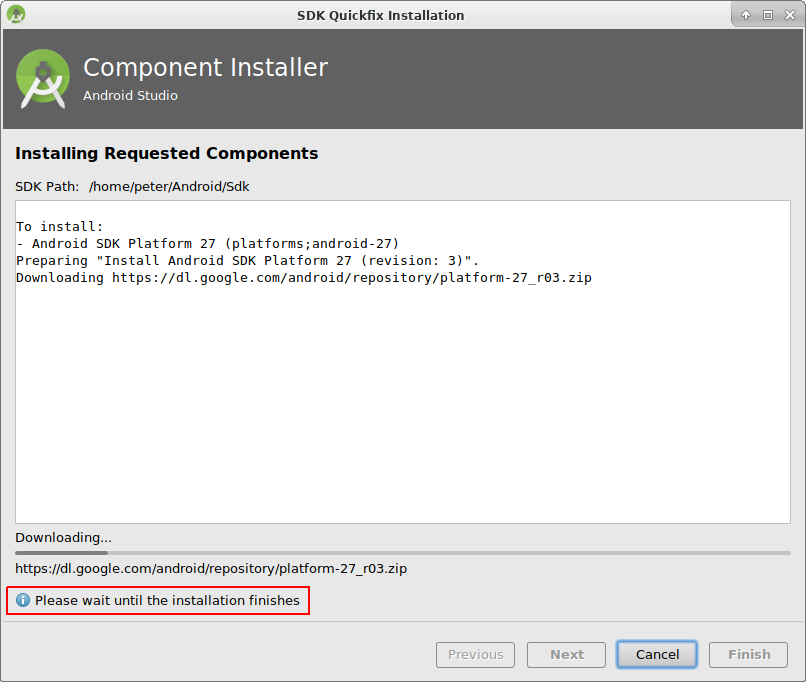

# Sestavení APK

Tento článek je rozdělený do dvou částí.

* In the overview part there is an explanation on what steps are necessary to build the APK file.
* V části průvodce krok za krokem najdete snímky obrazovky z konkrétní instalace. Jelikož se Android Studio (vývojové prostředí, které použijeme k sestavení APK) v čase mění velmi rychle, nebudou snímky úplně shodné s vaší instalací, ale určitě vám poskytnou dobrý záchytný bod. Android Studio also runs on Windows, Mac OS X and Linux and there might be small differences in some aspects between each platform. If you find that something important is wrong or missing, please inform the facebook group "AndroidAPS users" or in the Gitter chats [Android APS](https://gitter.im/MilosKozak/AndroidAPS) or [AndroidAPSwiki](https://gitter.im/AndroidAPSwiki/Lobby) so that we can have a look at this.

## Přehled

Následují obecné kroky k sestavení souboru APK:

* Instalujte git
* Instalujte a nastavte Android Studio.
* Použijte git, abyste si naklonovali zdrojové kódy z centrálního úložiště na Githubu, kam vývojáři umístili poslední zdrojové kódy aplikace.
* Otevřete naklonovaný projekt v Android Studiu jako aktivní projekt.
* Sestavete podepsané APK.
* Doručte podepsané APK na váš telefon.

## Průvodce krok za krokem

Následuje detailní popis kroků nutných k sestavení souboru APK.

* Instalujte git 
  * [Windows](https://gitforwindows.org/)
  * [Mac OS X](http://sourceforge.net/projects/git-osx-installer/)
  * Linux - prostě instalujte balíček git správcem balíčků z vaší distribuce
* Instalujte [Android Studio](https://developer.android.com/studio/install.html).
* Nastavte Android Studio při prvním spuštění

Zvolte "Do not import settings", protože jste tento software zatím nevyužívali.

Klikněte na "Next".

Vyberte "Standard" instalaci a klikněte na "Next".

Vyberte "Intellij" jako schéma uživatelského prostředí a klikněte na "Next".

Klikněte na "Next" v dialogovém okně "Verify Settings".

Emulátor Androidu (pro simulaci telefonu na vašem PC nebo Macu) se pro sestavení APK nepoužívá. Můžete kliknout na "Finish", abyste dokončili instalaci a odložili četbu dokumentace později na vyžádání.

Android Studio stahuje velké množství softwarových komponent, které používá. Můžete kliknout na tlačítko "Show Details" pro zobrazení detailů, které ale vůbec nejsou důležité.

Jakmile jsou stahování dokončena, klikněte na tlačítko "Finish".

* Hurá, hurá, nyní jste dokončili instalaci Android Studia a můžete začít s klonováním zdrojových souborů. Maybe it's time for a short break?

* Použijte klonování gitu v Android Studiu, jak je vidět na snímku níže. Zvolte "Check out project from Version Control" s "Git" jako konkrétní verzí správce zdrojových kódů.

 

Zadejte URL adresu do hlavního úložiště AndroidAPS ("https://github.com/MilosKozak/AndroidAPS") a klepněte na "Clone".

Android Studio začne s klonováním. Don't click "Background" as it goes fast and makes things more complicated at the moment.

Dokončete načtení projektu od správce zdrojových kódů kliknutím na "Yes", což projekt otevře.

Použijte standardní "default gradle wrapper" a klikněte na "OK".

Read and close the "Tip of Day" screen of Android Studio by pressing "Close".

* Excellent, you have your own copy of the source code and are ready to start the build.
* Now we are approaching our first error message. Fortunately, Android Studio will directly give us the solution for this.

Klikněte na "Install missing platform(s) and sync project", protože Android Studio potřebuje doinstalovat chybějící platformu.

Přijměte licenční ujednání zvolením "Accept" a kliknutím na "Next".

Jak již bylo řečeno v dialogovém okně, počkejte, než se stahování dokončí.

Nyní je dokončené. Prosím, klikněte na "Finish".

Aaaach, další chyba. Ale Android Studio navrhuje podobné řešení. Klikněte na "Install Build Tools and sync project", protože Android Studio potřebuje stáhnout chybějící pomůcky.

Jak již bylo řečeno v dialogovém okně, počkejte, než se stahování dokončí.

Nyní je dokončené. Prosím, klikněte na "Finish".

A další chyba k řešení, protože Android Studio potřebuje zase stáhnout chybějící platformu. Klikněte na "Install missing platform(s) and sync project".

Jak již bylo řečeno v dialogovém okně, počkejte, než se stahování dokončí.

Nyní je dokončené. Prosím, klikněte na "Finish".

Klikněte na "Install Build Tools and sync project", protože Android Studio potřebuje stáhnout chybějící pomůcky.

Jak již bylo řečeno v dialogovém okně, počkejte, než se stahování dokončí.

Nyní je dokončené. Prosím, klikněte na "Finish".

Ano, chybové zprávy jsou pryč a první gradle sestavení běží. Maybe it's time to drink some water?

Android Studio recommends we now update the gradle system to version 4.4. If you made this build for an AndroidAPS version before the release of at least a release candidate(RC) of version 2.0 do not follow this recommendation. Otherwise, the build will fail. Systém gradle je pomůcka Android Studia, která řídí proces sestavení. For AndroidAPS there is no disadvantage to using the old gradle version. Soubor APK se ve výsledku nebude lišit. Pokud sestavujete APK pro verzi AndroidAPS 2, klidně můžete aktualizovat gradle systém na verzi 4.4. Prosím klikněte na "Remind me tomorrow".

Sestavení zase běží.

Ano, první sestavení bylo úspěšné, ale ještě nejsme hotoví.

V menu "Build" zvolte "Generate Signed APK...". Signing means that you sign your generated app but in a digital way as a kind of digital fingerprint in the app itself. That is necessary because Android has a rule that it only accepts signed code to run for security reasons. For more information on this topic, follow the link [here](https://developer.android.com/studio/publish/app-signing.html#generate-key) Security is a deep and complex topic and you don't need this now.

Zvolte "app" a klikněte na "Next".

Click "Create new..." to start creating your keystore. A keystore in this case is nothing more than a file in which the information for signing is stored. It is encrypted and the information is secured with passwords. We suggest storing it in your home folder and remember the passwords but if you lose this information it's not a big issue because then you just have to create a new one. Best practice is to store this information carefully.

* Vyplňte údaje pro další dialogové okno. 
  * Key store path: je cesta k vašemu úložišti klíčů
  * The password fields below are for the keystore to double check for typing errors.
  * Alias je název pro klíč, který potřebujete. You can leave the default or give it a fancy name you want.
  * The password fields below the key are for the key itself. As always to double check for typing errors.
  * Můžete ponechat "Validity (years)" na výchozí hodnotě 25.
  * You only have to fill out firstname and lastname but feel free to complete the rest of information. Pak klikněte na "OK".

Vyplňte údaje posledního dialogového okna a klikněte na "Next".

Zvolte "full" jako flavour generované aplikace. Zvolte V1 "Jar Signature" (V2 je volitelné) a klikněte na "Finish". Následující údaje mohou být důležité pro pozdější použití.

* "Release" by měla být výchozí volba pro "Build Type", "Debug" je pouze pro vývojáře.
* Vyberte typ sestavení, jaký budete chtít. 
  * full (tj. automatické doporučení pro uzavřenou smyčku)
  * openloop (tj. doporučení pro uživatele s otevřenou smyčkou)
  * pumpcontrol (tj. vzdálené ovládání pumpy bez smyčky)
  * nsclient (tj. zobrazují se data jiného uživatele se smyčkou a lze vkládat vstupy ošetření)

V podokně "Event Log" vidíme, že podepsaný soubor APK byl úspěšně vygenerován.

Klikněte na odkaz "locate" v podokně "Event Log".

Objeví se správce souborů. It might look a bit different on your system as I am using Linux. Na Windows systémech to bude Průzkumník souborů a na Mac OS X to bude Finder. There you should see the directory with the generated APK file. Unfortunately this is the wrong place as "wear-release.apk" is not the signed "app" APK we are searching for.

Please change to the directory AndroidAPS/app/full/release to find the "app-full-release.apk" file. Dopravte tento soubor na váš Android telefon. You can do it on your preferred way, i.e. Bluetooth, cloud upload or email. Já zde na ukázku používám Gmail, jelikož je to pro mě dost jednoduché. I mention this because to install the self-signed app we need to allow Android on our smartphone to do this installation even if this file is received via Gmail which is normally forbidden. Pokud používáte něco jiného, prosím, postupujte adekvátně.

In the settings of your smartphone there is an area "unknown apps install" where I have to give Gmail the right to install APK files which I get via Gmail.

Vyberte "Povolit z tohoto zdroje". Po instalaci tuto volbu zase můžete zakázat.

Posledním krokem je kliknout na soubor APK, který jsem přijal Gmailem a instalovat aplikaci. Pokud se APK nechce nainstalovat a máte v telefonu již starší verzi AndroidAPS, pravděpodobně byla podepsaná jiným klíčem - pak musíte starou verzi nejdřív odinstalovat, nezapomeňte ale před tím exportovat svá nastavení!

Ano, máte to a můžete začít s úvodní konfigurací AndroidAPS (CGM, inzulínová pumpa), atd.