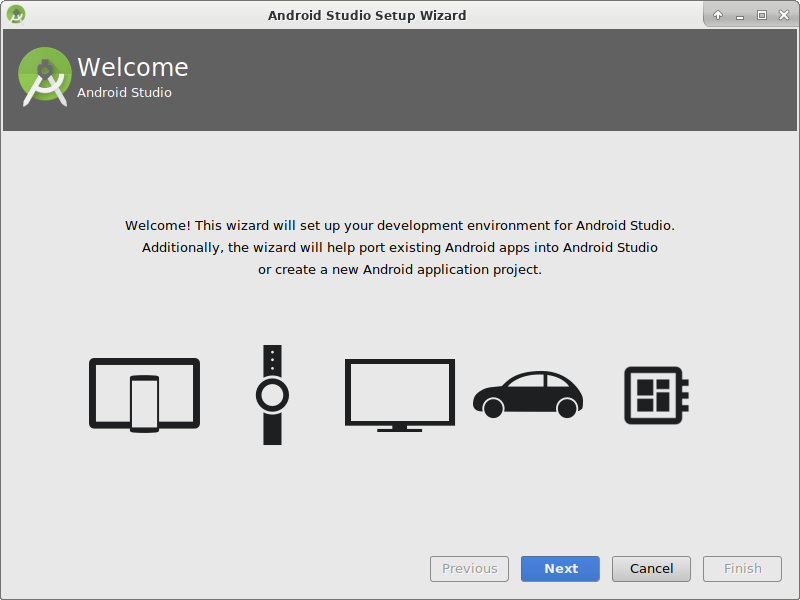
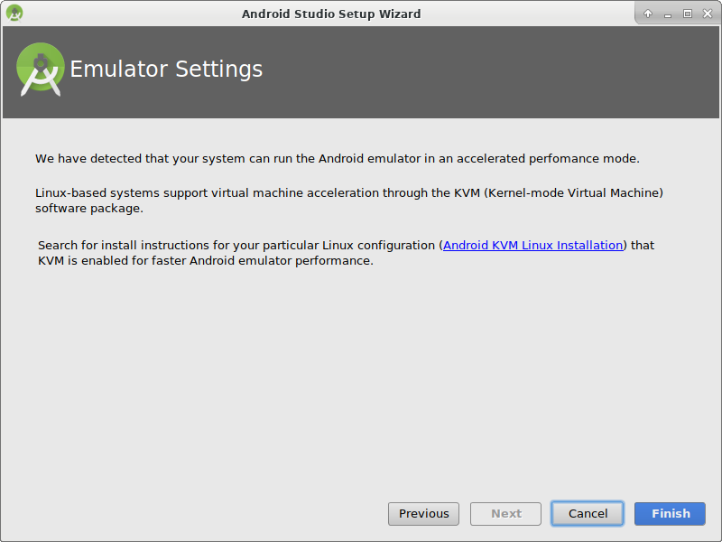
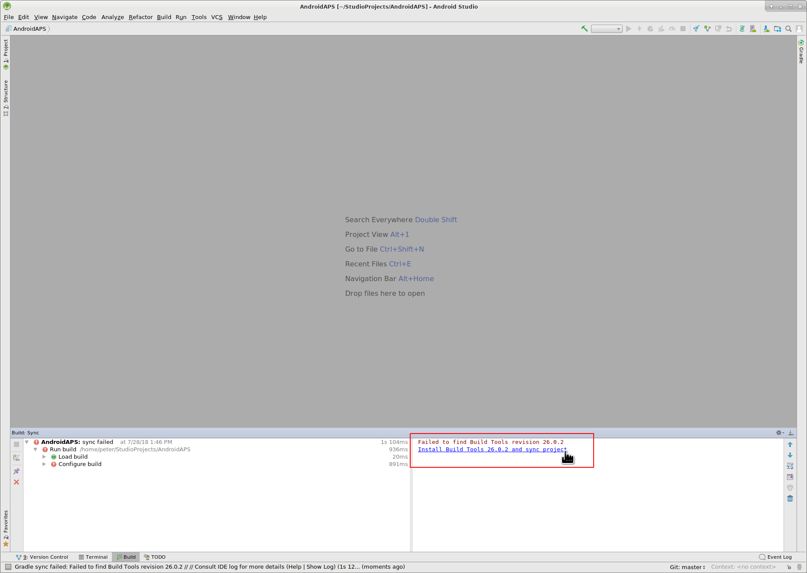

# Sestavení APK

* * *

**Poznámka** U AndroidAPS verze 2.3 není možné sestavit soubor APK s nejnovější verzí programu Android Studio. Použijte prosím Android Studio 3.4 z [tohoto](https://developer.android.com/studio/archive?) umístění.

**Poznámka** Při vytváření AndroidAPS 2.0 apk: **Konfigurace na vyžádání** není v aktuální verzi Android Gradle pluginu podporována!

Jestliže vytváření apk selže s chybou "on demand configuration", proveďte následující změnu:

* Otevřete okno Preferences klepnutím na File > Settings (na platformě Mac, Android Studio > Preferences).
* V levé části pak na Build, Execution, Deployment > Compiler.
* Zrušte označení možnosti Configure on demand.
* Klepněte na tlačítko použít nebo OK.

* * *

### Tento článek je rozdělený do dvou částí.

* In the overview part there is an explanation on what steps are necessary to build the APK file.
* In the step by step walkthrough part you will find the screenshots of a concrete installation. Because the versions of Android Studio - the software development environment which we will use to build the APK - will change very quickly this will be not identical to your installation but it should give you a good starting point. Android Studio also runs on Windows, Mac OS X and Linux and there might be small differences in some aspects between each platform. If you find that something important is wrong or missing, please inform the facebook group "AndroidAPS users" or in the Gitter chats [Android APS](https://gitter.im/MilosKozak/AndroidAPS) or [AndroidAPSwiki](https://gitter.im/AndroidAPSwiki/Lobby) so that we can have a look at this.

## Přehled

Následují obecné kroky k sestavení souboru APK:

* Install git
* Install and setup Android Studio.
* Use git to clone the source code from the central Github repository where the developers have put the actual code for the app.
* Open the cloned project in Android Studio as active project.
* Build the signed APK.
* Transfer the signed APK to your smartphone.

## Průvodce krok za krokem

Následuje detailní popis kroků nutných k sestavení souboru APK.

## Nainstalujte Android Studio

* Install git 
  * [Windows](https://gitforwindows.org/)
  * [Mac OS X](http://sourceforge.net/projects/git-osx-installer/)
  * Linux - just install a package git via package manager of your distribution
* Install [Android Studio](https://developer.android.com/studio/install.html).
* Setup Android Studio during first start

Zvolte "Do not import settings" (Neimportovat nastavení), protože jste tento software zatím nevyužívali.

Klikněte na "Next".

Vyberte "Standard" instalaci a klikněte na "Next".

Vyberte si motiv uživatelského rozhraní, který se vám líbí. (V tomto návodu používáme "Intellij". Poté klikněte na tlačítko „Next“. Jedná se pouze o barevný motiv. Můžete si vybrat jakýkoli jiný (např. „Darcula“ pro tmavý režim). Tato volba nemá žádný vliv na sestavení APK.

Klikněte na "Next" v dialogovém okně "Verify Settings".

Emulátor Androidu (pro simulaci telefonu na vašem PC nebo Macu) se pro sestavení APK nepoužívá. Můžete kliknout na "Finish", abyste dokončili instalaci a odložili četbu dokumentace později na vyžádání.

Android Studio stahuje velké množství softwarových komponent, které používá. Můžete kliknout na tlačítko "Show Details" pro zobrazení detailů, které ale vůbec nejsou důležité.

Jakmile jsou stahování dokončena, klikněte na tlačítko "Finish".

* Applause, applause you have now finished the Android Studio installation and can start cloning the source code. Maybe it's time for a short break?

## Stáhněte si kód a další komponenty

* Use git clone in Android Studio as shown in screenshots below. Select "Check out project from Version Control" with "Git" as concrete version control system.

Zadejte URL adresu do hlavního úložiště AndroidAPS ("https://github.com/MilosKozak/AndroidAPS") a klikněte na „Clone“.

Android Studio začne s klonováním. Neklikejte na "Background", což by věci nyní pouze zkomplikovalo.

Dokončete načtení projektu od správce zdrojových kódů kliknutím na „Yes“, čímž projekt otevřete.

Použijte standardní „default gradle wrapper“ a klikněte na „OK“.

Přečtěte si okno „Tip of Day“ a kliknutím na tlačítko „Close“ je zavřete.

* Excellent, you have your own copy of the source code and are ready to start the build.
* Now we are approaching our first error message. Fortunately, Android Studio will directly give us the solution for this.

Klikněte na „Install missing platform(s) and sync project“, protože Android Studio potřebuje doinstalovat chybějící platformu.

Přijměte licenční ujednání zvolením „Accept“ a kliknutím na tlačítko „Next“.

Jak již bylo řečeno v dialogovém okně, počkejte, než se stahování dokončí.

Nyní je dokončené. Prosím, klikněte na tlačítko „Finish“.

Aaaach, další chyba. Ale Android Studio navrhuje podobné řešení. Klikněte na „Install Build Tools and sync project“, protože Android Studio potřebuje stáhnout chybějící pomůcky.

Jak již bylo řečeno v dialogovém okně, počkejte, než se stahování dokončí.

Nyní je dokončené. Prosím, klikněte na tlačítko „Finish“.

A další chyba k řešení, protože Android Studio potřebuje zase stáhnout chybějící platformu. Klikněte na „Install missing platform(s) and sync project“.

Jak již bylo řečeno v dialogovém okně, počkejte, než se stahování dokončí.

Nyní je dokončené. Prosím, klikněte na tlačítko „Finish“.

Klikněte na „Install Build Tools and sync project“, protože Android Studio potřebuje stáhnout chybějící pomůcky.

Jak již bylo řečeno v dialogovém okně, počkejte, než se stahování dokončí.

Nyní je dokončené. Prosím, klikněte na tlačítko „Finish“.

Ano, chybové zprávy jsou pryč a první gradle sestavení běží. Možná je čas dát si trochu vody?

Android Studio doporučuje aktualizaci systému gradle. **Nikdy neaktualizujte gradle!** Mohlo by to vše zkomplikovat!

Klikněte prosím na „Znovu nepřipomínat pro tento projekt“.

Sestavení zase běží.

Ano, první sestavení bylo úspěšné, ale ještě nejsme hotoví.

## Vytvořte podepsaný soubor APK

V nabídce vyberte „Build“ a pak „Generate Signed Bundle / APK…“. (Nabídka Android Studio se v září 2018 změnila. In older versions select in the menu “Build” and then “Generate Signed APK...”.)

Signing means that you sign your generated app but in a digital way as a kind of digital fingerprint in the app itself. To je nezbytné, protože Android má pravidlo, že z bezpečnostních důvodů přijme pouze podepsaný kód. Pokud se o toto téma zajímáte, můžete si k tomu víc přečíst [zde](https://developer.android.com/studio/publish/app-signing.html#generate-key), ale Bezpečnost je hluboké a komplexní téma a teď ho nepotřebujete.

V následujícím dialogovém okně vyberte „APK“ místo „Android App Bundle“ a klepněte na tlačítko „Next“.

Zvolte „app“ a klepněte na tlačítko „Next“.

Click "Create new..." to start creating your keystore. A keystore in this case is nothing more than a file in which the information for signing is stored. It is encrypted and the information is secured with passwords. We suggest storing it in your home folder and remember the passwords but if you lose this information it's not a big issue because then you just have to create a new one. Best practice is to store this information carefully.

* Fill in the information for the next dialog. 
  * Key store path: is the path to the keystore file
  * The password fields below are for the keystore to double check for typing errors.
  * Alias is a name for the key you need. You can leave the default or give it a fancy name you want.
  * The password fields below the key are for the key itself. As always to double check for typing errors.
  * You can let the validity at the default of 25 years.
  * You only have to fill out first name and last name but feel free to complete the rest of information. Then click "OK".

Fill in the information of the last dialog in this dialog and click "Next".

Zvolte „full“ jako flavour generované aplikace. Zvolte V1 „Jar Signature“ (V2 je volitelné) a klikněte na tlačítko „Finish“. Následující údaje mohou být důležité pro pozdější použití.

* Možnost „Release“ by měla být výchozí volbou pro „Build Type“, možnost „Debug“ je pouze pro vývojáře.
* Vyberte typ sestavení, jaký budete chtít. 
  * full (tj. automatické doporučení pro uzavřenou smyčku)
  * openloop (tj. doporučení pro uživatele s otevřenou smyčkou)
  * pumpcontrol (tj. vzdálené ovládání pumpy bez smyčky)
  * nsclient (tj. zobrazují se data jiného uživatele se smyčkou a lze vkládat záznamy ošetření)

V podokně „Event Log“ vidíme, že podepsaný soubor APK byl úspěšně vygenerován.

Klikněte na odkaz „locate“ v podokně „Event Log“.

## Přeneste soubor APK do telefonu

Objeví se okno správce souborů. Na vašem počítači může vypadat trochu jinak, protože já používám systém Linux. Pokud používáte sytém Windows, otevře se Průzkumník souborů, na platformě Mac OS X to bude Finder. V něm byste měli vidět složku s vygenerovaným souborem APK. Toto bohužel není správné umístění, protože „wear-release.apk“ není podepsaný soubor „app“ APK, který hledáme.

Přejděte prosím do složky AndroidAPS/app/full/release a tam vyhledejte soubor „app-full-release.apk“. Přeneste tento soubor do telefonu s Androidem. Můžete to udělat způsobem, který upřednostňujete, přes Bluetooth, nahráním do cloudu, připojením telefonu k počítači pomocí kabelu nebo přes přílohu e-mailu. Já v této ukázce používám Gmail, jelikož je to pro mě poměrně jednoduché. Zmiňuji to proto, protože instalaci self-signed aplikace (certifikát podepsaný sám sebou) potřebujeme v systému Android výslovně povolit, i když byl soubor přijatý přes Gmail. Standardně je to totiž zakázané. Pokud použijete jinou metodu, zvolte vhodný postup.

V nastavení telefonu je nabídka (instalovat neznámé aplikace), kde lze povolit instalaci APK souborů, které jsem si poslal přes Gmail.

Vyberte možnost „Povolit z tohoto zdroje“. Po instalaci můžete tuto volbu zase zakázat.

Posledním krokem je klepnout na soubor APK, který jsem přijal přes Gmail, a nainstalovat aplikaci. Pokud se APK nechce nainstalovat a máte v telefonu již starší verzi AndroidAPS, pravděpodobně byla podepsaná jiným klíčem – v tom případě musíte starou verzi nejdřív odinstalovat, avšak nezapomeňte předtím exportovat svá nastavení!

Ano, máte to a můžete začít s úvodní konfigurací AndroidAPS (CGM, inzulínová pumpa) atd.