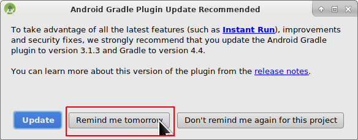

# Sestavení APK

* * *

***Mějte prosím na paměti** při vytváření AndroidAPS 2.0 apk: **Konfigurace na vyžádání** není podporována v aktuální verzi Android Gradle pluginu! Jestliže vytváření apk selže s chybou "on demand configuration", proveďte následující změnu:*

     * * Otevřete okno Preferences klepnutím na File > Settings (v systému Mac, Android Studio > Preferences). *
     * * V levém podokně klepněte na Build, Execution, Deployment > Compiler.*
     * * Zrušte zaškrtnutí políčka Configure on demand.*
    

## * *Klepněte na tlačítko použít nebo OK.*

### Tento článek je rozdělený do dvou částí.

* V části Přehled najdete vysvětlení, které kroky jsou obecně nutné, abyste sestavili soubor APK.
* V části Průvodce krok za krokem najdete snímky obrazovky z konkrétní instalace. Jelikož se Android Studio (vývojové prostředí, které použijeme k sestavení APK) v čase mění velmi rychle, nebudou snímky úplně shodné s vaší instalací, ale určitě vám poskytnou dobrý záchytný bod. Android studio běží na Windows, Linuxu a Mac OS X, a proto mohou být na různých platformách malé rozdíly. Jestliže najdete něco zásadního, co je špatně, nebo vám něco chybí, prosím informujte o tom facebookovou skupinu „AndroidAPS users“ nebo použijte Gitter chat [Android APS](https://gitter.im/MilosKozak/AndroidAPS) nebo [AndroidAPSwiki](https://gitter.im/AndroidAPSwiki/Lobby), abychom se na to mohli podívat.

## Přehled

Následují obecné kroky k sestavení souboru APK:

* Instalujte git
* Instalujte a nastavte Android Studio.
* Použijte git, abyste si naklonovali zdrojové kódy z centrálního úložiště na Githubu, kam vývojáři umístili poslední zdrojové kódy aplikace.
* Otevřete naklonovaný projekt v Android Studiu jako aktivní projekt.
* Sestavete podepsané APK.
* Doručte podepsané APK na váš telefon.

## Průvodce krok za krokem

Následuje detailní popis kroků nutných k sestavení souboru APK.

### Install Android Studio

* Instalujte git 
  * [Windows](https://gitforwindows.org/)
  * [Mac OS X](http://sourceforge.net/projects/git-osx-installer/)
  * Linux - prostě instalujte balíček git správcem balíčků z vaší distribuce
* Instalujte [Android Studio](https://developer.android.com/studio/install.html).
* Nastavte Android Studio při prvním spuštění

Zvolte "Do not import settings", protože jste tento software zatím nevyužívali.

Klikněte na "Next".

Vyberte "Standard" instalaci a klikněte na "Next".

Vyberte "Intellij" jako schéma uživatelského prostředí a klikněte na "Next".

Klikněte na "Next" v dialogovém okně "Verify Settings".

Emulátor Androidu (pro simulaci telefonu na vašem PC nebo Macu) se pro sestavení APK nepoužívá. Můžete kliknout na "Finish", abyste dokončili instalaci a odložili četbu dokumentace později na vyžádání.

Android Studio stahuje velké množství softwarových komponent, které používá. Můžete kliknout na tlačítko "Show Details" pro zobrazení detailů, které ale vůbec nejsou důležité.

Jakmile jsou stahování dokončena, klikněte na tlačítko "Finish".

* Applause, applause you have now finished the Android Studio installation and can start cloning the source code. Maybe it's time for a short break?

### Generate signed APK

* Use git clone in Android Studio as shown in screenshots below. Select "Check out project from Version Control" with "Git" as concrete version control system.

 

Zadejte URL adresu do hlavního úložiště AndroidAPS ("https://github.com/MilosKozak/AndroidAPS") a klepněte na "Clone".

Android Studio začne s klonováním. Neklikejte na "Background", což by věci nyní pouze zkomplikovalo.

Dokončete načtení projektu od správce zdrojových kódů kliknutím na "Yes", což projekt otevře.

Použijte standardní "default gradle wrapper" a klikněte na "OK".

Přečtěte si okno "Tip of Day" a kliknutím na "Close" je zavřete.

* Excellent, you have your own copy of the source code and are ready to start the build.
* Now we are approaching our first error message. Fortunately, Android Studio will directly give us the solution for this.

Klikněte na "Install missing platform(s) and sync project", protože Android Studio potřebuje doinstalovat chybějící platformu.

Přijměte licenční ujednání zvolením "Accept" a kliknutím na "Next".

Jak již bylo řečeno v dialogovém okně, počkejte, než se stahování dokončí.

Nyní je dokončené. Prosím, klikněte na "Finish".

Aaaach, další chyba. Ale Android Studio navrhuje podobné řešení. Klikněte na "Install Build Tools and sync project", protože Android Studio potřebuje stáhnout chybějící pomůcky.

Jak již bylo řečeno v dialogovém okně, počkejte, než se stahování dokončí.

Nyní je dokončené. Prosím, klikněte na "Finish".

A další chyba k řešení, protože Android Studio potřebuje zase stáhnout chybějící platformu. Klikněte na "Install missing platform(s) and sync project".

Jak již bylo řečeno v dialogovém okně, počkejte, než se stahování dokončí.

Nyní je dokončené. Prosím, klikněte na "Finish".

Klikněte na "Install Build Tools and sync project", protože Android Studio potřebuje stáhnout chybějící pomůcky.

Jak již bylo řečeno v dialogovém okně, počkejte, než se stahování dokončí.

Nyní je dokončené. Prosím, klikněte na "Finish".

Ano, chybové zprávy jsou pryč a první gradle sestavení běží. Možná je čas dát si trochu vody?

Android Studio nám doporučuje, abychom nyní aktualizovali systém gradle na verzi 4.4. Jestliže děláte sestavení pro verzi AndroidAPS, která předchází alespoň release kandidátovi (RC) verze 2.0, neřiďte se tímto doporučením. Jinak sestavení selže. Systém gradle je pomůcka Android Studia, která řídí proces sestavení. Pro AndroidAPS není žádná nevýhoda, když použijete starou verzi gradle. Soubor APK se ve výsledku nebude lišit. Pokud sestavujete APK pro verzi AndroidAPS 2, klidně můžete aktualizovat gradle systém na verzi 4.4. Prosím klikněte na "Remind me tomorrow".

Sestavení zase běží.

Ano, první sestavení bylo úspěšné, ale ještě nejsme hotoví.

V menu "Build" zvolte "Generate Signed APK...". Podepsání znamená, že podepíšete vygenerovanou aplikaci, ale digitálním způsobem, jakoby nějakým digitálním otiskem prstu uvnitř samotné aplikace. To je nezbytné, protože Android má pravidlo, že z bezpečnostních důvodů přijme pouze podepsaný kód. Pokud se o toto téma zajímáte, můžete si k tomu přečíst více informací [tady](https://developer.android.com/studio/publish/app-signing.html#generate-key), ale bezpečnost je hluboké a komplexní téma a teď ho nepotřebujete.

Zvolte "app" a klikněte na "Next".

Klikněte na "Create new...", abyste začali připravovat úložiště svých klíčů. Úložiště klíčů v tomto případě není nic jiného než soubor, ve kterém jsou uložené podepisovací informace. Je zašifrované a údaje jsou zabezpečené hesly. Doporučujeme, abyste si ho uložili do své domovské složky a zapamatovali si hesla. Kdybyste však tyto informace ztratili, nebyl by to tak velký problém, protože potom byste prostě museli vytvořit nové úložiště klíčů. Ale lepší je tyto údaje pečlivě uložit.

* Fill in the information for the next dialog. 
  * Key store path: is the path to the keystore file
  * The password fields below are for the keystore to double check for typing errors.
  * Alias is a name for the key you need. You can leave the default or give it a fancy name you want.
  * The password fields below the key are for the key itself. As always to double check for typing errors.
  * You can let the validity at the default of 25 years.
  * You only have to fill out firstname and lastname but feel free to complete the rest of information. Then click "OK".

Vyplňte údaje posledního dialogového okna a klikněte na "Next".

Zvolte "full" jako flavour generované aplikace. Zvolte V1 "Jar Signature" (V2 je volitelné) a klikněte na "Finish". Následující údaje mohou být důležité pro pozdější použití.

* 'Release' should be your default choice for "Build Type", 'Debug' is just for people coding.
* Select the build type you want to build. 
  * full (i.e. recommendations automatically enacted in closed looping)
  * openloop (i.e. recommendations given to user to manually enact)
  * pumpcontrol (i.e. remote control for pump, no looping)
  * nsclient (i.e. looping data of another user is displayed and careportal entries can be added)

V podokně "Event Log" vidíme, že podepsaný soubor APK byl úspěšně vygenerován.

Klikněte na odkaz "locate" v podokně "Event Log".

### Transfer APK to smartphone

Objeví se správce souborů. Na vašem počítači může vypadat trochu odlišně, já např. používám Linux. Na Windows systémech to bude Průzkumník souborů a na Mac OS X to bude Finder. V něm byste měli vidět složku s vygenerovaným souborem APK. Bohužel je toto nesprávné místo, protože "wear-release.apk" není podepsané "app" APK, které hledáme.

Běžte prosím do složky AndroidAPS/app/full/release, abyste našli soubor "app-full-release.apk". Přeneste tento soubor do telefonu s Androidem. Můžete to udělat svým oblíbeným způsobem, např. přes bluetooth, cloud uploadem nebo e-mailem. Já zde na ukázku používám Gmail, jelikož je to pro mě dost jednoduché. Zmiňuji to proto, protože instalaci samo-podepsané aplikace potřebujeme v systému Android výslovně povolit, i když byl soubor přijatý přes Gmail. Standardně je to totiž zakázané. Pokud používáte něco jiného, prosím, postupujte adekvátně.

V nastavení svého telefonu je místo, kde mohu povolit instalaci APK souborů, které jsem si poslal přes Gmail.

Vyberte "Povolit z tohoto zdroje". Po instalaci tuto volbu zase můžete zakázat.

Posledním krokem je kliknout na soubor APK, který jsem přijal Gmailem a instalovat aplikaci. Pokud se APK nechce nainstalovat a máte v telefonu již starší verzi AndroidAPS, pravděpodobně byla podepsaná jiným klíčem - pak musíte starou verzi nejdřív odinstalovat, nezapomeňte ale před tím exportovat svá nastavení!

Ano, máte to a můžete začít s úvodní konfigurací AndroidAPS (CGM, inzulínová pumpa), atd.