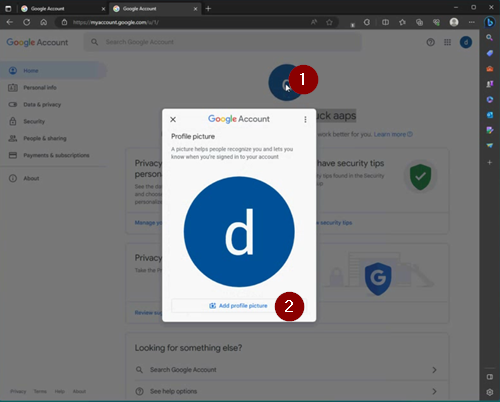

# Vyhrazený Google účet pro AAPS (volitelné)

Někteří uživatelé **AAPS** raději používají svůj hlavní e-mailový účet i pro **AAPS**. Naopak jiní uživatelé **AAPS** (nebo jejich pečovatelé) raději používají e-mailový účet určený pouze pro **AAPS**. Toto není povinné, ale níže uvádíme příklad, jak to nastavit.

Pokud nemáte zájem nastavit pro **AAPS** vyhrazený Gmail účet, můžete přejít přímo k dalšímu oddílu dokumentace, [Sestavení AAPS](building-AAPS.md).

:::{admonition} Výhody Google účtu určeného pouze pro AAPS

- Díky vyhrazenému prostoru na Google drive nebudete riskovat, že si zaplníte prostor na vašem osobním Google drive **Exporty konfigurace**.
- Každá veze **AAPS** (a podpůrných aplikací jako xdrip+, BYODA a další) bude uložena na jednom místě nezávisle na vašem počítačovém harwaru. Pokud přijdete o váš počítač nebo telefon kvůli krádeži, ztrátě nebo poruše, budete mít k souborům stále přístup.
- Harmonizací nastavení usnadníte online podporu mezi uživateli díky obdobné struktuře složek.
- V závislosti na nastavení (viz níže) budete mít samostatnou identitu jako alias ke komunikaci v rámci komunity, která může chránit vaše soukromí.
- Děti s cukrovkou I. typu si tak mohou zachovat svůj "každodenní" e-mailový účet jako nezletilí, zatímco mohou používat **AAPS** a související funkce, které vyžadují účet pro dospělé.
- Gmail vám umožňuje registrovat až 4 účty pod stejným telefonním číslem.
  :::

## Jak nastavit Google účet určený pouze pro AAPS

(⌛Asi 10 minut)

Požadavky:

- Máte Windows PC (Windows 10 nebo novější) a Android telefon (Android 9 nebo novější), na kterém se bude provozovat aplikace **AAPS**. Obě tato zařízení mají nainstalované všechny nejnovější bezpečnostní aktualizace, přístup k Internetu a administrátorská oprávnění, protože některé kroky vyžadují stažení a instalaci programů.
- Android telefonu je už nastaven s vaší osobní každodenní e-mailovou adresou, například Gmailovým účtem.

:::{admonition} Věci ke zvážení před nastavením nového účtu
:class: rozevírací seznam

- Místo vašeho vlastního jména můžete použít přezdívku, která má pro účet význam (jako t1dsuperstar) z důvodu ochrany soukromí. Pak ji můžete používat na veřejných **AAPS** fórech a zároveň si uchovat soukromí ohledně vaší vlastní identity. Ale vzhledem k tomu, že Google vyžaduje obnovovací e-mail a telefonní číslo, je i tento účet stále vysledovatelný.
- Nový **AAPS** účet bude využívat pro ověření stejné telefonní číslo jako váš "každodenní" účet. K ověření se bude používat vaše "každodenní" adresa;
- Nastavíme přesměrování e-mailů tak, aby každý e-mail odeslaný na nový účet vyhrazený pro AAPS byl přeposlán na primární e-mail (takže nebude nutné sledovat dvě různé e-mailové schránky);
- Použijte samostatná hesla pro váš každodenní Gmail účet a účet Gmail určený pro AAPS.
- Pokud používáte Google "2-step verification" (aka Multifaktor) ověření pro jeden Gmail účet, můžete to i pro druhý.
- Pokud máte v úmyslu používat Google “Passkeys”, ujistěte se, že jste zaregistrovali více zařízení. To je potřeba proto, abyste se sami "nezamknuli". Proveďte to pouze na zařízeních, ke kterým nemá přístup nikdo jiný (zn. nejde o PC se síleným účtem, ke kterému přistupuje víc osob).
  :::

:::{admonition} Videoprůvodce!
:class: Poznámka
Kliknutím [zde] (<https://drive.google.com/file/d/1dMZTIolO-kd2eB0soP7boEVtHeCDEQBF/view?usp=drive_link>) spustíte videoprůvodce nastavením vyhrazeného Google účtu.
:::

Toto jsou kroky nastíněné ve videu:

V tomto příkladu:

- Váš stávající "každodenní" Google účet je <donald.muck42@gmail.com>; 
- Váš nový "_AAPS_" Gmail účet bude: <donald.muck42.aaps@gmail.com>; 

#### Přejděte na <https://account.google.com> 

Pokud jste již přihlášeni do Google, nasměruje vás to na stránku " **Můj účet**" vašeho každodenního účtu.
(1) Klikněte v pravém horním rohu stránky na váš profilový obrázek (v tomto případě jednoduchý 
(2) vyberte "_přidat další účet_".

#### Zadejte podrobnosti o vašem NOVÉM vyhrazeném účtu: 

- Vložte nový účet: 
- Vytvořit účet
- pro mé osobní účely. 

#### Zadejte vaše osobní údaje:

- Vložte křestní jméno
- Příjmení
- datum narození (musí být zadán věk dospělého)

#### Vyberte svou novou e-mailovou adresu a heslo

Tento příklad doplňuje „.AAPS“ k existujícímu e-mailu Donalda Mucka…\
Nastavte heslo

####  Zadejte telefonní číslo, na kterém můžete přijímat SMS ověření

Gmail vám nyní odešle jedinečný kód pro ověření.

#### Zadejte adresu pro obnovení

V tomto případě to bude váš existující "_každodenní_" e-mail…

#### Dokončete nastavení vašeho účtu

Gmail zobrazí název účtu. Bude vás žádat, abyste přijali podmínky Gmailu a potvrdili vaše osobní nastavení.

#### Přizpůsobte zobrazení nového profilu

V tomto okamžiku byste měli být na Gmail stránce Můj účet zobrazující váš nový e-mailový účet vyhrazený pro **AAPS**. Profilový obrázek bude ve výchozím nastavení zobrazovat první písmeno vašeho jména. Změňte ho na něco jedinečného abyste zabránili omylu… v tomto příkladu Donald.Muck.AAPS byl nahrazen  obrázkem 

\

#### Pro nastavení nového účtu otevřete webovou stránku Gmail v obou oknech

Abyste nemuseli kontrolovat dva samostatné e-mailové účty, přeposílejte si e-maily z nového **AAPS** vyhrazenému účtu na váš každodenní účet \
Tato část může být trochu matoucí, protože se mezi oběma účty budete muset přepnout tam a zpět. Chcete-li si to usnadnit, otevřete si v prohlížeči dvě samostatná okna nad sebou:

1. Přesuňte vaše existující okno do horní části obrazovky a změňte jeho velikost tak, aby zabíralo pouze horní polovinu obrazovky… 
2. Klepněte pravým tlačítkem myši na logo prohlížeče v hlavním panelu 
3. Z menu vyberte "Nové okno"... a nastavte ho tak, aby zabíralo pouze dolní část obrazovky.

Otevřete <https://gmail.com>  v obou oknech prohlížeče. Ujistěte se, že Váš osobní účet je v horní části a nový vyhrazený účet **AAPS** je dole, a že jsou snadno rozpoznatelné profilovým obrázkem v pravém horním rohu. Pokud je to potřeba, můžete vždy přepnout účty kliknutím na profilový obrázek a výběrem správného.

Vaše domovské stránky Gmail by měly vypadat takto:\

#### V novém Gmail účtu (dolní okno) otevřete nastavení Gmail… 

- Klikněte na ozubené kolo vlevo od profilového obrázku 
- pak vyberte “**Zobrazit všechna nastavení**”

#### Nastavení přeposílání…

- Klikněte na záložku "Nastavení přeposlání a POP/IMAP"
- Klikněte na "Přidat adresu pro přeposílání"
- Zadejte vaši "každodenní" e-mailovou adresu
- Gmail vám na vaši "každodenní" e-mailovou adresu odešle ověřovací kód. 
- Přepněte se zpět na svůj každodenní profil a klikněte na odkaz, abyste potvrdili, že přijímáte přeposílání (nebo vezměte kód z ověřovacího e-mailu ve svém „každodenním“ Gmail okně a vložte ho do „nového vyhrazeného AAPS“ Gmail okna).

Budete muset docela přepínat tam a zpět mezi okny, ale zajistíte tak, že kdykoli zkontrolujete e-maily na vašem "každodenním" účtu, uvidíte zároveň e-maily přeposlané z vašeho účtu vyhrazeného pro AAPS, jako například upozornění Gmailu.

#### Ověření přeposlané e-mailové adresy

- V "každodenním" Gmailu (horní okno), dostanete e-mailem „Potvrzení o přesměrování Gmail“. 
- Otevřete jej a „klikněte na odkaz pro potvrzení požadavku“

#### Archivace přeposílaných e-mailů ve vyhrazeném Gmail účtu (dolní okno)

<!---->

1. Obnovte dolní okno
2. Zkontrolujte "přesměrování příchozích e-mailů"
3. A archivovujte kopii Gmailu (aby vaše nová vyhrazená poštovní schránky byla čistá)
4. Posuňte se až dolů a uložte změny\
   

Congratulations! Nyní máte vytvořený dedikovaný AAPS Google účet. Dalším krokem je [Sestavení aplikace AAPS](building-AAPS.md).
