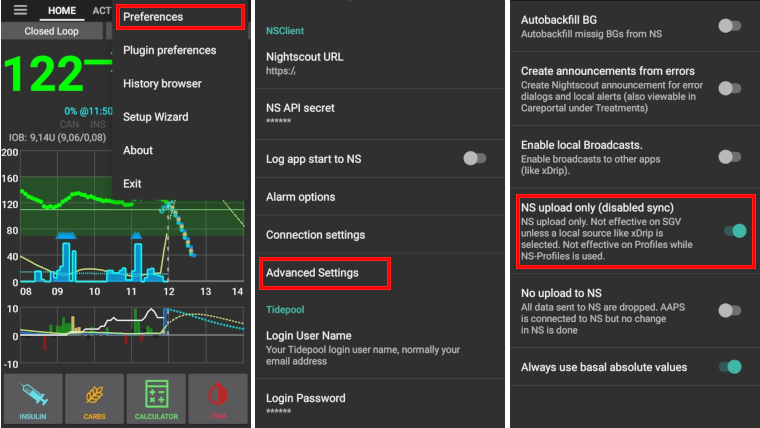

# Nightscout

(security-considerations)=

## Bezpečnostní pokyny

Besides reporting Nightscout can also be used to control AAPS. I.e. you can set temp targets or add future carbs. This information will be picked up by AAPS and it will act correspondingly. Therefore it is worth thinking about securing your Nightscout website.

### Nastavení Nightscoutu

You can deny public access to your Nightscout site by using [authentication roles](https://nightscout.github.io/nightscout/security).

### Nastavení AndroidAPS

There is an NS upload only (no sync) function in AAPS settings. By doing so AAPS will not pick up changes done in Nightscout such as temp targets or future carbs.

* Klepněte na menu (3 tečky v pravém horním rohu) na hlavní obrazovce AAPS.
* Zvolte „Nastavení“.
* Posuňte se dolů a klepněte na „Rozšířená nastavení“.
* Aktivujte možnost „pouze nahrávání do NS“

### Další nastavení zabezpečení

Keep your phone up to date as described in [safety first](../Getting-Started/Safety-first.md).

(manual-nightscout-setup)=

## Ruční nastavení Nightscoutu

It is assumed you already have a Nightscout site, if not visit the [Nightscout](http://nightscout.github.io/nightscout/new_user/) page for full instructions on set up, the instructions below are then settings you will also need to add to your Nightscout site. Your Nightscout site needs to be at least version 10 (displayed as 0.10...), so please check you are running the [latest version](https://nightscout.github.io/update/update/#updating-your-site-to-the-latest-version) otherwise you will get an error message on your AAPS app. Some people find looping uses more than the azure free quota allowed, so heroku is the preferred choice.

* Běžte na https://herokuapp.com/

* Klikněte na název své aplikace.

* Klikněte na "Application settings" (Azure) nebo "Settings" > "Reveal Config Variables" (Heroku)

* Přidejte nebo upravte proměnné takto:
  
  * `ENABLE` = `careportal boluscalc food bwp cage sage iage iob cob basal ar2 rawbg pushover bgi pump openaps`
  * `DEVICESTATUS_ADVANCED` = `true`
  * `SHOW_FORECAST` = `openaps`
  * `PUMP_FIELDS` = `reservoir battery clock`
  * Pro [hlídání pumpy](https://github.com/nightscout/cgm-remote-monitor#pump-pump-monitoring) lze nastavit různé alarmy, doporučujeme zejména % nabití baterie: 
    * `PUMP_WARN_BATT_P` = `51`
    * `PUMP_URGENT_BATT_P` = `26` 

* Klikněte na "Save" ve vrchní části panelu.

## Poloautomatickíé zřízení Nightscoutu

Fellow looper Martin Schiftan offered a semi-automated Nightscout setup for many years free of charge. As number of users increased so did cost and therefore he had to start asking a small fee starting October 2021 - starting at €4,17 per month.

**Benefits**

* Nightscout si pomocí této služby můžete nainstalovat pomocí několika málo kliknutí a ihned jej začít používat. 
* Téměř žádná manuální práce, protože Martin se snaží celou administraci zautomatizovat.
* Všechna nastavení lze provádět prostřednictvím uživatelsky přívětivého webového rozhraní. 
* Tato služba obsahuje rovněž automatické kontroly bazálů prostřednictvím nástroje Autotune. 
* Servery jsou umístěny v Německu a Finsku.

<https://ns.10be.de/en/index.html>

An alternative would be <https://t1pal.com/> - starting at $11,99 per month.