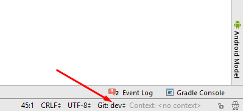

# Aktualizace na novou verzi nebo větev (branch)

## Větev Master

**Instalace gitu (pokud ho ještě nemáte)**

* Měly by fungovat všechny verze gitu. Například <https://git-scm.com/download/win>
* Řekněte Android Studiu, kde je git.exe umístěný: File > Settings > Version Control > Git

**Aktualizace lokální kopie**

* Klikněte na: VCS > Git > Fetch

**Výběr větve**

* Pokud chcete změnit větev, vyberte jinou z dolní lišty: master (poslední vydání) nebo jiná verze (viz níže)

and then checkout (You can use 'Checkout as New Branch' if 'Checkout' is not available.)

**Aktualizace větve z Githubu**

* Stiskněte Ctrl+T, zvolte metodu Merge a stiskněte OK

Na dolní liště uvidíte zelenou zprávu o aktualizovaném projektu

**Nahrání do telefonu**

Vygenerujte podepsaný APK soubor, jak je popsáno v části Vytvoření APK ([odkaz](Building-APK.md))

## Vývojové větve

**Pozor:** Dev verze AndroidAPS je pouze pro vývojáře a testery, kteří bez problémů pracují s ladicími výpisy, procházejí logy a eventuálně spustí debugger, aby k chybě připravili zprávu, která je užitečná pro vývojáře (ve zkratce: dev je pro lidi, kteří vědí, co dělají, aniž by potřebovali něčí asistenci!). Proto je mnoho nedokončených funkcí zakázaných. K povolení těchto funkcí vstupte do **Vývojářského režimu** založením souboru s názvem `engineering_mode` ve stejné složce, kde se nacházejí log soubory. Povolením vývojářského režimu můžete smyčku zcela narušit.

Nejstabilnější verze AndroidAPS k použití je ta v [Master](https://github.com/MilosKozak/AndroidAPS/tree/master) větvi. Doporučuje se zůstat v Master větvi, než dokončíte cíle a procvičíte se ve smyčce.

Nicméně [Dev](https://github.com/MilosKozak/AndroidAPS/tree/dev) větev je dobré místo, kde se ukazují testované funkce a můžete zde pomoci vyžehlit nějaké chyby a poskytnout zpětnou vazbu, jak nové funkce pracují v praxi. Uživatelé často testují Dev větev na starém telefonu a pumpě, než jsou si jistí stabilitou - jakékoliv použití je na vaše vlastní riziko.

Následuje krátké shrnutí některých změn oproti předchozím verzím a nové funkce aktuálně v Dev větvi. Odkazy na všechny známé klíčové problémy budou sdílené (pokud existují).

**Super Micro Bolus (SMB)**

O Super Micro Bolusech (SMB) si můžete více přečíst v [OpenAPS dokumentaci](https://openaps.readthedocs.io/en/latest/docs/Customize-Iterate/oref1.html#understanding-smb). Nezapomeňte, že se chystáte testovat funkci, která se stále ještě vyvíjí. Činíte tak na vlastní riziko a na vlastní zodpovědnost za své bezpečí.   
  
Předtím byste měli běžet v uzavřené smyčce více než čtyři týdny (se splněným cílem 7) a měli byste znát všechny typy situací, ve kterých může APS selhávat.   
  
Zřejmě budete potřebovat doladit své nastavení, aby mohlo SMB pracovat efektivně. Pro začátek je dobré zvýšit maximální IOB na běžný bolus k jídlu + trojnásobek maximálního denního bazálu. Ale zůstaňte bdělí a upravujte nastavení s opatrností.

   
  
Jako u jiných aktualizací, původní kód byl vyčištěný, vylepšený a byly v něm opraveny chyby.    
Pokud najdete chybu, nebo si myslíte, že se stalo něco špatného při používání Dev větve, pak se podívejte na záložku [Issues](https://github.com/MilosKozak/AndroidAPS/issues), abyste prověřili, jestli to už nenahlásil někdo jiný, pokud ne, tak problém rovnou nahlašte. Čím více informací sdělíte, tím lépe (nezapomeňte sdílet své [log soubory](../Usage/Accessing-logfiles.md). Nové funkce mohou být také diskutovány v [Gitter](https://gitter.im/MilosKozak/AndroidAPS) místnosti.    
Pokud chcete zůstat se svou Dev větví aktuální, můžete postupovat stejným způsobem, jak bylo popsáno výše. Stačí jen namísto "master" větve použít "dev" větev v Android Studiu.