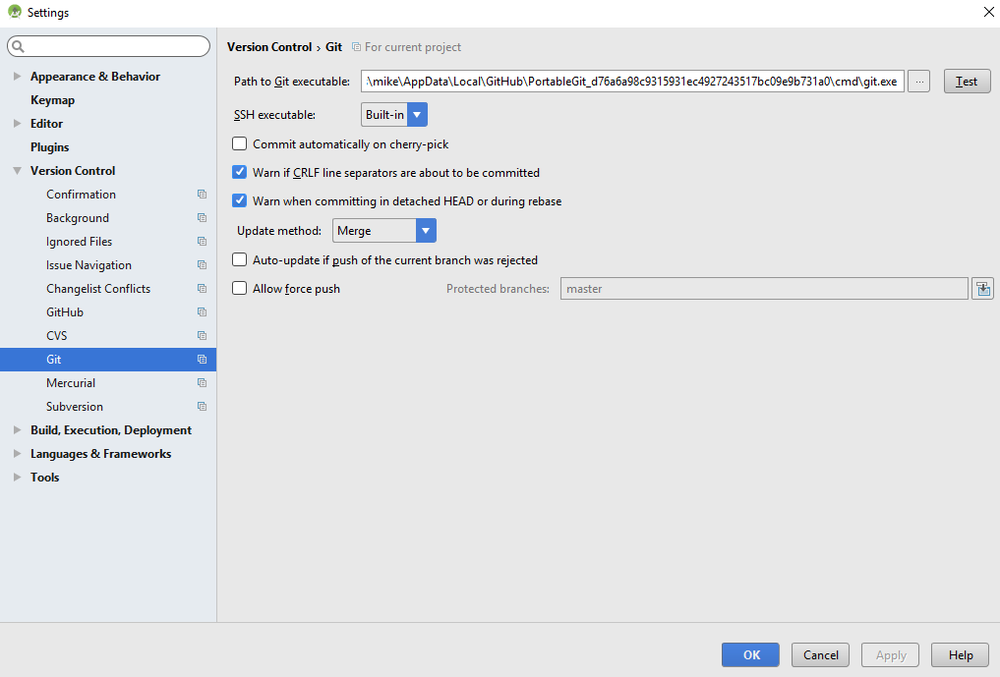

# Aktualizace na novou verzi nebo větev (branch)

## Větev Master

### Install git (if you don't have it)

* Měly by fungovat všechny verze gitu. Například <https://git-scm.com/download/win>
* Řekněte Android Studiu, kde je git.exe umístěný: File > Settings > Version Control > Git

### Update your local copy

* Klikněte na: VCS > Git > Fetch

### Selecting branch

* Pokud chcete změnit větev, vyberte jinou z dolní lišty: master (poslední vydání) nebo jiná verze (viz níže)

and then checkout (You can use 'Checkout as New Branch' if 'Checkout' is not available.)

### Updating branch from Github

* Stiskněte Ctrl+T, zvolte metodu Merge a stiskněte OK

On the tray you'll see green message about updated project

### Generate APK & upload to phone

Generate signed apk as described in [Building APK (Generate signed APK)](../Installing-AndroidAPS/Building-APK.md)

