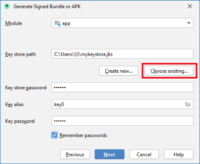

# Aktualizace na novou verzi nebo větev (branch)

## Vyrobte si místo stažení

**AndroidAPS není k dispozici ke stažení kvůli regulaci zdravotnických zařízení. Je legální vytvořit aplikaci pro své vlastní použití, ale nesmíte dát kopii ostatním! Další informace naleznete v části [Časté dotazy](../Getting-Started/FAQ.md).**

## Důležité poznámky

* Aktualizujte co nejdříve, jakmile bude k dispozici nová verze. O nové verzi budete [informování na domovské obrazovce AndroidAPS](../Installing-AndroidAPS/Releasenotes#release-notes).
* Od verze 2.3 je potřeba pro aktualizaci použít git. Aktualizace pomocí zip souboru již nefunguje.
* As of version 2.7 repository location changed to <https://github.com/nightscout/AndroidAPS>. If you are not familiar with git the easiest way for update is remove directory with AndroidAPS and do a [new clone](../Installing-AndroidAPS/Building-APK.html).
* Please use [Android Studio Version 4.0.1](https://developer.android.com/studio/) or newer to build the apk.
* [Windows 10 32-bit systems](../Installing-AndroidAPS/troubleshooting_androidstudio#unable-to-start-daemon-process) are not supported by Android Studio 4.0.1.
* If you are using xDrip make sure to [identify the receiver](../Configuration/xdrip#identify-receiver).
* If you are using Dexcom G6 with the [patched Dexcom app](../Hardware/DexcomG6#if-using-g6-with-patched-dexcom-app) you will need the version from the [2.4 folder](https://github.com/dexcomapp/dexcomapp/tree/master/2.4).

## Rychlý postup pro pokročilé uživatele

Pokud aplikaci aktualizujete poprvé, přeskočte tento odstavec. Je určen pouze pro zkušené uživatele. Pokud ho ještě nemáte, měli byste pokračovat bodem [ nainstalujte git ](../Installing-AndroidAPS/git-install.rst).

Pokud jste v minulosti již AAPS aktualizovali a používáte-li Windows PC, můžete provést aktualizaci ve čtyřech jednoduchých krocích:

1. [Exportujte své nastavení](../Usage/ExportImportSettings#how-to-export-settings) ze stávající verze AAPS do svého telefonu
2. [Aktualizujte lokální kopii](../Installing-AndroidAPS/Update-to-new-version#update-your-local-copy) (VCS->Git->Pull)
3. [Vytvořte podepsané APK (Generate signed APK)](../Installing-AndroidAPS/Update-to-new-version#generate-signed-apk) (Místo 'wear' zvolte 'app'!)
4. V závislosti na [zdroji glykémie](../Configuration/BG-Source.rst) se ujistěte, že jste povolili možnost [Identify receiver](../Configuration/xdrip#identify-receiver) v aplikaci xDrip nebo používáte upravenou aplikaci Dexcom ze [složky 2.4 ](https://github.com/dexcomapp/dexcomapp/tree/master/2.4).

## Nainstalujte git (pokud ho ještě nemáte)

Postupujte podle návodu na [stránka instalace gitu](../Installing-AndroidAPS/git-install.rst).

## Aktualizace lokální kopie

* As of version 2.7 repository location changed to <https://github.com/nightscout/AndroidAPS>. If you are not familiar with git the easiest way for update is remove directory with AndroidAPS and do a [new clone](../Installing-AndroidAPS/Building-APK.html).
* Click: VCS -> Git -> Pull
    
    

* Click Pull (no changes in dialog field)
    
    

* Wait while download is in progress.
    
    

* When done Android Studio will inform you that "all files are up-to-date".
    
    

## Vytvořte podepsaný soubor APK

<!--- Text is maintained in page building-apk.md --->

* Click "Build" in the menu bar and select "Generate Signed Bundle / APK...".

* Select "APK" (1.) instead of "Android App Bundle" and click "Next" (2.).

* Ujistěte se, že modul je nastaven na "app".
* Vyberte cestu k úložišti klíčů klepnutím na volbu "Vybrat existující...".
* Zadejte heslo pro úložiště klíčů a klíč.
* Máte-li zaškrtnuté políčko pro zapamatování hesla, nemusíte ho zadávat. V případě, že během posledního sestavení aplikace nebylo zaškrtnuto políčko pro zapamatování hesla, a vy jste heslo zapomněli, pokračujte na článek [odstraňování problémů](../Installing-AndroidAPS/troubleshooting_androidstudio#lost-keystore).
* Klikněte na "Next".

* Select build variant "fullRelease" (1.). 
* Check boxes V1 and V2 for signature versions (2.).
* Click "Finish". (3.)

* Android Studio will display the information "APK(s) generated successfully..." after build is finished.
* In case build was not successful refer to the [troubleshooting section](../Installing-AndroidAPS/troubleshooting_androidstudio.rst).
* Easiest way to find the apk is to click on "Event log".

* In the event log section click "locate".

* app-full-release.apk is the file you are looking for.

## Přeneste soubor APK do telefonu

Easiest way to transfer app-full-release.apk to your phone is via [USB cable or Google Drive](https://support.google.com/android/answer/9064445?hl=en). Please note that transfer by mail might cause difficulties and is not the preferred way.

On your phone you have to allow installation from unknown sources. Manuals how to do this can be found on the internet (i.e. [here](https://www.expressvpn.com/de/support/vpn-setup/enable-apk-installs-android/) or [here](https://www.androidcentral.com/unknown-sources)).

## Zkontrolujte verzi AAPS na telefonu

Verzi AAPS můžete na telefonu zkontrolovat klepnutím na tři tečky vpravo nahoře a poté na položku O aplikaci.

## Poradce při potížích

Viz samostatná stránka [odstraňování potíží s Android Studiem](../Installing-AndroidAPS/troubleshooting_androidstudio.rst).