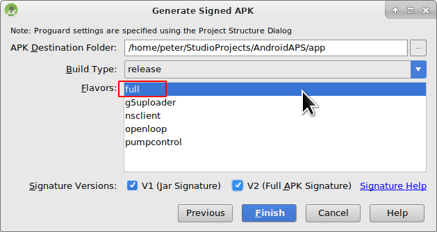

# Aktualizace na novou verzi nebo větev (branch)

## Build yourself instead of download

**AndroidAPS is not available as download due to regulation for medial devices. It is legal to build the app for your own use but you must not give a copy to others! See [FAQ page](../Getting-Started/FAQ.md) for dertails.**

## Důležité poznámky

<font color="#FF0000"><b>Important note: As of version 2.3 you have to use git to update. Updating via zip file does not work anymore.</font></b>.

***Note***: If updating to AndroidAPS 2.3, you need to use [Android Studio Version 3.4](https://developer.android.com/studio/archive?), it doesn't work with the latest one.

## Nainstalujte git (pokud ho ještě nemáte)

### Windows

* Měly by fungovat všechny verze gitu. Například <https://git-scm.com/download/win>
* Poznačte si cestu instalace. Budete ji potřebovat v dalším kroku.
  
  

* Zadejte do Studia umístění souboru git.exe: File - Settings
  
  

* V dalším okně: Version Control - Git

* Zvolte správnou cestu: .../Git<font color="#FF0000"><b>/bin</b></font>

* Ujistěte se, že je vybrána metoda aktualizace "Merge".
  
  

### Mac

* Měly by fungovat všechny verze gitu. Například <https://git-scm.com/download/mac>
* Použijte homebrew k instalaci gitu: ```$ brew install git```.
* Detaily o instalaci gitu naleznete v [oficiální dokumentaci gitu](https://git-scm.com/book/en/v2/Getting-Started-Installing-Git).
* Pokud instalujete git přes homebrew, není třeba měnit žádné předvolby. Pokud by bylo třeba: Najdete je zde: Android Studio - Preferences.

## Update your local copy

* Klikněte na: VCS->Git->Fetch
  
  

## Selecting branch

* Pokud chcete změnit větev, vyberte jinou z dolní lišty: master (poslední vydání) nebo jiná verze (viz níže)
  
  

and then checkout (You can use 'Checkout as New Branch' if 'Checkout' is not available.)

     
    

## Updating branch from Github

* Stiskněte Ctrl+T, zvolte metodu Merge a klikněte na OK
  
  

On the tray you'll see green message about updated project

## Vytvořte podepsaný soubor APK

<!--- Text is maintained in page building-apk.md ---> V nabídce vyberte „Build“ a pak „Generate Signed Bundle / APK…“. (Nabídka Android Studio se v září 2018 změnila. In older versions select in the menu “Build” and then “Generate Signed APK...”.)

  
Signing means that you sign your generated app but in a digital way as a kind of digital fingerprint in the app itself. To je nezbytné, protože Android má pravidlo, že z bezpečnostních důvodů přijme pouze podepsaný kód. Pokud se o toto téma zajímáte, můžete si k tomu víc přečíst [zde](https://developer.android.com/studio/publish/app-signing.html#generate-key), ale Bezpečnost je hluboké a komplexní téma a teď ho nepotřebujete.


V následujícím dialogovém okně vyberte „APK“ místo „Android App Bundle“ a klepněte na tlačítko „Next“.


Zvolte „app“ a klepněte na tlačítko „Next“.


Enter your key store path, enter key store password, select key alias and enter key password.

Select 'Remember passwords'.

Then click next.


Zvolte „full“ jako flavour generované aplikace. Zvolte V1 „Jar Signature“ (V2 je volitelné) a klikněte na tlačítko „Finish“. Následující údaje mohou být důležité pro pozdější použití.

* Možnost „Release“ by měla být výchozí volbou pro „Build Type“, možnost „Debug“ je pouze pro vývojáře.
* Vyberte typ sestavení, jaký budete chtít. 
  * full (tj. automatické doporučení pro uzavřenou smyčku)
  * openloop (tj. doporučení pro uživatele s otevřenou smyčkou)
  * pumpcontrol (tj. vzdálené ovládání pumpy bez smyčky)
  * nsclient (tj. zobrazují se data jiného uživatele se smyčkou a lze vkládat záznamy ošetření)



V podokně „Event Log“ vidíme, že podepsaný soubor APK byl úspěšně vygenerován.


Klikněte na odkaz „locate“ v podokně „Event Log“.


## Přeneste soubor APK do telefonu

<!--- Text is maintained in page building-apk.md ---> Objeví se okno správce souborů. Na vašem počítači může vypadat trochu jinak, protože já používám systém Linux. Pokud používáte sytém Windows, otevře se Průzkumník souborů, na platformě Mac OS X to bude Finder. V něm byste měli vidět složku s vygenerovaným souborem APK. Toto bohužel není správné umístění, protože „wear-release.apk“ není podepsaný soubor „app“ APK, který hledáme.


Přejděte prosím do složky AndroidAPS/app/full/release a tam vyhledejte soubor „app-full-release.apk“. Přeneste tento soubor do telefonu s Androidem. Můžete to udělat způsobem, který upřednostňujete, přes Bluetooth, nahráním do cloudu, připojením telefonu k počítači pomocí kabelu nebo přes přílohu e-mailu. Já v této ukázce používám Gmail, jelikož je to pro mě poměrně jednoduché. Zmiňuji to proto, protože instalaci self-signed aplikace (certifikát podepsaný sám sebou) potřebujeme v systému Android výslovně povolit, i když byl soubor přijatý přes Gmail. Standardně je to totiž zakázané. Pokud použijete jinou metodu, zvolte vhodný postup.


V nastavení telefonu je nabídka (instalovat neznámé aplikace), kde lze povolit instalaci APK souborů, které jsem si poslal přes Gmail.

Vyberte možnost „Povolit z tohoto zdroje“. Po instalaci můžete tuto volbu zase zakázat.


Posledním krokem je klepnout na soubor APK, který jsem přijal přes Gmail, a nainstalovat aplikaci. Pokud se APK nechce nainstalovat a máte v telefonu již starší verzi AndroidAPS, pravděpodobně byla podepsaná jiným klíčem – v tom případě musíte starou verzi nejdřív odinstalovat, avšak nezapomeňte předtím exportovat svá nastavení!

Ano, máte to a můžete začít s úvodní konfigurací AndroidAPS (CGM, inzulínová pumpa) atd.

## Check AAPS version on phone

You can check the AAPS version on your phone by clicking the three dots menu on the top right and then about.


# Poradce při potížích

## Kotlin compiler warning

If build completed successfully but you get Kotlin compiler warnings then just ignore these warnings.

App was build successfully and can be transferred to phone.


## Could not download… / Offline Work

If you get a failure message like this


make sure that ‘Offline work’ is disabled.

File -> Settings


## Uncommitted changes

If you receive failure message like


### Možnost 1

* V Android Studio zvolte VCS -> GIT -> Reset HEAD 

### Možnost 2

* Zkopírujte ‘git checkout --’ do schránky (bez uvozovek)
* Přepněte v Android Studiu na Terminal (ve spodní části vlevo v okně Android Studia) 

* Vložte zkopírovaný text a stiskněte enter. 

## App not installed


* Ujistěte se, že jste do telefonu přenesli soubor „app-full-release.apk“.
* Pokud se na telefonu zobrazí "Aplikace není nainstalována", postupujte následovně: 
  1. [Exportujte nastavení](../Usage/Objectives#export-import-settings) (ve verzi AAPS, kterou již máte nainstalovanou v telefonu)
  2. Odinstalujte aplikaci AAPS ze svého telefonu
  3. Zapněte režim letadlo a vypněte bluetooth
  4. Nainstalujte novou verzi (“app-full-release.apk”)
  5. [Importujte nastavení](../Usage/Objectives#export-import-settings)
  6. Znovu zapněte bluetooth a vypněte režim letadlo

## App installed but old version

If you build the app successfully, transferred it to your phone and installed it successfully but the version number stays the same then you might have missed the merging step in the [update manual](../Installing-AndroidAPS/Update-to-new-version#updating-branch-from-github).

## None of the above worked

If non of the above tips helped you might consider building the app from scratch:

1. [Exportujte nastavení](../Usage/Objectives#export-import-settings) (ve verzi AAPS, kterou již máte nainstalovanou v telefonu)
2. Připravte si heslo klíče a heslo úložiště klíčů Pokud jste hesla zapomněli, můžete je zkusit najít v souborech projektu, jak je popsáno [zde](https://youtu.be/nS3wxnLgZOo).
3.     Poznamenejte si cestu ke svému úložišti klíčů
      V Android Studiu Build -> Generate Signed APK
      
      
  
  4. Vytvořte aplikaci úplně od začátku, jak je popsáno [zde](../Installing-AndroidAPS/Building-APK#download-code-and-additional-components). Použijte stávající klíč a úložiště klíčů.
4. Jestliže jste úspěšně sestavili APK, odstraňte stávající aplikaci z telefonu a přeneste do něj a nainstalujte nový soubor apk.
5. [Importujte nastavení](../Usage/Objectives#export-import-settings)

## Worst case scenario

In case even building the app from scratch does not solve your problem you might want to try to uninstall Android Studio completely. Some Users reported that this solved their problem.

Make sure to uninstall all files associated with Android Studio. Manuals can be found online i.e. <https://stackoverflow.com/questions/39953495/how-to-completely-uninstall-android-studio-from-windowsv10>.

Install Android Studio from scratch as described [here](../Installing-AndroidAPS/Building-APK#install-android-studio) and **do not update gradle**.