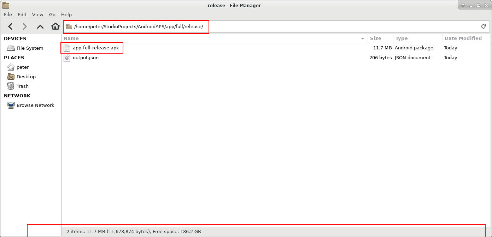

# Aktualizace na novou verzi nebo větev (branch)

<font color="#FF0000"><b>U verze 2.3 je potřeba použít git pro aktualizaci. Aktualizace pomocí zip souboru již nefunguje.</font></b>.

***Poznámka***: Jestliže aktualizujete na verzi AndroidAPS 2.3, musíte použít [Android Studio Version 3.4](https://developer.android.com/studio/archive?), protože s nejnovější verzí nefunguje.

## Nainstalujte git (pokud ho ještě nemáte)

### Windows

* Měly by fungovat všechny verze gitu. Například <https://git-scm.com/download/win>
* Poznačte si cestu instalace. Budete ji potřebovat v dalším kroku.
  
  

* Zadejte do Studia umístění souboru git.exe: File - Settings
  
  

* V dalším okně: Version Control - Git

* Zvolte správnou cestu: .../Git<font color="#FF0000"><b>/bin</b></font>

* Ujistěte se, že je vybrána metoda aktualizace "Merge".
  
  

### Mac

* Měly by fungovat všechny verze gitu. Například <https://git-scm.com/download/mac>
* Použijte homebrew k instalaci gitu: ```$ brew install git```.
* Detaily o instalaci gitu naleznete v [oficiální dokumentaci gitu](https://git-scm.com/book/en/v2/Getting-Started-Installing-Git).
* Pokud instalujete git přes homebrew, není třeba měnit žádné předvolby. Pokud by bylo třeba: Najdete je zde: Android Studio - Preferences.

## Aktualizujte svou lokální kopii

* Klikněte na: VCS->Git->Fetch
  
  

## Vyberte větev

* Pokud chcete změnit větev, vyberte jinou z dolní lišty: master (poslední vydání) nebo jiná verze (viz níže)
  
  

a poté zvolte možnost „checkout“ (Můžete použít rovněž volbu 'Checkout as New Branch', jestliže možnost 'Checkout' není k dispozici.)

     
    

## Aktualizace větve z Githubu

* Stiskněte Ctrl+T, zvolte metodu Merge a klikněte na OK
  
  

Na dolní liště uvidíte zelenou zprávu o aktualizovaném projektu

## Vytvořte podepsaný soubor APK

<!--- Text is maintained in page building-apk.md ---> V nabídce vyberte „Build“ a pak „Generate Signed Bundle / APK…“. (Nabídka Android Studio se v září 2018 změnila. Ve starších verzích vyberte nabídku „Build“ a pak „Generate Signed APK...“.)

  
Podepsání znamená, že podepíšete svou generovanou aplikaci, ale digitálním způsobem, něco jako digitálním otiskem prstu v samotné aplikaci. To je nezbytné, protože Android má pravidlo, že z bezpečnostních důvodů přijme pouze podepsaný kód. Pokud se o toto téma zajímáte, můžete si k tomu víc přečíst [zde](https://developer.android.com/studio/publish/app-signing.html#generate-key), ale Bezpečnost je hluboké a komplexní téma a teď ho nepotřebujete.


V následujícím dialogovém okně vyberte „APK“ místo „Android App Bundle“ a klepněte na tlačítko „Next“.


Zvolte „app“ a klepněte na tlačítko „Next“.


Zadejte cestu ke svému úložišti klíčů, zadejte heslo k úložišti klíčů, vyberte alias klíče a zadejte heslo klíče.

Vyberte 'Zapamatovat hesla'.

Poté klepněte na tlačítko „Next“.


Zvolte „full“ jako flavour generované aplikace. Zvolte V1 „Jar Signature“ (V2 je volitelné) a klikněte na tlačítko „Finish“. Následující údaje mohou být důležité pro pozdější použití.

* Možnost „Release“ by měla být výchozí volbou pro „Build Type“, možnost „Debug“ je pouze pro vývojáře.
* Vyberte typ sestavení, jaký budete chtít. 
  * full (tj. automatické doporučení pro uzavřenou smyčku)
  * openloop (tj. doporučení pro uživatele s otevřenou smyčkou)
  * pumpcontrol (tj. vzdálené ovládání pumpy bez smyčky)
  * nsclient (tj. zobrazují se data jiného uživatele se smyčkou a lze vkládat záznamy ošetření)


V podokně „Event Log“ vidíme, že podepsaný soubor APK byl úspěšně vygenerován.


Klikněte na odkaz „locate“ v podokně „Event Log“.


## Přeneste soubor APK do telefonu

<!--- Text is maintained in page building-apk.md ---> Objeví se okno správce souborů. Na vašem počítači může vypadat trochu jinak, protože já používám systém Linux. Pokud používáte sytém Windows, otevře se Průzkumník souborů, na platformě Mac OS X to bude Finder. V něm byste měli vidět složku s vygenerovaným souborem APK. Toto bohužel není správné umístění, protože „wear-release.apk“ není podepsaný soubor „app“ APK, který hledáme.


Přejděte prosím do složky AndroidAPS/app/full/release a tam vyhledejte soubor „app-full-release.apk“. Přeneste tento soubor do telefonu s Androidem. Můžete to udělat způsobem, který upřednostňujete, přes Bluetooth, nahráním do cloudu, připojením telefonu k počítači pomocí kabelu nebo přes přílohu e-mailu. Já v této ukázce používám Gmail, jelikož je to pro mě poměrně jednoduché. Zmiňuji to proto, protože instalaci self-signed aplikace (certifikát podepsaný sám sebou) potřebujeme v systému Android výslovně povolit, i když byl soubor přijatý přes Gmail. Standardně je to totiž zakázané. Pokud použijete jinou metodu, zvolte vhodný postup.



V nastavení telefonu je nabídka (instalovat neznámé aplikace), kde lze povolit instalaci APK souborů, které jsem si poslal přes Gmail.

Vyberte možnost „Povolit z tohoto zdroje“. Po instalaci můžete tuto volbu zase zakázat.


Posledním krokem je klepnout na soubor APK, který jsem přijal přes Gmail, a nainstalovat aplikaci. Pokud se APK nechce nainstalovat a máte v telefonu již starší verzi AndroidAPS, pravděpodobně byla podepsaná jiným klíčem – v tom případě musíte starou verzi nejdřív odinstalovat, avšak nezapomeňte předtím exportovat svá nastavení!

Ano, máte to a můžete začít s úvodní konfigurací AndroidAPS (CGM, inzulínová pumpa) atd.

## Zkontrolujte verzi AAPS na telefonu

Verzi AAPS můžete na telefonu zkontrolovat klepnutím na tři tečky vpravo nahoře a poté na položku O aplikaci.


# Poradce při potížích

## Varování kompilátoru Kotlin

Pokud sestavení proběhne úspěšně, ale objeví se varování kompilátoru Kotlin, prostě je ignorujte.

Sestavení aplikace bylo úspěšné a můžete ji přenést do telefonu.


## Nelze stáhnout… / Práce Offline

Pokud se zobrazí podobná chybová zpráva,


ujistěte se, že položka ‘Offline work’ je deaktivována.

File -> Settings


## Neprovedené změny

Pokud se zobrazí podobná chybová zpráva,


### Možnost 1

* V Android Studio zvolte VCS -> GIT -> Reset HEAD 

### Možnost 2

* Zkopírujte ‘git checkout --’ do schránky (bez uvozovek)
* Přepněte v Android Studiu na Terminal (ve spodní části vlevo v okně Android Studia) 

* Vložte zkopírovaný text a stiskněte enter. 

## Aplikace není nainstalována


* Ujistěte se, že jste do telefonu přenesli soubor „app-full-release.apk“.
* Pokud se na telefonu zobrazí "Aplikace není nainstalována", postupujte následovně: 
  1. [Exportujte nastavení](../Usage/Objectives#export-import-settings) (ve verzi AAPS, kterou již máte nainstalovanou v telefonu)
  2. Odinstalujte aplikaci AAPS ze svého telefonu
  3. Zapněte režim letadlo a vypněte bluetooth
  4. Nainstalujte novou verzi (“app-full-release.apk”)
  5. [Importujte nastavení](../Usage/Objectives#export-import-settings)
  6. Znovu zapněte bluetooth a vypněte režim letadlo

## Aplikace je nainstalována, ale ve staré verzi

Jestliže jste úspěšně sestavili aplikaci, přenesli ji do telefonu a nainstalovali ji, ale číslo verze zůstává stejné, možná jste zapomněli krok sloučení v [návodu na aktualizaci](../Installing-AndroidAPS/Update-to-new-version#updating-branch-from-github).

## Nic z výše uvedeného nefunguje

Jestliže žádný z uvedených tipů nepomáhá, zvažte sestavení aplikace úplně od začátku:

1. [Exportujte nastavení](../Usage/Objectives#export-import-settings) (ve verzi AAPS, kterou již máte nainstalovanou v telefonu)
2. Připravte si heslo klíče a heslo úložiště klíčů Pokud jste hesla zapomněli, můžete je zkusit najít v souborech projektu, jak je popsáno [zde](https://youtu.be/nS3wxnLgZOo).
3.     Poznamenejte si cestu ke svému úložišti klíčů
      V Android Studiu Build -> Generate Signed APK
      
      
  
  4. Vytvořte aplikaci úplně od začátku, jak je popsáno [zde](../Installing-AndroidAPS/Building-APK#download-code-and-additional-components). Použijte stávající klíč a úložiště klíčů.
4. Jestliže jste úspěšně sestavili APK, odstraňte stávající aplikaci z telefonu a přeneste do něj a nainstalujte nový soubor apk.
5. [Importujte nastavení](../Usage/Objectives#export-import-settings)

## Nejčernější scénář

V případě, že ani sestavení aplikace úplně od začátku nevyřeší váš problém, zkuste úplně odinstalovat Android Studio. Někteří uživatelé uvedli, že to jejich problém vyřešilo.

Ujistěte se, že odinstalujte všechny soubory spojené s Android Studio. Návody lze najít online, např. <https://stackoverflow.com/questions/39953495/how-to-completely-uninstall-android-studio-from-windowsv10>.

Znovu od začátku nainstalujte Android Studio, jak je popsáno [zde](../Installing-AndroidAPS/Building-APK#install-android-studio) a **neaktualizujte gradle**.