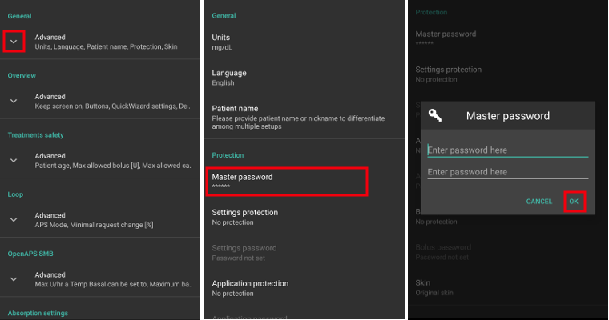

Nezbytné kontroly po aktualizaci na AndroidAPS 2.6
***********************************************************

* U verze AAPS 2.7 byl kód programu významně změněn. 
* Proto je důležité, abyste po aktualizaci provedli nějaké změny, nebo zkontrolovali nastavení.
* Podrobnosti o nových a rozšířených funkcích naleznete v `Poznámkách k vydání <../Installing-AndroidAPS/Releasenotes.html#version-2-7-0>`_.

Zkontrolujte zdroj glykémií
-----------------------------------------------------------
* Zkontrolujte, zda je zdroj glykémií po aktualizaci správný.
* Zejména při použití `xDrip+ <../Configuration/xdrip.html>`_ se může stát, že zdroj glykémie se změní na Dexcom aplikace (upravená).
* Otevřete `Konfigurace <../Configuration/Config-Builder.html#bg-source>`_ (hamburger menu v levém horním rohu hlavní obrazovky)
* Sjeďte dolů na "Zdroj glykémie".
* Je-li to nutné, nastavte správný zdroj glykémie.

.. image:: ../images/ConfBuild_BG.png
  :alt: Zdroj glykémie

Dokončit cíle
-----------------------------------------------------------
* AAPS 2.7 obsahuje nový cíl 11 pro `automatizaci <../Usage/Automation.html>`_.
* You have to finish exam (`objective 3 and 4 <../Usage/Objectives.html#objective-3-prove-your-knowledge>`_) in order to complete `objective 11 <../Usage/Objectives.html#objective-11-automation>`_.
* If for example you did not finish the exam in `objective 3 <../Usage/Objectives.html#objective-3-prove-your-knowledge>`_ yet, you will have to complete the exam before you can start `objective 11 <../Usage/Objectives.html#objective-11-automation>`_. 
* Neovlivní to cíle, které jste již dokončili. Splněné cíle zůstanou zachovány!

Nastavit hlavní heslo
-----------------------------------------------------------
* Abyste mohli `exportovat nastavení <../Usage/ExportImportSettings.html>`_, je nutné nastavit hlavní heslo. Od verze 2.7 jsou totiž exporty šifrované.
* Klepnutím na tři tečky v pravém horním rohu hlavní obrazovky otevřete Nastavení
* Klepněte na trojúhelník pod "Obecné"
* Klepněte na položku "Hlavní heslo"
* Zadejte heslo, potvrďte ho, a klepněte na tlačítko Ok.

  
Exportovat nastavení
-----------------------------------------------------------
* AAPS 2.7 používá nový šifrovaný formát zálohy. 
* Po aktualizaci na verzi 2.7 musíte `exportovat nastavení <../Usage/ExportImportSettings.html>`_.
* Soubory se zálohou vytvořenou v předchozích verzích mohou být v AAPS 2.7 pouze naimportované. Export bude už v novém formátu.
* Ujistěte se, že jste uložili exportovaná nastavení nejen na vašem telefonu, ale také alespoň na jednom bezpečném místě (pc, cloudové úložiště...).
* Pokud sestavujete apk AAPS 2.7 za použití stejného podpisového klíče jako u předchozích verzí, můžete instalovat novou verzi bez odstranění předchozí verze. 
* Všechna nastavení i dokončené cíle zůstanou tak, jak byly v předchozí verzi.
* V případě, že jste ztratili svůj podpisový klíč, sestavte verzi 2.7 za použití nového klíče a importem z předchozí verze tak, jak je popsáno v sekci `odstraňování problémů <../Installing-AndroidAPS/troubleshooting_androidstedio.html#lost-keystore> ` _.

Autosens (Tip - není nutná žádná akce)
-----------------------------------------------------------
* Autosens je změněn na dynamický přepínací model, který replikuje referenční design.
* Autosens se nyní pro výpočet citlivosti přepíná mezi 24 a 8 hodinovým úsekem. Vybere, která z nich je citlivější. 
* Pokud uživatelé pocházejí z Oref1, pravděpodobně si všimnou toho, že systém může být méně dynamický na změny, v závislosti na citlivosti za 24 nebo 8 hodin.

Nastavení hesla pumpy Dana RS (pokud používáte Dana RS)
-----------------------------------------------------------
* V předchozích verzích nebylo heslo pumpy `Dana RS <../Configuration/DanaRS-Insulin-Pump.html>`_ kontrolováno.
* Klepnutím na tři tečky v pravém horním rohu hlavní obrazovky otevřete Nastavení
* Přejděte dolů a klikněte na trojúhelník vedle "Dana RS".
* Klikněte na "Heslo pumpy (pouze v1)"
* Zadejte heslo pumpy (`Výchozí heslo <../Configuration/DanaRS-Insulin-Pump.html#default-password>`_ se liší v závislosti na verzi firmwaru), a klikněte na tlačítko OK.

.. image:: ../images/DanaRSPW.png
  :alt: Nastavení hesla Dana RS
  
Chcete-li změnit heslo na Dana RS, postupujte podle pokynů na stránce `DanaRS <../Configuration/DanaRS-Insulin-Pump.html#change-password-on-pump>`_.
