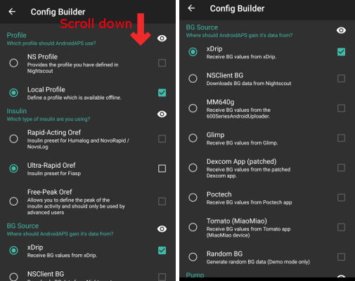
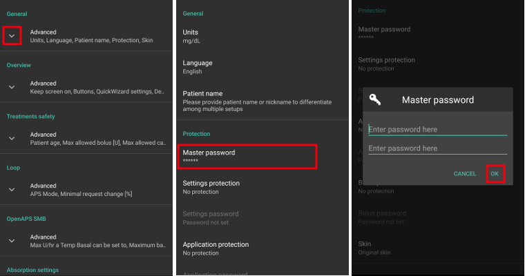

# Necessary checks after update coming from AAPS 2.6

- U verze AAPS 2.7 byl kód programu významně změněn.
- Proto je důležité, abyste po aktualizaci provedli nějaké změny, nebo zkontrolovali nastavení.
- Please see [release notes](#Releasenotes-version-2-7-0) for details on new and extended features.

## Zkontrolujte zdroj glykémií

- Zkontrolujte, zda je zdroj glykémií po aktualizaci správný.
- Especially when using [xDrip+](../CompatibleCgms/xDrip.md) it might happen, that BG source is changed to Dexcom app (patched).
- Open [Config builder](#Config-Builder-bg-source) (hamburger menu on top left side of home screen)
- Sjeďte dolů na "Zdroj glykémie".
- Je-li to nutné, nastavte správný zdroj glykémie.

## Dokončit cíle

- AAPS 2.7 contains new objective 11 (in later versions renumbered to objective 10!) for [automation](../DailyLifeWithAaps/Automations.md).
- You have to finish exam ([objective 3 and 4](#objectives-objective3)) in order to complete objective 11.
- If for example you did not finish the exam in [objective 3](#objectives-objective3) yet, you will have to complete the exam before you can start objective 11.
- Neovlivní to cíle, které jste již dokončili. Splněné cíle zůstanou zachovány!

## Nastavit hlavní heslo

- Necessary to be able to [export settings](ExportImportSettings.md) as they are encrypted as of version 2.7.
- Klepnutím na tři tečky v pravém horním rohu hlavní obrazovky otevřete Nastavení
- Klepněte na trojúhelník pod "Obecné"
- Klepněte na položku "Hlavní heslo"
- Zadejte heslo, potvrďte ho, a klepněte na tlačítko Ok.

## Exportovat nastavení

- AAPS 2.7 používá nový šifrovaný formát zálohy.
- You must [export your settings](ExportImportSettings.md) after updating to version 2.7.
- Soubory se zálohou vytvořenou v předchozích verzích mohou být v AAPS 2.7 pouze naimportované. Export bude už v novém formátu.
- Ujistěte se, že jste uložili exportovaná nastavení nejen na vašem telefonu, ale také alespoň na jednom bezpečném místě (pc, cloudové úložiště...).
- Pokud sestavujete apk AAPS 2.7 za použití stejného podpisového klíče jako u předchozích verzí, můžete instalovat novou verzi bez odstranění předchozí verze.
- Všechna nastavení i dokončené cíle zůstanou tak, jak byly v předchozí verzi.
- In case you have lost your keystore build version 2.7 with new keystore and import settings from previous version as described in the [troubleshooting section](#troubleshooting_androidstudio-lost-keystore).

## Autosens (Tip - není nutná žádná akce)

- Autosens je změněn na dynamický přepínací model, který replikuje referenční design.
- Autosens se nyní pro výpočet citlivosti přepíná mezi 24 a 8 hodinovým úsekem. Vybere, která z nich je citlivější.
- Pokud uživatelé pocházejí z Oref1, pravděpodobně si všimnou toho, že systém může být méně dynamický na změny, v závislosti na citlivosti za 24 nebo 8 hodin.

## Nastavení hesla pumpy Dana RS (pokud používáte Dana RS)

- Pump password for [Dana RS](../CompatiblePumps/DanaRS-Insulin-Pump.md) was not checked in previous versions.
- Klepnutím na tři tečky v pravém horním rohu hlavní obrazovky otevřete Nastavení
- Přejděte dolů a klikněte na trojúhelník vedle "Dana RS".
- Klikněte na "Heslo pumpy (pouze v1)"
- Enter pump password ([Default password](#DanaRS-Insulin-Pump-default-password) is different depending on firmware version) and click OK.

To change password on Dana RS follow instructions on [DanaRS page](#DanaRS-Insulin-Pump-change-password-on-pump).
