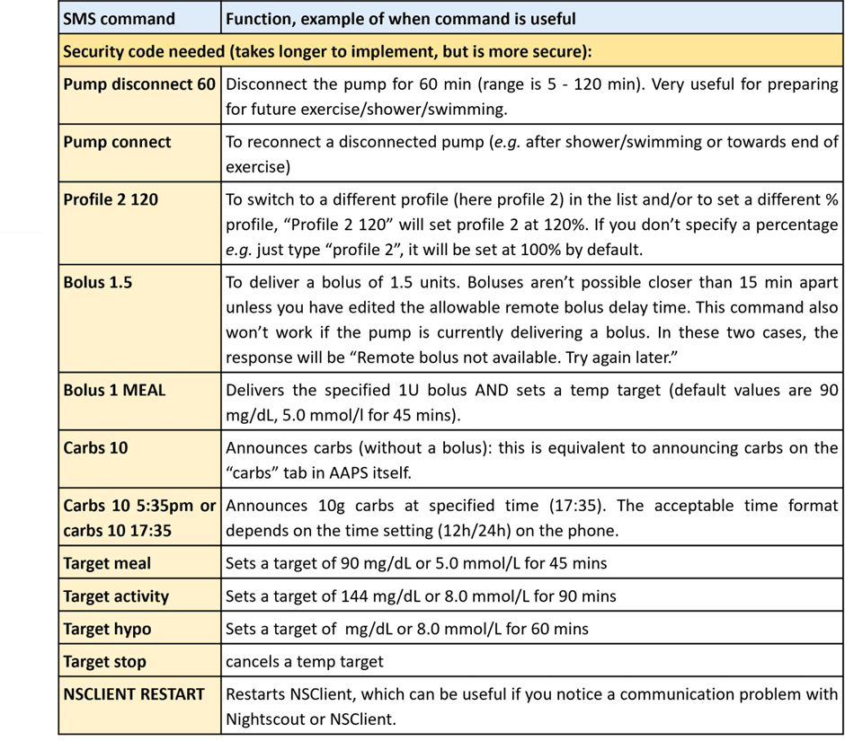

# Vzdálené ovládání AAPS
Existují čtyři vysoce účinné nástroje pro vzdálené řízení **AAPS**:

1) [SMS commands](#1-sms-commands) (follower phone can be either Android or iOS), 2) [AAPSClient](#2-aapsclient) (follower phone is Android) 3) [Nightscout](#3-nightscout) (Android, iOS or other computer/device).  
4) [Smartwatches](#4-smartwatches) (Android)

První tři jsou většinou vhodné pro pečovatele/rodiče, ale chytré hodinky jsou velmi užitečné pro pečovatele/rodiče i pro dospělé s diabetem.


#### Věci ke zvážení když nastavujete vzdálené řízení **AAPS** pro dítě

1.  Rozmyslete si, jak budete telefon dítěte udržovat v dosahy jeho pumpy a CGM. To může být náročné u dětí, které jsou příliš malé na to, aby mohly být zodpovědné za telefon. Ujistěte se, že pro AAPS vyberete telefon s dobrým dosahem bluetooth a naleznete způsob, jak může dítě pumpu a telefon nosiit - pokud je dostatečně staré/velké na to, aby telefon nosilo (např. _běžecký opasek_ může pomoct).
2.  Udělejte si čas na otestování příkazů ve chvíli, kdy máte dítě po boku, než začnete dálkový monitoring a léčbu používat. Mnoho rodičů si k tomu vybírá školní prázdniny nebo víkendy.
3.  Ujistěte se, že ostatní pečovatelé/učitelé jsou si vědomi způsobu léčby vašeho dítěte a rozmyslete, jak přidání vzdálené kontroly bude fungovat dohromady nebo vylepší již existující způsoby léčby.
4.  Mnotí rodiče zjistili, že je užitečné mít samostatný komunikační kanál s ostatními pečovateli, například evný sledovací telefon pro učitele.
5.  Příklady odlišných plánů léčby pro děti různého věku můžete nalézt v oddíle ["soubory"](https://www.facebook.com/groups/AndroidAPSUsers/files/) ve Facebookové skupině **AAPS**.
6.  Jaký je váš nouzový plán pro případy, kdy vzdálená kontrola nefunguje (_např._ problémy se sítí nebo ztráta konektivity bluetooth)?  Vždy zvažujte, co se stane s **AAPS** ve chvíli, kdy nemůžete odeslat příkazy. **AAPS** přepíše v pumpě nastavení bazálů, ISF a ICR aktuálními hodnotami profilu. Vždy používejte pouze dočasné přepnutí profilu (tzn. s nastavenou dobou trvání) pokud přepínáte na silnější inzulínový profil, pro případ že by došlo k přeručení spojení. Tak se po vypršení nastaveného času vrátí nastavení pumpy k původnímu profilu.

## 1) SMS příkazy

```{admonition} Documentation
:class: note

This section may contain outdated content. Please also see the page [SMS Commands](../RemoteFeatures/SMSCommands.md).

```

**AAPS** můžete vzdáleně ovládat pomocí textových zpráv (SMS) pomocí funkce známé jako **SMS příkazy**. SMS příkazy mohou být odesílány na **AAPS** z _jakéhokoli_ typu telefonu (iPhone/Android).

**SMS příkazy jsou opravdu užitečné:**
1. Pro běžné dálkové ovládání

2. Ke vzdálenému podávání bolusového inzulínu

3. V místech, kde máte špatné připojení k internetu, textové zprávy projdou, zatímco data/internetová konektivita jsou omezené. To je velmi užitečné při cestách do odlehlých oblastí (např. kempování, lyžování).

4. Pokud došlo dočasnému výpadku vašich dalších způsobů vzdáleného ovládání (Nightscout/AAPSClient)

### Zabezpečení SMS příkazů
Když v **AAPS** povolíte **SMS komunikátor**, vezměte do úvahy, že telefon, který má povoleno posílat příkazy, může být ukraden nebo použit jinou osobou. Vždy zamykejte svůj telefon alespoň pomocí PINu. Rozhodně doporučujeme biometrický zámek a/nebo silné heslo a ujistěte se, že nejde o stejné heslo jako vaše APK Master heslo (heslo které používáte pro změnu nastavení **AAPS**). Povolte SMS příkazy pro druhé telefonní číslo i v případě, že vzdáleně pracuje pouze jeden pečovatel/sledující. Potom můžete druhé telefonní číslo použít k dočasnému vypnutí SMS komunikátoru (příkazem **"SMS stop"**) pokud dojde ke kompromitaci primárního telefonu. Versions of **AAPS** 2.7 and newer also use an [Authenticator app](#authentication-or-not)).

### Různé typy SMS příkazů
V následující **tabulce SMS příkazů** jsou všechny dostupné SMS příkazy. Jsou uvedené _Příklady hodnot_, které pomáhají problematice porozumnět. Příkazy mají stejný rozsah možných hodnot (cíle, procento profilu atd.) jako aplikace AAPS. Níže uvedené příkazy byly seřazené podle toho, jak pravděpodobně jsou používány. První dvě tabulky by měly obsahovat většinu SMS příkazů, které potřebujete s plnou smyčkou.

### Tabulky SMS příkazů





(authentication-or-not)=
### Autentizace ano nebo ne?

Ve výše uvedené tabulce si můžete všimnout, že na některé SMS příkazy je reakce okamžitá, jiné vyžadují </strong>ověření/autentizaci</0> pomocí bezpečnostního kódu z další aplikace a zadání PIN (viz níže uvedený odkaz). Jednoduchý dotaz jako **bg** (zaslání aktuální hodnoty glikémie) je rychlý na napsání, nevyžaduje ověření, a vrátí **AAPS** tuto stavovou informaci:


Přikazy, které vyžadují vyšší bezpečnost, vyžadují zadání bezpečnostního kódu, např.:


### Jak nastavit SMS příkazy

Celkově proces probíhá takto:

**1) Stáhněte si authentikátor (telefon pečovatele)**

**2) Zkontrolujte nastavení telefonu (telefon AAPS)**

**3) Synchronizace data a času (pečovatelův a AAPS telefon)**

**4) Nastavení AAPS (telefon APPS)**

**5) Otestování SMS příkazů (pečovatelům a AAPS telefon)**

### Pojďme na to!

1) **Stáhněte si autentizátor**: Na telefonu pečovatele stáhněte (z App Store nebo Google play) a nainstalujte některý z tohoto seznamu autentizačních aplikací:

[**Authy**](https://authy.com/download/)

[**Google Authenticator - Android / iOS**](https://play.google.com/store/apps/details?id=com.google.android.apps.authenticator2&pli=1)

[**LastPass Authenticator**](https://www.lastpass.com/solutions/authentication)

[**FreeOTP Authenticator**](https://freeotp.github.io/)

Tyto autentizační aplikace vytvářejí časově omezené, šestimístné heslo, podobně jako aplikace pro mobilní bankovnictví nebo nakupování. Můžete použít libovolnou autentizační aplikaci, která podporuje tokeny RFC 6238 TOTP. Microsoft Authenticator se s AAPS nefunguje.

2) **Zkontrolujte nastavení telefonu:** V nastavení **AAPS** telefonu jděte do Aplikace > AndroidAPS > Oprávnění > SMS > Povolit SMS


3) **Synchronizace data a času:** V telefonu **AAPS** a telefonu pečovatele zkontrolujte, zda jsou datum a čas synchronizovány. Jak přesně toto nastavíte zavisí na zařízení, které používáte. Možná budete muset vyzkoušet různá nastavení.

Příklad (pro Samsung S23): Nastavení – obecná správa – datum a čas – automatické nastavení data a času

Některé možnosti mohou být neaktivní z důvodu potřeby oprávnění správce přes rodinný účet, pokud byl telefon nastaven jako dětský. Toto nastavení data a času je na telefonu pečovatele/rodiče nazváno „nastavit automaticky“. Pokud si nejste jistí, žemáte zařízení synchronizovaná, nedělejte si starosti. Můžete nastavit SMS příkazy a následně vyřešit problémy (pokud je to nutné, požádejte o pomoc).

4) **Nastavení AAPS:**

i) Nyní, když je nastavení telefonů zkontrolované, v **AAPS** aplikaci použijte hamburger menu na levé straně a otevřete Konfiguraci:


ii) Povolte "SMS komunikátor" zaškrtnutím políčka, pak klikněte na "ozubené kolečko" a tím otevřete obrazovku nastavení SMS komunikátoru:


_Poznámka: Jako alternativu ke Konfiguraci můžete také použít novou kartu „SMS komunikátor“ v horní části obrazovky AAPS, poté klikněte na ahmburger menu v pravé části a tak otevřete obrazovku nastavení SMS komunikátoru._

iii) Na obrazovce nastavení povolte "Povolit vzdálené příkazy přes SMS":


iv) Zadejte telefonní číslo(a) pečovatele. Zadejte kód země a vynechte první "0" u telefonního čísla, jak je uvedeno v těchto příkladech:

Telefon Spojeného království: +447976304596

Telefon USA: +11234567890

Telefon Francie: +33612344567

_atp._

Dejte pozor na to, že „+“ před číslem může nebo nemusí být požadováno na základě vaší polohy. Abyste to zjistili, pošlete vzorový text, který se zobrazí v přijatém formátu na kartě SMS komunikátoru.

Chcete-li přidat více než jedno telefonní číslo, oddělte je středníky BEZ MEZER mezi čísly (to je kriticky důležité!). Stiskněte „OK“:


v) Vyberte PIN kód, který vy (a všichni ostatní pečovatelé) budete používat na konci ověřovacího kódu při odeslání SMS příkazu.

Požadavky na PIN jsou:

•3 až 6 číslic

• různé číslice (_, tj._ 1111 nebo 1224)

• bez následujících čísel (_, tj._ 1234)


vi) Na obrazovce nastavení vyberte "Nastavení autentizátoru"

● Postupujte krok za krokem podle instrukcí na obrazovce.

● Otevřete nainstalovanou ověřovací aplikaci na _pečovatelském telefonu_ a nechte přidat nové připojení.

● Použijte telefon pečovatele k naskenování QR kódu poskytnutého **AAPS**, když budete vyzváni.

● Otestujte jednorázové heslo z autentizační aplikace na telefonu pečovatele, po němž následuje váš PIN.

Příklad:

Jednorázové heslo z autentizační aplikace je 457051

Váš povinný PIN je 2401

Ověřovací kód: 4570512401

Pokud je zadán správný kód, červený text „WRONG PIN“ se automaticky změní na zelený „OK“. Proces je nyní dokončen, po zadání kódu nemáte žádné potvrzovací tlačítko „OK“:


Nyní byste měli mít nastaveny SMS příkazy.

### První kroky při užívání SMS příkazů

1) Chcete-li zkontrolovat, že jste všechno nastavili správně, otestujte spojení zasláním „bg“ jako SMS zprávy z telefonu pečovatele do AAPS telefonu. Odpověď by se měla podobat té, která je zde zobrazena:


2) Nyní vyzkoušejte SMS příkaz, který vyžaduje autentifikátor. Chcete-li to udělat, pošlete z telefonu pečovatele text s požadovaným příkazem na **AAPS** telefon (_např._ ‚target hypo‘). Telefon pečovatele obdrží text zpět, vyzve vás k zadání **šestimístného ověřovacího hesla** z autentizační aplikace, následované dalším tajným kódem **PIN** známým pouze pečovateli/sledujícímu (celkem deset číslic, za předpokladu, že váš PIN je pouze 4 místný).

Viz příklad níže, SMS příkaz „target hypo“ nastaví dočasný cíl:

● V tomto příkladu je váš PIN 1289

Jednorázové heslo z autentizační aplikace je 274127

● Po výzvě odešlete 2741271289

Příkazy musí být zadány v angličtině. Odpověď by měla přijít ve vašem místním jazyce. Když budete zkoušet odeslat SMS příkaz poprvé, testujte to, když máte po ruce AAPS telefon, abyste viděli, jak všechno funguje:


Na telefon pečovatele přijde SMS odpověď od **AAPS** jako potvrzení, že byl vzdálený SMS příkaz úspěšně proveden. Existuje několik možných důvodů, pokud příkaz nebyl úspěšný:

● Nastavení SMS příkazů není úplné/správné

●   Odeslali jste příkaz v nesprávném formátu (jako “disconnect pump 45” místo “pump disconnect 45”)

● Použili jste nesprávný nebo prošlý ověřovací kód (je obvykle dobré počkat několik sekund na nový kód, pokud má platnost aktuálního kódu zrovna vypršet)

● Kód + PIN byl v pořádku, ale došlo ke zpoždění v doručení SMS, podle čehož AAPS vypočetl, že ověřovací kód vypršel

● Telefon AAPS je mimo dosah/kontakt s pumpou

● Systém je již zaneprázdněn podáváním  bolusu

Pokud je váš příkaz úspěšný, obdržíte odpověď s potvrzením. Pokud se vyskytne problém, obdržíte chybovou zprávu.

Obecné chyby jsou uvedeny v následujících příkladech:


### Dodatečné bezpečnostní poznámky k SMS příkazům

Výchozí minimální prodleva mezi bolusovými příkazy je 15 minut. Z bezpečnostních důvodů musíte přidat alespoň dvě autorizovaná telefonní čísla ke zkrácení tohoto limitu. Pokud se pokusíte znovu o vzdálený bolus do 15 minut od předchozího bolusu, obdržíte odpověď: „Vzdálený bolus není k dispozici. Zkuste to později.”.

Pokud chcete telefonu pečovatele odebrat právo posílat SMS příkazy, použijte v AAPS nouzové tlačítko „RESET AUTHENTICATORS“ (viz snímek obrazovky nastavení výše, odkaz) nebo poslat SMS příkaz „SMS stop“. Resetováním autentizačních aplikací zneplatníte VŠECHNY telefony pečovatelů. Budete je muset nastavit znovu.

### Posílání bolusů k jídlu prostřednictvím SMS příkazů

Vzdálené posílání bolusů inzulínu může být provedeno _pouze_ prostřednictvím **SMS příkazů**, nelze to provést pomocí Nightscout nebo AAPSClienta. Naopak sacharidy mohou být zadány kteroukoli z těchto 4 metod. Ale není možné odesílat sacharidy i inzulínové příkazy v jedné SMS zprávě. Tyto příkazy musí být zaslány odděleně:

1) Poslání bolusu (_např._"bolus 2" přikáže podat bolus 2 jednotek inzulínu) pomocí SMS příkazů je ekvivalenem použití ikony "injekční stříkačky" v **AAPS**. 2) Odeslání sacharidů (_např._ “carbs 20” oznámí 20 g sacharidů). To je ekvivalentem použití ikony "sacharidy" v **AAPS**.

Abyste se vyhnuli hypoglykémii, je lepší začít opatrně podáváním **menšího množství inzulínu** než je podle vašeho inzulíno sacharidového poměru potřeba, protože nezohledňujete současnou hladinu glukézy nebo trend.

**Pořadí, ve kterém odesíláte tyto příkazy, je důležité**. Pokud oznamujete velké množství sacharidů libovolnou cestou a máte povoleno SMB, **AAPS** může okamžitě reagovat podáním částečného bolusu inzulínu. Takže pokud se pak pokusíte odeslat bolus _po_ oznámení sacharidů, můžete dostat frustrující zprávu o povinné prodlevě mezi bolusy a pak musíte zkontrolovat, co bylo podáno jako SMB. Případně pokud si neuvědomíte, že jsou SMB doručovány a vámi poslaný následný bolus je úspěšný, na jídlo může být dodáno celkově příliš mnoho inzulínu. Z tohoto důvodu, pokud potřebujete posílat bolusy vzdáleně, je nutné vždy odeslat bolus _před_ oznámením sacharidů. Pokud vám to vyhovuje, můžete využívat kombinaci Nightscoutu nebo AAPSClienta s SMS příkazy. Sacharidy mohou být bez jakékoli autentizace oznámeny prostřednictvím Nighscoutu (viz instrukce níže v pododdíle) a tedy rychleji než prostřednictvím SMS příkazů.

### Řešení problémů s SMS příkazy a FAQ

#### Q: Co _nemůžeme_ dělat s SMS příkazy?

1)  **Nemůžeme _dočasně_ přepnout profil** (například nastavit „profil na cvičení“ po dobu 60 minut), ale můžete natrvalo přepnout na „profil na cvičení“. Dočasná změna profilu může být provedena prostřednictvím Nightscoutu nebo AAPSClienta.

2)  **Nemůžete zrušit automatizaci** nebo **nastavit uživatelem definované cíle**, ale existují jiná řešení: Například: Představte si, že normální cíl profilu je 5.5. V AAPS máte nastavenou automatizaci, která vždy mezi 2:30 a 3:30 odpoledne nastaví z důvodu tělocviku ve škole vyšší cíl na 7.0 mmol/L a podmínkou spuštění tohoto pravidla je, že "neexistuje dočasný cíl". Tento týden vám bylo na poslední chvíli oznámano, že tělocvik byl zrušen a místo něj se jde na pizzu. Vaše dítě už je ale ve škole s AAPS telefonem. Pokud automatizace spustí cíl 7.0 a vy ho zrušíte (na AAPS telefonu nebo vzdáleně), podmínky pro automatizační pravidlo jsou pořád platné a **AAPS** jednoduše nastaví vysoký cíl za minutu znovu.

**Pokud máte přístup k AAPS telefonu**, můžete automatizaci vypnout nebo upravit, nebo, pokud nechcete automatizaci měnit, můžete jednoduše nastavit dočasný cíl na 5.6 na 60 min na záložce Akce nebo stisknutím tlačítka Cíl. To zabrání automatizaci v novém spuštění vysokého cíle 7.0.

**Pokud nemáte přístup k AAPS telefonu**, SMS příkaz můžu být využit pro náhradní řešení: například odesláním příkazu "target meal" nastavíte cíl 5.0 na 45 minut (ostatní výchozí cíle jsou nastavené na 8.0, protože se používají na aktivitu nebo hypoglykémii). Nicméně SMS příkazem nemůžete zadat _konkrétní_ cílovou hodnotu (5.6 na 60 minut, například). Na to byste potřebovali **AAPSClient** nebo Nightscout.

#### Q: Co se stane, když změním názor na příkaz, který jsem právě odeslal?

**AAPS** doručí pouze poslení příkaz. Takže pokud napíšete "bolus 1,5" a potom, bez autentizace pošlete nový příkaz "bolus 1", Aaps bude ignorovat předchozí 1,5. **AAPS** vždy odešle telefonu pečovatele potvrzení, jaký SMS příkaz přišel, než vás vyzve k zadání ověřovacího kódu, stejně jako potvrzení po akci.

#### Q: Proč jsem nedostal odpověď na SMS příkaz?

Může jít o jeden z těchto důvodů:

1) Zpráva se nedostala do telefonu (problémy se sítí). 2)  **AAPS** stále zpracovává požadavek (_např._ bolus, který může nějakou dobu trvat, v závislosti na rychlosti bolusu). 3) AAPS telefon nemá dobré bluetooth spojení s pumpou, když je příkaz přijal, a příkaz tedy selhal (tato situace obvykle nastaví alarm na AAPS telefonu).

#### Q: Jak mohu zastavit příkaz, který už byl ověřený?

Nemůžete. Nicméně můžete zrušit bolus odeslaný pomocí SMS na samotném **AAPS** telefonu, jednoduše jeho zrušením v popup okně pro podávání, pokud jste dostatečně rychlí. Mnoho příkazů (vyjma poslání bolusu a zadání sacharidů) může být snadno vráceno nebo mohou být provedeny kroky ke zmínění dopadů případné chyby.

V případě chybně poslaného bolusu nebo oznámení sacharidů můžete stále podniknout opatření. Na příklad, pokud jste oznámili 20g sacharidů ale dítě snědlo pouze 10g a vy (nebo pečovatel na místě) nemůžete smazat ošetření přímo v **AAPS** telefonu, můžete nastavit vysoký dočasný cíl nebo nastavit slabší profil a tím zajistit, že se **AAPS** bude chovat méně agresivně.

#### Q: Proč dostávám více SMS se stejnou zprávou?

Pokud obdržíte opakovaně stejnou zprávu (_např._ o přepnutí profilu), mohlo se stát, že jste omylem vytvořili smyčku s ostatními aplikacemi. Například xDrip+. Pokud je to tak, ujistěte se prosím, že xDrip+ (nebo jakákoliv jiná aplikace) nenahrává ošetření přímo do NightScout.

#### Q: Právě jsem nastavil SMS příkazy a nyní dostávám příliš mnoho textových zpráv. Mohu snížit jejich frekvenci nebo je zastavit?

Použití SMS příkazů může generovat spoustu automatizovaných zpráv z AAPS telefonu do telefonu pečovatele. Budete také dostávat zprávy, na příklad "bazální profil aktualizován", pokud na to máte nastavenou v **AAPS** automatizaci. Může být užitečné mít nastavený neomezený počet odeslaných SMS na účtu vašeho AAPS telefonu (a na všech telefonech pečovatelů) pokud bude přicházet velké množství zpráv, případně deaktivovat oznámení o došlé SMS, alarmy a vibrace na telefonech. Není možné mít zapnuté SMS příkazy a zároveň nedostávat tyto stavové zprávy. Z toho důvodu můžete chtít nastavit alternativní způsob komunikace přímo s vaším dítětem (pokud je dostatečně staré), mimo SMS. Běžně používané aplikace pro komunikaci pečovatelů zahrnují Whatsapp, Lime a Facebook messenger.

#### Q: Proč SMS příkazy nefungují na telefonech Samsung?

Po aktualizaci telefonu Galaxy S10 bylo hlášeno, že SMS příkazy přestaly fungovat. Lze to vyřešit vypnutím možnosti "odesílat zprávy jako konverzace".


#### Q: Jak mohu vyřešit problémy s aplikací Android Messages?

Pokud máte problémy s posíláním nebo přijímáním SMS příkazů v aplikaci Android Message, zakažte end-to-end šifrování jak na telefonu péčovatele, tak na AAPS telefonu:

● Otevřete patřičnou SMS konverzaci ve zprávách

● Vyberte možnosti (elipsu) v pravém horním rohu

● vyberte "Podrobnosti"

● Aktivujte "Posílat pouze SMS a MMS zprávy"

(aapsclient)=
## 2) AAPSClient

_Všimněte si, že **NSClient** byl nahrazen **AAPSClient** pro AAPS verze 3.2 a vyšší. Pro více informací zkontrolujte poznámky k verzi._

Pro verze **AAPS**, které jsou starší než AAPS 3.2, pokud máte Android telefon pečovatele/rodiče, můžete si aplikaci [**AAPSClient**](https://github.com/nightscout/AndroidAPS/releases/) přímo stáhnout a nainstalovat. **AAPSClient** vypadá velmi podobně jako samotná aplikace **AAPS** a poskytuje tak pečovateli nástroj na vzdálené ovládání **AAPS**.


Existují 2 verze apk, které lze stáhnout [zde](https://github.com/nightscout/AndroidAPS/releases/), **AAPSClient** & **AAPSClient2**, mezi kterými je drobný, ale důležitý rozdíl, jak je vysvětleno níže.

**AAPSClient** můžete nainstalovat do jednoho telefonu nebo do více telefonů sledujících osob (např. telefonu sledujícího rodiče 1 a telefonu sledujícího rodiče 2), aby měli oba pečovatelé přístup a vzdálené ovládání telefonu pacienta **AAPS**.

Pokud pečovatel potřebuje druhou kopii **AAPSClient** ke vzdálenému ovládání dalšího pacienta s Nightscout účtem, může kromě **AAPSClient** nainstalovat navíc **AAPSClient2**. **AAPSClient 2** umožňuje jedinému poskytovateli péče nainstalovat aplikaci **AAPSClient** dvakrát na stejný telefon pečovatele, aby měl současný přístup a ovládání k dvěma různým pacientům.

Chcete-li stáhnout **AAPSClient**, přejděte na [tuto stránku](https://github.com/nightscout/AndroidAPS/releases/) a klepněte na soubor **“app-AAPSClient-release_x.x.x.x”** (může to být novější verze než ta zobrazená na snímku níže):


Pak jděte na _stáhnout_ na vašem počítači. On Windows, -downloads_ will show the right hand ribbon:


Po stažení klikněte na _zobrazit ve složce_, abyste nalezli soubor.

**AAPSClient** apk může být buď:

Zkopírován do telefonu pečovatele pomocí USB kabelu nebo přetáhnut do adresáře Google drive, připojeného do telefonu pečovatele. Následně klikněte na soubor "app_AAPSClient-release. apk".

### Nastavení synchronizace - AAPSClient a AAPS (pro verzi 3.2.0.0 a vyšší)

Once __AAPSClient__ apk is installed on the follower phone, the user must ensure their ‘Preferences’ in Config Builder are correctly set up and aligned with __AAPS__ for Nightscout 15 (see Release Notes [here](../Maintenance/UpdateToNewVersion)). Níže uvedený příklad poskytuje pokyny pro synchronizaci pro NSClient a NSClientV3 pomocí Nightscout15, ale jsou k dispozici i jiné možnosti s __AAPS__ (například xDrip+).

V rámci „Synchronizace“ v „Config builderu“ může uživatel zvolit synchronizační možnosti pro __AAPS__ i sledující telefon:

- Možnost 1: NSClient (také známý jako „v1“) – který synchronizuje uživatelovy údaje s Nightscout; nebo

- Možnost 2: NSClientV3 (také nazývaný jako „v3“) – který synchronizuje uživatelovy údaje s Nightscout pomocí API v3.


Uživatel musí zajistit, aby __oba__ telefony AAPS i AAPS Client byly synchronizovány pomocí stejné volby a to buď v1 nebo v3:

Možnost 1: v1 pro oba telefony:

- Vložte adresu vašeho Nightscoutu

- Zadejte své API heslo

Možnost 2: v1 pro oba telefony:

- Zadejte Nightscout URL na záložce NSClientV3

- Zadejte svůj přístupový token NS na záložce „Config Builder“. Následujte prosím poznámky [zde](https://nightscout.github.io/nightscout/security/#create-a-token)

Pokud zvolíte Websockety (což je volitelné), ujistěte se, že jsou aktivovány nebo deaktivovány pro oba telefony, jak __AAPS'__, tak __AAPSClienta__. Aktivace Websockets v __AAPS__ a ne v __AAPSClient__ (nebo naopak) způsobí, že __AAPS__ přestane fungovat. Povolením websockets umožníte rychlejší synchronizaci s Nightscoutem, ale může to vést k větší spotřebě baterie.


Uživatelé by měli zajistit, že jak __AAPSClient__, tak __AAPS__ zobrazují „připojeno“ na záložce „NSClient" a že lze přepnout 'Profil' nebo 'Dočasný cíl' správně aktivovat v __AAPS__ po jejich výběru v __AAPSClient__.

Uživatelé by měli také zajistit, že jsou sacharidy jsou zaznamenány v obou aplikacích na kartě „Ošetření“, jinak by to mohlo naznačovat chybu v uživatelském nastavení.

### Troubleshooting 'NS access token' configuration issues

The precise 'NS access token' configuration may differ depending upon whether your Nightscout provider is a paid for hosted site or not.

If you are struggling with **AAPS** v3 to accept the 'NS access token' and using a paid for hosted Nightscout site, you may wish to first liaise with your Nightscout provider on how to resolve the 'NS access token' difficulties. Otherwise, please reach out to the **AAPS** group but please double check that you have correctly followed the notes before doing so [here](https://nightscout.github.io/nightscout/security/#create-a-token).

### Vlastnosti AAPSClienta zahrnují:


**AAPSClient** umožňuje pečovateli provádět vzdáleně všechna nastavení, která umožňuje **AAPS** (s výjimkou posílání bolusů), prostřednictvím mobilních dat nebo internetu. Hlavními výhodami **AAPSClient** jsou rychlost a jednoduchost, s jakou mohou pečovatelé/rodiče použít ke vzdálenému ovládání **APPS**. __AAPSClient__ _může_ být mnohem rychlejší než posílání SMS příkazů, které vyžadují ověření. Příkazy zadané v **AAPSClient** jsou nahrány do Nightscoutu.

Remote control through **AAPSClient** is only recommended if your synchronization is working well (_i.e._ you don’t see unwanted data changes like self-modification of TT, TBR etc) see [release notes for Version 2.8.1.1](../Maintenance/ReleaseNotes#version-2811) for further details.

### AAPSClient a možnosti chytrých hodinek

Chytré hodinky mohou být velmi užitečným nástrojem pro správu **AAPS** vašeho dítěte. K dispozici je několik možností. Je-li na telefonu rodičů nainstalován **AAPSClient**, lze na kompatibilní chytré hodinky připojené k rodičovskému telefonu nainstalovat [**AAPSClient WearOS aplikaci**](https://github.com/nightscout/AndroidAPS/releases/). Na hodinkách pak bude zoubrazována aktuální glykémiie, stav smyčky, a bude možné zadávat sacharidy, dočasné cíle a změny profilu. Z aplikace WearOS ale nebude možné posílat bolusy. You can read more about Smartwatches [here](#4-smartwatches).

(nightscout)=
## 3) Nightscout

Obdobně jako je Nightscout je serverem v cloudu, existuje také vyhrazená **Nightscout** aplikace, kterou lze stáhnout přímo z App Store na vašem iPhone. If you have an Android follower phone, there is not a dedicated Nightscout app and it is better to use [**AAPSClient**](#2-aapsclient), or, if you only want to follow, and not send treatments you can download and install the [Nightwatch](https://play.google.com/store/apps/details?id=se.cornixit.nightwatch) app from the Playstore.

Jakmile máte na telefonu nainstalovanou **Nightscout** aplikaci na vašem iPhone, otevřete aplikaci, následujte instrukce a zadejte Nightscout adresu (viz níže vlevo). Přesná podoba se může lišit v závislosti na tom, jak je hostován Váš NightScout. (_např._ http://youraddresshere.herokuapp.com). Poté zadejte váš Nightscout API secret (viz níže vlevo). Pokud nejste požádáni o vložení API hesla, pak ho musíte zadat po kliknutí na zámek v horní části aplikace:


Více informací o nastavení je k dispozici přímo z [Nightscout](https://nightscout.github.io/nightscout/discover/)

Při prvním přihlášení budete mít velmi jednoduchý zobrazení (dole, vlevo). Přizpůsobte možnosti zobrazení výběrem „hamburger menu“ v pravém horním rohu a posouváním dolů:


Posuňte se dolů na „Nastavení“. Možná si budete přát změnit "měřítko" na "lineární", protože výchozí zobrazení glykémie je logaritmické, a pod "vykreslovat bazál" vyberte "výchozí" tak, aby se podávané bazály zobrazily. Pokračovat v posouvání dolů, dokud se nedostanete k „zobrazit pluginy“. Musíte se ujistit, že je zaškrtnuta možnost "Portál péče" a můžete také vybrat k zobrazení další hodnoty (nejužitečnější jsou: IOB, portál péče, pumpa, stáří kanyly a inzulínu, bazální profil a OpenAPS).


Důležité je nyní kliknout na „uložit“ v dolní části obrazovky, aby se tyto změny projevily.

Po stisknutí tlačítka "Uložit" se aplikace vrátí na hlavní obrazovku Nightscout, která bude vypadat takto:


Podívejte se podrobněji do levého horního menu aplikace Nightscout:


Na této obrazovce je na šedých kartách k dispozici velké množství informací o stavu **AAPS** systému (a ještě více informací se zobrazí při klepnutí na záložku):


### Odesílání ošetření prostřednictvím Nightscout aplikace do AAPS

K nastavení odesílání ošetření z **Nigthscout** aplikace do **AAPS**, přejděte na AAPS telefonu do aplikace **AAPS** a otevřete záložku **AAPSClient**. Otevřete tříbodové menu na pravé straně a vyberte položku AAPSClient Nastavení- synchronizace a vyberte v menu příslušné možnosti. Vyberte příjem jednotlivých příkazů (dočasných cílů atd.) a také synchronizaci profilů. Pokud se zdá, že se data nesynchronizují, přejděte zpět na záložku AAPSClient, zvolte „plnou synchronizaci“ a počkejte několik minut.

Nightscout na Vašem iPhone má všechny funkce jako Nightscout na vašem PC. Umožňuje vám posílat množství příkazů do **AAPS** aplikace, ale neumožňuje posílat bolusy.

### Zrušení negativního inzulínu, aby se zabránilo opakování hypoglykémií

Ačkoli nemůžete přímo posílat inzulínový bolus, můžete prostřednictvím Nightscout "oznámit" inzulín jako "korekční bolus", i když není doručen. Protože AAPS nyní bere tento falešný bolus v úvahu, oznámení podaného inzulínu ve skutečnosti zajišťuje, že se AAPS chová _méně agresivně_. Díky tomu se hodí ke zručení efektu negativního inzulínu a tak předcházet nízkým glykémiím v případě, že je profil příliš silný (na příklad z důvodu předchozího svičení). Toto si budete chtít zkontrolovat za přítomnosti **AAPS** telefonu, pokud se liší vaše nastavení **Nightscoutu**.


Některé z nejužitečnějších **Nightscout** příkazů je popsáno v níže uvedené tabulce.

#### Příkazová tabulka Nightscoutu


Přečtěte si více o možnostech **Nightscoutu** [zde](https://nightscout.github.io/)

### Tipy, jak nejlépe využít aplikaci Nightscout

1). Pokud se na stránce „zaseknete“ a chcete znovu zobrazit hlavní obrazovku, stačí kliknout na tlačítko „obnovit“ (dole uprostřed) a to vás dostane zpět na domovskou stránku **Nightscout** s grafem glykémie.

Chcete-li zobrazit aktuální profil, který běží na telefonu, můžete stisknout různé ikony na obrazovce nad grafem. Více informací (aktuální sacharidový poměr, citlivost, časové pásmo atd.) můžete vidět po stisknutí tlačítka "basal" a "OpenAPS" a zobrazíte informace o profilu, aktuálním cíli atd. Také lze sledovat stav baterie telefonu i inzulínové pumpy. BWP poskytuje informace o tom, co se podle algoritmu stane v budoucnu, vzhledem k hodnotám IOB a COB.

#### Ostatní ikony v nabídce: co znamená tužka (editace)?

Můžete (technicky) použít editační tužku pro přesunutí nebo odstranění bolusu nebo korekce z posledních 48 hodin.

Více o tom je [zde](https://nightscout.github.io/nightscout/discover/#edit-mode-edit)

Ačkoli to může být použito ke smazání oznámených (ale ne bolusovaných) sacharidů, v praxi to nefunguje dobře ve spolupráci s **AAPS** a doporučujeme takové provádět přímo v **AAPS** aplikaci.

(chytré hodinky)=
## 4) Chytré hodinky

Chytré hodinky se začínají stále více používat s **AAPS** aplikací, a to jak pro dospělé pacienty s cukrovkou, tak pro pečovatele/rodiče dětí s cukrovkou.

### Obecné výhody používání chytrých hodinek s **AAPS**


Chytré hodinky, v závislosti na modelu, mohou být s **AAPS** využity mnoha různými způsoby. Mohou být využity k úplnému nebo částečnému ovládání **AAPS** nebo jednoduše ke vzdálené kontrole glykémií, aktivního inzulínu a dalších parametrů.

Integrace chytrých hodinek s **AAPS** může být užitečná v mnoha situacích, včetně řízení auta, motocyklu, kola nebo během cvičení. Někteří lidé to vnímají tak, že podívat se na hodinky (v průběhu schůzky, večírku, večeře apod.) je diskrétnější než hledět na telefon. Z hlediska bezpečnosti, chytré hodinky mohou být přínosem na cestách, kdy uživateli umožňují mít jeho **AAPS** telefon uložen z dohledu (například v tašce), ale přitom pod vzdálenou kontrolou prostřednictvím hodinek.

### Specifické výhody pro rodiče/pečovatele používající **AAPS**

Pro dítě - pokud je jejich **AAPS** telefon poblíž - může pečovatel využít chytré hodinky k dohledu a úpravám bez nutnosti použít přímo **AAPS** telefon. To může být užitečné, například pokud je **AAPS** telefon uložený v páse pumpy.

A smartwatch can be used either _in addition_ to, or as an _alternative_ to the PHONE-based options for remote control or [following only](../RemoteFeatures/FollowingOnly.md).

Navíc na rozdíl od sledovacích telefonů rodiče/pečovatele (které závisí na mobilní síti nebo připojení přes wifi), chytré hodinky připojené přes bluetooth mohou být užitečné na vzdálených místech, jako je jeskyně, na lodi, nebo na horách. Pokud jsou obě zařízení (**AAPS** telefon a chytré hodinky) na stejné wifi síti, mohou ji také využívat.

### Různé druhy interakcí chytrých hodinek a AAPS

Mnohé z možností chytrých hodinek dostupných uživatelům **AAPS** jsou detailně popsány v oddíle [Nightscout a vašich hodinkách](https://nightscout.github.io/nightscout/wearable/#), takže doporučujeme tuto část přečíst, abyste si udělali představu o všech možnostech.

Aktuálně existuje pět základních způosobů, jak využít chytré hodinky ve spojení s **AAPS**. Ty jsou uvedeny v následující tabulce: 


Vezměte prosím na vědomí, že tato tabulka byla vypracována v roce 2023, není vyčerpávající a stále přibývají další možnosti.

### Než si koupíte smartwatch…

Přesný model chytrých hodinek, který kupujete, závisí na požadovaných funkcích. V současné době existují dvě historické tabulky, které zaznamenávají kompatibilní [chytré telefony](https://docs.google.com/spreadsheets/d/1zO-Vf3wv0jji5Gflk6pe48oi348ApF5RvMcI6NG5TnY/edit#gid=2097219952) a [chytré telefony a hodinky](https://docs.google.com/spreadsheets/d/1gZAsN6f0gv6tkgy9EBsYl0BQNhna0RDqA9QGycAqCQc/edit#gid=698881435), ale tyto už nebudou nadále aktualizovány, protože kvůli obrovskému množství možností je snazší se zeptat prostřednictvím Discord a Facebookové skupiny.

Mezi oblíbené značky patří Samsung Galaxy, Garmin, Fossil, Mi a Fitbit. Různé možnosti, které jsou shrnuty v tabulce výše, jsou níže vysvětleny podrobněji, abysme vám pomohli s rozhodnutím, které smartwatch jsou ve vaší situaci ty správné.

Pokud chcete integrovat chytré hodinky s **AAPS** na telefonu s úmyslem vzdáleně **AAPS** ovládat, musíte také vzít do úvahy jestli jsou spolu obě zařízení kompatibilní, zejména pokud máte starší nebo neobvyklý telefon.

Obecně platí, že pokud chcete pouze sledovat hodnoty glykémie a nepotřebujete **AAPS** z hodinek ovládat, existuje široká škála jednodušších dostupných hodinek, které můžete použít.

Nejlepší způsob, jak vybrat chytré hodinky, je hledat v příspěvcích "hodinky" buď na Discordu nebo na Facebookových **AAPS** skupinách. Přečtěte si o zkušenostech ostatních a pokud to nezodpoví vaše dotazy, zanechte zde konkrétní otázku.

#### Možnosti chytrých hodinek 1 - 3: Co _je_ Wear OS?

První tři možnosti chytrých hodinek vyžadují, aby měly instalovaný **Wear OS**.

**Wear OS** je operační systém, který běží na některých moderních chytrýích hodinkách Android. V [2018](https://en.wikipedia.org/wiki/Wear_OS)Google přejmenoval _Android Wear 1.x na Wear OS_ od verze 2.x. Pokud je tedy zařízení označené jako _"Android Wear"_ namísto **Wear OS**, může se jednat o starší verzi hodinek. Pokud je v popisu chtrých hodinek informace pouze o _kompatibilitě_ s Android nebo iOS, neznamená to, že běží na WearOS. Může se jednat o jiný druh operačního systému konkrétního výrobce, který není kompatibilní s **AAPS**. Aby byla podporována instalace a používání jakékoliv verze **AAPS** nebo **AAPSClient**, chytré hodinky musí běžet na **Wear OS** a v ideálním případě na Android 10 nebo novější. Vodítkem při výběru může být, že v říjnu 2023 je poslední verze **Wear OS** 4.0 založená na Android 13).

Pokud nainstalujete **AAPS** wear.apk na **Wear OS** hodinkách, budete moct vybrat z řady různých **AAPS** ciferníků. Alternativně můžete využít standardní ciferník, kde budou informace z **AAPS** zobrazeny na malých polích známých jako "complications". Complication je jakákoli funkce, která je na ciferníku zobrazena navíc k aktuálnímu času. Takovéto funkce vyžadují Wear OS verze 2.0 nebo vyšší.


#### Jak by mohl vypadat můj chytrý telefon s dálkovým ovládáním AAPS systému?

Po instalaci **AAPS** do vašich hodinek budete automaticky moct vybrat svůj oblíbený ciferník z těchto verzí pro **AAPS**. U většiny hodinek jednoduše dlouze stiskněte domovskou obrazovku, dokud se obrazovka nezmenší, a posuňte prstem doprava, abyste vybrali alternativní obrazovku:


#### Jak provozovat hodinky Wear OS v každodenním životě?

Further details about the watchfaces, and day-to-day use, including how to make (and share) your own customised watchface, can be found in the section [Operation of Wear AAPS on a Smartwatch](../UsefulLinks/WearOsSmartwatch.md).

### Možnost 1) Samostatný provoz **AAPS**

Zní to jako atraktivní možnost, že? V současné době však pouze několik nadšenců experimentuje s **AAPS** na hodinkách samostatně. Existuje omezené množství typů chytrých hodinek s dostatečně velkým ciferníkem a zároveň správně fungujících s **AAPS** a CGM aplikací. Populární modely zahrnují LEMFO LEM 14, 15 a 16. Hodinky budete muset startovat s plnou verzí **AAPS** aplikace (full.apk, která se obvykle používá na telefonech) namísto **AAPS** "wear" apk.

Protože neexistuje specifikace, podle které by šlo určit, které hodinky jsou vhodné pro samostatný provoz **AAPS**, tyto parametry mohou pomoct:

1) Android 10 nebo novější. 2) Je schopen použít ciferník v režimu „čtverec“, aby byl text větší a snadněji čitelný. 3) Velmi dobrá životnost baterie. 4) Dobrý dosah Bluetooth.

Většina frustrace ze samostatného provozu **AAPS** na hodinkách pramení z práce s maličkou obrazovkou a z faktu, že plná AAPS aplikace nebyla navržena pro zobrazení na hodinkách. Práce s rozhraním **AAPS** na hodinkách může být kvůli omezené velikosti orazovky pohodlnější se stylusem. Z těchto důvodů ani nemusí být některá tlačítka <0>AAPS</0> na obrazovce viditelná.

Další výzvy spočívají v tom, že je těžké mít dostatečnou kapacitu baterie, a hodinky s dostatečnou baterií jsou často objemné a tlusté. Uživatelé také hlásí boj s nastavením OS a úsporných módů, problémy se startováním senzorů na hodinkách, omezený dosah bluetooth (pro zajištění spojení se senzorem a pumpou) a spornou vodotěsnost. Příklady jsou zobrazeny na fotografiích níže (fotograf: Janvier Doyon).


Pokud máte zájem o nastavení samostatných hodinek, přečtěte si příspěvky ve Facebookové **AAPS** skupině (je dobré vyhledat výrazy "standalone" a "Lemfo") a na Discordu.

### Možnost 2) **AAPS** na hodinkách, pro dálkové ovládání **AAPS** v telefonu

Podobně jako můžete používat sledovací telefon s AAPSClient, Nightscout nebo SMS příkazy (odkaz na oddíly), chytré hodinky je možné použít ke vzdálenému ovládání **AAPS** a poskytnutí kompletní dat profilu. Klíčovým rozdílem oproti používání sledovacího telefonu je, že chytré hodinky jsou s **AAPS** propojeny přes bluetooth a není vyžadován ověřovací kód. Za pozornost stojí hlášení uživatelů, že pokud jsou chytré hodinky i **AAPS** telefon propojené zároveň přes bluetooth i WiFi síť, hodinky s telefonem mohou komunikovat prostřednictvím této sítě, což jim dává větší dosah. To zahrnuje vzdálené podání bolusu, kde pečovatel s **AAPS** hodinkami a dítě s T1D (s **AAPS** telefonem) jsou na různých místech, což může být užitečné v situacích, kdy je dítě s T1D ve škole.

Dálkové ovládání pomocí chytrých hodinek je proto často užitečné v těchto situacích:

a)  **AAPSClient**/Nightscout/**SMS** příkazy nemohou fungovat; nebo

b) uživatel se chce vyhnout potřebě autentizace (jak je požadováno pro sledovací telefon se zadáním dat, výběrem TT nebo zadáním sacharidů).

Chytré hodinky musí mít systém **Android wear** (ideálně 10 nebo vyšší), aby mohl ovládat **AAPS**. Please check the technical specifications of the watch, and check the [spreadsheet of compatible watches](https://docs.google.com/spreadsheets/d/1gZAsN6f0gv6tkgy9EBsYl0BQNhna0RDqA9QGycAqCQc/edit?usp=sharing). Pokud si nejste jistí, vyhledejte si informace ve v **AAPS** skupinách na Facebook/Discord.

Konkrétní návody jak nastavit **AAPS** na Samsung Galaxy Watch 4 (40 mm) jsou uvedeny níže. Hodinky [Garmin](https://apps.garmin.com/en-US/apps/a2eebcac-d18a-4227-a143-cd333cf89b55?fbclid=IwAR0k3w3oes-OHgFdPO-cGCuTSIpqFJejHG-klBTm_rmyEJo6gdArw8Nl4Zc#0) jsou také oblíbenou volbou. If you have experience of setting up a different smartwatch which you think would be useful to others, please add it into these pages [edit the documentation](../SupportingAaps/HowToEditTheDocs.md) to share your findings with the wider **AAPS** community.

#### AAPS Wear apk

Aplikace Wear OS **AAPS**  („Wear OS apk“), která je potřebná pro chytré hodinky, byla oddělena od "full" **AAPS** sestavení pro Android telefony. Proto musíte vygenerovat druhý instalační nebo apk soubor, abyste mohli instalovat **AAPS** na hodinky (což se prováděno načtením z telefonu (side-loading)). Důrazně se doporučuje vytvořit **AAPS** Wear apk soubor okamžitě po sestavení full apk verze pro telefon. Nejen že to je velmi rychlé, pokud sestavujete aplikaci **AAPS** poprvé (odkaz na stavbu **AAPS**), ale při pokusu o nastavení komunikace v hodinkách se vyhnete případným problémům s kompatibilitou. **AAPS** wear apk na hodinkách bude pravděpodobně nekompatibilní s **AAPS** full apk na telefonu, pokud byly sestaveny v různých verzích Android Studia nebo pokud uplynuly měsíce od úvodního sestavení aplikace.

Pokud již používáte **AAPS** na telefonu a nevytvořili jste zároveň **AAPS** pro telefon i hodinky, pro zajištění úspěchu je nejlepší řešení sestavit obě aplikace znovu ve stejný čas. Pokud už máte nainstalované Android Studio, je možná vhodnější ho odinstalovat a nainstalovat poslední verzi, jak je nastíněno níže, a sestavit AAPS pro telefon i hodinky zároveň s použitím stejného **keystore souboru**.

#### Jak odinstalovat Android Studio

Ujistěte se, že váš keystore soubor je bezpečně uložený ve vašem počítači mimo složky Android Studia.

K úplnému odstranění Android Studia z počítače je potřeba několik kroků. Toto je [vhodný návod](https://www.geeksforgeeks.org/how-to-completely-uninstall-android-studio-on-windows/) pro počítače se systémem Windows. V posledním kroku těchto instrukcí musíte také ručně odstranit složku „StudioProjects“.

Nyní přeinstalujte nejnovější verzi Android Studio.

#### Sestavení **AAPS** Wear apk
Souhrnem, proces sestavení Wear apk je velmi podobný sestavení Full apk pro telefon, rozdíl je pouze v tom, že v Android studiu vyberete "**AndroidAPS.wear**" v drop-down menu a jako vyriantu sestavení vyberte "**fullrelease**". Takto vygenerujete **AAPS** wear apk soubor.  Pokud chcete, můžete místo toho vybrat **"pumpcontrolRelease"** z drop-down menu, což vám umožní vzdáleně ovládat pumpu, ale bez možnosti spuštění smyčky.

Následující průvodce předpokládá, že jste nainstalovali nejnovější verzi Android studia (scénář níže použil Giraffe 2022.3.1)).


Pro návrat sem:


pokračujte podle pokynů.

Postupujte pomocí průvodců přes různé obrazovky, dokud se nedostanete na obrazovku s rozbalovacím menu a nabídkou sestavit plnou aplikaci AAPS. V tomto okamžiku vyberte „Wear“ z drop-down seznamu místo „AndroidAPS.apk“, protože budujete apk pro chytré hodinky.


V dalším kroku přejděte na "Build"


Přejděte na Build> Generate Signed Bundle / APK


Select > APK:


V Modulu vyberte: AndroidAPSwear


Vložte keystore soubor na výchozí umístění. Vyše cesta k souboru úložiště klíčů (keystore soubor) bude záviset na tom, kam jste soubor umístili. Pro účely tohoto scénáře je cesta k úložišti klíčů: C:\Program Soubor\Android\Android Studio\jbr\bin


Další obrazovka by měla zobrazit:


A vyberte „fullRelease“.

Buďte trpěliví - **AAPS** Wear apk by měl být sestaven přibližně za 10-20 minut v závislosti na rychlosti vašeho internetového připojení.

### Troubleshooting

V procesu vytváření plné **AAPS** aplikace verze 3.2 (a vlastně jakékoli podepsané aplikace) Android Studio vygeneruje ve stejném adresáři soubor s příponou .json. This then causes errors with [uncommitted changes](../GettingHelp/TroubleshootingAndroidStudio#uncommitted-changes) when you try to build the next signed app, like the **AAPS** wear app. Nejrychlejší způsob, jak to vyřešit, je přejít do složky, kde byla sestavena plná aplikace AAPS. Vaše složka je pravděpodobně na adrese:

C:\Users\Your Name\StudioProjects\AndroidAPS\app\aapsclient\release.

Buď odstraňte nebo přesuňte nepotřebný .json soubor z této složky. Potom zkuste znovu vytvořit **AAPS** wear aplikaci. If that doesn't work, the more detailed [troubleshooting guide](../GettingHelp/TroubleshootingAndroidStudio) will help you to identify the specific file causing the issue, which could also be your keystore file.


#### Jak nastavit chytré hodinky Samsung Galaxy 4 s **AAPS**

Tato sekce předpokládá, že v oblasti chytrých hodinek jste zcela noví a poskytuje vám základní orientaci mezi populárními hodinkami, **Galaxy Watch 4**, následovaný průvodcem krok za krokem k nastavení **AAPS** na hodinkách.

_Tento průvodce předpokládá, že nastavujete hodinky Samsung Galaye na Wear OS verze 3 nebo nižší._ Pokud nastavujete hodinky na Wear OS 4 / OneUI 5 nebo vyšší, budete potřebovat použít nový proces párování ADB, což je vysvětleno v Samsung software na vašem telefonu a zde to bude v pravý čas aktualizováno. Zde jsou základní návody pro nastavení [Galaxy Watch 5](https://www.youtube.com/watch?v=Y5upzOIxwTU) a [Galaxy Watch 6](https://www.youtube.com/watch?v=D6bq20KzPW0)

##### Základní obeznámení s chytrými hodinkami

Po základním nastavení hodinek podle výše uvedeného videa, přejděte do obchodu Playstore na telefonu a stáhněte si následující aplikace: "Galaxy Wearable", "Samsung" a buďto "Easy Fire tools" nebo "Wear Installer 2".

Existuje spousta YouTube videí třetích stran, které vám pomohou seznámit se s vašimi novými chytrými hodinkami, například:

https://www.youtube.com/watch?v=tSVkqWNmO2c

Aplikace „Galaxy Wearable“ má také integrovaný manuál. Otevřete aplikaci Galaxy wearable na telefonu, vyhledejte hodinky a pokuste se spárovat hodinky s telefonem. V závislosti na vaší verzi, můžete být požádáni o instalaci další aplikace třetí strany „galaxy watch 4 plugin“ z Playstore (stahování trvá chvilku). Nainstalujte aplikaci do telefonu a pak se pokuste znovu spárovat hodinky a telefon v aplikaci Galaxy wearable. Přejděte přes řadu nabídek a zaškrtněte potřebné předvolby.

##### Nastavení účtu Samsung

Musíte se ujistit, že e-mailový účet, který používáte pro nastavení účtu Samsung, má nastavené takové datum narození, že uživatel je ve věku 13+, jinak bude problém se schválením oprávnění Samsung. Pokud je účet založen na vaše dítě mladší 13 let a chcete použít tuto adresu, nebudete mít možnost to snadno změnit na účet dospělého. Jedním ze způsobů, jak to obejít, je upravit současné datum narození tak, aby se současný věk stal 12 let a 363 dní. Následující den bude účet převeden na účet pro dospělé a můžete pokračovat v nastavení účtu Samsung.

##### Přenos aplikace **AAPS** Wear na váš **AAPS** telefon

Načtení Wear.apk z Android Studio do telefonu může být provedeno buď:

a) pomocí USB kabelu vložte  **AAPS** wear apk do telefonu a potom proveďte "side-load" do hodinek. Soubor wear apk přeneste do adresáře download;

b) vyjměte a vložte wear.apk z Android Studia na Gdrive.


Na "side-load" (instalaci do hodinek) můžete použít buď Wear Installer 2 nebo Easy Fire Tools. Doporučujeme Wear Installer 2, protože instrukce a celý proces jsou tak jasně a velmi dobře vysvětlené ve videu.

##### Použití Wear Installer 2 k nahrání **AAPS** Wear z telefonu do hodinek

 

Aplikaci Wear Installer 2, vyvynutou [Malcolmem Bryantem](https://www.youtube.com/@Freepoc), si můžete stáhnout z Google Play do vašeho telefonu a použít k nahrání (side-load) aplikace AAPS wear do vašich hodinek. Aplikace obsahuje praktický [videonávod](https://youtu.be/abgN4jQqHb0?si=5L7WUeYMSd_8IdPV) "how to sideload".

Ten poskytuje všechny potřebné detaily (nejlepší je otevřít video na druhém zařízení, abyste ho mohli sledovat, zatímco budete nastavovat telefon).

Jak je zmíněno ve videu, po dokončení na hodinkách vypněte ADB ladění, aby se zabránilo vyčerpání baterie v hodinkách.

Nebo můžete postupovat takto:

```{admonition} Use Easy Fire tools to side-load the **AAPS** wear on the watch
:class: dropdown

1)   Download _Easy Fire Tools_ from playstore onto phone 


2)  Make yourself a developer in the watch (once set up and connected to phone): 

Go to settings >about watch (bottom option) >- software info > software version. 

Rychle klepejte na "Verze software" dokud se neobjeví oznámení, že hodinky jsou přepnuté ve "vývojářském módu". Vraťte se zpět do menu Nastavení, posuňte se na konec a podívejte se na "Vývojářské možnosti" dole v části "O hodinkách". 

Ve "Vývojářských možnostech" zapněte "ADB ladění" a "Bezdrátové ladění". Poslení možnost vám zobrazí IP adresu hodinek, z níž se poslední dvě číslice mění pokaždé, když se hodinky spárují s novým telefonem. It will be something like: **167.177.0.20.** 5555 (ignore the last 4 digits). Všimněte si, že poslední 2 číslice (v tomto případě "20") této adresy se změní pokaždé, když se přepnete na nový telefon s AAPS.  


STEP 3)     Enter IP address _e.g._ **167.177.0.20** into Easy Fire tools on the phone (go into the left hamburger, settings and enter the IP address). Potom klikněte na ikonu zásuvky vpravo nahoře.  


STEP 4) Follow the instructions [here](https://wearablestouse.com/blog/2022/01/04/install-apps-apk-samsung-galaxy-watch-4/?utm_content=cmp-true) to side-load (i.e. transfer)  Wear.apk onto the smartwatch using Easy Fire tools

Click side "plug-in" socket in the app, in order to upload Wear OS.apk onto the smartwatch: 


 Next step > accept the authorisation request on the smartwatch


```


##### Nastavení propojení mezi hodinkami a telefonem z **AAPS**

Posledním krokem je konfigurace **AAPS** na telefonu, který bude komunikovat s "**AAPS** Wear“ na hodinkách. Proveďte to povolením Wear pluginu v konfiguraci:

● Přejděte do aplikace **AAPS** na telefonu

● Vyberte > v levém hamburger menu záložku Konfigurace

● Zaškrtněte Wear pod Obecné


Chcete-li změnit vzhled **AAPS** aplikace, stiskněte domovskou obrazovku hodinek a zobrazí se "Přizpůsobení".  Přejetím vpravo si postupně zobrazíte všechny ciferníky **AAPS**.

Pokud byla aplikace **AAPS** úspěšně nahrána do hodinek, bude vypadat takto:


#### Řešení problémů s komunikací mezi **AAPS** na hodinkách a **AAPS** v telefonu
1.  Pokud se aplikace Easy Fire Tools nepřipojuje nebo jste dostali zprávu "autorizace selhala" >, zkontrolujte jestli máte správně zadanou IP adresu.
2.  Zkontrolujte, že jsou chytré hodinky připojené k internetu a ne pouze k telefonu prostřednictvím Bluetooth.
3.  Zkontrolujte že **AAPS** telefon a hodinky jsou správně spárovány nebo propojeny v Samsung aplikaci.
4.  Může také pomoci provést tvrdý restart telefonu a chytrých hodinek (tzn. zapnutí a vypnutí telefonu)
5.  Za předpokladu, že jste zvládli stáhnout Wear.apk na telefon, ale nedostáváte žádná data o glykémii, _zkontrolujte_, že jste nahráli do hodinek správnou verzi **AAPS** apk. Pokud je vaše verze AAPS wear.apk uvedena jako: a) „wear-AAPSClient-release“; b) „wear-full-release. ab“; nebo c) slovo se v názvu zobrazí slovo „ladění“, nevybrali jste během sestavení správnou verzi Wear OS apk.
6.  Zkontrolujte, že váš router od sebe neizoluje jednotlivá zařízení.

Další tipy pro řešení problémů naleznete [zde](https://freepoc.org/wear-installer-help-page/#:~:text=If%20you%20are%20having%20problems,your%20phone%20and%20your%20watch.)

### Ovládání AAPS z hodinek Wear

Once you have setup **AAPS** on your watch, extensive details about the smartwatch faces and their functions can be found in [Operation of Wear AAPS on a Smartwatch](../UsefulLinks/WearOsSmartwatch.md).

Na hodinkách je možné spustit následující funkce:

●   nastavit dočasný cíl

●   použít bolusovou kalkulačku (nastavení kalkulátoru můžete upravit v nastaveni v telefonu)

●   zadávat eSacharidy

●   podávat bolus (inzulín + sacharidy)

●   měnit nastavení hodinek

●   stav

●   zkontrolovat stav pumpy

●   kontrolovat stav smyčky

●   kontrolovat a měnit profil, CPP (Circadian Percentage Profile = posun času + procentní změna)

●   zobrazit TDD (celková denní dávka = bolus + bazál za den)

●   Vzdálené podání dávky, kdy pečovatel a dítě s T1D jsou na různých místech (což je možné pro hodinky **AAPS** a telefon **AAPS**, pokud jsou obě zařízení připojená k Wifi síti)

#### Komunikace mezi pečovateli a hodinkami pomocí jiných aplikací (jako Whatsapp)

Do hodinek je možné přidat další aplikace, jako Whatsapp, např. pro zasílání zpráv mezi pečovateli a dětmi. Je důležité mít s telefonem propojený pouze JEDEN Google účet, jinak hodinky nebudou přenášet data. Abyste mohli mít účet Samsung, musí vám být alespoň 13 let, a účet musíte mít nastavený se stejnou e-mailovou adresou, jako je použita v Android telefonu.

Video popisující nastavení WhatsApp pro posílání zpráv na hodinkách Galaxy 4 (není možné dosáhnout plné funkčnosti Whatsapp) je [zde](https://gorilla-fitnesswatches.com/how-to-get-whatsapp-on-galaxy-watch-4/)

Provedením úprav zároveň v aplikaci **Galaxy werable** na **AAPS** telefonu a hodinkách umožňuje oznámení nových Whatsapp zpráv pomocí lehké vibrace a také její zobrazení přes aktuálně spuštěný ciferník.

#### Řešení problémů s chytrými hodinkami Sony

Although it was discontinued a few years ago, if you are using a Sony Smartwatch SW 3 please see here for a troubleshooting guide: [Troubleshooting Sony Smartwatch SW 3](../UsefulLinks/SonySW3.md)


### Možnost 3) AAPSClient na hodinkách ke vzdálenému řízení **AAPS** na telefonu

Software pro hodinky, **AAPSClient** Wear apk, je možné stáhnout přímo z [Github](https://github.com/nightscout/AndroidAPS/releases/).

Pro stažení softwaru klikněte na požadovanou aplikaci (na tomto snímku obrazovky by fungoval buď **wear-aapsclient-release_3.2.0.** nebo **wear-aapsclient2-release_3.2.0.**; existují dvě verze v případě, že potřebujete druhou kopii pro hodinky druhého pečovatele):


"Uložte" nebo "Uložte jako" stažený soubor na vhodné místo na vašem počítači:


The **AAPSClient** wear apk can be transferred to your phone and side-loaded onto the watch in the same way as the **AAPS** Wear app, as detailed in [Transferring the Wear app onto your AAPS phone](#transferring-the-aaps-wear-app-onto-your-aaps-phone)

### Možnost 4) Omezený Nightscout (a další možnosti) na hodinkách - Fitbit hodinky


Ciferník **"Sentinel"** vyvinul [Ryan Chen](http://ryanwchen.com/sentinel.html) pro svou rodinu a zdarma ho poskytl pro uživatele chytfých hodinek Fitbit: Sense 1/2, Versa 2/3/4. Není kompatibilní s FitBit Luxe, protože se jedná pouze o fitness tracker. Sentinel je možné stáhnout z aplikace [FitBit mobile](https://gallery.fitbit.com/details/5f75448f-413d-4ece-a53d-b969c6afea7c).

Umožňuje to dohled nad stavem glykémie 1, 2 nebo 3 jedinců s využitím Dexcom Share, Nightscoutu nebo jejich kombinace jako zdrojů dat.

Také můžete použít xDrip+ nebo SpikeApp, pokud je používáte v režimu lokálního webového serveru. Uživatelé si mohou nastavit vlastní alarmy nebo odesílat události z hodinek přímo do Nightscout portálu, aby bylo možné lépe sledonat akotivní inzulín (IOB), aktivní sacharidy (COB), zadávat informace o jídlech (množství sacharidů a velikost bolusu) a hodnoty kontroly glykémie.

Všechno se zobrazí na grafu časové osy Nightscoutu a jako aktualizované hodnoty v polích IOB a COB. Podpora komunity je k dispozici v dedikované [Facebookové skupině, Sentinel.](https://www.facebook.com/groups/3185325128159614)

Existují další možnosti sledování pomocí hodinek FitBit, které ale slouží pouze k monitorování. To zahrnuje [Glance](https://glancewatchface.com/). Tyto další možnosti jsou popsány na stránkách [Nightscout.](https://nightscout.github.io/nightscout/wearable/#fitbit)

### Možnost 5) **Monitorování AAPS** (kompletní profilová data nebo pouze glykémie), když **AAPS** běží na telefonu.

These options are described in more detail in the ["following only"](../RemoteFeatures/FollowingOnly.md) section of the documentation.

Obecně platí, že existuje široká škála cenově dostupných chytrých hodinek, které mohou poskytovat pouze zobrazení glykémie. Pokud používáte Nightscout, dobrý přehled všech možností je popsán na [Nightscout stránkách](https://nightscout.github.io/nightscout/wearable/#).


