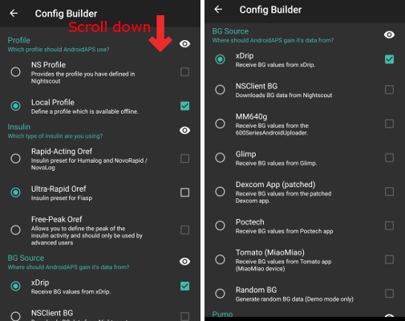

# Konfigurace

V závislosti na vašich nastaveních můžete Konfiguraci otevřít prostřednictvím záložky v horní části obrazovky nebo pomocí nabídky hamburger.

Konfigurace (Conf) je záložka, kde si zapínáte nebo vypínáte jednotlivé moduly. Zaškrtávací políčka na levé straně (A) slouží k výběru používaných modulů, zatímco políčka na pravé straně (C) umožňují jejich zobrazení ve formě záložek (E) v AAPS. I když není pravý box zaškrtnutý, dostanete se k funkci přes hamburger menu (D) v levém horním rohu obrazovky.

Pokud má modul další dodatečná nastavení, dostanete se k nim kliknutím na ozubené kolo (B).

**Prvotní nastavení**: od AAPS v 2.0 Vám s úvodním nastavením aplikace pomůže Průvodce nastavením. Stiskněte 3 tečky v pravé horní části obrazovky (F) a vyberte „Průvodce nastavením“.

(Config-Builder-tab-or-hamburger-menu)=

## Záložka nebo hamburger menu

Pomocí zaškrtávacího políčka pod symbolem oka se můžete rozhodnout, jak chcete otevírat odpovídající sekci programu.

(Config-Builder-profile)=

## Profile

* Vyberte bazální profil, který chcete použít. See [Profiles](../DailyLifeWithAaps/ProfileSwitch-ProfilePercentage.md) page for more setup information.
* Od AAPS 3.0 je k dispozici pouze lokální profil.

Nicméně i nadále je možné synchronizovat Nightscout profil do lokálního profilu. Za tímto účelem je však důležité naklonovat celý záznam sestávající z několika profilů v Nightscoutu. Podívejte se prosím na níže uvedené pokyny. Zadání změny prostřednictvím webového rozhraní může být užitečné v případě, že se jedná o velmi rozsáhlé změny profilu, např. ruční zkopírování dat z tabulky.

(Config-Builder-local-profile)=

### Místní profil

Místní profil používá bazální profil zapsaný přímo do telefonu. Po jeho vybrání se v AAPS objeví nová záložka, kde si můžete profil upravovat. Ten je pak v případě potřeby načten pumpou. Při přepnutí profilu je uložen do pumpy jako profil 1. Tento profil je doporučen, protože nevyžaduje připojení k internetu.

Your local profiles are part of [exported settings](../Maintenance/ExportImportSettings.md). Proto se ujistěte, že máte zálohu bezpečně uloženou.

Tlačítka:

* zelené plus: přidat
* červené X: odstranit
* modrá šipka: kopírovat

Děláte-li v profilu nějaké změny, ujistěte se, že upravujete správný profil. Na záložce profilu nemusí být pokaždé zobrazen aktuální profil. Například když na domovské obrazovce přepnete přes záložku profilu na jiný profil, může pak být aktuální profil odlišný od toho, který je zobrazen v záložce profil, protože mezi nimi není žádné spojení.

#### Klonování přepnutí profilu

Z přepnutí profilu můžete snadno vytvořit nový místní profil. Posun času a procentuální změna budou v takovém případě přeneseny do nového místního profilu.

1. Klikněte na 3 tečky v pravém horním rohu.
2. Vyberte „Ošetření“.
3. Stiskněte symbol hvězdičky pro přístup na stránku přepnutí profilu.
4. Vyberte požadovaný přepínač profilu, a stiskněte „Klonovat“.
5. Nový místní profil můžete upravit na kartě Místní profil (MPRF) nebo prostřednictvím hamburger menu.

(Config-Builder-upload-local-profiles-to-nightscout)=

#### Nahrávání místních profilů do Nighscoutu

Místní profily lze také nahrát do Nightscoutu. The settings can be found in [NSClient preferences](../SettingUpAaps/Preferences.md#nsclient).

#### Change profile in Nightscout profile editor

You can synchronize changes to the profile in the Nightscout profile editor to local profiles. The settings can be found in [NSClient preferences](../SettingUpAaps/Preferences.md#nsclient).

Je nezbytné naklonovat všechny aktuální aktivní záznamy v databázi Nightscout, a ne pouze profil s modrou šipkou! Nové databázové záznamy pak obsahují aktuální datum a lze je aktivovat pomocí záložky "místní profil".

### Pomocník s profilem

Pomocník s profilem nabízí dvě funkce:

1. Najít profil pro děti
2. Porovnání dvou profilů nebo přepnutí profilů za účelem naklonování nového profilu

Details are explained on the separate [profile helper page](../SettingUpAaps/ProfileHelper.md).

(Config-Builder-insulin)=

## Inzulín

* Vyberte typ inzulínové křivky, kterou používáte.
* Všechny varianty „Rychle působící Oref“, „Ultra rychlý Oref“, „Lyumjev“ a „Volitelný vrchol Oref“ mají exponenciální tvar. Více informací najdete v [dokumentaci k OpenAPS](https://openaps.readthedocs.io/en/latest/docs/While%20You%20Wait%20For%20Gear/understanding-insulin-on-board-calculations.html#understanding-the-new-iob-curves-based-on-exponential-activity-curves). 
* Křivky se liší podle DIA a času max. účinnosti inzulínu.
    
    * FIALOVÁ linka ukazuje, kolik **inzulínu zbývá** poté, co byl aplikován a postupem času se vstřebává.
    * MODRÁ linka ukazuje, **jak aktivní** inzulín je.

### Doba působnosti inzulínu

* Hodnota DIA není u každého člověka stejná. Proto si ji musíte vyzkoušet sami na sobě. 
* Vždy to však musí být alespoň 5 hodin.
* Pro velké množství lidí nemá ultra-rychlý inzulin jako Fiasp po 3–4 hodinách prakticky žádné znatelné účinky, i když fakticky zbývá cca 0,0xx jednotky. Nicméně i toto zbytkové množství může mít vliv například při sportu. Z toho důvodu AAPS používá minimální hodnotu DIA 5 hodin.
* You can read more about that in the Insulin Profile section of [this](../DailyLifeWithAaps/AapsScreens.md#insulin-profile) page.

### Rozdíly v typu inzulínu

* Pro „Rychle působící“ a „Ultra rychlý“ a „Lyumjev“ inzulín je DIA jediná proměnná, kterou si můžete upravovat. Doba maximální účinnosti je fixní. 
* „Volitelný vrchol“ umožňuje nastavit obě proměnné – DIA i dobu maximální účinnosti inzulínu. Tato volba je určena pouze pro pokročilé uživatele, kteří znají důsledky nastavených hodnot. 
* The [insulin curve graph](../DailyLifeWithAaps/AapsScreens.md#insulin-profile) helps you to understand the different curves.
* Zaškrtnutím čtverečku vedle názvu si je můžete prohlédnout v záložce. Další možnost jejich zobrazení je přes hamburgerové menu.

#### Rychle působící - Oref

* doporučeno pro Humalog, Novolog a Novorapid
* DIA = alespoň 5 h
* Max. Max. účinek = 75 minut po podání (pevné hodnota, nelze měnit)

#### Ultra rychlý - Oref

* doporučeno pro FIASP
* DIA = alespoň 5 h
* Max. max. účinek = 55 minut po podání (pevná hodnota, nelze měnit)

(Config-Builder-lyumjev)=

#### Lyumjev

* speciální inzulínový profil pro Lyumjev
* DIA = alespoň 5 h
* Max. Max. účinek = 45 minut po podání (pevné hodnota, nelze měnit)

#### Volitelný vrchol Oref

* V profilu „Volitelný vrchol 0ref“ můžete ručně zadat dobu max. účinku inzulínu. Chcete-li tak učinit, klikněte pro přístup k rozšířenému nastavení na ozubené kolečko.
* Pokud není v profilu zadána vyšší hodnota, je DIA je automaticky nastaveno na 5 h.
* Tento profil je doporučován v případě, že používáte nepodporovaný inzulín nebo směs různých inzulínů.

(Config-Builder-bg-source)=

## Zdroj glykémií

Select the blood glucose source you are using - see [BG Source](../Getting-Started/CompatiblesCgms.md) page for more setup information.

* [Sestav si vlastní Dexcom aplikaci (BYODA)](https://docs.google.com/forms/d/e/1FAIpQLScD76G0Y-BlL4tZljaFkjlwuqhT83QlFM5v6ZEfO7gCU98iJQ/viewform?fbzx=2196386787609383750&fbclid=IwAR2aL8Cps1s6W8apUVK-gOqgGpA-McMPJj9Y8emf_P0-_gAsmJs6QwAY-o0).
* [xDrip+](https://xdrip-plus-updates.appspot.com/stable/xdrip-plus-latest.apk)
* [MM640g](https://github.com/pazaan/600SeriesAndroidUploader/releases)
* [Glimp](https://play.google.com/store/apps/details?id=it.ct.glicemia&hl=de) - jsou podporovány pouze verze 4.15.57 a novější
* [Poctech](https://www.poctechcorp.com/en/contents/268/5682.html)
* [Tomato App](http://tomato.cool/) pro zařízení MiaoMiao
* [Glunovo aplikace](https://infinovo.com/) pro Glunovo CGM systém
* NSClient BG - není doporučeno, protože v tomto případě je uzavřená smyčka závislá na mobilních datech / Wi-Fi. CGM data budou přijímána pouze v případě, jste-li připojeni ke svému Nightscoutu. Je mnohem lepší využít některý z lokálních zdrojů CGM.
* Generovat náhodné hodnoty glykémie (pouze režim Demo)

(Config-Builder-pump)=

## Pump

Vyberte, kterou pumpu používáte.

* [Dana R](../CompatiblePumps/DanaR-Insulin-Pump.md)
* DanaR Korea (pro korejskou verzi pumpy DanaR)
* Dana Rv2 (DanaR s neoficiálním upgradem firmwaru)
* [Dana-i/RS](../CompatiblePumps/DanaRS-Insulin-Pump.md)
    
    * Pro pumpy Dana – pokud je nutný BT watchdog, aktivujte ho v **Rozšířená nastavení**. Při problémech s připojením k pumpě vypne bluetooth na 1 sekundu. Toto nastavení může u některých mobilů pomoci při zamrzání bluetooth.
    * [Password for Dana RS pump](../CompatiblePumps/DanaRS-Insulin-Pump.md) must be entered correctly. V předchozích verzích nebylo heslo kontrolováno.

* [Accu-Chek Insight](../CompatiblePumps/Accu-Chek-Insight-Pump.md)

* [Accu Chek Combo](../CompatiblePumps/Accu-Chek-Combo-Pump.md) (requires ruffy installation)
* [Omnipod Eros](../CompatiblePumps/OmnipodEros.md)
* [Omnipod DASH](../CompatiblePumps/OmnipodDASH.md)
* [Medtronic](../CompatiblePumps/MedtronicPump.md)
* [Diaconn G8](../CompatiblePumps/DiaconnG8.md)
* MDI (AAPS poskytuje návrhy pro aplikaci inzulínu pomocí inzulínových per)
* Virtuální pumpa (otevřená smyčka pro pumpu, pro kterou zatím neexistuje ovladač – nabízí pouze návrhy AAPS)

## Detekce citlivosti

Vyberte variantu detekce citlivosti. For more details of different designs please [read on here](../DailyLifeWithAaps/SensitivityDetectionAndCob.md). Bude prováděna analýza historických dat. Jestliže se zjistí, že na inzulín reagujete citlivěji než obvykle (nebo naopak máte vyšší rezistenci), provedou se úpravy. Další podrobnosti o algoritmu citlivosti si můžete přečíst v [dokumentaci OpenAPS](https://openaps.readthedocs.io/en/latest/docs/Customize-Iterate/autosens.html).

Průběh citlivosti můžete na hlavní stránce zobrazit vybráním políčka Citlivost. Zobrazí se jako bílá čára. Note, you need to be in [Objective 8](../SettingUpAaps/CompletingTheObjectives.md#objective-8-adjust-basals-and-ratios-if-needed-and-then-enable-autosens) in order to let Sensitivity Detection/[Autosens](../DailyLifeWithAaps/KeyAapsFeatures.md#autosens) automatically adjust the amount of insulin delivered. Před dosažením tohoto cíle slouží procentuální údaj Autosens a bílá čára v grafu pouze pro informaci.

(Config-Builder-absorption-settings)=

### Nastavení absorpce sacharidů

Pokud používáte Oref1 s funkcí SMB, musíte změnit **min_5m_carbimpact** na 8. Tato hodnota se používá pouze při výpadcích hodnot odečítaných z CGM nebo v případech, kdy se fyzickou aktivitou vyrovná vzestup glykémie, který by jinak vedl k tomu, že by systém AAPS odbourával COB. At times when [carb absorption](../DailyLifeWithAaps/CobCalculation.md) can't be dynamically worked out based on your bloods reactions it inserts a default decay to your carbs. V podstatě jde o bezpečnostní pojistku.

(Config-Builder-aps)=

## APS

Vyberte požadovaný algoritmus APS pro úpravy léčby. Detaily vybraného algoritmu můžete zobrazit na kartě OpenAPS (OAPS).

* OpenAPS AMA (pokročilý asistent s jídly, stav algoritmu v roce 2017). Zjednodušeně řečeno, výhoda systému je v tom, že zadáte-li sacharidy, dokáže systém po poslání bolusu velmi rychle spustit vysoký dočasný bazál.
* [OpenAPS SMB](../DailyLifeWithAaps/KeyAapsFeatures.md) (super micro bolus, most recent algorithm for advanced users) Note you need to be in [Objective 9](../SettingUpAaps/CompletingTheObjectives.md#objective-9-enabling-additional-oref1-features-for-daytime-use-such-as-super-micro-bolus-smb) in order to use OpenAPS SMB and min_5m_carbimpact must be set to 8 in Config builder > Sensitivity detection > Sensitivity Oref1 settings.

## Smyčka

* Přepínání mezi otevřenou smyčkou, uzavřenou smyčkou a pozastavením při nízké glykémii (LGS).

(Config-Builder-open-loop)=

### Otevřená smyčka

* AAPS průběžně hodnotí všechny dostupné údaje (IOB, COB, glykémie…) a předkládá návrhy, jak v případě potřeby upravit vaši léčbu. 
* Návrhy nebudou provedeny automaticky (tak jako v uzavřené smyčce), ale mohou být zadány ručně přímo do pumpy nebo tlačítkem z aplikace – pokud používáte podporovanou pumpu (DanaR/RS nebo Accu-check Combo). 
* Tato možnost slouží k tomu, abyste poznali, jak vlastně AndroidAPS funguje, nebo pro případ, že používáte nepodporovanou pumpu.

(Config-Builder-closed-loop)=

### Uzavřená smyčka (Closed Loop)

* AAPS průběžně vyhodnocuje všechny dostupné údaje (IOB, COB, glykémie…) a podle potřeby automaticky upravuje léčbu (tj. bez dalšího Vašeho zásahu) s cílem dosáhnout nastaveného cílového pásma nebo hodnoty (podání bolusu, dočasné bazální dávky, vypnutí podávání inzulínu, aby se předešlo hypoglykémii atd.). 
* Uzavřená smyčka je zabezpečena velkým množstvím bezpečnostních limitů, které lze nastavit individuálně.
* Closed Loop is only possible if you are in [Objective 6](../SettingUpAaps/CompletingTheObjectives.md#objective-6-starting-to-close-the-loop-with-low-glucose-suspend) or higher and use a supported pump.
* Poznámka: při používání uzavřené smyčky se doporučuje nastavit jeden cíl místo cílového rozsahu (tj. 5,5 mmol nebo 100 mg/l místo rozsahu 5,0–7,0 mmol nebo 90–125 mg/dl).

### Pozastavení při nízké glykémii (LGS)

* maxIOB je nastaveno na nulu
* To znamená, že klesá-li hladina glukózy v krvi, snížuje se odpovídajícím způsobem i bazál.
* Při rostoucí hladině glukózy ale nedochází k žádné automatické korekci. Hodnota bazálu zůstává stále na hodnotě nastavené z profilu.
* Dodatečný inzulín je pro snížení glykémie podáván pouze v případě, že je bazální IOB negativní (na základě jeho předchozího pozastavení při nízké glykémii).

### Minimální změna pro oznámení

* Při použití otevřené smyčky budete dostávat oznámení pokaždé, když AAPS doporučí úpravu bazální dávky. 
* Ke snížení počtu oznámení můžete použít buď širší rozsah cílové glykemie, nebo vyšší procento minimální změny pro výzvu.
* Toto definuje relativní změnu, která je požadována pro spuštění oznámení.

## Cíle (výukový program)

AAPS has a learning program (objectives) that you have to fulfill step by step. Ty by vás měly bezpečně provést nastavením uzavřené smyčky. Postupným splněním cílů je zajištěno, že přesně porozumíte tomu, jak systém pracuje. Jedině tak můžete svému systému plně důvěřovat.

You should [export your settings](../Maintenance/ExportImportSettings.md) (including progress of the objectives) on a regularly basis. V případě, že v budoucnosti budete muset svůj smartphone nahradit (nové zařízení, poškození displeje atd.), můžete tato nastavení jednoduše importovat.

See [Objectives](../SettingUpAaps/CompletingTheObjectives.md) page for more information.

## Ošetření

Pokud se podíváte na záložku Ošetření, můžete vidět ošetření které byly nahrány na Nightscout. Should you wish to edit or delete an entry (e.g. you ate less carbs than you expected) then select 'Remove' and enter the new value (change the time if necessary) through the [carbs button on the home screen](../DailyLifeWithAaps/AapsScreens.md#bolus--carbs).

## General

### Přehled

Displays the current state of your loop and buttons for most common actions (see [section The Homescreen](../DailyLifeWithAaps/AapsScreens.md) for details). Kliknutím na ozubené kolo se dostanete do nastavení.

#### Nechat obrazovku zapnutou

Tato volba zabrání tomu, aby systém Android vypnul obrazovku. To je vhodné například pro prezentace. Při tomto nastavení ale dochází k velmi rychlému vybíjení baterie. Proto je doporučeno připojit smartphone k napájecímu kabelu.

#### Tlačítka

Určuje, která tlačítka budou zobrazena na domácí obrazovce.

* Ošetření
* Kalkulačka
* Inzulín
* Sacharidy
* CGM (otevře xDrip+)
* Kalibrace

Kromě toho můžete nastavit zkratky pro inzulín a sacharidy a rozhodnout se, zda bude v dialogu pro přidání ošetření i poznámka.

#### Nastavení rychlých bolusů

Vytvořte si tlačítko pro určité standardní jídlo (sacharidy a parametry pro výpočet bolusu), které se zobrazí na domácí obrazovce. Můžete ho použít pro standardní jídlo, které konzumujete pravidelně. U každého jídla (tlačítka) lze definovat i čas, a tak budete mít na domácí obrazovce k dispozici vhodné tlačítko pro dané jídlo odpovídající denní době.

Poznámka: tlačítko nebude viditelné, pokud je aktuální čas mimo interval definovaný v nastavení nebo pokud máte dostatečný IOB k pokrytí sacharidů definovaných kalkulačkou.

#### Výchozí nastavení dočasných cílů

Vyberte výchozí dočasné cíle (doba trvání a cíl). Přednastavené hodnoty jsou:

* blížící se jídlo: cíl 72 mg/dl/4, 0 mmol/l, trvání 45 min
* aktivita: cíl 140 mg/dl/7, 8 mmol/l, trvání 90 min
* hypoglykemie: cíl 125 mg/dl/6, 9 mmol/l, trvání 45 min

#### Standardní množství inzulinu pro Plnění/Doplňování

Nastavte výchozí hodnoty tří tlačítek v dialogovém okně plnění/doplňování v závislosti na délce vaší hadičky.

#### Rozsah pro zobrazení

Nastavte hranice nízké a vysoké glykémie, které budou použité u grafů glykémie v AAPS a hodinkách. Jde pouze o zobrazení, nikoliv nastavení cílové hodnoty glykémie. Příklad: 70–180 mg/dl nebo 3,9–10 mmol/l

#### Krátké názvy modulů

Choose whether the tab titles in AAPS are long (e.g. ACTIONS, LOCAL PROFILE, AUTOMATION) or short (e.g. ACT, LP, AUTO)

#### Zobrazovat kolonku poznámky v dialozích ošetření

Vyberte si, chcete-li mít při zadávání ošetření k dispozici pole poznámka.

#### Stavové indikátory

Choose if you want to have [status lights](../SettingUpAaps/Preferences.md#status-lights) on overview for cannula age, insulin age, sensor age, battery age, reservoir level or battery level. Je-li dosaženo úrovně pro varování, změní se barva stavového indikátoru na žlutou. Kritická hodnota se zobrazí červeně.

#### Pokročilá nastavení

**Podat tuto část z výsledku kalkukace [%]**: Při použití SMB si mnoho lidí neposílá na jídlo 100% dávku inzulínu, ale pouze její část (např. 75 %), a nechá zbytek na SMB ve spolupráci s UAM (detekce neoznámeného jídla). In this setting, you can choose a default value for the percentage the bolus wizard should calculate with. Pokud je toto nastavení 75 % a máte dostat bolus 10 U, navrhne bolusový kalkulátor pouze 7,5 jednotky.

**V průvodci povolte funkci superbolus** (jde o něco jiné než *super mikro bolus*!): Funkci používejte s opatrností a nepovolujte ji, dokud se nenaučíte, co to skutečně dělá. V podstatě je bazál za následující 2 hodiny přidán do bolusu a po dobu těchto 2 h je nastaven nulový dočasný bazál. **Funkce smyčky AAPS budou po dobu superbolusu deaktivovány – používat opatrně! If you use SMB AAPS looping functions will be disabled according to your settings in ["Max minutes of basal to limit SMB to"](../DailyLifeWithAaps/KeyAapsFeatures.md#max-minutes-of-basal-to-limit-smb-to), if you do not use SMB looping functions will be disabled for two hours.** Details on super bolus can be found [here](https://www.diabetesnet.com/diabetes-technology/blue-skying/super-bolus).

(Config-Builder-actions)=

### Akce

* Tlačítka k běžně používaným úkonům.
* See [AAPS screenshots](../DailyLifeWithAaps/AapsScreens.md#action-tab) for details.

### Automatizace

Uživatelem vytvořené úlohy automatizace ('if-then-else'). Please [read on here](../DailyLifeWithAaps/Automations.md).

(Config-Builder-sms-communicator)=

### SMS komunikátor

Allows remote caregivers to control some AAPS features via SMS, see [SMS Commands](../RemoteFeatures/SMSCommands.md) for more setup information.

### Jídlo

Zobrazuje jídla přidaná do databáze Nightscoutu. Více informací viz [Nightscout Readme](https://github.com/nightscout/cgm-remote-monitor#food-custom-foods).

Poznámka: Tyto záznamy nelze použít v Kalkulačce v AAPS. (Pouze je zobrazit)

(Config-Builder-wear)=

### Wear

Monitor and control AAPS using your Android Wear watch (see [page Watchfaces](../UsefulLinks/WearOsSmartwatch.md)). Chcete-li nastavit parametry pro výpočet bolusu na hodinkách (tj. 15min trend, COB…), klikněte na nastavení (ozubené kolo).

Chcete-li z hodinek zadávat bolus atd., musíte v „Nastavení wear“ aktivovat volbu „Ovládání z hodinek“.

Prostřednictvím záložky Wear nebo hamburger menu (levý horní roh obrazovky, když není záložka zobrazena) můžete

* znovu poslat všechna data. To může pomoci v případech, kdy byly hodinky nějakou dobu nedostupné a potřebujete do nich poslat data.
* Otevřít nastavení hodinek přímo z telefonu.

### Stavová řádka xDrip (hodinky)

Display loop information on your xDrip+ watchface (if you are not using AAPS/[AAPSv2 watchface](../UsefulLinks/WearOsSmartwatch.md)

### NSClient

* Nastavení synchronizace dat mezi AAPS a Nightscoutem.
* Settings in [preferences](../SettingUpAaps/Preferences.md#nsclient) can be opened by clicking the cog wheel.

### Údržba

E-mail a počet logů, které budou odeslány. Obvykle není nutné tyto hodnoty měnit.

### Konfigurace

Místo hamburger menu použijte záložku Konfigurace.