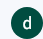
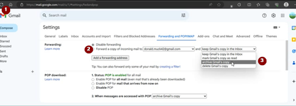

# Vyhrazený Google účet pro AAPS (volitelné)

Někteří uživatelé **AAPS** raději používají svůj hlavní e-mailový účet i pro **AAPS**. Naopak jiní uživatelé **AAPS** (nebo jejich pečovatelé) raději používají e-mailový účet určený pouze pro **AAPS**. Toto není povinné, ale níže uvádíme příklad, jak to nastavit.

If you don't want to set up an **AAPS**-dedicated Gmail account, you can just go straight to the next section, [building AAPS](../SettingUpAaps/BuildingAaps.md).

```{admonition} Advantages of a dedicated Google account for AAPS
:class: dropdown

- Dedicated Google drive space means you will not risk filling up your personal Google drive limit with **Export Preferences**.
- Each version of **AAPS** (and supporting apps like xdrip+, BYODA, etc) will be stored in one single place which is independent of your computer hardware. If your PC or phone is stolen/lost/broken you will still have access.
- By harmonizing the setup, it will make online support simpler across users with similar folder structure.
- Depending on the setup (see below), you will have a separate identity as an alias to communicate within the community which can protect your privacy. 
- Children with T1D can preserve their own “everyday” email account as minors while using **AAPS** and associated features which require an adult account.
- Gmail allows you to register up to 4 accounts under the same phone number.
```

## Jak nastavit Google účet určený pouze pro AAPS

(⌛Asi 10 minut)


Požadavky:

- Máte Windows PC (Windows 10 nebo novější) a Android telefon (Android 9 nebo novější), na kterém se bude provozovat aplikace **AAPS**. Obě tato zařízení mají nainstalované všechny nejnovější bezpečnostní aktualizace, přístup k Internetu a administrátorská oprávnění, protože některé kroky vyžadují stažení a instalaci programů.
- Android telefonu je už nastaven s vaší osobní každodenní e-mailovou adresou, například Gmailovým účtem.

```{admonition} Things to consider when setting up your new account
:class: dropdown
- You could use a name different to your own, which has relevance to the account (like t1dsuperstar) for privacy reasons. You can then use it in **AAPS** public forums while keeping your own identity private. Since Google requires a recovery email and phone number, it is still traceable.
- The new **AAPS** account will use the same phone number for verification as your “_everyday_” one. It will use the “everyday” email address for verification;
- We will setup email forwarding such that any email sent to the new dedicated AAPS account will be forwarded to the primary one (so there is no need to check two different mailboxes);
- Use separate passwords for your _everyday_ Gmail account and the AAPS-dedicated Gmail account
- If you use google “2-step verification” (aka multifactor) authentication for one Gmail account, you might as well do it for both Gmail accounts.
- If you plan to use Google “Passkeys”, make sure you register multiple devices. This is so you don’t lock yourself out. Only do it on devices that nobody else can access (_i.e._ not on a PC with a shared account that other people can unlock).
```


```{admonition} Video Walkthrough! 
:class: Poznámka
Kliknutím [zde] (<https://drive.google.com/file/d/1dMZTIolO-kd2eB0soP7boEVtHeCDEQBF/view?usp=drive_link>) spustíte videoprůvodce nastavením vyhrazeného Google účtu.
```

Toto jsou kroky nastíněné ve videu:

V tomto příkladu:

- Váš stávající "každodenní" Google účet je <donald.muck42@gmail.com>; 
- Váš nový "_AAPS_" Gmail účet bude: <donald.muck42.aaps@gmail.com>; 

#### Přejděte na <https://account.google.com> 

Pokud jste již přihlášeni do Google, nasměruje vás to na stránku " **Můj účet**" vašeho každodenního účtu.
(1) Klikněte v pravém horním rohu stránky na váš profilový obrázek (v tomto případě jednoduchý 
(2) vyberte "_přidat další účet_".


#### Zadejte podrobnosti o vašem NOVÉM vyhrazeném účtu: 

- Vložte nový účet: 
- Vytvořit účet
- pro mé osobní účely. 

#### Zadejte vaše osobní údaje:

- Vložte křestní jméno
- Příjmení
- datum narození (musí být zadán věk dospělého)

#### Vyberte svou novou e-mailovou adresu a heslo

Tento příklad doplňuje „.AAPS“ k existujícímu e-mailu Donalda Mucka…\
Nastavte heslo

####  Zadejte telefonní číslo, na kterém můžete přijímat SMS ověření

Gmail vám nyní odešle jedinečný kód pro ověření.

#### Zadejte adresu pro obnovení

V tomto případě to bude váš existující "_každodenní_" e-mail…

#### Dokončete nastavení vašeho účtu

Gmail zobrazí název účtu. Bude vás žádat, abyste přijali podmínky Gmailu a potvrdili vaše osobní nastavení.

#### Přizpůsobte zobrazení nového profilu

V tomto okamžiku byste měli být na Gmail stránce Můj účet zobrazující váš nový e-mailový účet vyhrazený pro **AAPS**. Profilový obrázek bude ve výchozím nastavení zobrazovat první písmeno vašeho jména. Změňte ho na něco jedinečného abyste zabránili omylu… v tomto příkladu Donald.Muck.AAPS byl nahrazen  obrázkem 

\


#### Pro nastavení nového účtu otevřete webovou stránku Gmail v obou oknech

Abyste nemuseli kontrolovat dva samostatné e-mailové účty, přeposílejte si e-maily z nového **AAPS** vyhrazenému účtu na váš každodenní účet \
Tato část může být trochu matoucí, protože se mezi oběma účty budete muset přepnout tam a zpět. Chcete-li si to usnadnit, otevřete si v prohlížeči dvě samostatná okna nad sebou:

1. Přesuňte vaše existující okno do horní části obrazovky a změňte jeho velikost tak, aby zabíralo pouze horní polovinu obrazovky… 
2. Klepněte pravým tlačítkem myši na logo prohlížeče v hlavním panelu 
3. Z menu vyberte "Nové okno"... a nastavte ho tak, aby zabíralo pouze dolní část obrazovky.

Otevřete <https://gmail.com>  v obou oknech prohlížeče. Ujistěte se, že Váš osobní účet je v horní části a nový vyhrazený účet **AAPS** je dole, a že jsou snadno rozpoznatelné profilovým obrázkem v pravém horním rohu. Pokud je to potřeba, můžete vždy přepnout účty kliknutím na profilový obrázek a výběrem správného.


Vaše domovské stránky Gmail by měly vypadat takto:\


#### V novém Gmail účtu (dolní okno) otevřete nastavení Gmail… 

- Klikněte na ozubené kolo vlevo od profilového obrázku 
- pak vyberte “**Zobrazit všechna nastavení**”


#### Nastavení přeposílání…

- Klikněte na záložku "Nastavení přeposlání a POP/IMAP"
- Klikněte na "Přidat adresu pro přeposílání"
- Zadejte vaši "každodenní" e-mailovou adresu
- Gmail vám na vaši "každodenní" e-mailovou adresu odešle ověřovací kód. 
- Přepněte se zpět na svůj každodenní profil a klikněte na odkaz, abyste potvrdili, že přijímáte přeposílání (nebo vezměte kód z ověřovacího e-mailu ve svém „každodenním“ Gmail okně a vložte ho do „nového vyhrazeného AAPS“ Gmail okna).

Budete muset docela přepínat tam a zpět mezi okny, ale zajistíte tak, že kdykoli zkontrolujete e-maily na vašem "každodenním" účtu, uvidíte zároveň e-maily přeposlané z vašeho účtu vyhrazeného pro AAPS, jako například upozornění Gmailu.


#### Ověření přeposlané e-mailové adresy

- V "každodenním" Gmailu (horní okno), dostanete e-mailem „Potvrzení o přesměrování Gmail“. 
- Otevřete jej a „klikněte na odkaz pro potvrzení požadavku“

#### Archivace přeposílaných e-mailů ve vyhrazeném Gmail účtu (dolní okno)

<!---->

1. Obnovte dolní okno
2. Zkontrolujte "přesměrování příchozích e-mailů"
3. A archivovujte kopii Gmailu (aby vaše nová vyhrazená poštovní schránky byla čistá)
4. Posuňte se až dolů a uložte změny\
   


Congratulations! Nyní máte vytvořený dedikovaný AAPS Google účet. The next step is to [build the AAPS app](../SettingUpAaps/BuildingAaps.md).
