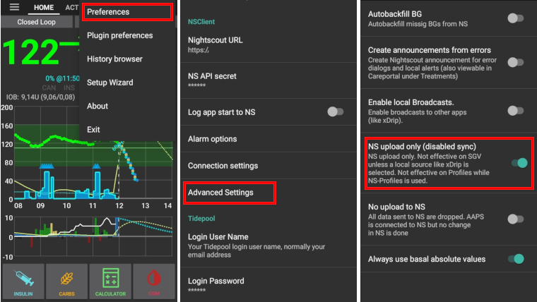

# Nightscout

(Nightscout-security-considerations)=

## Bezpečnostní pokyny

Kromě sledování může být Nightscout použit také k ovládání AAPS. Tj. můžete nastavit dočasné cíle nebo přidat budoucí sacharidy. Tyto informace budou sbírány AAPS a bude to fungovat odpovídajícím způsobem. Proto stojí za to přemýšlet o zabezpečení Nightscout webové stránky.

Buďte maximálně opatrní, pokud používáte Nightscout jako zdroj dat v AAPS.

### Nightscout settings

Veřejný přístup k webu Nightscout můžete odepřít použitím [autentizačních rolí](https://nightscout.github.io/nightscout/security): ujistěte se, že sdílíte svou URL pouze pomocí `tokenu pro čtení`, nikdy s `admin` tokenem.

Nightscout `API_SECRET` je hlavní heslo vašeho webu: nesdílejte jej veřejně.

(Nightscout-aaps-settings)=

### AAPS settings

AAPS můžete nastavit tak, aby přijímal Nightscout příkazy (změny profilu, ošetření, ...), nebo je zcela zakázat.

* Přistupujte k nastavením pluginů NSClient nebo NSClientV3 pomocí 1) Hlavní zobrazení -> Konfigurace -> Synchronizace -> Ikona ozubeného kola u NSClient 2) Záložka NSCLIENT -> Třítečkové menu -> Předvolby pluginu
* Povolte nahrání všech dat do Nightscoutu (3), protože to je nyní standardní postup, pokud není zdrojem vašich údajů o glykémii Nightscout.  
  Pokud je v AAPS zdrojem vašich údajů o glykémii Nightscout, **nepovolujte** nahrávání údajů o glykémii do NS (3).
* Nepovolujte přijímání/vyplňování dat (4) pokud Nightscout není vaším zdrojem dat glykémie.

#### Nesynchronizujte z Nightscoutu

Zakázáním těchto možností se zajistí, že žádná změna v Nightscoutu nebude použita AAPS.

#### Přijmout změny z Nightscoutu

Povolení těchto možností vám umožní vzdáleně měnit nastavení AAPS přes Nightscout, např. změny a přepínání profilů, dočasné cíle a přidávání sacharidů, které budou brány v úvahu AAPS.  
Mějte ale na paměti, že zadané dávky inzulínu budou použity pouze pro výpočty podle pravidla "Neaplikovat inzulín, pouze zaznamenat".

### Další nastavení zabezpečení

Keep your phone up to date as described in [safety first](#preparing-safety-first).

(Nightscout-manual-nightscout-setup)=

## Ruční nastavení Nightscoutu

Předpokládá se, že Nightscout stránky už máte, pokud ne, tak navštivte stránku [Nightscout](http://nightscout.github.io/nightscout/new_user/) pro návod k založení. Následující pokyny jsou nastavení, která potřebujete provést v Nightscoutu pro správnou funkčnost AndroidAPS. Aby fungovalo správně propojení s AAPS od verze 3.2, váš Nightscout server musí být alespoň ve verzi 15. Ověřte si, že provozujete [poslední verzi](https://nightscout.github.io/update/update/#updating-your-site-to-the-latest-version) Nightscoutu, jinak bude AAPS reagovat chybovou zprávou.

* [Upravte své proměnné](https://nightscout.github.io/nightscout/setup_variables/#nightscout-configuration)

* Přidejte nebo upravte proměnné takto:
  
  * `ENABLE` = `careportal boluscalc food bwp cage sage iage iob cob basal dbsize pushover pump openaps`
  * `DEVICESTATUS_ADVANCED` = `true`
  * `SHOW_FORECAST` = `openaps`
  * `PUMP_FIELDS` = `reservoir battery clock`
  * Pro [hlídání pumpy](https://github.com/nightscout/cgm-remote-monitor#pump-pump-monitoring) lze nastavit různé alarmy, doporučujeme zejména % nabití baterie: 
    * `PUMP_WARN_BATT_P` = `51`
    * `PUMP_URGENT_BATT_P` = `26` 

* Uložte změny. Váš Nightscout web by nyní měl umožňovat zobrazení pilulek. Můžete vynutit výchozí zobrazení přidáním do `SHOW_PLUGINS`.
  
  * `SHOW_PLUGINS` = `careportal boluscalc food bwp cage sage iage iob cob basal dbsize pushover pump openaps`
  
  

## Nightscout jako placená služba typu SaaS (Software as a Service)

Použijte webové rozhraní dodavatele k nastavení proměnných. V případě potřeby kontaktujte službu podpory dodavatele.