# Nastavení

- **Open preferences** by clicking the three-dot menu on the top right side of the home screen.


- You can jump directly to preferences for a certain tab (i.e. pump tab) by opening this tab and clicking Plugin preferences.

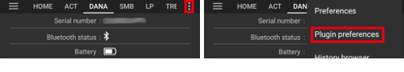

- **Sub-menus** can be opened by clicking the triangle below the sub-menu title.

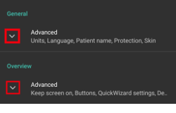

- With the **filter** on top of the preferences screen you can quickly access certain preferences. Just start typing part of the text you are looking for.

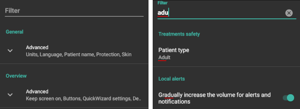

```{contents}
:backlinks: entry
:depth: 2
```

(Preferences-general)=
## General

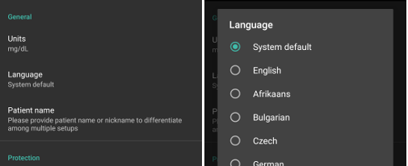

**Units**

- Set units to mmol/l or mg/dl depending on your preferences.

**Language**

- New option to use phone's default language (recommended).

- In case you want **AAPS** in a different language than your standard phone language, you can choose from a broad variety.

- If you use different languages, you might sometimes see a language mix. This is due to an android issue where overriding the default android language sometimes doesn't work.
- Setting hidden in [simple mode](#preferences-simple-mode).

(preferences-simple-mode)= **Simple mode**

The **simple mode** is activated by default when you first install **AAPS**. In **simple mode**, a significant amount of settings is hidden and preferences are replaced by predefined values. [Additional graphs](#AapsScreens-section-g-additional-graphs) on the HomePage are also predefined for you. You should switch off Simple mode once you become familiar with **AAPS** user interface and settings.

**Patient name**

- Can be used if you have to differentiate between multiple setups (i.e. two T1D kids in your family).
- Displayed in the [Dual Watchface](../WearOS/WearOsSmartwatch.md).

(Preferences-skin)=
### Skin

Setting hidden in [simple mode](#preferences-simple-mode).

Můžete si vybrat ze čtyř typů vzhledů:

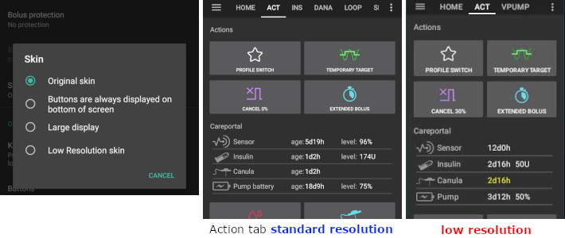

'Low resolution skin' comes with shorter labels and age/level removed to have more available space on a very low resolution screen.

Difference between the other skins depends on the phone's display orientation:

#### Portrait orientation

- \*\* Původní vzhled\*\* a **Tlačítka jsou vždy zobrazena na spodní části obrazovky** jsou stejné
- **Large Display** has an increased height for all graphs compared to other skins

#### Landscape orientation

- Při použití **Původní vzhled** a **Velký displej**, musíte posouvat dolů, abyste zobrazili tlačítka v dolní části obrazovky

- **Large Display** has an increased height for all graphs compared to other skins


(Preferences-protection)=
## Ochrana


(Preferences-master-password)=
### Master password

Mandatory to be able to [export settings](../Maintenance/ExportImportSettings.md) as they are encrypted from version 2.7.

**Biometric protection may not work on OnePlus phones. This is a known issue of OnePlus on some phones.**


### Settings protection

- Protect your settings with a password or phone's biometric authentication (i.e. [child is using **AAPS**](../RemoteFeatures/RemoteMonitoring.md)). If you enable this feature, you will be prompted for authentication each time you want to access any Preferences related view.

- Custom password should be used if you want to use master password just for securing [exported settings](../Maintenance/ExportImportSettings.md), and use a different one for editing the preferences.

- If you are using a custom password click on line "Settings password" to set password as described [above](#Preferences-master-password).

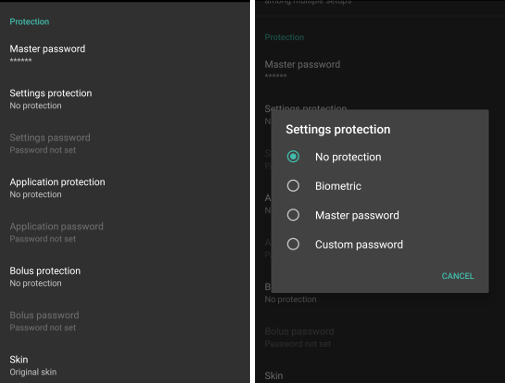

### Application protection

If the app is protected, you must enter the password or use the phone's biometric authentication to open **AAPS**.

**AAPS** will shut down immediately if a wrong password is entered - but will still run in background if it was previously opened successfully.

### Bolus protection

- Bolus protection might be useful if **AAPS** is used by a small child and you [bolus via SMS](../RemoteFeatures/SMSCommands.md).

- V níže uvedeném příkladu vidíte výzvu k biometrické ochraně. If biometric authentication does not work, click in the space above the white prompt and enter thr master password.


### Password and PIN retention

Define how long (in seconds), the preferences or bolus functionalities remain unlocked after you successfully enter the password.

## Přehled

In the **Overview** section, you can define the preferences for the home screen.

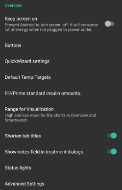

### Keep screen on

Option 'Keep screen on' will force Android to keep the screen on at all times. This is useful for presentations etc. But it consumes a lot of battery power. Therefore, it is recommended to connect the smartphone to a charger cable.

(Preferences-buttons)=
### Tlačítka

- Define which buttons are visible on the bottom of your home screen.
- Setting hidden in [simple mode](#preferences-simple-mode).

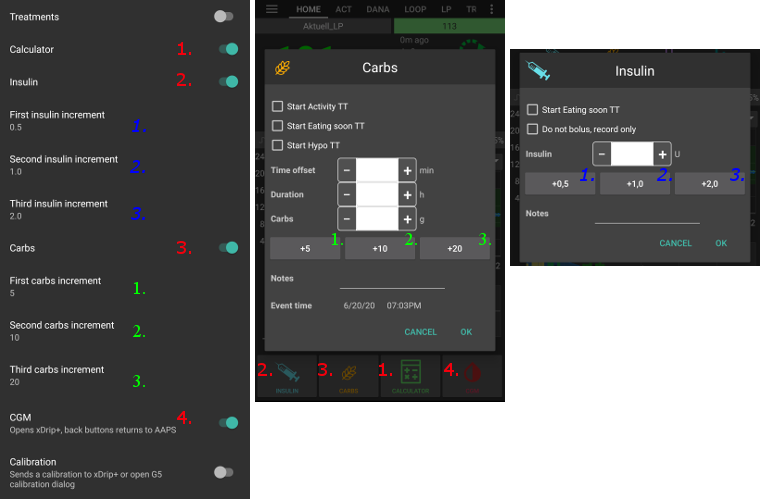

- The **Increment** options allow you to define the amount for the three buttons in the carb and insulin dialogues, for easy entry.


(Preferences-quick-wizard)=
### Průvodce rychlým bolusem

Create customized buttons for certain standard meals or snacks which will be displayed on the home screen. Useful for standard meals frequently eaten.

For each button, you define the carbs and calculation method for the bolus. Then, you define during which time period the button will be visible on your home screen - just one button per period. The button will not be visible if outside the specified time range or if you have enough IOB to cover the carbs defined in the QuickWizard button. If different times are specified for the different meals you will always have the appropriate standard meal button on the home screen, depending on the time of day.

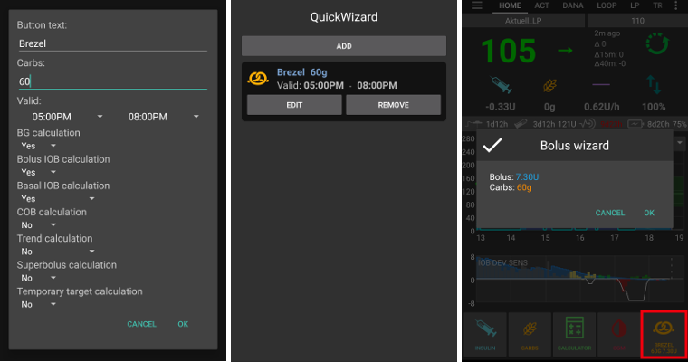

If you click the quick wizard button **AAPS** will calculate and propose a bolus for those carbs based on your current ratios (considering blood glucose value or insulin on board if set up).

Navržený bolus musí být potvrzen, aby byl následně vydán.


Only one QuickWizard button can show up at the same time. If you want to execute a different one : long press on the Quick Wizard button currently showing. It will take you to the list of all Quick Wizard options. To execute one, long press on it. You will have to confirm before execution.

(Preferences-default-temp-targets)=
### Default temp targets

Setting hidden in [simple mode](#preferences-simple-mode).

[Temporary targets (TT)](../DailyLifeWithAaps/TempTargets.md) allow you to change your blood glucose target for a certain time period. When setting a default TT, you can easily change your target for activity, eating soon etc.

Here you can change the target and the duration for each predefined TT. Preset values are:

* Eating soon: target 72 mg/dL / 4.0 mmol/l, duration 45 min
* Activity: target 140 mg/dL / 7.8 mmol/l, duration 90 min
* Hypo: target 125 mg/dL / 6.9 mmol/l, duration 45 min

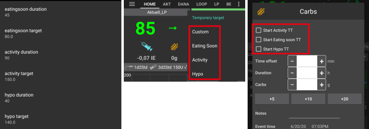

Learn how to [activate Temp Targets here](#TempTargets-where-can-i-select-a-temp-target).

### Fill/Prime standard insulin amounts

Setting hidden in [simple mode](#preferences-simple-mode).

If you want to fill the tube or prime cannula through **AAPS** you can do this through the [**Actions** tab](#screens-action-tab).

Přednastavené hodnoty se dají měnit v tomto dialogu. Choose the default amounts of the three buttons in fill/prime dialogue, depending on the length of your catheter.

(Preferences-range-for-visualization)=
### Range for visualization

Choose the high and low marks for the BG-graph on **AAPS** overview and smartwatch. It is only the visualization, not the target range for your BG. Example: 70 - 180 mg/dl or 3.9 - 10 mmol/l

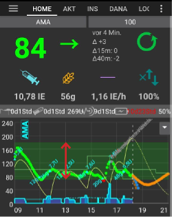

### Shorten tab titles

Setting hidden in [simple mode](#preferences-simple-mode).

Useful to see more tab titles on screen.

Například název "OpenAPS AMA" bude zobrazen jako "OAPS" a "NS CLIENT" jako "NSCL" atd.

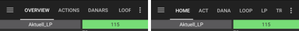

(Preferences-show-notes-field-in-treatments-dialogs)=
### Show notes field in treatments dialogs

Setting hidden in [simple mode](#preferences-simple-mode).

Přidává možnost doplňovat k záznamům o ošetření krátkou textovou poznámku v dialozích, kde se zadávají (Bolusová kalkulačka, Sacharidy, Inzulín...)

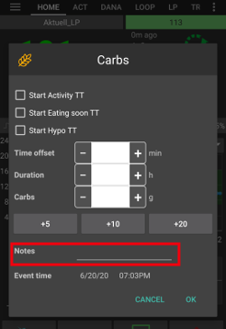

(Preferences-status-lights)=
### Stavové indikátory

Setting hidden in [simple mode](#preferences-simple-mode).

Status lights give a visual warning for:

- Stáří senzoru
- Sensor battery level for certain smart readers (see [screenshots page](#screens-sensor-level-battery) for details).
- Stáří inzulínu (doba použití aktuálního zásobníku)
- Stav zásobníku (jednotky)
- Stáří kanyly
- Stáří baterie v pumpě
- Úroveň nabití baterie pumpy (%)

If the warning threshold is exceeded, values will be shown in yellow. If the critical threshold is exceeded, values will be shown in red.

The last option allows you to import those settings from Nightscout if defined there. See [Nightscout documentation](https://nightscout.github.io/nightscout/setup_variables/#age-pills) for more information.

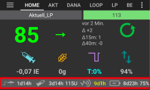

(Preferences-deliver-this-part-of-bolus-wizard-result)=
### Deliver this part of bolus wizard result

Set the [default percentage](#AapsScreens-section-j) of the bolus calculated when using the bolus wizard.

Default is 100%: no correction. Even when setting a different value here, you can still change each time you use the bolus wizard. If this setting is 75 % and you had to bolus 10U, the bolus wizard will propose a meal bolus of only 7.5 units.

When using [SMB](#objectives-objective9), many people do not meal-bolus 100% of needed insulin, but only a part of it (e.g. 75 %) and let the SMB with UAM (Unattended Meal Detection) do the rest. Using a value lower than 100% here can be useful:
* for people with slow digestion: sending all the bolus upfront can cause hypo because the insulin action is faster than the digestion.
* to leave more room to **AAPS** to deal by itself with **BG rise**. In both cases, **AAPS** will compensate for the missing part of the bolus with SMBs, if/when deemed adequate.

### Enabled bolus advisor

Setting hidden in [simple mode](#preferences-simple-mode).


When enabled, when you use the bolus wizard as you are in hyperglycemia, you will get a warning, prompting you if you wish to pe-bolus and eat later, when your **BG** gets back in range.

### Enabled bolus reminder

Setting hidden in [simple mode](#preferences-simple-mode).

% todo

(Preferences-advanced-settings-overview)=
### Advanced Settings (Overview)

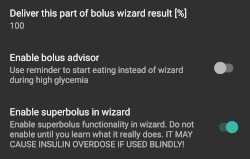

#### Superbolus

Setting hidden in [simple mode](#preferences-simple-mode).

Volba pro povolení superbolusu v bolusové kalkulačce.

[Superbolus](https://www.diabetesnet.com/diabetes-technology/blue-skying/super-bolus/) se používá jako prevence proti prudkému růstu glykémie po jídle, a spočívá ve "vypůjčení" bazálního inzulínu z následujících 2 hodin. It is different from *super micro bolus*!

Use with caution and do not enable it until you learn what it really does. Basically, the basal for the next two hours is added to the bolus and a two hour zero-temp activated. **AAPS looping functions will be disabled - so use with care! If you use SMB **AAPS** looping functions will be disabled according to your settings in ["Max minutes of basal to limit SMB to"](#Open-APS-features-max-minutes-of-basal-to-limit-smb-to), if you do not use SMB looping functions will be disabled for two hours.** Details on super bolus can be found [here](https://www.diabetesnet.com/diabetes-technology/blue-skying/super-bolus).

## Bezpečnostní omezení ošetření

(preferences-patient-type)=
### Patient type

- Bezpečnostní limity jsou nastaveny na základě věku, který jste zvolili v tomto nastavení.
- Pokud začnete narážet na pevně nastavené limity (jako například na maximální bolus), je čas posunout se o stupeň výš.
- It's a bad idea to select higher than real age because it can lead to overdosing by entering the wrong value in the insulin dialog (by skipping the decimal dot, for example).
- If you want to know the actual numbers for these hard-coded safety limits, scroll to the algorithm feature you are using on [this page](../DailyLifeWithAaps/KeyAapsFeatures.md).

### Max allowed bolus

- Defines the maximum amount of bolus insulin, in insulin units, that **AAPS** is allowed to deliver at once.
- Nastavení slouží jako bezpečnostní limit pro zabránění odeslání příliš velkého bolusu vzhledem k množství zadaných sacharidů, nebo k ohlídání chyby uživatele.
- Doporučuje se nastavit ho na rozumnou hodnotu zhruba odpovídající maximálnímu bolusu, který jste kdy poslali na jídlo.
- Toto omezení se vztahuje i na výsledky bolusové kalkulačky.

### Max allowed carbs

- Defines the maximum amount of carbs, in grams, that **AAPS** bolus calculator is allowed to dose for.
- Nastavení slouží jako bezpečnostní limit pro zabránění odeslání příliš velkého bolusu vzhledem k množství zadaných sacharidů, nebo k ohlídání chyby uživatele.
- Je doporučeno nastavit limit na nějakou rozumnou hodnotu, která odpovídá maximálnímu množství sacharidů, které jste kdy v jídle snědli.

## Smyčka

(Preferences-aps-mode)=
### APS mode
Switch between Open Loop, Closed Loop and Low Glucose Suspend (LGS).


(Preferences-pen-loop)=
#### Open Loop
**AAPS** continuously evaluates all available data (IOB, COB, BG...) and makes treatment suggestions (temporary basal rates) on how to adjust your therapy if necessary.

The suggestions will not be executed automatically (as in closed loop). The suggestions have to be enacted by the user manually into the pump (if using virtual pump) or by using a button if **AAPS** is connected to a real pump.

This option is for getting to know how **AAPS** works or if you are using an unsupported pump. You will be in Open Loop, no matter what choice you make here, until the end of **[Objective 5](#objectives-objective5)**.

(preferences-closed-loop)=
#### Closed Loop

**AAPS** continuously evaluates all available data (IOB, COB, BG...) and automatically adjusts the treatment if necessary (_i.e._ without further intervention by you) to reach the set [target range or value](#profile-glucose-targets) (bolus delivery, temporary basal rate, insulin switch-off to avoid hypo etc.).

The Closed Loop works within numerous safety limits, which can be set individually.

Closed Loop is only possible if you are in **[Objective 6](#objectives-objective6)** or higher and use a supported pump.

#### Low Glucose Suspend (LGS)

In this mode, [maxIOB](#Open-APS-features-maximum-total-iob-openaps-cant-go-over) is set to zero.

This means that if blood glucose is dropping, **AAPS** can reduce the basal for you. But if blood glucose is rising, no automatic correction will be made. Your basal rates will remain the same as defined in your current **Profile**. Only if IOB is negative (from a previous Low Glucose Suspend) additional insulin will be given to lower **BG**.

(Preferences-minimal-request-change)=
### Minimal request change

When using **Open loop**, you will receive notifications every time **AAPS** recommends adjusting the basal rate. To reduce the number of notifications you can either use a [wider bg target range](#profile-glucose-targets) or increase the percentage of the minimal request rate. Toto definuje relativní změnu, která je požadována pro spuštění oznámení.

## Vylepšený asistent pro jídlo (AMA) nebo Super Micro bolus (SMB)

Depending on your settings in [Config builder > APS](../SettingUpAaps/ConfigBuilder.md) you can choose between two algorithms:

- [Advanced meal assist (OpenAPS AMA)](#Open-APS-features-advanced-meal-assist-ama) - state of the algorithm in 2017
- [Super Micro Bolus (OpenAPS SMB)](#Open-APS-features-super-micro-bolus-smb) - most recent algorithm recommended for beginners

As of [**AAPS** version 3.3](#version3300), [Dynamic ISF](../DailyLifeWithAaps/DynamicISF.md) feature has been moved as part of OpenAPS SMB.

### OpenAPS AMA

All the settings for OpenAPS AMA are described in the dedicated section in [Key AAPS Features > Advanced Meal Assist (AMA)](#Open-APS-features-advanced-meal-assist-ama).

(Preferences-openaps-smb-settings)=
### OpenAPS SMB

All the settings for OpenAPS SMB are described in the dedicated section in [Key AAPS Features > Super Micro Bolus (SMB)](#Open-APS-features-super-micro-bolus-smb).

## Nastavení absorpce sacharidů

(Preferences-min_5m_carbimpact)=
### min_5m_carbimpact

Setting hidden in [simple mode](#preferences-simple-mode).

The algorithm uses BGI (blood glucose impact) to determine when [carbs are absorbed](../DailyLifeWithAaps/CobCalculation.md).

At times when carb absorption can’t be dynamically worked out based on your blood's reactions, **AAPS** inserts a default decay to your carbs. Basically, it is a failsafe. This value is only used during gaps in **CGM** readings or when physical activity “uses up” all the blood glucose rise that would otherwise cause **AAPS** to decay COB.

Zjednodušeně řečeno: algoritnuls ví jak by se *měla* vaše glykémie chovat, je-li ovlivněna podaným inzulínem apod. Kdykoli dojde k pozitivní odchylce od očekávaného chování, je rozloženo/absorbováno určité množství sacharidů. Velká změna = více sacharidů atp.

Hodnota min_5m_carbimpact definuje výchozí vliv absorpce sacharidů za 5 minut. Více informací naleznete v [dokumentaci OpenAPS](https://openaps.readthedocs.io/en/latest/docs/While%20You%20Wait%20For%20Gear/preferences-and-safety-settings.html?highlight=carbimpact#min-5m-carbimpact).

Standardní hodnota pro AMA je 5, pro SMB 8.

Graf COB na domovské obrazovce označuje kdy se používá min_5m_impact tím, že se na vrcholu zobrazí oranžový kroužek.

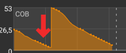

### Meal max absorption time

Pokud často jíte jídla s vysokým obsahem tuků nebo bílkovin, budete si muset nastavit delší čas absorpce jídla.

### Advanced settings - autosens ratio

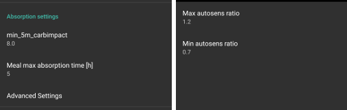

- Define min. and max. [autosens](#Open-APS-features-autosens) ratio.
- Normálně by se neměly měnit standardní hodnoty (max. 1.2 a min. 0.7).

## Pump

### Hlídač BT

Activate BT watchdog if necessary (e.g. for Dana pumps). It switches off bluetooth for one second if no connection to the pump is possible. This may help on some phones where the bluetooth stack freezes.

## Nastavení pumpy

The options here will vary depending on which pump driver you have selected in [Config Builder > Pump](#Config-Builder-pump).  Pair and set your pump up according to the [pump related instructions](../Getting-Started/CompatiblePumps.md).

## Tidepool

More information on the dedicated [Tidepool](../SettingUpAaps/Tidepool.md) page.

(Preferences-nsclient)=
## NSClient

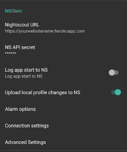

Původní komunikační protokol, lze použít se staršími verzemi Nightscoutu.

- Nastavte svou *Nightscout URL* (tj. <https://yoursitename.yourplaform.dom>).
- **Ujistěte se, že adresa URL na konci NEOBSAHUJE /api/v1/.**
- *[API secret](https://nightscout.github.io/nightscout/setup_variables/#api-secret-nightscout-password)* (12 znakové heslo zaznamenané v proměnných Nightscoutu).
- This enables data to be read and written between both the Nightscout website and **AAPS**.
- Větší množství SSID lze oddělit středníkem.

## NSClientV3


[New protocol introduced with AAPS 3.2.](#Important-comments-on-using-v3-versus-v1-API-for-Nightscout-with-AAPS) Safer and more efficient.

```{admonition} V3 data uploaders
:class: warning

When using NSClientV3, all uploaders must be using the API V3. Since most are not compatible yet, this means **you must let **AAPS** upload all data** (BG, treatments, ...) to Nightscout and disable all other uploaders if they're not V3 compliant.
```

- Nastavte svou *Nightscout URL* (tj. <https://yoursitename.yourplaform.dom>).
- **Ujistěte se, že adresa URL na konci NEOBSAHUJE /api/v1/.**
- In Nightscout, create an *[Admin token](https://nightscout.github.io/nightscout/security/#create-a-token)* (requires [Nightscout 15](https://nightscout.github.io/update/update/) to use the V3 API) and enter it in the **NS access token** (not your API Secret!).
- This enables data to be read and written between both the Nightscout website and **AAPS**.
- Větší množství SSID lze oddělit středníkem.
- Ponechte připojení k websocketům povolené (doporučeno).

### Synchronization

Synchronization choices will depend on the way you will want to use **AAPS**.

You can select which data you want to [upload and download to or from Nightscout](#Nightscout-aaps-settings).

### Alarm options


- Nastavení alarmů umožňují vybrat, jaké alarmy Nightscoutu se mají v aplikaci používat. **AAPS** will alarm when a Nightscout alarm triggers.
- Aby alarmy fungovaly, je třeba nastavit v [Nightscoutu variables](https://nightscout.github.io/nightscout/setup_variables/#alarms) hodnoty glykémie pro Urgentní, Vysokou, Nízkou a Urgentní nízkou glykémii.
- Budou fungovat pouze v případě že budete mít připojení k Nightscoutu, a jsou určeny pro rodiče/pečovatele.
- If you have the **CGM** source on your phone (i.e. xDrip+ or BYODA) then use those alarms instead of Nightscout Alarms.
- Create notifications from Nightscout [announcements](https://nightscout.github.io/nightscout/discover/#announcement) will echo Nightscout announcements in the **AAPS** notifications bar.
- Můžete nastavit Mezní hodnotu pro zastaralá data a Urgentní mezní hodnotu pro zastaralá data. Tato nastavení spustí alarm pokud po určenou dobu nejsou přijata žádná data z Nightscoutu.

### Connection settings


- Nastavení připojení definují, kdy bude povoleno připojení k Nightscoutu.
- Volby alarmu umožňují vybrat, jaké výchozí alarmy Nightscoutu se mají v aplikaci používat.
- If you want to use only a specific Wi-Fi network you can enter its Wi-Fi SSID.
- Budou fungovat pouze v případě že budete mít připojení k Nightscoutu, a jsou určeny pro rodiče/pečovatele.
- Chcete-li smazat všechna SSID, nechejte pole prázdné.

(Preferences-advanced-settings-nsclient)=
### Advanced settings (NSClient)


Options in advanced settings are self-explanatory.

## SMS komunikátor

More information on the dedicated [SMS Commands](../RemoteFeatures/SMSCommands.md) page.

## Automatizace

Select which location service shall be used:

- Use passive location: **AAPS** only takes locations if other apps are requesting it
- Používat zjištění polohy podle sítě: Poloha podle vaší Wi-Fi sítě
- Používat GPS polohu (Pozor! Může způsobovat nadměrné vybíjení baterie!)

## Místní výstrahy

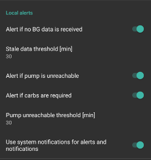

Můžete pomáhat s vývojem AAPS zasláním hlášení o pádu vývojářům.

(preferences-maintenance-settings)=
## Nastavení údržby

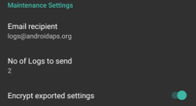

**Email recipient**: Standard recipient of logs is <logs@aaps.app>.

**Data Choices**


You can help develop **AAPS** further by sending crash reports to the developers.

**Unattended Settings Export**<br/> By enabling this feature, you allow **AAPS** to execute settings exports without user intervention. For this the master password is securely stored on your phone (only) at the next manually export. The stored password will be used for up to 4 weeks. After 4 weeks you will be notified the password is about to expire. During a grace period of 1 week, the password can then be refreshed by manually exporting settings from the maintenance menu.

After the grace period of 1 week has passed the stored password expires and any automated settings export will abort while notifying the user, asking to reenter the password.  [(**Automated settings exports**)](../DailyLifeWithAaps/Automations.md#automating-preference-settings-export)  will be logged to the AAPS 'Careportal' and 'User entry' lists under Treatments.

After enabling this option, make sure to perform a manual settings export, where you will be requested for your password, so that **AAPS** can store it.

(preferences-maintenance-logdirectory)= Maintenance settings also include the **AAPS** directory, which can be found directly under the Maintenance tab. This setting allows the user to choose a directory on their phone where **AAPS** will store preferences, logs, and other files.


## Open Humans

Můžete pomoci komunitě tím, že daruje vaše data do výzkumných projektů! Details are described on the [Open Humans page](../SupportingAaps/OpenHumans.md).

In Preferences, you can define when data shall be uploaded
- only if connected to Wi-Fi
- pouze při nabíjení
