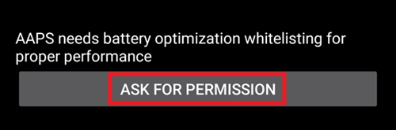

# Průvodce nastavením AAPS

When you first start **AAPS** you are guided by the "**Setup Wizard**", to quickly setup all the basic configurations of your app in one go. **Setup Wizard** guides you, in order to avoid forgetting something crucial. For example, the **permission settings** are fundamental for setting up **AAPS** correctly.

However, it's not mandatory to get everything completely configured in the first run of using the **Setup Wizard** and you can easily exit the Wizard and come back to it later. There are three routes available after the **Setup Wizard** to further optimise/change the configuration. Všechny budou popsány v následující sekci. Je tedy v pořádku, pokud některé body v Průvodci nastavením přeskočíte, později je můžete snadno nakonfigurovat.

During, and directly after using the **Setup Wizard** you may not notice any significant observable changes in **AAPS**. To enable your **AAPS** loop, you have to follow the **Objectives** to enable feature after feature. You will start **Objective 1** at the end of the Setup Wizard. You are the master of **AAPS**, not the other way around.

```{admonition} Preview Objectives
:class: note
If you are keen to know the structure of the objectives, please read [Completing the objectives](../SettingUpAaps/CompletingTheObjectives.md) but then come back here to run the Setup Wizard first.

```

From previous experience, we are aware that new starters often put themselves under pressure to setup **AAPS** as fast as possible, which can lead to frustration as it is a big learning curve.

So, please take your time in configuring your loop, the benefits of a well-running **AAPS** loop are huge.

```{admonition} Ask for Help
:class: note
If there is an error in the documentation or you have a better idea for how something can be explained, you can ask for help from the community as explained at [Connect with other users](../GettingHelp/WhereCanIGetHelp.md).
```
## Uvítací zpráva

Toto je pouze uvítací zpráva kterou můžete přeskočit kliknutím na tlačítko "Další":


## Licenční ujednání

In the end user license agreement there is important information about the legal aspects of using **AAPS**. Přečtěte si ji prosím pozorně.

If you don't understand, or can't agree to the end user license agreement please don't use **AAPS** at all!

Pokud rozumíte a souhlasíte, klikněte na tlačítko "ROZUMÍM A SOUHLASÍM" a pokračujte v Průvodci nastavením:


## Vyžadovaná oprávnění

**AAPS** needs some requirements to operate correctly.

In the following screen you are asked several questions you have to agree to, to get **AAPS** working. Průvodce vždy poskytne vysvětlení, z jakého důvodu jsou tato nastavení vyžadována.

Na těchto obrazovkách se zaměřujeme na poskytnutí informací o pozadí, přeložení technických termínů do běžného jazyka nebo vysvětlení důvodů. Continue reading below to see each permission request.


### Oznámení

Android vyžaduje zvláštní oprávnění pro aplikace, které potřebují posílat uživateli upozornění.

While it is a good feature to disable notifications _e.g._ from  social media apps, it is essential that you allow **AAPS** to send you notifications.

Please click the first "ASK FOR PERMISSION" button:


Vyberte aplikaci "AAPS":


Povolte oprávnění "Zobrazit nahoře" přesunem přepínače doprava:


Přepínač v povoleném stavu by měl vypadat takto:


### Battery optimization

Battery consumption on smartphones is a consideration, as the performance of batteries is still quite limited. Therefore, the Android operating system on your smartphone is restrictive about allowing applications to run and consume CPU time, and therefore battery power.

However, **AAPS** needs to run regularly, _e.g._ to receive the glucose readings every few minutes and then apply the algorithm to decide how to deal with your glucose levels, based on your specifications. Proto AAPS potřebuje povolení v systému Android.

Toho dosáhnete potvrzením požadovaných nastavení.

Click the second "ASK FOR PERMISSION" button.



Vyberte prosím "Povolit":


### Storage permission

**AAPS** needs to log information to the permanent storage of your smartphone. Trvalá paměť znamená, že data budou k dispozici i po restartu vašeho telefonu. Informace uložené pouze v operační paměti a nikoli v paměti trvalé mohou být ztracené.

Click the first "ASK FOR PERMISSION" button:


Klikněte na "Povolit":


Click "AAPS Directory". This opens the filesystem on your phone and allows you to choose where you want AAPS to store its information.


The default directory is **AAPS**, but you can use any dedicated directory of your liking. Create the directory if necessary, enter it, and choose "Use this folder":


Confirm that you wish to grant access to **AAPS** to the selected directory:


Kliněte na tlačítko "DALŠÍ":


### Location

Android links the use of Bluetooth communication to the ability to use location services. Možná už jste na to narazili i u jiných aplikací. It's common to need location permission if you want to access Bluetooth.

**AAPS** uses Bluetooth to communicate with your CGM and insulin pump if they are directly controlled by **AAPS** and not another app which is used by **AAPS**. Detaily se mohou lišit u různých konfigurací.

Click the first "ASK FOR PERMISSION" button:


Toto je důležité. Otherwise **AAPS** can not work properly at all.

Klikněte na "Během používání aplikace":


Click the second "ASK FOR PERMISSION" button:


Select "Allow all the time".


Kliněte na tlačítko "DALŠÍ":


## Master password

As the configuration of **AAPS** contains some sensitive data (_e.g._ API_KEY for accessing your Nightscout server) it is encrypted by a password you can set here.

The second sentence is very important, please **DO NOT LOSE YOUR MASTER PASSWORD**. Please make a note of it _e.g._ on Google Drive. Google Drive je vhodné místo, protože ho pro vás Google automaticky zálohuje. Váš telefon nebo poočítač se může porouchat a vy byste mohli skončit bez vašeho aktuálního hesla. If you forget your Master Password, it can be difficult to recover your profile configuration and progress through the **Objectives** at a later date.

Po dvojím zadání hesla klikněte na tlačítko "DALŠÍ":


## Units (mg/dL <-> mmol/L)

Please select if your glucose values are in mg/dL or mmol/L and then please click the "NEXT" button:


## Přehled

 Tady nastavíte hodnoty glykémie, které budou zobrazovány jako "v rozsahu". V tuto chvíli můžete ponechat výchozí hodnoty a k nastavení se vrátit později.

Zadané hodnoty ovlivňují pouze grafické zobrazení diagramu a nic jiného.

Your glucose target _e.g._ is configured separately in your profile.

Váš rozsah pro analýzu Času v rozsahu se konfiguruje nezávisle na vašem reportovacím serveru.

Klikněte prosím na tlačítko "DALŠÍ":


(SetupWizard-synchronization-with-the-reporting-server-and-more)=
## Synchronizace dat s reportovacím serverem a další

Zde nastavujete nahrávání dat na reportovací server.

Je zde možné konfigurovat i další nastavení, ale v prvním průběhu se budeme soustředit pouze na reportovací server.

Pokud ho v tuto chvíli nemůžete nastavit, tak obrazovku přeskočte. K nastavením se můžete vrátit později.

If you select an item here on the left tick box, on the right you can then ticking the visibility (eye) box, which will place this plugin in the upper menu on the **AAPS** home screen. Zaškrněte prosím také viditelnost pokud budete v tomto bodě konfigurovat reportovací server.

V tomto příkladu vybereme reportovací server Nightscout a zkonfigurujeme ho.

```{admonition}  **NSClient** version
:class: Note

Click [here](#version3200) for the release notes of **AAPS** 3.2.0.0 which explain the differences between the top option **NSClient** (this is "v1", although it is not explicitly labelled) and the second option, **NSClient v3**.
```
Pro reportovací server Tidepool je nastavení ještě jednodušší, protože je třeba pouze zadání vašch přihlašovacích údajů.

After making your selection, please press the cogwheel button next to the item you selected :


Zde nastavujete reportovací server Nightscout.

Klikněte prosím na "Nightscout URL":


Zadejte URL adresu vašho osobního Nightscout serveru. Jedná se buď o URL, které jste sami nastavili nebo jste ho dostali od vašeho poskytovatele služby Nightscout.

Klikněte prosím na tlačítko "OK":


Enter your Nightscout access token. Jedná se o přístupový token, který jste nastavili na vašem Nightscout serveru. Bez tohoto tokenu nebude přístup fungovat.

If you don't have it at the moment please check the documentation for setting up the reporting server in the **AAPS** documentation.

After filling in the "**Nightscout access token**" and clicking "OK", please click on the "Synchronization" button:


Please select "Upload data to NS" if you already configured Nightscout in the previous steps of the Setup Wizard.

If you have stored profiles on Nightscout and want to download them to **AAPS**, enable "Receive profile store":


Vraťte se na předchozí obrazovku a vyberte "Nastavení alarmů":


Prozatím ponechte přepínače vypnuté. We only walked to the screen to make you familiar with possible options you might configure in the future. V tuto chvíli to není třeba dělat.

Vraťte se na předchozí obrazovku a vyberte "Nastavení připojení".

Zde je možné nastavit jak se budou přenášet data na váš reportovací server.

Caregivers must enable "use cellular connection" as otherwise the smartphone which serves the dependant/child can not upload data outside of WiFi range _e.g._ on the way to school.

Other **AAPS** users can disable the transfer via cellular connection if they want to save data or battery.

Pokud máte pochybnosti, ponechte vše povoleno.

Vraťte se na předchozí obrazovku a vyberte "Rozšířená nastavení".


Povolte "Zaznamenávat spuštění aplikace do NS", pokud chcete mít tuto informaci zaznamenanou na serveru. Může vám to, především jako ošetřující osobě, mít vzdáleně přehled jestli a kdy byla aplikace restartována.

It might be interesting to see if **AAPS** is correctly configured now, but later it is usually not that important to be able to see **AAPS** stopping or starting in Nightscout.

Povolte "Vytvořit oznámení z chyb" a "Vytvořit oznámení z návrhu sacharidů".

Položku "Zpomalit odesílání" ponechte vypnutou. You would only use it in unusual circumstances if for example a lot of information is to be transferred to the Nightscout server, and the Nightscout server is being slow in processing this data.

Go back twice, to the list of plugins and select "NEXT" to go to the next screen:


## Patient name

Here you can setup your name in **AAPS**.

Může zde být zadáno cokoli. Položka slouží pouze k odlišení pacientů.

Pro jednoduchost zadejte jméno a příjmení.

Klikněte na tlačítko "DALŠÍ" a přejdete k další obrazovce.


## Patient type

Here you select your "Patient type" which is important, as the **AAPS** software has different limits, depending on the age of the patient. Nastavení je důležité z bezpečnostních důvodů.

Here is where you also configure the **maximum allowed bolus** for a meal. Jedná se o největší hodnotu bolusu, který potřebujete k pokrytí typické porce jídla. Jedná se o bezpečnostní funkci, která brání náhodnému předávkování při posílání bolusu k jídlu.

Druhý limit je koncipován obdobně, ale vztahuje se k maximálnímu očekávanému příjmu sacharidů.

Po zadání potřebných hodnot klikněte na "DALŠÍ":


## Používaný inzulín

Vyberte typ inzulínu, který používáte v pumpě.

Názvy inzulínů by měly být samovysvětlující.

```{admonition} Don't use the "Free-Peak Oref" unless you know what you are doing
:class: danger
For advanced users or medical studies there is the possibility to define with "Free-Peak Oref" a customised profile of how insulin acts. Please don't use it unless you are an expert, usually the pre-defined values work well for each branded insulin.
```

Klinkněte na tlačítko "DALŠÍ" a přejděte na následující obrazovku:


## Zdroj informací o glykémii

Vyberte zdroj dat o glykémii, který používáte. Please read the documentation for your [BG source](../Getting-Started/CompatiblesCgms.md).

Jelikož je k dispozici více možností, nebudeme zde popisovat všechny. We are using xDrip+ in our example here:


Enable the visibility in the top level menu by clicking the check box on the right side.

Po nastavení vašeho výběru klikněte na tlačítko "DALŠÍ" a přejděte k následující obrazovce:


Click on the cogwheel button to access the settings.

Povolte "Nahrát data glykémie do NS" a "Zaznamenat výměnu senzoru do NS".

Go back and press "NEXT" to go to the next screen:


(setup-wizard-profile)=
## Profile

Teď se dostáváme k velmi důležité části Průvodce nastavením.

Please read the documentation about [profiles](../SettingUpAaps/YourAapsProfile.md) before you try to enter your profile details on the following screen.

```{admonition} Working profile required - no exceptions here !
:class: danger
An accurate profile is necessary to control the safe action of **AAPS**.

It's required that you have determined and discussed your profile with your doctor, and that it has been proven to work by successful basal rate, ISF and IC testing!

If a robot has an incorrect input it will fail - consistently. **AAPS** can only work with the information it is given. If your profile is too strong, you risk hypoglycemia, and if it is too weak, you risk hyperglycemia. 
```

Klikněte na tlačítko "DALŠÍ" a přejdete k další obrazovce. Zadejte "Název profilu":


Postupem času se může stát, že budete potřebovat několik různých profilů. V tuto chvíli vytvoříme pouze jeden.

```{admonition} Profile only for tutorial - not for your usage
:class: information
The example profile here is only to show you how to enter data.

It is not intended to be an accurate profile or something very well optimised, because each person's needs are so different.

Don't use it for actually looping!
```

Enter your [Duration of insulin Action (DIA)](#your-aaps-profile-duration-of-insulin-action) in hours. Potom klikněte na "IC":


Enter your [IC](#your-aaps-profile-insulin-to-carbs-ratio) values:


Klikněte na "ISF". Enter your [ISF values](#your-aaps-profile-insulin-sensitivity-factor):


Klikněte na "BAZ". Enter your [basal values](#your-aaps-profile-basal-rates):


Klikněte na "CÍL". Zadejte vaše cílové hodnoty glykémie.

For open looping this target can be a wider range, as otherwise **AAPS** notifies you permanently to change the temporary basal rate or another setting, which can be exhausting.

Později, s uzavřenou smyčkou, budete mít obvykle zadanou stejnou hodnotu pro horní i dolní limit. That makes it easier for **AAPS** to hit the target and give you better overall diabetes control.

Zadejte/potvrďte cílové hodnoty:


Uložte profil kliknutím na tlačítko "ULOŽIT":


After saving, a new button "Activate Profile" appears.

```{admonition} Several defined but only one active profile
:class: information
Můžete mít několik vytvořených profilů, ale v jeden okamžik může být aktivovaný a běžící pouze jeden z nich.
```

Klikněte na "AKTIVOVAT PROFIL":


Otevře se dialog přepnutí profilu. V tomto případě ponechte předvolené nastavení.

```{admonition} Several defined but only one active profile
:class: information
Časem se naučíte jak tento obecný dialog využívat k řešení situací jako jsou nemoc nebo sport, kdy budete potřebovat spustit profil s vhodným nastavením pro danou situaci.
```


Klikněte na tlačítko "OK":


Otevře se potvrzovací dialog přepnutí profilu.

Můžete ho potvrdit kliknutím na "OK". Klinkněte na tlačítko "DALŠÍ" a přejděte na následující obrazovku:


Váš profil byl nyní nastaven:


## Inzulinová pumpa


Nyní si vybíráte inzulínovou pumpu.

Zobrazí se vám důležité upozornění. Přečtěte si ho, prosím, a potom klikněte na tlačítko "OK".

Pokud jste již v předchozích krocích nastavili svůj profil a víte, jak připojit vaši pumpu, můžete ji nyní připojit.

Otherwise, leave the Setup Wizard, using the arrow in the top left corner and let **AAPS** first show you some blood glucose values. Kdykoli se k připojení pumpy můžete vrátit nebo můžete využít možnost přímé konfigurace (bez využití Průvodce).

Please read the documentation for your [insulin pump](../Getting-Started/CompatiblePumps.md).

Klikněte na tlačítko "DALŠÍ" a přejdete k další obrazovce.


V tomto případě vybereme "Virtuální pumpu".

Klinkněte na tlačítko "DALŠÍ" a přejděte na následující obrazovku:


## APS algorithm

Vyberte OpenAPS SMB jako váš APS algoritmus. Despite the name the SMB feature of the algorithm is disabled until you are familiar with AAPS and already worked through the first objectives. OpenAPS SMB algoritmus je každopádně novější a obecně lepší než OpenAPS AMA.

Důvodem k vypnutí funkce SMB na začátku je ten, že SMB umožňuje rychlejší reakci na stav cukru v krvi díky využití mikrobolusů namísto zvýšení úrovně bazálu. As in the beginning your profile is in general not as good as after some time of experience the feature is disabled in the beginning.

```{admonition} Only use the older algorithm **OpenAPS AMA** if you know what you are doing
:class: information
OpenAPS AMA is the most basic algorithm which does not support micro boluses to correct high values. There might be circumstances where it is better to use this algorithm but it is not the recommendation.
```

Press the cogwheel to see the details:


Zde si pouze přečtěte text a nic zde neměňte.

Due to the limitations which are imposed by the **Objectives** you can't use either "closed loop" or "SMB features" at the moment anyway.

Go back and press "NEXT" to go to the next screen:


## Detekce citlivosti

Let "Sensitivity Oref1" the standard for the sensitivity plugins selected.

Klinkněte na tlačítko "DALŠÍ" a přejděte na následující obrazovku:


## Začněte Cíl 1

Nyní vstupujete do Cílů. The qualification for access to further **AAPS** features.

Zde začínáme Cíl 1, i když v tuto chvíli naše nastavení není zcela připraveno k jeho úspěšnému dokončení.

Ale je to začátek.

Stiskněte zelené tlačítko "START" pro spuštění cíle 1:


Vidíte, že jste již udělali určitý pokrok, ale další oblasti je ještě třeba dokončit.

Klikněte na tlačítko "DOKONČIT" a přejděte k další obrazovce.


You are coming to the home screen of **AAPS**.

Here you find the information message in **AAPS** that you set your profile.

K tomu došlo ve chvíli, kdy jsme přepnuli na náš nový profil.

Můžete kliknout na "ODLOŽIT" a zpráva zmizí.


If you accidentally leave the Setup Wizard at any point, you can either simply re-start the Wizard, or change the [configuration of the AAPS loop](../SettingUpAaps/ChangeAapsConfiguration.md) manually.

If your **AAPS** loop is now fully setup, please move on to the next section ["Completing the objectives"](../SettingUpAaps/CompletingTheObjectives.md).