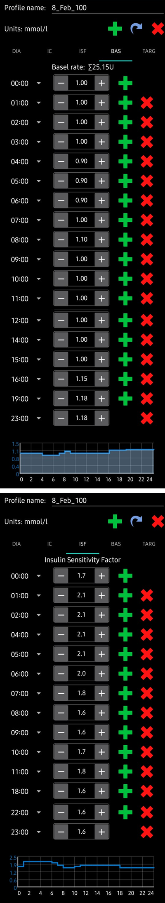

## Úvod do Vašeho profilu AAPS

### What is an AAPS profile?

Váš profil AAPS je sada pěti klíčových parametrů, které definují, jak má AAPS dodávat inzulín v reakci na data o úrovni glykémie ze senzoru. AAPS has several _additional_ modifiable parameters (like SMB settings), but using these well relies on your underlying AAPS profile being correct. Profil AAPS zahrnuje: trvání účinku inzulínu (DIA), cílová glykémie, bazální dávky (BR), citlivost na inzulín (ISF) a inzulíno-sacharidový poměr (IC nebo ICR). Screenshots from AAPS of an _example_ profile are shown in below. Vezměte prosím na vědomí, že tento profil zobrazuje velký počet časových pásem. Až začnete s AAPS, Váš profil bude pravděpodobně mnohem jednodušší. Profiles vary significantly from person-to-person, for examples of AAPS profiles for small children, teenagers and adults please see the later section, optimising your [profile](link).

#### Duration of insulin action (DIA)

Doba působnosti inzulínu se v AAPS nastavuje jednou hodnotou, protože vaše pumpa bude neustále dávkovat inzulín stejného typu. Ostatní 4 parametry mohou být nastavené na odlišné hodnoty, které se mohou v případě potřeby měnit hodinu po hodině.

#### Glucose targets

Cíle glykémie jsou nastaveny podle vašich osobních preferencí. Pokud máte například obavy z nočních hypoglykémií, můžete nastavit vyšší cílovou hodnotu 6.5 mmol/L od 21:00 - 7:00. Pokud se chcete ujistit, že máte máte ráno v těle dostatek inzulínu (Insulin On Board; IOB) než budete podávat bolus k snídani, můžete nastavit nižší hodnotu cílové glykémie 4,5 mmol/L v době od 7:00 - 8:00. A glucose target, particularly if it is only short-term (less than 4 hours in duration), does not need to be the _actual value_ you expect or want your glucose level to get to, rather, it is a good way to tell AAPS to be more or less aggressive, while still keeping your glucose levels in range. The **figure below** shows an example of how the DIA and glucose targets could be set in an AAPS profile.

Hodnoty a trendy posledních 3 parametrů, bazální dávky (BR), citlivost na inzulín (ISF) a inzulíno-sacharidový poměr (IC nebo ICR) se u jednotlivých osob významně liší podle biologie, pohlaví, věku, zdatnosti apod., stejně jako podle krátkodobých vlivů jako onemocnění nebo nedávné cvičení. For more guidance on this, the book [“Brights Spots and Landmines”](https://brightspotsandlandmines.org/Bright_Spots_and_Landmines_by_Adam_Brown.pdf) by Adam Brown is an excellent book to read.

#### Basal rates

Vaše bazální dávky inzulínu (jednotky za hodinu) poskytují na pozadí inzulín, který udržuje vaši glykémii při absenci jídla nebo cvičení stabilní.

Vyladěné bazály vám umožní probudit se v rozsahu, přeskakovat jídla nebo jíst dříve či později, aniž by šla glykémie nahoru nebo dolů. Inzulínová pumpa posílá malé dávky rychle působícího inzulínu každých pár minut, aby bránil játrům v uvolňování nadbytečného množství glukózy a aby se glukóza dostala do tělesných buněk. Bazální inzulín obvykle tvoří 40 - 50% celkové denní dávky (TDD), v závislosti na vaší stravě, a obvykle se řídí cirkadiánním rytmem, denně s jedním vrcholem a jedním propadem v požadavcích na inzulín. For more information, chapter 23 of [“Think like a Pancreas”](https://amzn.eu/d/iVU0RGe) by Gary Scheiner is very useful.

Most type 1 diabetes educators (and people with type 1 diabetes!) agree that you should work on getting your basal rates correct, before attempting to optimise your ISF and ICR.

#### Insulin sensitivity factor (ISF)

Faktor citlivosti na inzulín (někdy nazývaný korekční faktor) říká o kolik se sníží hladina krevního cukru po podání 1 jednotky inzulínu.

**In mg/dL units:**
If you have an ISF of 40, each unit of insulin will reduce your blood glucose by approx. 40 mg/dL (for example, your blood glucose will fall from 140 mg/dL to 100 mg/dL).

**In mmol/L units:**
If you have an ISF of 1.5, each unit of insulin will reduce your blood glucose by approx. 1.5 mmol/L (for example from 8 mmol/L to 6.5 mmol/L).

From these examples you can see that the _smaller_ the ISF value, the less sensitive you are to insulin. Takže pokud snížíte citlivost ze 40 na 35 (mg/dl) nebo z 1,5 na 1,3 (mmol/L) se často nazývá posílením citlivosti. Naopak, zvýšení hodnoty citlivosti ze 40 na 45 (mg/dL) nebo z 1,5 na 1,8 mmol/L) citlivost oslabuje.

Pokud je vaše citlivost nastavená příliš silná (názká hodnota), povede to k hypoglykémiím, a pokud je nastavená příliš slabá (vysoká hodnota), vyústí v hyperglykémii.

Výchozím bodem pro stanovení vaší citlivosti v průběhu dne je výpočet založený na celkové denní dávce (TDD) pomocí pravidla 1700 (94). More detail is given in Chapter 7 of [“Think like a Pancreas”](https://amzn.eu/d/iVU0RGe) by Gary Scheiner.

1700 (měřeno v mg/dl) nebo 94 (mmol/L)/TDD = přibližná ISF.

Například: TDD = 40
Cca. ISF (mg/dL) = 1700/40 = 43
Cca. ISF (mmol/L) = 94/40 = 2,4

See the **figure below** for an example of how the basal rates and ISF values could be set in an AAPS profile.

#### Insulin to Carb ratio (ICR)

ICR je měřítkem toho, kolik gramůsacharidů je pokryto jednou jednotkou inzulínu.

Někteří lidé také používají I:C jako zkratku místo ICR nebo mluví o sacharidovém poměru (CR).

Je obvyklé, že se z důvodu úrovní hormonů a fyzické aktivitě v průběhu dne hodnoty ICR liší. Mnoho lidí má nejnižší hodnoty ICR okolo snídaně. Takže například vaše ICR může být 1:8 na snídani, 1:10 na oběd a 1:10 v době večeře. Tyto modely ale nejsou univerzální a někteří lidé jsou v době večeře vůči inzulínu odolnější a vyžadují silnější / menší ICR.

Například inzulíno sacharidový poměr 1:10 znamená, že na každých 10 gramů zkonzumovaných sacharidů si vezmete 1 U inzulinu. Jídlo s obsahem 25g sacharidů potřebuje 2,5 jednotky inzulínu.

Pokud je vaše ICR slabší, například 1:20, potřebujete pouze 0,5U inzulinu, abyste pokryli 10 g sacharidů. Jídlo s obsahem 25g sacharidů potřebuje 25/20 = 1,25 jednotky inzulínu.

As shown in the **figure below**, when entering these values into an AAPS profile, we just enter the final part of the ratio, so an insulin-to-carb ratio of 1:3.5 is entered simply as “3.5”.

#### Why should I try to get my profile settings right? Can’t the loop just take care of it?

A hybrid closed loop _can_ attempt to make insulin delivery adjustments to minimise poor glycemic control that results from having incorrect profile values. Může například pozastavit dodávku inzulínu pokud máte hypoglykémii. Nicméně dosáhnete mnohem lepší kontroly glykémie, pokud nastavení vašeho profilu se co nejvíce blíží potřebám vašeho těla. To je jeden z důvodů, proč AAPS používá postupné cíle pro přechod od otevřené smyčky k hybridní uzavřené smyčce. In addition, there will be times when you need to open the loop (sensor warmups, sensor failure _etc._), sometimes in the middle of the night, and you will want to have your settings right for these situations.

Pokud přecházíte na AAPS z jiného systému otevřené nebo uzavřené smyčky, tak už máte poměrně jasnou představu o tom, jaké hodnoty bazálu (BR), citlivosti na inzulín (ISF) a inzulíno-sacharidového poměru (ICR) máte použít.

Pokud na AAPS přecházíte z léčby inzulinovými pery (MDI), pak je vhodné si nejdřív přečíst jak provést přechod z MDI na inzulínovou pumpu a pečlivě přechod naplánovat po konzultaci s vaším lékařem. ["Pumping insulin"](https://amzn.eu/d/iaCsFa2) by John Walsh & Ruth Roberts and [“Think like a Pancreas”](https://amzn.eu/d/iVU0RGe) by Gary Scheiner are very useful.

In the [optimising your profile](operating - optimising - your profile link) we present example profiles, discuss how to set and optimise the parameters which form your AAPS profile(s), and provide guidance on additional resources such as **Autotune** which aim to automate optimisation of your profile.

### Profile Helper

The [Profile Helper](../SettingUpAaps/ProfileHelper.md) can help you:

- build a profile from scratch for a kid
- compare two profiles
- clone a profile
