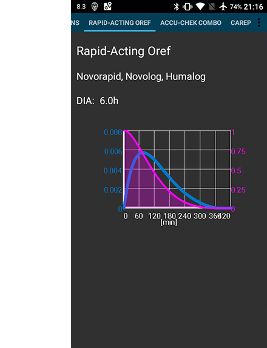

# Your AAPS profile

Your **AAPS Profile** is a set of five key parameters which define how **AAPS** should deliver insulin in response to your sensor glucose levels. These are the main parameters **AAPS** is built upon. As you progress through the **Objectives**, you will unlock additional modifiable parameters (like SMB settings), but the performance of these features rely on your underlying **Profile** being correct. The **Profile** incorporates:
* [duration of insulin action](#duration-of-insulin-action-dia) (DIA),
* [glucose targets](#glucose-targets),
* [basal rates](#basal-rates) (BR),
* [insulin sensitivity factors](#insulin-sensitivity-factor-isf) (ISF) and
* [insulin-to-carb ratios](#insulin-to-carb-ratio-icr) (IC or ICR).

As part of **AAPS**’ management, users should continually assess and scrutinise the accuracy of their **Profile** settings. It is recommended to take the settings in the order they are presented here. Cílem je mít dané nastavení správně, předtím než začnete měnit další. Postupujte po malých krocích a neprovádějte velké změny najednou. Don't forget to activate the new profile after each change. Regularly [backup your **Profile**](#YourAapsProfile_Profile-backup) settings by exporting your Preferences.

Your **Profile** settings interact with one another - you can have 'wrong' settings that work well together in certain circumstances but do not in others. For instance, if a too-high basal happens to be at the same time as a too-high **CR**. This means that you need to consider the settings individually and check they work harmoniously together in a variety of circumstances.

Jako vodítko můžete použít nástroj [Autotune](https://autotuneweb.azurewebsites.net/), ale nesmíte mu slepě věřit: ve vašem případě nebo za všech okolností nemusí fungovat správně.

```{admonition} Your diabetes may vary
:class: information
**Profiles** vary significantly from person-to-person.

For basal rates (BR), insulin sensitivity factors (ISF) and insulin-to-carb ratios (IC or ICR), the absolute values and trends in insulin requirements vary significantly from person to person, depending on your biology, gender, age, fitness level etc. as well as shorter term factors like illness and recent exercise. For more guidance on this, the book [“Brights Spots and Landmines”](https://diatribe.org/bright-spots-and-landmines/) by Adam Brown is an excellent book to read.

```

The four last parameters (glucose targets, basal rates, insulin sensitivity factors and insulin-to-carb ratios) can be set to different values, changing hourly if required, over a 24-hour period.


Screenshots from **AAPS** of an _example_ profile are shown below. Please note, this sample profile below shows a large number of timepoints. When you start out with **AAPS**, your profile is likely to be much simpler.

(your-aaps-profile-duration-of-insulin-action)=
## Duration of insulin action (DIA)

### Description

The length of time that insulin takes to decay to zero.

The duration of insulin action is set to a single value in **AAPS**, because your pump will continually infuse the same type of insulin.



In combination with the [insulin type](#Config-Builder-insulin), this will result in the [insulin profile](#AapsScreens-insulin-profile), as shown in the image above. The important thing to note is that the decay has a **long tail**. If you have been used to manual pumping, you have probably been used to assuming that insulin decays over a much shorter period i.e. about 3.5 hours. However, when you are looping, the long tail matters as the calculations are far more precise and these small amounts add up when they are subjected to the recursive calculations in the **AAPS** algorithm. Therefore, **AAPS** uses minimum 5h as **DIA**.

Additional reading on the topic of duration of insulin action, and why it matters :
* [Understanding the New IOB Curves Based on Exponential Activity Curves](https://openaps.readthedocs.io/en/latest/docs/While%20You%20Wait%20For%20Gear/understanding-insulin-on-board-calculations.html#understanding-the-new-iob-curves-based-on-exponential-activity-curves) on OpenAPS documentation.
* [Why we are regularly wrong in the duration of insulin action (DIA) times we use, and why it matters…](https://www.diabettech.com/insulin/why-we-are-regularly-wrong-in-the-duration-of-insulin-action-dia-times-we-use-and-why-it-matters/) on Diabettech.
* [Exponential Insulin Curves + Fiasp](https://web.archive.org/web/20220630154425/http://seemycgm.com/2017/10/21/exponential-insulin-curves-fiasp/) on See My CGM (archive).
* [Revised Humalog model in a closed loop](https://bionicwookiee.com/2022/04/13/revised-humalog-model-in-a-closed-loop/) and other articles on Bionic Wookie, recommending a DIA of 9h for Lyumjev, Fiasp, NovoRapid, Humalog.


### Impact

Too short **DIA** can lead to low BGs. And vice versa.

If **DIA** is too short, **AAPS** will calculate too early that your previous bolus is all consumed, and if your **BG** is still high, it will over-deliver in insulin. (Systém ve skutečnosti nečeká tak dlouho, ale počítá predikce toho, co by se mohlo stát, a bude přidávat inzulin). This essentially creates ‘insulin stacking’ that **AAPS** is unaware of. This is especially noticeable at night, if you see negative IOB with no other explanation than the queue of the last bolus.

Example of a too-short **DIA** is a **high BG** followed by **AAPS** over-correcting and giving a **low BG**.

### How to set it

The **figure below** shows an example of how the **DIA** set in an **AAPS** profile.


The **DIA** setting is often set too short by new users. A **DIA** of 6 or 7 is probably a good place to start. A growing number of people find that a **DIA** of 8 to 9 hours works good for them. See the additional reading mentioned above.

(profile-glucose-targets)=
## Glucose targets

### Description

Your **BG target** is a core value and all of **AAPS** calculations are based on it. It is different from the target range which you usually aim to keep your blood glucose values in. The target is used in **AAPS** calculations: if **AAPS** predicts that your **BG** will land outside the target range, then it will take action to take you back in said range.

The targets can be defined within those boundaries :

|         | _Low_ target           | _High_ target          |
| ------- | ---------------------- | ---------------------- |
| Minimum | 4 mmol/l or 72 mg/dL   | 5 mmol/l or 90 mg/dL   |
| Maximum | 10 mmol/l or 180 mg/dL | 15 mmol/l or 225 mg/dL |

### Impact

If the target in your **Profile** is very wide (say, 3 or more mmol/l [50 mg/dl or more] wide), you will often find little **AAPS** action. This is because **BG** level is predicted to be somewhere in that wide range, and thus temporary basal rate are unlikely to be actioned by **AAPS**.

### How to set it

The **figure below** shows an example of how the target can be set in an **AAPS** profile.


**BG** targets are set according to your personal preferences and requirements. For example, if you are concerned about hypos at night, you may set your target slightly higher at 117 mg/dL (6.5 mmol/L) from 9 pm - 7am. Pokud se chcete ujistit, že máte máte ráno v těle dostatek inzulínu (Insulin On Board; IOB) než budete podávat bolus k snídani, můžete nastavit nižší hodnotu cílové glykémie 4,5 mmol/L v době od 7:00 - 8:00.

When In [Open Loop](#Preferences-pen-loop), especially when progressing through [the first objectives](../SettingUpAaps/CompletingTheObjectives.md), using a wide range target can be a good option while you are learning how **AAPS** behaves and adjusting your **Profile**.<br/> When In [Closed Loop](#preferences-closed-loop) (starting at **[Objective 6](#objectives-objective6)**), it is recommended to reduce the range until you have a single target for each time of the day (_Low_ target = _High_ target), to make sure that **AAPS** reacts promptly to **BG** fluctuations.

(your-aaps-profile-basal-rates)=

## Basal rates

### Description

Vaše bazální dávky inzulínu (jednotky za hodinu) poskytují na pozadí inzulín, který udržuje vaši glykémii při absenci jídla nebo cvičení stabilní.

Inzulínová pumpa posílá malé dávky rychle působícího inzulínu každých pár minut, aby bránil játrům v uvolňování nadbytečného množství glukózy a aby se glukóza dostala do tělesných buněk. Bazální inzulín obvykle tvoří 40 - 50% celkové denní dávky (TDD), v závislosti na vaší stravě, a obvykle se řídí cirkadiánním rytmem, denně s jedním vrcholem a jedním propadem v požadavcích na inzulín. For more information, chapter 6 of [“Think like a Pancreas”](https://amzn.eu/d/iVU0RGe) by Gary Scheiner is very useful.

Most type 1 diabetes educators (and people with type 1 diabetes!) agree that you should work on getting your basal rates correct, before attempting to optimise your ISF and ICR.

### Impact

Vyladěné bazály vám umožní probudit se v rozsahu, přeskakovat jídla nebo jíst dříve či později, aniž by šla glykémie nahoru nebo dolů.

Příliš vysoký bazál může vést k nízkým glykémiím. And vice versa.

**AAPS** ‘baselines’ against the default basal rate. Je-li bazál příliš vysoký, „dočasný nulový bazál“ bude započítán jako větší záporný IOB, než by měl být. This will lead to **AAPS** giving more subsequent corrections than it should to bring IOB ultimately to zero.

So, a basal rate too high will create low **BGs** both with the default rate, but also some hours hence as **AAPS** corrects to target.

Conversely, a basal rate too low can lead to high BGs, and a failure to bring levels down to target.

### How to set it

The **figure below** shows an example of how the basal rates can be set in an **AAPS** profile.


Setting your basal rates right is done by trial and error, and should be done in consultation with your diabetic team.

There are basal testing methods which usually entails observing your basal rates and insulin needs during an intermittent fasting over a 24-hour period. Although you need to test your basal rates for the whole day, it is not recommended to fast during 24h straight. This is because the body triggers mechanisms such as hormones to compensate. A recommended way is to fast 3 times for 8 hours.

The recommended method is to suspend the loop, which will revert to your default background basal rate. Observe how your **BG** changes: if it is dropping, basal rate is too high. And vice versa.<br/> An alternative method (may be more tricky) is to keep the loop running, and seeing how **IOB** changes. If **IOB** is negative, your basal rate is too high. And vice versa. Beware that this method relies on **ISF** to correct **BG**, and thus depends on other variables to be set reasonably well for it to be successful.<br/> Another way of adjusting your basal rates is to watch the loop action during the night, when all COB have decayed. This method is particularly useful for children, when fasting is difficult or insulin needs change often. [Dr Saleh Adi from Tidepool](https://www.youtube.com/watch?v=-fpWnGRhLSo) provides useful ways on how to analyse overnight BG lines in order to optimise your basal rates.

When taking action on the result of your basal testing, changes in the **Profile** should be done 1 hour before the rise/drop. Repeat the test as necessary until you are comfortable with your **basal rates** settings.

(your-aaps-profile-insulin-sensitivity-factor)=

## Insulin sensitivity factor (ISF)

### Description

Faktor citlivosti na inzulín (někdy nazývaný korekční faktor) říká o kolik se sníží hladina krevního cukru po podání 1 jednotky inzulínu.

**In mg/dL units:** If you have an **ISF** of 40, each unit of insulin will reduce your blood glucose by approx. 40 mg/dL (for example, your blood glucose will fall from 140 mg/dL to 100 mg/dL).

**In mmol/L units:** If you have an **ISF** of 1.5, each unit of insulin will reduce your blood glucose by approx. 1.5 mmol/L (for example from 8 mmol/L to 6.5 mmol/L).

From these examples you can see that the _smaller_ the **ISF** value, the less sensitive you are to insulin. So if you reduce your ISF from 40 to 35 (mg/dl) or 1.5 to 1.3 (mmol/L), this is often called strengthening your **ISF**. Conversely, increasing the **ISF** value from 40 to 45 (mg/dl) or 1.5 to 1.8 mmol/L) is weakening your **ISF**.

### Impact

A **lower / stronger ISF** (i.e. 40 instead of 50) means insulin drops your **BG** less per unit. This leads to a more aggressive / stronger correction from the loop with **more insulin**. If your **ISF** is too strong (small value), this can lead to low **BG**.

A **higher / weaker ISF** (i.e. 45 instead of 35) means insulin drops your **BG** more per unit. This leads to a less aggressive / weaker correction from the loop with **less insulin**. If your **ISF** is too weak (large value), this can lead to high **BG**.

**Příklad:**
* **BG** is 190 mg/dL (10,5 mmol/L) and target is 100 mg/dL (5,6 mmol/L).
* So, you want a correction of `190 - 110 = 90 mg/dL` or `10,5 - 5,6 = 4.9 mmol/L`
* If `ISF = 30` -> `90 / 30 = 3` or `ISF = 1.63` -> `4.9 / 1.63 = 3`: 3 units of insulin
* If `ISF = 45` -> `90 / 45 = 2` or `ISF = 2.45` -> `4.9 / 2.45 = 2`: 2 units of insulin

An **ISF** that is too low (and therefore more aggressive, not uncommon) can result in ‘over corrections’, because **AAPS** calculates that the user needs more insulin to correct a high **BG** than actually required. This can lead to ‘roller coaster’ BG levels (esp. when fasting), as shown on the image below. In this circumstance, the **ISF** value should be increased in order to make **AAPS** less aggressive. This will ensure **AAPS** delivers smaller correction doses, and avoid over-correcting a high **BG** resulting in a low **BG**.


Conversely, an **ISF** set too high can result in under-corrections, meaning your **BG** remains above target – particularly noticeable overnight.

### How to set it

See the **figure below** for an example of how ISF values could be set in an **AAPS** profile.


Výchozím bodem pro stanovení vaší citlivosti v průběhu dne je výpočet založený na celkové denní dávce (TDD) pomocí pravidla 1700 (94). More detail is given in Chapter 7 of [“Think like a Pancreas”](https://amzn.eu/d/iVU0RGe) by Gary Scheiner.

    1700 (měřeno v mg/dl) nebo 94 (mmol/L)/TDD = přibližná ISF.
    
    Například: TDD = 40
    Cca. ISF (mg/dL) = 1700/40 = 43
    Cca. ISF (mmol/L) = 94/40 = 2,4

Assuming your basal levels are correct, you can test this by suspending the loop, checking **IOB** is zero, and taking a few glucose tablets to get to a stable ‘high’ level.

Poté si aplikujete adekvátní množství inzulinu (podle aktuálního nastavení citlivosti), abyste glykémii dostali na cílovou hodnotu.

Buďte opatrní, protože tato hodnota je často nastavena příliš nízko. Příliš nízko znamená, že vám 1 jednotka inzulinu sníží glykémii více, než jste očekávali.

(your-aaps-profile-insulin-to-carbs-ratio)=

## Insulin to Carb ratio (ICR)

### Description

The **ICR** is a measure of how many grams of carbohydrate are covered by one unit of insulin.

Some people also use **I:C** as an abbreviation instead of **ICR**, or talk about carb ratio : **CR**.

Například inzulíno sacharidový poměr 1:10 znamená, že na každých 10 gramů zkonzumovaných sacharidů si vezmete 1 U inzulinu. Jídlo s obsahem 25g sacharidů potřebuje 2,5 jednotky inzulínu.

If your **ICR** is weaker (higher value), perhaps 1:20, you would only need 0.5U of insulin to cover 10 g of carbs. Jídlo s obsahem 25g sacharidů potřebuje 25/20 = 1,25 jednotky inzulínu.

It is common to have different **ICR** at different times of day due to hormone levels and physical activity. Many people find they have their lowest/strongest **ICR** around breakfast time because they tend to be more insulin resistant. So, for example, one adult user's **ICR** could be 1:8 for breakfast, 1:10 for lunch and 1:10 for dinner, but these patterns are not universal, and some people are more insulin resistant at dinner time, and require a stronger/smaller **ICR** then.

> **POZNÁMKA:**
> 
> V některých evropských zemích se používaly chlebové/výměnné jednotky pro stanovení toho, kolik inzulínu je na dané jídlo potřeba. Z počátku odpovídala 1 výměnná jednotka 12 g sacharidů, později se to změnilo na 10 g sacharidů.
> 
> V tomto modelu bylo množství sacharidů fixní a měnilo se množství inzulinu. („Kolik inzulínu je zapotřebí k pokrytí jedné výměnné jednotky?“)
> 
> When using **ICR** the amount of insulin is fixed and the amount of carbs is variable. („Kolik g sacharidů lze pokrýt jednou jednotkou inzulínu?“)
> 
> Příklad:
> 
> Bread unit factor (BU = 12g carbs): 2,4 U/BU -> You need 2,4 units of insulin when you eat one bread unit.
> 
> Corresponding **ICR**: 12g / 2,4 U = 5,0 g/U -> 5,0g carbs can be covered with one unit of insulin.
> 
> BU factor 2,4 U / 12g   ===>   IC = 12g / 2,4 U = 5,0 g/U
> 
> Převodní tabulky jsou k dispozici online, např. [zde](https://www.mylife-diabetescare.com/files/media/03_Documents/11_Software/FAS/SOF_FAS_App_KI-Verha%CC%88ltnis_MSTR-DE-AT-CH.pdf).

### Impact

A **lower / stronger ICR** means less food per unit, i.e. you are getting more insulin for a fixed amount of carbs. Lze také označit za „agresivnější“. If your IC is too strong, you are getting too much insulin, this can lead to low **BGs**.

A **higher / weaker ICR** = more food per unit, i.e. you are getting less insulin for a fixed amount of carbs. Lze také označit za „méně agresivní“. If your IC is too weak, you are getting less insulin than you need, this can lead to high **BGs**.

### How to set it

The **figure below** shows an example of a user's **ICR** and how it can be set in an **AAPS Profile**. When entering these values, we just enter the final part of the ratio, so an insulin-to-carb ratio of 1:3.5 is entered simply as “3.5”.


If after a meal has been digested and the **IOB** has returned to zero, your **BG** remains higher than before food, chances are your **ICR** is too weak (_i.e._ the number is too high and should be gradually lowered). Conversely, if your **BG** is lower than before food, **ICR** is too strong (_i.e._ the number is too small and should be gradually increased).

Assuming your basal rates are correct, you can test by checking if **IOB** is zero and that you are in-range, eating exactly known carbs, and take an estimated amount of insulin based on current insulin to carb ratio. Best is to eat food you normally eat at that time of day and count its carbs precisely.

## Common questions related to the Profile

```{contents} Common questions related to the Profile
:depth: 1
:local: true
```

### About the importance of getting your profile right

**Why should I try to get my profile settings right? Can’t the loop just take care of it?**

A hybrid closed loop _can_ attempt to make insulin delivery adjustments to minimise poor glycemic control that results from having incorrect **Profile** values. It can do this, for example, by withholding insulin delivery if you are going to hypo. However, you can achieve much better glycemic control if your **Profile** settings are already as close as possible to what your body needs. This is one of the reasons that **AAPS** uses staged objectives to move from open loop pumping towards hybrid closed loop. In addition, there will be times when you need to open the loop (sensor warmups, sensor failure _etc._), sometimes in the middle of the night, and you will want to have your settings right for these situations.

If you are starting with **AAPS** after using a different open or closed-loop pumping system, you will already have a reasonable idea of what values to use for basal rates (**BR**), insulin sensitivity factors (**ISF**) and insulin-to-carb ratios (**ICR**).

If you are moving from injections (MDI) to **AAPS**, then it is a good idea to read up on how to make the transfer from MDI to pump first, and plan and make the move carefully in consultation with your diabetes team. ["Pumping insulin"](https://amzn.eu/d/iaCsFa2) by John Walsh & Ruth Roberts and [“Think like a Pancreas”](https://amzn.eu/d/iVU0RGe) by Gary Scheiner are very useful.

### What causes high postprandial peaks in closed loop?
Ze všeho nejdřív ověřte své bazály a proveďte „hladový test“ bazálu (bez příjmu sacharidů). If it is correct and your **BG** is falling to reach your target after carbs are fully absorbed, try to set an 'eating soon' temp target in **AAPS** some time before the meal or think about an appropriate pre-bolus time with your endocrinologist. <br/> If your **BG** is too high after the meal and still too high after carbs are fully absorbed, consider decreasing your **ICR** with your endocrinologist. If your **BG** is too high while **COB** and too low after carbs are fully absorbed, think about increasing your **ICR** and an appropriate pre-bolus time with your endocrinologist.

### I'm stuck high and the loop does not bring me down
The possible reasons for **AAPS** not giving enough insulin are:
* **ISF** is not strong enough
* Basal might not be strong enough
* A security setting might kick in, such as **maxIOB**. Or **SMB** is disabled at this time, depending on your settings.
* Automation has been set up and has overridden **AAPS**.

### I have negative IOB, is this an issue ?
Negative **IOB** means the amount of absolute insulin (basal + bolus) in your body is less than the basal. It will cause **AAPS** to send more insulin as soon as the **BG** starts to rise, because it considers that insulin is missing, which can result in low **BG** later.

Here are some reasons why you may have negative IOB, and what action to take:
* a too strong basal: tweak your **Profile**
* too much bolus at the previous meal: tweak your **Profile** or check if you are bolusing at the right time.
* DIA too short, resulting in insulin stacking: tweak your **Profile**
* physical activity: next time, consider using a lower [Profile percentage](../DailyLifeWithAaps/ProfileSwitch-ProfilePercentage.md) during activity to account for increased sensitivity.

## Manage your Profiles

```{contents} Operations that you can perform on your **Profiles** in **AAPS**
:depth: 1
:local: true
```
(your-aaps-profile-create-and-edit-profiles)=
### Create and edit Profiles

The **Profile** tab can be found from the top menu or hamburger menu, depending on your [Config Builder settings](../SettingUpAaps/ConfigBuilder.md).


Buttons:

- green plus: add
- red X: delete
- blue arrow: duplicate

If you make any changes to your **Profile**, make sure you are editing the correct **Profile**. The **Profile** tab may not always show the actual profile being used - e.g. if you made a profile switch by using the profile tab on homescreen, it may differ from the profile actually shown in profile tab as there is no connection between these.

(your-aaps-profile-profile-from-scratch-for-a-kid)=
### Build a Profile from scratch for a kid

The [Profile Helper](#aaps-screens-profile-helper) tab may help you to create a profile for a child (up to 18 years).

**Důležité poznámky**

**Pomocník s profilem je určen k tomu, aby vám pomohl s počátečním nastavením profilu vašeho dítěte. I když je založen na datech dvou různých nemocnic, vždy jeho výsledky konzultujte s vaším lékařem, než je použijete jako hotový profil!**

Pomocník s profilem nabízí datové sady dětských pacientů do 18 let ze dvou různých nemocnic, aby vám pomohly najít úvodní nastavení profilu.


1. Make sure you are in **Profile 1**.
2. In **Profile type**, make sure you have "Default profile" selected.
3. Upravte Výchozí profil (připravený z nemocničních dat) zadáním věku a buďto CDD celkem **nebo** hmotnosti.
4. Change screen by clicking on **Profile 2** on the right.
5. Press **Profile type** and select "DPV Default profile".
6. Upravte Výchozí profil DVP (vytvořen z rozdílných nemocničních dat) zadáním věku dítěte, procentního podílu bazálu a buďto CDD celkem **nebo** hmotnosti.
7. Press the button **Compare profiles** at the bottom of the screen. Comparison of the two adjusted profiles will be displayed (see screenshot below).
8. If you want to start tweaking your profile based on one of these suggestions, use the **Clone** button either from **Profile 1** ou **Profile 2**.


### Switch Profile

See [Profile switch & Profile Percentage](../DailyLifeWithAaps/ProfileSwitch-ProfilePercentage.md).

(your-aaps-profile-clone-profile-switch)=
### Clone a Profile switch to a new Profile


The [Treatments](#aaps-screens-treatments) tab shows all past **Profile Switches**. When going to the **Profile Switch** sub-tab, you can use a past **Profile Switch** as a base to create a new **Profile**. In this case, timeshift and percentage will be applied to the new local profile. Use the **Clone** button shown on line **1**.

You can now go to the [Profile tab](#your-aaps-profile-create-and-edit-profiles) to edit the newly created Profile.

(YourAapsProfile_Profile-backup)=
### Profile backup

Being a core setting of your looping system, your **Profiles** are highly sensitive and something you really don't want to lose.

* Your **Profiles** are stored in the **AAPS** database.
* If enabled, **Profiles** are also uploaded to Nightscout. The settings can be found in [NSClient Preferences > NSClient > Synchronization > Upload data to NS](#Preferences-nsclient).


* They are also part of [exported settings](../Maintenance/ExportImportSettings.md). So make sure to have a backup in a safe place.

### Editing Profiles from Nightscout

If enabled, **Profile** changes made directly in Nightscout can  be received in **AAPS**. The settings can be found in [NSClient Preferences > NSClient > Synchronization > Receive profile store](#Preferences-nsclient).

This can be helpful when about to make major changes to a more extensive **Profile**. They can be entered more easily via the web interface, _e.g._ to manually copy data from a spreadsheet.

To do this, however, it is important to clone the whole **database record** consisting of several profiles in the Nightscout editor (blue arrow on the screenshot below). The new database records then carries the current date. After saving, the changed/new **Profile** can be activated in **AAPS** with a regular [Profile switch](../DailyLifeWithAaps/ProfileSwitch-ProfilePercentage.md).


(your-aaps-profile-compare-profiles)=
### Compare two Profiles

You can use the [Profile Helper](#aaps-screens-profile-helper) tab also to compare to different profiles or profile switches (percentage of one of your profiles used in a [profile switch](../DailyLifeWithAaps/ProfileSwitch-ProfilePercentage.md) before).


1. Make sure you are in **Profile 1**.
2. In **Profile type**, select "Available profile" to choose between all stored **Profiles**.
3. Choose the **Profile** you want to compare from.
4. Change screen by clicking on **Profile 2** on the right.
5. In **Profile type**, select "Profile switch" to choose in the history of all your **Profiles Switched**.
6. Choose the **Profile Switch** you want to compare to.
7. Press the button **Compare profiles** at the bottom of the screen. Comparison of the two adjusted profiles will be displayed (see screenshot below).


