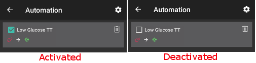

Automatizace
**************************************************

Co je automatizace
==================================================
Může se stát, že pro tytéž často se opakující události budete měnit tatáž nastavení. Chcete-li se vyhnout nadbytečným úkonům, můžete se pokusit tyto události zautomatizovat, pokud je dokážete dostatečně jasně specifikovat. 

Např. když je glykémie příliš nízká, můžete si nechat automaticky nastavit vyšší dočasný cíl. Nebo když se budete nacházet ve fitness centru, automaticky se nastaví dočasný cíl. 

Dříve než použijete Automatizaci, měli byste ovládat ruční nastavování dočasných cílů <./temptarget.html>`_ nebo přepínání profilu. 

Make sure you really understand how automation works before setting up your first simple rule. **Instead of action let AAPS display only notification.** When you are sure automation is triggered at the right time replace notification by real action.

.. image:: ../images/Automation_ConditionAction_RC3.png
  :alt: Automatizace – podmínka + akce

Jak to používat
==================================================
Chcete-li nastavit automatizaci, musíte ji pojmenovat a vybrat alespoň jednu podmínku a jednu akci. 

Important note
--------------------------------------------------
**Automation is still active when you disable loop!**

So make sure to deactivate Automation rules during these occations if neccessary. You can do so by untiking the box left of the name of your automation rule.

Obecné
--------------------------------------------------
Existují určitá omezení:

* Hodnota glykémie musí být v rozmezí 4 až 15 mmol/l.
* Procentuální hodnota profilu musí být mezi 70 % a 130%.
* Je tam 5 min. časový limit mezi provedeními (a prvním provedením).

**Buďte prosím opatrní:**

* **méně než -2 znamená: -3 a nižší (-4,-10 atd.)**
* **více než -2 znamená: -1 a vyšší (-1, 0, +10 atd.)**

Podmínka
--------------------------------------------------
Můžete si vybrat mezi několika podmínkami. Některé věci jsou zde vysvětleny, ale většina z nich by měla být snadno srozumitelná a není zde popsána:

* spojování podmínek: můžete mít několik podmínek, které navzájem spojíte pomocí operátorů 

   * „A“
   * „Nebo“
   * „Exkluzivní nebo“ (což znamená, že pokud nastane jedna (a pouze jedna) z podmínek, bude provedena akce)
   
* Čas vs. opakující se čas

   * čas =  jednorázová událost
   * opakující se čas = něco, co se děje pravidelně (tj. jednou týdně, každý pracovní den apod.)
   
* poloha: na kartě Konfigurace (Automatizace) můžete vybrat, kterou službu určování polohy chcete používat:

  * Používat pasivní polohu: AAPS zjistí polohu pouze v případě, že ji budou požadovat ostatní aplikace
  * Používat zjištění polohy podle sítě: Poloha podle vaší sítě Wifi
  * Use GPS location (Attention! May cause excessive battery drain!)
  
Akce
--------------------------------------------------
Můžete si vybrat jednu nebo více akcí: 

* spustit dočasný cíl 

   * musí být v rozmezí 4 mmol/l a 15 mmol/l
   * funguje pouze tehdy, není-li již spuštěn jiný dočasný cíl
   
* zastavit dočasný cíl
* oznámení
* procento profilu

   * musí být mezi 70 % a 130 % 
   * funguje pouze v případě, že předchozí procento profilu bylo 100 %

Po přidání akce kliknutím na výchozí hodnoty **nezapomeňte změnit výchozí hodnoty** na to, co potřebujete.
 
.. image:: ../images/Automation_Default_V2_5.png
  :alt: Výchozí hodnoty automatizace vs. nastavené hodnoty

Sort automation rules
-----
To sort automation rules click and hold the four-lines-button on the right side of the screen and move up or down.

.. image:: ../images/Automation_Sort.png
  :alt: Sort automation rules
  
Delete automation rules
-----
To delete an automation rule just swipe it left or right.

.. image:: ../images/Automation_Delete.png
  :alt: Delete automation rule

Good practice & caveats
==================================================
* When you start using Automation or create a new rule add a notification until you are sure the rule is working well.
* Whatch the rule results.
* Try not make conditions too easy (i.e.: IF bg > 80 mg/dl AND bg < 180 mg/dl)

    **Doubly important if action is a profile switch!**
 
* Try and use Temp Targets instead of Profile Switches. Temp Targets do not reset `Autosens <../Usage/Open-APS-features.html#autosens>`_ back to 0.
* Make sure Profile switches are made sparingly and preferably at a last resort.

    * Profile switching renders `Autosens <../Usage/Open-APS-features.html#autosens>`_ useless for a min of 6 hours.

* Profile switching will not reset the profile back to your base profile

    * You have to make another rule to set this back or do it manually!
    * Increased risk of Hypoglycemia if profile switch does not expire or reset back to base profile.

Příklady
==================================================
Toto jsou jen příklady, žádné rady. Nesnažte se je reprodukovat, aniž byste si uvědomovali, co vlastně děláte nebo proč je potřebujete. See below for two examples with screenshots.

* Switching profiles for your daily activities (like school, gym, weekend, workday...) using geolocation, wifi, time etc.
* Setting temp target for activities based on time, location...
* Setting eating soon temp targets based on time, location...

Dočasný cíl při nízké glykémii
--------------------------------------------------
.. image:: ../images/Automation2.png
  :alt: Automatizace 2

Toto nastavení má osoba, která chce, aby se při hypoglykémii automaticky spustil dočasný cíl „Hypoglykémie“.

Dočasný cíl v době oběda
--------------------------------------------------
.. image:: ../images/Automation3.png
  :alt: Automatizace 3
  
Toto je ukázkové nastavení osoby, která během týdne mívá oběd ve stejnou dobu. Pokud se v určitou dobu nachází na místě, kde obvykle obědvá, spustí se při čekání na oběd dočasný cíl „Před jídlem“. Vzhledem k použitému operátoru „A“ se tak stane pouze tehdy, když je splněna podmínka určitého času A polohy. Tato automatizace tedy nefunguje, pokud je osoba v nastaveném místě v jakoukoli jinou dobu, ani když je v nastavenou dobu někde jinde, např. pracuje z domu nebo pracuje přesčas. 

Incorrect use of Automation
--------------------------------------------------
As every system Automation can be used incorrectly. This might lead to difficulties and even danger for your health. Examples for incorrect use are for instance:

* Trying to override algorithm at all instead of help only (i.e. by changing profile instead of tunning basal, IC etc.)
* Setting profile to compensate food
* Setting profile without duration
* Creating one way rules (i.e. do something but don't undo it by another rule)
* Creating long term rules

Alternativy
==================================================

Pokročilí uživatelé mohou využít další možnosti pro automatizaci úloh pomocí IFTTT nebo externí aplikace pro Android zvané Automate. Některé příklady jsou uvedeny v části <./automationwithapp.html>`_.
