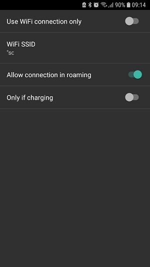

# Automatizace pomocí Automate – aplikace třetí strany pro Android

**This article has been written before AndroidAPS version 2.5. There is an [automation plugin in AndroidAPS](./Automation.md) itself with AndroidAPS version 2.5. For some, this here might be still useful, but should only be used by advanced users.**

Vzhledem k tomu, že AndroidAPS je systém hybridní uzavřené smyčky, uživatel stále musí s aplikací do určité míry interagovat (např. říci smyčce, že se prochází, že se blíží jídlo nebo že leží na gauči...). Časté ruční zásahy uživatele lze automatizovat pomocí externích nástrojů, jako je Automate nebo IFTTT, které mohou rozšířit stávající funkce AndroidAPS.

## Aplikace Automate pro Android

Bezplatná aplikace Automate pro Android™ umožňuje automatizovat různé úkoly na vašem smartphonu. Create your automations with flowcharts, make your device automatically change settings like Bluetooth, Wi-Fi, NFC or perform actions like sending SMS, e-mail, based on your location, the time of day, or any other “event trigger”. Na svém zařízení můžete automatizovat prakticky všechno. Automate dokonce podporuje plug-iny vytvořené pro aplikace Tasker a Locale.

Pomocí tohoto nástroje můžete snadno vytvořit automatizační diagramy pro automatickou léčbu svého diabetu založené na několika podmínkách podle principu 'jestliže nastane toto... a toto... nikoli toto..., pak udělej toto... a toto...'. Existují tisíce možností, které můžete nastavit.

Aktuálně je **nezbytné používat smyčku s Nightscout profilem**, jelikož Automate provádí příkazy přes HTTP-požadavky přímo na vaší stránce nightscout a následně je synchronizuje s aplikací AndroidAPS.

**Offline looping (direct communication between Automate and AndroidAPS app) is not supported yet**, but technologically possible. Možná bude v budoucnu existovat řešení. Pokud jste našli způsob, jak to udělat, přidejte jej prosím do této dokumentace nebo kontaktujte vývojáře.

### Základní požadavky

#### Aplikace Automate

Stáhněte si aplikace Android Automate z Google Play Store nebo z <https://llamalab.com/automate/> a nainstalujte ji na smartphone, na kterém běží AndroidAPS.

In Automate, tap on hamburger menu on the upper left of the screen > Settings > Check 'Run on system startup'. Toto automaticky spustí vaše automatizační diagramy při spuštění systému.

#### AndroidAPS

In AndroidAPS, tap on 3 dots menu on the upper right screen and go to Preferences > NSClient > Connection settings > Uncheck 'Use WiFi connection only' and 'Only if charging' as the automated treating does only work when AndroidAPS has an actual nightscout connection.

In AndroidAPS, tap on 3 dots menu on the upper right screen and go to Preferences > NSClient > Advanced Settings > Uncheck 'NS upload only (disabled sync)' and 'No upload to NS'.

Be aware of the [security issues](../Installing-AndroidAPS/Nightscout.md#security-considerations) that might occure and be very careful if you are using an [Insight pump](../Configuration/Accu-Chek-Insight-Pump#settings-in-aaps).

### Příklady automatizačních schémat

#### Příklad 1: Jestliže je zjištěna aktivita (např. chůze nebo běh), nastav vyšší DC. A když aktivita skončí, počkej 20 minut a pak zruš DC

Toto schéma bude využívat senzory smartphonu (krokoměr, G-senzor...), které detekují aktivitu. If there is recent activity like walking, running or riding a bicycle present, then Automate will set a user specified high temporary target for the user specified time. Až aktivita skončí, smartphone to detekuje, počká 20 minut a pak nastaví cíl zpět na normální hodnoty nastavené v profilu.

Stáhněte si skript pro aplikaci Automate <https://llamalab.com/automate/community/flows/27808>.

Upravte sling klepnutím na ikonu tužky > Flowchart

Upravte schéma podle svého uvážení následovně:

1. = Nastavit vysoký DC
2. = Go back to normal target 20 minutes after the end of activity

1 

2 

URL požadavku: Vaše NS-URL končící znaky /api/v1/treatments.json (např. https://my-cgm.herokuapp.com/api/v1/treatments.json)

Obsah požadavku:

* targetTop / targetBottom: Hodnota vysokého DC (top a bottom by měly mít stejnou hodnotu)
* duration: Trvání vysokého DC (po tomto čase se obnoví cíl podle profilu, pokud nebude aktivita pokračovat). 
* secret: Váš API SHA1 hash. Toto NENÍ váš api key! Svůj API key můžete převést do formátu SHA1 na adrese <http://www.sha1-online.com/>

Save: Klepněte na „Done“ a na zatržítko

Start sling: Klepněte na tlačítko „Play“

#### Příklad 2: Jestliže je aktivní výstraha xDripu+ na vysokou glykémii, pak nastav nízký TT na... minut.

Automatizační schéma bude využívat notifikační kanál xDripu+. If there is triggered a user specified xDrip+ high BG alert, then Automate will set a user specified low temporary target for the user specified time. Po nastavené době může případná další výstraha prodloužit dobu trvání nízkého DC.

##### xDrip+

Nejprve musíte přidat výstrahu na vysokou glykémii v aplikaci xDrip+:

Alert name: (Pay attention on it!) This name is essential for firing the trigger. It should be unmistakable and not similar to other alert names. Příklad: 'Výstraha180' by neměla být hned vedle 'Výstraha80'.

Limit: Hodnota glykémie, při které se spustí výstraha.

Výchozí potvrzení: Zadejte dobu, po kterou chcete nastavit nízký dočasný cíl, protože výstraha se po uplynutí této doby může spustit znovu a případně prodloužit DC.

##### Automate

Stáhněte si podruhé skript pro aplikaci Automate <https://llamalab.com/automate/community/flows/27809>.

Upravte sling klepnutím na ikonu tužky > Flowchart

Upravte schéma podle svého uvážení následovně:

V části spouštěcí události 'Notification posted?' musíte do 'TITLE' zadat název výstrahy xDripu+, která má spustit spouštěcí událost a přidat před a za název proměnnou *.

URL požadavku: Vaše NS-URL končící znaky /api/v1/treatments.json (např. https://my-cgm.herokuapp.com/api/v1/treatments.json)

Obsah požadavku:

* targetTop / targetBottom: Hodnota nízkého DC (top a bottom by měly mít stejnou hodnotu)
* trvání: Trvání nízkého DC (po tomto čase se obnoví cíl podle profilu). Doporučuje se používat stejnou dobu trvání jako u 'Výchozího potvrzení' u výstrahy xDripu+
* secret: Váš API SHA1 hash. Toto NENÍ váš api key! Svůj API key můžete převést do formátu SHA1 na adrese <http://www.sha1-online.com/>

Save: Klepněte na „Done“ a na zatržítko

Start sling: Klepněte na tlačítko „Play“

#### Příklad 3: Ten přidejte vy!!!

Přidejte prosím další automatizační schémata tak, že nahrajete soubor .flo do komunity Automate (pod klíčovým slovem 'Nightscout') a popíšete je zde tím, že vytvoříte [Pull Request v úložišti AndroidAPSdocs](../make-a-PR.md).

## If this, then that (IFTTT)

Návod můžete přidat pomocí PR...